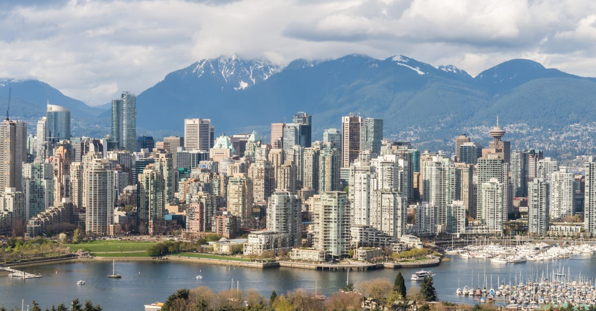

# Vancouver, Canada

Country: Canada
Region: Americas

Vancouver is the largest city in British Columbia, a 2.5-million-person metropolitan area on Canada's Pacific coast, wrapped by the Strait of Georgia and the North Shore mountains. One of the world's most consistently top-ranked livable cities, with serious natural and cultural assets within walking distance.

---

## 🧭 Step 1: Choices

### ✨ Why Visit

Vancouver compresses ocean, mountains, rainforest, and a serious modern city into a single peninsula. Stanley Park (an urban rainforest larger than Central Park) is on the city's edge. The North Shore mountains and the Capilano and Lynn Canyon suspension bridges are 20 minutes away. Granville Island and the seawall are the city's working public spaces.

The city is also the gateway to British Columbia: Whistler (1.5 hours), Victoria (a ferry to Vancouver Island), the Sea-to-Sky country, the Okanagan wine region, and the Pacific Rim National Park (Tofino surf). Vancouver as a base for a week-long BC trip is well used.

You come for the mountains, the food (the most diverse Asian-Canadian food scene in the country), the seawall walk, and as a gateway to the wider Pacific Northwest.

### 🌍 Ethical Compass

- **💰 Economy.** Eat in actual neighbourhoods: Chinatown, Commercial Drive (Italian and Latin), Punjabi Market, Mount Pleasant, Main Street, Richmond (a separate suburb that is one of North America's best Chinese food destinations). Avoid limiting yourself to downtown chains.
- **👥 Employment.** Tip 18 to 20 percent at sit-down restaurants. Vancouver service-industry workers face one of the highest costs of living in North America.
- **📚 Education.** This is the unceded traditional territory of the **Musqueam, Squamish, and Tsleil-Waututh** First Nations. Visit the Museum of Anthropology (MOA) at UBC; engage with Indigenous-led tours such as Talaysay Tours, Take a Hike Indigenous Cultural Tours, or the Bill Reid Gallery downtown.
- **🌱 Ecology.** Walk, cycle (the seawall is one of the world's great cycling paths), and use TransLink. The Vancouver Aquarium has changed its cetacean policy in recent years; verify current. Reef-safe sunscreen at Pacific beaches.

---

## 🎒 Step 2: Preparation

### 🔍 Governance Management

- Most visitors need an **eTA (Canadian Electronic Travel Authorization)** if visa-exempt, or a visa otherwise; verify on the official Government of Canada Immigration portal.
- **TransLink** (SkyTrain, bus, SeaBus, West Coast Express) uses **Compass card** or contactless on most lines.
- **Vancouver Aquarium, Museum of Anthropology (MOA), Capilano Suspension Bridge** sell tickets on official portals.
- **Granville Island** is open year-round; the public market is the centrepiece.
- **Whistler day-trips** by the Sea-to-Sky shuttle, Greyhound (or successor), or rental car.

### 📡 Information Curation

- **Vancouver Sun** and **CBC Vancouver** for serious local news.
- **Destination Vancouver** (the official tourism site) for events.
- A British Columbia author: Eden Robinson (Haisla-Heiltsuk, Indigenous BC fiction); Esi Edugyan; Madeleine Thien.
- An Indigenous-led tour (Talaysay Tours, Take a Hike Indigenous Cultural Tours, or the MOA at UBC's Indigenous-led programming).
- **Wikivoyage Vancouver** for orientation.

### 🎯 Inference Interaction

- **You decide on the Stanley Park approach.** Walking the seawall (10 km loop) is the right pace; renting a bike is faster and covers more.
- **You decide on Granville Island timing.** The public market is best at lunch; the wider island has artists, theatre, and microbreweries.
- **You decide on Capilano vs Lynn Canyon.** Capilano Suspension Bridge is famous and ticketed; Lynn Canyon Park is free with a smaller suspension bridge.
- **You decide on Indigenous engagement.** A Talaysay or Take a Hike tour gives a different reading of the same harbour and forest.
- **You decide on day-trips.** Whistler (alpine), Victoria (ferry to Vancouver Island, BC capital), Tofino (longer, Pacific Rim National Park).

### 🔄 Intelligence Cooperation

Vancouver weather is famously wet (October to March), mild (rarely freezing), and dramatic in the summer (June to September is the dry beautiful window). Wildfire smoke from BC's interior occasionally affects air quality in summer.

Bring a soft plan. If rain ruins outdoor plans, the MOA, the Vancouver Art Gallery, and the Polygon Gallery (on the North Shore) absorb a wet day. If wildfire smoke worsens air quality, indoor experiences and Granville Island work.

### 📍 Top 5 Anchor Spots

1. **Stanley Park seawall walk or bike.** Free; 10 km; one of the world's great urban paths.
2. **Granville Island public market + a False Creek ferry.** Half-day; food, arts, theatre.
3. **Museum of Anthropology (MOA) at UBC.** The world's most important Northwest Coast First Nations art collection.
4. **Capilano Suspension Bridge OR Lynn Canyon Park.** Pick one; Lynn is free.
5. **A Chinatown / Commercial Drive / Punjabi Market dinner.** Real ethnic-neighbourhood food.

### 🧰 Practical Essentials

- **Recommended Length.** Three to four days for Vancouver. Add days for Whistler, Victoria, the Sea-to-Sky, or Tofino.
- **Transport.** Walk in the central peninsula. **TransLink SkyTrain (4 lines), buses, SeaBus**; Compass card or contactless. **HandyDART** and ride-share for after-hours. Vancouver International Airport (YVR) is connected to downtown by the Canada Line SkyTrain in 25 minutes.
- **Daily Cost (per person).**
  - **Budget:** roughly CAD 110 to 200. Hostel, food-court and ethnic-neighbourhood meals, TransLink, Stanley Park, Lynn Canyon, MOA.
  - **Mid-range:** roughly CAD 280 to 480. Three-star hotel, restaurant dinners, all major attractions, Capilano, Whistler day-trip.
  - **Higher-comfort:** roughly CAD 700 and up. Fairmont Pacific Rim, Loden, Rosewood Hotel Georgia, fine dining at St. Lawrence, Botanist, Hawksworth, private guided tours.
- **Booking Notes.**
  - **eTA:** verify on the official Canadian Immigration portal.
  - **Wildfire smoke** (mid-summer to autumn): verify air quality.
  - **Cruise season** (May to October) fills the downtown waterfront briefly.
  - **Major events** (Celebration of Light, Vancouver International Film Festival, Pride): book accommodation ahead.
  - **Vancouver Aquarium:** verify current cetacean policy.

---

## ✈️ Step 3: Delivery

### 🤖 AI Prompt

Copy this into your own AI assistant, fill in the brackets, and treat the answer as a researcher's draft, not a final plan.

> Please help me plan an ethical visit to Vancouver, Canada for [NUMBER] days in [MONTH]. I am travelling with [WHO] and my interests are [INTERESTS, e.g. mountains, Indigenous culture, food, Stanley Park, day-trips to Whistler or Victoria]. My total budget is around [AMOUNT] and my comfort level is [budget / mid-range / higher-comfort].
>
> Please structure your answer in three steps.
>
> **Step 1: Choices.** Help me decide what to prioritise. Recommend the two or three Vancouver experiences I should not miss given my interests, and one I should consider skipping (a downtown-only itinerary, Capilano if Lynn Canyon is steps cheaper and similar, a Whistler day-trip in poor weather). Briefly explain each trade-off.
>
> **Step 2: Preparation.** Cover all four of the following:
> - **Governance Management.** What assumptions should I check before I book? Include the Canadian eTA, TransLink Compass/contactless, official MOA and Capilano portals, ferry to Victoria, and wildfire-smoke air quality.
> - **Information Curation.** Suggest at least four different source types: one official Vancouver source, one local news outlet, one BC author, and one Indigenous-led tour (Talaysay or Take a Hike).
> - **Inference Interaction.** List the decisions I personally need to make (Stanley Park walk vs bike, Capilano vs Lynn, MOA commitment, Indigenous engagement, day-trip choice).
> - **Intelligence Cooperation.** How should I trust my own judgment and local advice over algorithmic defaults when conditions change? Build me a soft plan with at least two alternates for likely disruptions (rain, wildfire smoke, a Whistler weather day, a ferry cancellation).
>
> **Step 3: Delivery.** Give me the actual itinerary, day by day, with realistic timings and named neighbourhoods. Include at least one Indigenous-led experience and one ethnic-neighbourhood dinner. Mark each business as confidently locally owned, or flag for me to verify.
>
> Finally, please remind me at the end to verify your suggestions against:
> 1. Official sources: Destination Vancouver, TransLink, MOA, BC Ferries, and the Canadian Immigration eTA portal.
> 2. Real people: a Vancouver resident, an Indigenous-led tour guide, or hotel staff who live in Vancouver now.
>
> Treat your output as a researcher's draft. I will make the final calls.

---

Part of **Gyro Governance Ethical Travel: AI-Empowered Guides for Humane Adventures**.

Explore more destinations, ethical domains, and AI prompts at [travel.gyrogovernance.com](https://travel.gyrogovernance.com/).
