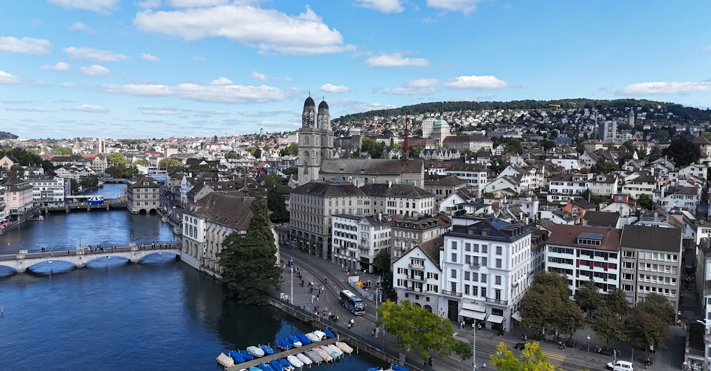

# Zurich, Switzerland

Country: Switzerland
Region: Europe

Zurich (*Zürich*) is the largest city in Switzerland, a 430,000-person financial and cultural capital at the head of Lake Zurich, with the Alps visible from the city centre. The global home of Swiss banking, a UNESCO-listed historic centre, swimmable city rivers and lake, and one of the world's most consistently top-ranked livable cities.

---

## 🧭 Step 1: Choices

### ✨ Why Visit

Zurich is small, civilised, and remarkably pleasant. The Altstadt (Old Town) straddles the Limmat river. Bahnhofstrasse is one of the most expensive shopping streets in the world. The Kunsthaus has one of Europe's best Giacometti and Munch collections; the Landesmuseum covers Swiss history. The lake is genuinely swimmable; the Limmat and Sihl rivers are swimmable in summer; the *Frauenbad* and *Männerbad* (river bathing houses) are working public infrastructure.

The city is also the gateway to the wider German-speaking Switzerland: Lucerne (1 hour), the Bernese Alps, the Glarus Alps, Liechtenstein, and one of the world's best long-distance rail networks.

You come for the lake, the easy Alpine access, the museums, the chocolate (Sprüngli's Luxemburgerli), the food, and a Swiss city that does urban life with serious thought.

### 🌍 Ethical Compass

- **💰 Economy.** Switzerland is expensive; budget honestly. Eat at *Beizli* (traditional taverns) and small restaurants in Kreis 4, 5, and 6 rather than only the Bahnhofstrasse luxury district. The Hauptbahnhof food halls and outdoor weekly markets are reasonable.
- **👥 Employment.** Tipping is not customary in Switzerland; service is included by law and Swiss wages are properly funded. A small tip for exceptional service is appreciated.
- **📚 Education.** Read about Swiss federalism, neutrality, direct democracy, and the contested history of Swiss banking. Visit the Landesmuseum (Swiss National Museum) and the Kunsthaus Zurich.
- **🌱 Ecology.** Walk and cycle. Zurich's public transport (VBZ trams, S-Bahn) is excellent. The lake and rivers are swimmable; in summer, locals carry waterproof bags and float home from work in the Limmat. Refill water from public fountains; tap is excellent.

---

## 🎒 Step 2: Preparation

### 🔍 Governance Management

- Most visitors are **visa-exempt for short Schengen stays**; verify on the official Swiss government portal.
- **Kunsthaus Zurich, Landesmuseum, Museum Rietberg** sell tickets on official portals.
- **VBZ (Zurich Verkehrsbetriebe)** public transport: ZürichCARD bundles transport and museums; verify on the official portal whether it suits your itinerary.
- **Swiss Travel Pass** if visiting multiple Swiss cities; verify on the official SBB portal.
- **Lake Zurich boat trips** by ZSG sell on official portals.

### 📡 Information Curation

- **Swissinfo** and **NZZ** (Neue Zürcher Zeitung) for current Swiss news.
- The official **Zurich Tourism** site for events and openings.
- A Swiss author: Max Frisch (Zurich-born, *Stiller*); Friedrich Dürrenmatt; Lukas Bärfuss; Hermann Hesse (lived in Switzerland later).
- A locally led Zurich walking tour with a Zurich resident.
- **Wikivoyage Zurich** for orientation.

### 🎯 Inference Interaction

- **You decide on the Lake or the rivers.** In summer (June-August), swimming in the lake at one of the *Seebäder* (lake bathing houses, free or low cost) or floating the Limmat is one of the city's gifts.
- **You decide on Alpine day-trips.** Uetliberg (Zurich's home mountain, 30 minutes by S-Bahn) for an easy view; Mt Pilatus or Rigi from Lucerne (90 minutes total); Jungfrau region (2.5 hours each way, a full day is possible but tight).
- **You decide on the chocolate experience.** Sprüngli on Bahnhofstrasse for the Luxemburgerli; the Lindt Home of Chocolate in Kilchberg (a tram ride from the city) for the full chocolate-factory experience.
- **You decide on the day-trip vs city focus.** Two days in Zurich + one Alpine day is a balanced trip.
- **You decide on the ZürichCARD vs single tickets.** Run the numbers for your itinerary; the card includes transport and museum entries.

### 🔄 Intelligence Cooperation

Zurich weather is variable; cold winter (occasional snow), warm summer, beautiful shoulder seasons. Major events (Sechseläuten in April with the burning of the Böögg snowman; Street Parade in August; Zurich Film Festival in September-October) reshape parts of the city.

Bring a soft plan. If a rainy day kills the lake plan, the museums and a Beizli lunch absorb a wet afternoon. If an Alpine day is forecast cloud, the city itself works. If your Lindt Home of Chocolate is sold out, the Sprüngli flagship serves.

### 📍 Top 5 Anchor Spots

1. **Altstadt walking loop.** Both banks of the Limmat: Niederdorf and the Lindenhof; the Grossmünster and the Fraumünster (the Chagall stained glass windows); Bahnhofstrasse.
2. **A summer swim in the lake or the Limmat.** Free or low-cost; the Seebad Enge or the Frauenbad Stadthausquai.
3. **Kunsthaus Zurich or Landesmuseum.** Pick one; both excellent.
4. **Lindt Home of Chocolate (Kilchberg).** A working chocolate-history museum; the tasting at the end is real.
5. **Day-trip to Lucerne + Mt Pilatus or Mt Rigi.** 90 minutes; cogwheel railway up an Alpine peak.

### 🧰 Practical Essentials

- **Recommended Length.** Two to three days for Zurich. Add a day for Lucerne, Bernese Alps, or Liechtenstein.
- **Transport.** Walk in the Altstadt. **VBZ trams, buses, the S-Bahn**; ZürichCARD or contactless. **SBB** for inter-city rail. Zurich Airport (ZRH) is connected to the centre by S-Bahn in 12 minutes.
- **Daily Cost (per person).**
  - **Budget:** roughly CHF 100 to 170. Hostel or budget hotel, supermarket and bakery meals, VBZ, free lake swimming.
  - **Mid-range:** roughly CHF 240 to 430. Three-star hotel, Beizli and restaurant dinners, all major museums, a day-trip to Lucerne.
  - **Higher-comfort:** roughly CHF 600 and up. Baur au Lac, the Dolder Grand, Widder Hotel, fine dining at Pavillon, Kronenhalle, Igniv, private guides, day-trips by chartered car.
- **Booking Notes.**
  - **Schengen:** verify your nationality.
  - **Swiss Travel Pass:** verify whether the cost-benefit suits your itinerary.
  - **Sechseläuten (April), Street Parade (August), Zurich Film Festival (Sept-Oct)** affect parts of the city.
  - **Lake swimming season:** roughly mid-June to early September.
  - **Sundays:** most shops closed; museums and restaurants stay open.

---

## ✈️ Step 3: Delivery

### 🤖 AI Prompt

Copy this into your own AI assistant, fill in the brackets, and treat the answer as a researcher's draft, not a final plan.

> Please help me plan an ethical visit to Zurich, Switzerland for [NUMBER] days in [MONTH]. I am travelling with [WHO] and my interests are [INTERESTS, e.g. lake swimming, museums, chocolate, Alpine day-trips, food]. My total budget is around [AMOUNT] and my comfort level is [budget / mid-range / higher-comfort].
>
> Please structure your answer in three steps.
>
> **Step 1: Choices.** Help me decide what to prioritise. Recommend the two or three Zurich experiences I should not miss given my interests, and one I should consider skipping (a Bahnhofstrasse luxury-shop day if I am not shopping, a packed Lucerne-and-Jungfrau day-trip that should be split, a winter lake swim). Briefly explain each trade-off.
>
> **Step 2: Preparation.** Cover all four of the following:
> - **Governance Management.** What assumptions should I check before I book? Include Schengen, official ticketing for Kunsthaus and Landesmuseum, the ZürichCARD cost-benefit, the Swiss Travel Pass if multi-city, and ZSG lake-boat schedules.
> - **Information Curation.** Suggest at least four different source types: one official Swiss source, one Swiss news outlet, one Swiss author, and one Zurich-based walking guide.
> - **Inference Interaction.** List the decisions I personally need to make (lake or river swim, Alpine day-trip choice, chocolate destination, ZürichCARD use, Sunday-shopping awareness).
> - **Intelligence Cooperation.** How should I trust my own judgment and local advice over algorithmic defaults when conditions change? Build me a soft plan with at least two alternates for likely disruptions (cloud on an Alpine day, rainy lake day, a major event closure, sold-out top restaurant).
>
> **Step 3: Delivery.** Give me the actual itinerary, day by day, with realistic timings and named neighbourhoods. Include at least one lake or river swim (in summer) or chocolate experience (year-round), and one Alpine day if my schedule allows. Mark each business as confidently locally owned, or flag for me to verify.
>
> Finally, please remind me at the end to verify your suggestions against:
> 1. Official sources: Zurich Tourism, the museum portals, VBZ for transport, and SBB for inter-city.
> 2. Real people: a Zurich resident, a Zurich guide, or hotel staff who live in Zurich now.
>
> Treat your output as a researcher's draft. I will make the final calls.

---

Part of **Gyro Governance Ethical Travel: AI-Empowered Guides for Human Adventures**.

Explore more destinations, ethical domains, and AI prompts at [travel.gyrogovernance.com](https://travel.gyrogovernance.com/).
