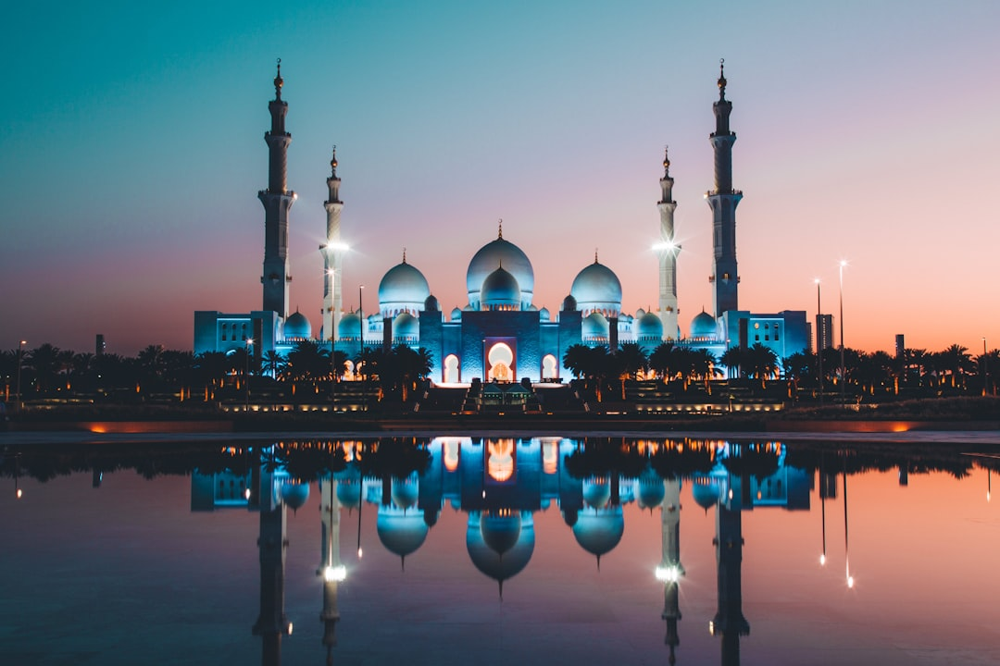

# Abu Dhabi, United Arab Emirates

Country: United Arab Emirates
Region: Asia

Abu Dhabi is the quieter, more deliberate cousin of Dubai. The capital of the UAE keeps its wealth visible but its volume lower. A great mosque, a Louvre on the sea, mangroves a metro stop from oil towers, and a desert that begins the moment the city ends.

---

## 🧭 Step 1: Choices

### ✨ Why Visit

Abu Dhabi is what happens when a young oil capital decides culture is part of the long game. The Sheikh Zayed Grand Mosque is one of the most architecturally generous religious buildings of this century, and the Louvre Abu Dhabi is a serious museum, not a souvenir of the original.

Beyond the headline buildings, the city is unexpectedly green. Mangroves wrap the eastern coastline, the Corniche is a real public promenade where families walk after sunset, and the Empty Quarter desert is two hours away if you want to feel the scale of Arabia.

You come here for the architecture, the museums, and a window onto a Gulf identity that is more measured than its neighbours suggest.

### 🌍 Ethical Compass

- **💰 Economy.** Most of what you spend in Abu Dhabi flows to international hotel and restaurant chains. Steer some of it local: eat at Lebanese, Egyptian, Indian, and Filipino canteens in Tourist Club Area or Madinat Zayed, buy dates from the Mina Port date market, and book Emirati-run desert camps rather than the largest tour operators.
- **👥 Employment.** The hospitality, construction, and driving workforce is overwhelmingly South Asian and East African on labour contracts. Tip taxi drivers, hotel staff, and porters generously in cash, address people by name when you can read it on a badge, and avoid the rhetoric that flattens migrant workers into "service".
- **📚 Education.** Read about the Bedouin pearling history before you mistake the city for a recent invention. Visit Qasr Al Hosn (the original fort) and Qasr Al Watan (the presidential palace) for the Emirati story alongside the global one at the Louvre. Dress modestly at mosques and heritage sites; this is asked, not optional.
- **🌱 Ecology.** Summer cooling drives extreme energy use; visit October through April and you halve your air-conditioning load. Bring a refillable bottle and avoid bottled water where possible. Choose the mangrove kayak or the Eastern Mangroves boardwalk over jet-ski tours.

---

## 🎒 Step 2: Preparation

### 🔍 Governance Management

- Confirm entry to the Sheikh Zayed Grand Mosque is **timed and free**, booked on the official mosque portal. Tour operators often add a transport fee on top; the entry itself should never cost you anything.
- Verify Louvre Abu Dhabi, Qasr Al Watan, and Qasr Al Hosn hours through their official websites, not third-party listings. Friday and Ramadan hours shift.
- Check the **current dress code** for mosque visits on the official mosque site. Robes are provided, but knowing the rules in advance avoids the rebooking queue.
- Confirm your driver's vehicle is a metered Abu Dhabi taxi (silver with a coloured roof) or a licensed ride-hail; avoid unofficial drivers at the airport arrivals curb.
- Alcohol is legal in licensed venues only. If you plan to drink outside hotel bars and licensed restaurants, verify current rules on the official UAE government portal before booking that desert party.

### 📡 Information Curation

- **The National** and **Khaleej Times** (English-language UAE newspapers) for current event listings, cultural openings, and weather.
- **Visit Abu Dhabi** (the official tourism site) for opening hours, cultural calendars, and Ramadan timings.
- A book by an Emirati or long-resident author on the Gulf transition. *From Rags to Riches* by Mohammed Al-Fahim is a useful primer from the inside.
- A migrant-worker-focused voice, such as the reporting of Migrant-Rights.org, to balance the official narrative.
- Wikivoyage Abu Dhabi for unfiltered practicalities (transport, costs, district orientation).

### 🎯 Inference Interaction

- **You decide your season.** Visit in summer and you accept indoor-only days; visit in shoulder months and you can actually walk the Corniche.
- **You decide on Ramadan.** Travelling during the fast is a different city, more contemplative, with reduced daytime hours. It is a choice worth making with eyes open.
- **You decide where to direct your dirhams.** Five-star resort or local guesthouse, chain mall or Madinat Zayed canteen, ticketed desert spectacle or smaller Emirati-run camp.
- **You decide your dress.** Modest dress is required at religious sites and expected at heritage sites and traditional neighbourhoods. The city is more relaxed on beaches and in malls. The judgement is yours, in context.
- **You decide whether to engage the harder questions** about labour conditions, freedom of expression, and regional politics. We do not pretend they do not exist.

### 🔄 Intelligence Cooperation

The Gulf moves fast. Museums open and close wings, transport links extend, the cultural district on Saadiyat Island adds new flagship buildings every couple of years. A plan made today may be outdated by next season.

Build a soft week. If a sandstorm rolls through, swap outdoor days for the Louvre and indoor souks. If a public holiday brings the Corniche alive at midnight, follow the families and adjust. The city responds well to curiosity and patience.

### 📍 Top 5 Anchor Spots

1. **Sheikh Zayed Grand Mosque.** Free entry on a timed booking; allow ninety minutes plus dressing time. Sunset light on the white marble is unforgettable.
2. **Louvre Abu Dhabi.** Jean Nouvel's "rain of light" dome over a museum that genuinely re-imagines world history. Plan two to three hours.
3. **Qasr Al Hosn and the Cultural Foundation.** The original fort, now restored, traces Abu Dhabi from a pearling outpost to a capital. Pair it with Qasr Al Watan, the working presidential palace.
4. **Eastern Mangroves National Park.** Kayak through the tidal forest that the city was nearly built over. Early morning is calm and cool.
5. **Liwa Oasis and the Empty Quarter.** Two hours south by road, the dunes of Rub' al Khali start. A licensed overnight desert camp here is a different planet from the city.

### 🧰 Practical Essentials

- **Recommended Length.** Three to four days for the city. Add one to two for a Liwa desert overnight or a day on Sir Bani Yas Island.
- **Transport.** Walk the Corniche and Saadiyat boardwalks. For longer hops, taxis (metered) and ride-hail apps are the practical defaults; the public bus network is comprehensive but slow. The airport is a thirty-minute taxi to downtown. There is no metro.
- **Daily Cost (per person).**
  - **Budget:** roughly AED 250 to 400. Guesthouse or modest hotel, canteen meals, bus and the occasional taxi, mostly free or low-cost sites.
  - **Mid-range:** roughly AED 500 to 900. Four-star hotel, mixed dining, taxis, all the major sites, one guided desert evening.
  - **Higher-comfort:** roughly AED 1,200 and up. Saadiyat resort, private guides, fine dining, helicopter tours, a Liwa desert overnight.
- **Booking Notes.**
  - **Sheikh Zayed Grand Mosque** requires a timed entry slot, free, booked on the official mosque portal in advance.
  - **Louvre Abu Dhabi and Qasr Al Watan** sell timed tickets online; verify current pricing on each official portal.
  - **Friday mornings and Ramadan** alter opening hours across most cultural sites.
  - **Dress code at religious and heritage sites:** shoulders and knees covered for all visitors, head covering for women at the Grand Mosque (robes provided).
  - **Public drinking and public displays of affection** carry real legal consequences. Verify current rules on the official UAE government portal before assuming a Western default.

---

## ✈️ Step 3: Delivery

### 🤖 AI Prompt

Copy this into your own AI assistant, fill in the brackets, and treat the answer as a researcher's draft, not a final plan.

> Please help me plan an ethical visit to Abu Dhabi, United Arab Emirates for [NUMBER] days in [MONTH]. I am travelling with [WHO] and my interests are [INTERESTS, e.g. architecture, museums, desert, mangroves]. My total budget is around [AMOUNT] and my comfort level is [budget / mid-range / higher-comfort].
>
> Please structure your answer in three steps.
>
> **Step 1: Choices.** Help me decide what to prioritise. Recommend the two or three Abu Dhabi experiences I should not miss given my interests, and one I should consider skipping. For each, briefly explain the trade-off.
>
> **Step 2: Preparation.** Cover all four of the following:
> - **Governance Management.** What assumptions should I check before I book? Include the timed free booking for the Sheikh Zayed Grand Mosque, official ticketing for Louvre Abu Dhabi and Qasr Al Watan, current dress and alcohol rules on UAE government portals, and Ramadan or public-holiday timing shifts in my dates.
> - **Information Curation.** Suggest at least four different source types: one official UAE government source, one local English-language newspaper, one Emirati or long-resident author, and one migrant-worker or human-rights voice.
> - **Inference Interaction.** List the decisions I personally need to make (season, Ramadan, where my dirhams go, dress code, which harder questions I engage with).
> - **Intelligence Cooperation.** How should I trust my own judgment and local advice over algorithmic defaults when conditions change? Build me a soft plan with at least two alternates for likely disruptions (sandstorm, extreme heat, a public-holiday traffic shutdown, a closed wing at a flagship museum).
>
> **Step 3: Delivery.** Give me the actual itinerary, day by day, with realistic timings and named places. Include at least one half-day at the mangroves or in the desert if my dates allow. Mark each recommendation as confidently locally owned, or flag it for me to verify.
>
> Finally, please remind me at the end to verify your suggestions against:
> 1. Official sources: the Sheikh Zayed Grand Mosque portal, Visit Abu Dhabi, the Louvre Abu Dhabi site, and the UAE government portal for current rules.
> 2. Real people: a local resident, a licensed guide, or hotel staff who live in Abu Dhabi now.
>
> Treat your output as a researcher's draft. I will make the final calls.

---

Part of **Gyro Governance Ethical Travel: AI-Empowered Guides for Human Adventures**.

Explore more destinations, ethical domains, and AI prompts at [travel.gyrogovernance.com](https://travel.gyrogovernance.com/).
