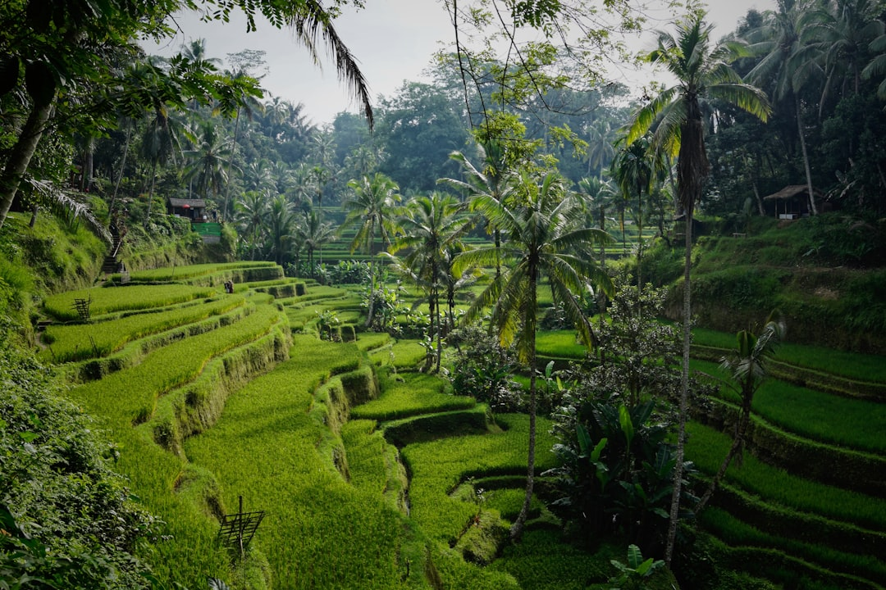

# Bali, Indonesia

Country: Indonesia
Region: Asia

Bali is the small Hindu island in a vast Muslim archipelago, a working ceremonial culture wrapped around terraced rice fields and volcanic ridges, and the most pressure-tested mass-tourism destination in Southeast Asia. How you visit here matters more than at almost any other beach destination on this list.

---

## 🧭 Step 1: Choices

### ✨ Why Visit

Bali still rewards the curious traveller. Beyond the south-coast traffic and influencer cafés, the island holds a living Hindu calendar of ceremonies, working subak rice-irrigation systems UNESCO-listed for their cooperative ingenuity, volcanic hiking on Mount Batur and Mount Agung, and some of the most generous people you will meet on any trip.

Bali is also a real conversation about overtourism. Provincial authorities have introduced a tourist levy, dress and behaviour rules for temples and sacred sites, and active campaigns asking visitors to slow down, dress respectfully, and stop treating volcanoes as photo props.

You come for the ceremonies, the rice terraces, the food, and a chance to spend money in a way that supports rather than displaces.

### 🌍 Ethical Compass

- **💰 Economy.** Stay in family-run *homestays* and locally owned guesthouses rather than international resorts; the difference in how much money stays on the island is enormous. Eat at *warungs*, buy from local markets, and use Balinese drivers and guides paid directly rather than international booking platforms that take large cuts.
- **👥 Employment.** Hire local guides for temple visits, rice-terrace walks, and Mount Batur sunrise treks. The Mount Batur guide cooperative exists specifically because outside guides were undercutting local livelihoods; choose the cooperative.
- **📚 Education.** Read about Balinese Hinduism and the *subak* system before you arrive. The Bali Tourism Levy is real; pay it on arrival or online before. Learn that beaches and temples have a dress code (sarong and sash for temples; provided at major sites or bring your own).
- **🌱 Ecology.** Bali has a serious plastic-waste and freshwater problem driven partly by tourism. Refill water, decline plastic straws and bags, and choose accommodation that visibly handles waste. Avoid south-coast resorts with private pools during dry-season water shortages.

---

## 🎒 Step 2: Preparation

### 🔍 Governance Management

- Check current **visa-on-arrival** and **e-VOA** requirements on the official Indonesian Directorate General of Immigration portal.
- Pay the **Bali Tourist Levy** through the official Love Bali portal before or on arrival; keep the QR code.
- Confirm temple **dress codes** and current behavioural rules on the official Bali provincial government site. Climbing sacred mountains for photographs has become a fineable offence in some cases.
- Book Mount Batur sunrise treks only through the **Mount Batur Trekking Guides Association (HPPGB)** or operators that work with them.
- Verify your driver or motorbike rental is licensed; international driving permits are checked.

### 📡 Information Curation

- **The Bali Sun** and **The Jakarta Post** (English-language) for current local rules and tourism updates.
- The **Love Bali** official portal for visitor levy, dress code, and behavioural guidance.
- A book by a Balinese or Indonesian author: Pramoedya Ananta Toer's *This Earth of Mankind* for broader Indonesian context.
- A Bali-resident expat-and-local podcast (such as *The Bali Podcast*) for ground-truth on neighbourhoods and operators.
- **Wikivoyage Bali** for area-by-area orientation.

### 🎯 Inference Interaction

- **You decide where on the island you stay.** Canggu or Seminyak places you in the worst traffic and the most extractive tourism economy. Ubud, Sidemen, Munduk, Amed, and Pemuteran are different islands.
- **You decide whether to rent a motorbike.** Riding without a licence and without experience is the largest single cause of tourist injury and death on Bali. Your call, with eyes open.
- **You decide on Mount Batur and Mount Agung.** Sunrise treks are extraordinary; they are also at sacred sites where Balinese authority is real. Use the official guide cooperative or do not go.
- **You decide your ceremony behaviour.** If you encounter a procession, you wait. You do not photograph faces close-up without permission. You do not stand above a priest.
- **You decide on water and waste.** Refill, refuse plastic, choose accommodations that visibly manage rubbish.

### 🔄 Intelligence Cooperation

Bali's ceremonial calendar runs in parallel to the Western one. *Nyepi*, the Balinese day of silence, shuts the entire island, airport included; the lead-up *ogoh-ogoh* parades are spectacular. *Galungan* and *Kuningan* (every 210 days) fill temples and roadsides with offerings. Plan around them, not against them.

Bring a soft plan. If a ceremony closes a road, the answer is to find a viewpoint and watch. If a sudden rainy-season downpour washes out your beach day, switch to a temple visit or a cooking class. Cooperate with what the island is doing.

### 📍 Top 5 Anchor Spots

1. **Ubud and the surrounding rice terraces.** Tegallalang and Jatiluwih (the UNESCO-listed *subak* terraces) are different in scale; visit at least one.
2. **Tirta Empul temple and the wider Tampaksiring area.** A working purification temple where Balinese come to bathe ritually. Dress and behaviour rules matter here; consider a Balinese guide.
3. **Mount Batur sunrise trek with the local guides association.** A genuine sunrise above the cloud line from an active volcano. Book through the HPPGB cooperative.
4. **East Bali villages: Sidemen, Tirta Gangga, Amed.** Working rice valleys, a royal water palace, and a calm dive coast. The Bali most visitors do not see.
5. **Munduk and the central highlands.** Waterfalls, lake temples (Ulun Danu Beratan), and cool-climate coffee. A real break from the south-coast crowds.

### 🧰 Practical Essentials

- **Recommended Length.** A week minimum to do Bali real justice. Two weeks to combine south, central, and east. Day-trippers from Java miss the point entirely.
- **Getting There and Around.** Fly into Ngurah Rai International Airport (Denpasar). Most visitors hire a driver or a car-with-driver for the day rather than self-drive; rates are reasonable. Motorbike rental is common but risky for inexperienced riders. Ride-hail apps (Grab, Gojek) work in the south. Inter-island ferries serve Lombok and the Gilis.
- **Daily Cost (per person).**
  - **Budget:** roughly IDR 500,000 to 900,000 (about USD 30 to 55). Homestay, warung meals, a shared driver day, public beach access.
  - **Mid-range:** roughly IDR 1,400,000 to 2,800,000 (about USD 85 to 180). Boutique guesthouse, mixed dining, private driver for half-days, a guided trek, spa visits.
  - **Higher-comfort:** roughly IDR 4,500,000 and up. Resort or private villa, fine dining, private guides, surf or dive instruction, helicopter tours.
- **Booking Notes.**
  - **Visa.** Most travellers can use e-VOA via the official Indonesian Immigration portal; verify your nationality's current requirement.
  - **Bali Tourist Levy.** Pay on the official Love Bali portal; keep the QR code accessible.
  - **Nyepi (March, date varies).** The whole island shuts for 24 hours. Airport closed. Plan around or plan to experience it from your accommodation.
  - **Mount Batur sunrise:** book through the local guides association (HPPGB) only.
  - **Rainy season** runs roughly November to March; afternoon storms are normal and beaches can become unsafe.

---

## ✈️ Step 3: Delivery

### 🤖 AI Prompt

Copy this into your own AI assistant, fill in the brackets, and treat the answer as a researcher's draft, not a final plan.

> Please help me plan an ethical visit to Bali, Indonesia for [NUMBER] days in [MONTH]. I am travelling with [WHO] and my interests are [INTERESTS, e.g. Balinese culture, rice terraces, trekking, surfing, diving, food]. My total budget is around [AMOUNT] and my comfort level is [budget / mid-range / higher-comfort].
>
> Please structure your answer in three steps.
>
> **Step 1: Choices.** Help me decide what to prioritise. Recommend the two or three Bali experiences I should not miss given my interests, and one I should consider skipping (the south-coast traffic, the over-photographed cafés, the unlicensed volcano trek). Briefly explain each trade-off.
>
> **Step 2: Preparation.** Cover all four of the following:
> - **Governance Management.** What assumptions should I check before I book? Include the e-VOA on the official Indonesian Immigration portal, the Bali Tourist Levy on Love Bali, current temple dress and behavioural rules, the Mount Batur guides association (HPPGB), and any major ceremonies (especially Nyepi) in my dates.
> - **Information Curation.** Suggest at least four different source types: one official Indonesian government source, one local English-language news outlet, one Balinese or Indonesian author, and one Bali-resident or community-based podcast or guide.
> - **Inference Interaction.** List the decisions I personally need to make (which part of the island I stay in, whether to ride a motorbike, how I approach sacred sites, my plastic and water choices).
> - **Intelligence Cooperation.** How should I trust my own judgment and local advice over algorithmic defaults when conditions change? Build me a soft plan with at least two alternates for likely disruptions (a ceremony closing a road, a rainy-season storm, a Mount Batur weather cancellation, an unexpected rāhui-like closure of a sacred site).
>
> **Step 3: Delivery.** Give me the actual itinerary, day by day, with realistic timings and named places. Include at least one cultural ceremony experience and one full day outside Canggu, Seminyak, and Kuta. Mark each business as confidently locally owned, or flag it for me to verify.
>
> Finally, please remind me at the end to verify your suggestions against:
> 1. Official sources: the Love Bali portal, the Indonesian Immigration portal, and the Bali provincial government tourism site.
> 2. Real people: a local resident, a Balinese guide, or homestay hosts who live on the island now.
>
> Treat your output as a researcher's draft. I will make the final calls.

---

Part of **Gyro Governance Ethical Travel: AI-Empowered Guides for Humane Adventures**.

Explore more destinations, ethical domains, and AI prompts at [travel.gyrogovernance.com](https://travel.gyrogovernance.com/).
