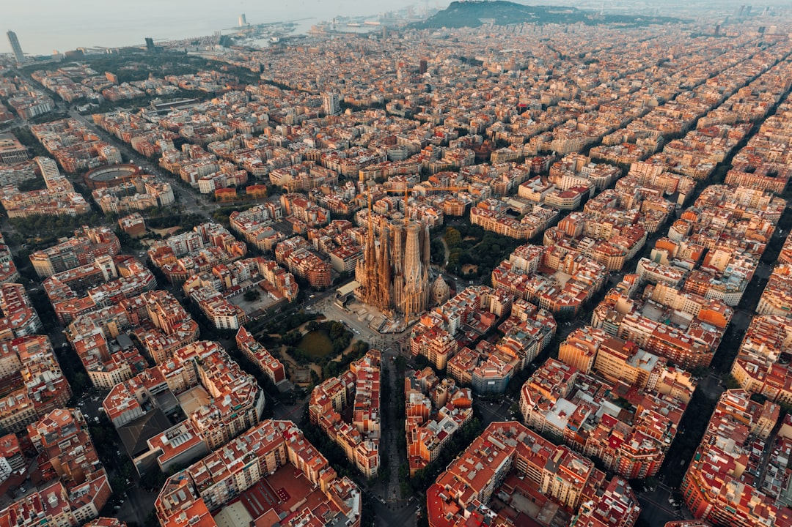

# Barcelona, Spain

Country: Spain
Region: Europe

Barcelona is the capital of Catalonia, a Mediterranean port with Roman bones, Gothic walls, a nineteenth-century grid by Cerdà, and Gaudí's surrealist Modernisme draped across all of it. It is also one of the most active centres of the European anti-overtourism movement, and visiting respectfully here is not optional.

---

## 🧭 Step 1: Choices

### ✨ Why Visit

Barcelona packs more architectural eras into walking distance than almost any city in Europe. The Sagrada Família is the most ambitious building of the last century, still being completed. The Eixample is a genuinely radical urban design. The medieval Barri Gòtic and the working-class Raval are minutes apart.

The city has also become the European poster city for overtourism resistance. Residents have demonstrated with water pistols against visitors, the city has capped cruise-ship arrivals, restricted new tourist apartments, and announced a phased elimination of short-term holiday lets. Visiting Barcelona today means visiting on the residents' terms, not the visitor's.

You come for Gaudí, the food, the Mediterranean, and a city actively redrawing the deal between residents and tourists.

### 🌍 Ethical Compass

- **💰 Economy.** Stay in a licensed hotel or pension rather than a short-term apartment; the city has been clear that tourist apartments hurt residents. Eat where Catalans eat (Sant Antoni, Gràcia, Sant Andreu) rather than the worst of La Rambla. Buy from Mercat de Sant Antoni or the Boqueria's interior (not the front-row tourist stalls).
- **👥 Employment.** Catalan-owned tapas bars and family pastry shops keep money in the neighbourhood. Tip a euro or two at sit-down meals; service is not included as generously as in some European countries.
- **📚 Education.** Learn that Catalonia has its own language and a real political identity; *bon dia* (good morning in Catalan) opens more doors than the Castilian *buenos días*. Read about the Spanish Civil War and the Franco dictatorship before walking through the Raval and the Born.
- **🌱 Ecology.** Cycle, walk, or use the metro. Beach traffic, cruise pollution, and water shortages are all real issues; choose shoulder seasons (April to June, September to October). Refill from public fountains; tap water is safe.

---

## 🎒 Step 2: Preparation

### 🔍 Governance Management

- Book the **Sagrada Família** strictly through its official portal. Tickets are timed; sell out days ahead in peak season.
- Book **Park Güell** through its official site; the monumental zone is ticketed with timed entry.
- **Camp Nou** is closed during a major renovation; verify current status on FC Barcelona's official site before planning a visit.
- Short-term tourist apartments are being phased out; verify your accommodation's **HUTB licence number** on the listing. Unlicensed lets are illegal.
- **Cruise-ship terminal access and city access** are being capped; verify current rules on the Port of Barcelona and city portal.

### 📡 Information Curation

- **El País** (English edition) and **The Local Spain** for current Catalan and Spanish news.
- **Barcelona Turisme** (the official city site) for current rules, events, and capacity restrictions.
- A Catalan author or filmmaker: Mercè Rodoreda's *The Time of the Doves*, or anything by Eduardo Mendoza.
- A Barcelona-resident podcast or local-led tour focused on neighbourhood life beyond La Rambla.
- **Wikivoyage Barcelona** for district orientation.

### 🎯 Inference Interaction

- **You decide where you sleep.** A licensed Eixample or Gràcia hotel directly supports the city's housing policy. An unlicensed Airbnb actively undermines it.
- **You decide your route.** La Rambla and the Boqueria's first row are tourist machinery. The actual market and the neighbourhoods around it are working Barcelona.
- **You decide on Park Güell timing.** The monumental zone is small; an early or late slot is the only humane time to visit in summer.
- **You decide your Catalan-vs-Castilian register.** Catalan is the daily language for most residents; a few words go far.
- **You decide on the beach.** Barceloneta is the obvious option and the most crowded; the metro to Bogatell or further is a better swim.

### 🔄 Intelligence Cooperation

Barcelona is changing how it accepts visitors. The rules in place today are stricter than they were three years ago, and probably looser than they will be three years from now. Cruise caps, apartment licences, and entry restrictions tighten on a regular cycle.

Bring a soft plan. If the Sagrada Família slot you wanted is full, La Pedrera and Casa Batlló absorb a Modernisme day well. If a city demonstration closes Plaça de Catalunya, the metro routes around it. If your beach plan dies in a thunderstorm, MNAC on Montjuïc is one of the great European museum experiences.

### 📍 Top 5 Anchor Spots

1. **Sagrada Família.** Timed entry, official portal, book days ahead. Pay the lift fee for the towers if heights are fine.
2. **Park Güell (monumental zone).** Timed entry, official portal. Early morning is bearable; midday in summer is not.
3. **Barri Gòtic and El Born walking loop.** From the Cathedral through Plaça Sant Jaume to Santa Maria del Mar and the Born Cultural Centre. Best on foot, early morning or evening.
4. **MNAC (Museu Nacional d'Art de Catalunya) on Montjuïc.** The world's best collection of Catalan Romanesque art, plus the fountain show below the museum.
5. **Gràcia neighbourhood.** Plaça del Sol, Plaça de la Vila, and small streets between. Workshops, indie cafés, working tapas bars. The August Festa Major is extraordinary.

### 🧰 Practical Essentials

- **Recommended Length.** Three to four days for the city. Add one for Montserrat or the Costa Brava day-trip.
- **Transport.** Walk in the Old City. The TMB metro is excellent; tap a T-Casual ticket or use contactless on most lines. Bicing bikes are for residents; tourists rent at private outlets. El Prat Airport is 30 minutes by metro or Aerobús to Plaça de Catalunya. Avoid driving in the city.
- **Daily Cost (per person).**
  - **Budget:** roughly €80 to €130. Hostel, menu del día lunches, public transport, two ticketed sites.
  - **Mid-range:** roughly €150 to €260. Three-star hotel or licensed pension, tapas and seafood dinners, all the major sites, a guided architecture walk.
  - **Higher-comfort:** roughly €320 and up. Boutique Eixample hotel, fine dining at places like Disfrutar, private guides, taxis instead of metro.
- **Booking Notes.**
  - **Sagrada Família and Park Güell:** timed entry on official portals, book days ahead.
  - **Short-term rentals:** HUTB licence number must be on the listing; the policy is to phase tourist apartments out entirely. Choose licensed hotels.
  - **Cruise day caps and city tourism rules** are tightening. Verify current rules on the city's official portal.
  - **La Mercè (late September)** is the city's biggest festival; book months ahead.
  - **El Clásico or major Camp Nou events** (when the stadium reopens) book out the city.

---

## ✈️ Step 3: Delivery

### 🤖 AI Prompt

Copy this into your own AI assistant, fill in the brackets, and treat the answer as a researcher's draft, not a final plan.

> Please help me plan an ethical visit to Barcelona, Spain for [NUMBER] days in [MONTH]. I am travelling with [WHO] and my interests are [INTERESTS, e.g. architecture, Catalan culture, food, beaches, art]. My total budget is around [AMOUNT] and my comfort level is [budget / mid-range / higher-comfort].
>
> Please structure your answer in three steps.
>
> **Step 1: Choices.** Help me decide what to prioritise. Recommend the two or three Barcelona experiences I should not miss given my interests, and one I should consider skipping to protect my time, my budget, or the residents (La Rambla in midday, the worst of Park Güell's exterior touts, an unlicensed apartment). Briefly explain each trade-off.
>
> **Step 2: Preparation.** Cover all four of the following:
> - **Governance Management.** What assumptions should I check before I book? Include Sagrada Família and Park Güell timed entry on official portals, the HUTB licence requirement for any rental, the phase-out of tourist apartments, and Camp Nou's current renovation status.
> - **Information Curation.** Suggest at least four different source types: one official Catalan or Spanish source, one local English-language news outlet, one Catalan author, and one neighbourhood-based walking host outside the Gothic Quarter.
> - **Inference Interaction.** List the decisions I personally need to make (licensed hotel vs unlicensed apartment, La Rambla vs Boqueria interior vs Sant Antoni, Catalan greetings, beach choice, response to anti-tourism messaging).
> - **Intelligence Cooperation.** How should I trust my own judgment and local advice over algorithmic defaults when conditions change? Build me a soft plan with at least two alternates for likely disruptions (sold-out Sagrada slot, a city demonstration, a summer heatwave, a cruise-cap day closure).
>
> **Step 3: Delivery.** Give me the actual itinerary, day by day, with realistic timings and named neighbourhoods. Include at least one half-day in Gràcia, Sant Antoni, or Poblenou (beyond the Gothic Quarter and Eixample). Mark each business as confidently locally owned, or flag it for me to verify.
>
> Finally, please remind me at the end to verify your suggestions against:
> 1. Official sources: Barcelona Turisme, the Sagrada Família and Park Güell official portals, and the Port of Barcelona for cruise restrictions.
> 2. Real people: a local resident, a licensed Catalan guide, or hotel staff who live in Barcelona now.
>
> Treat your output as a researcher's draft. I will make the final calls.

---

Part of **Gyro Governance Ethical Travel: AI-Empowered Guides for Human Adventures**.

Explore more destinations, ethical domains, and AI prompts at [travel.gyrogovernance.com](https://travel.gyrogovernance.com/).
