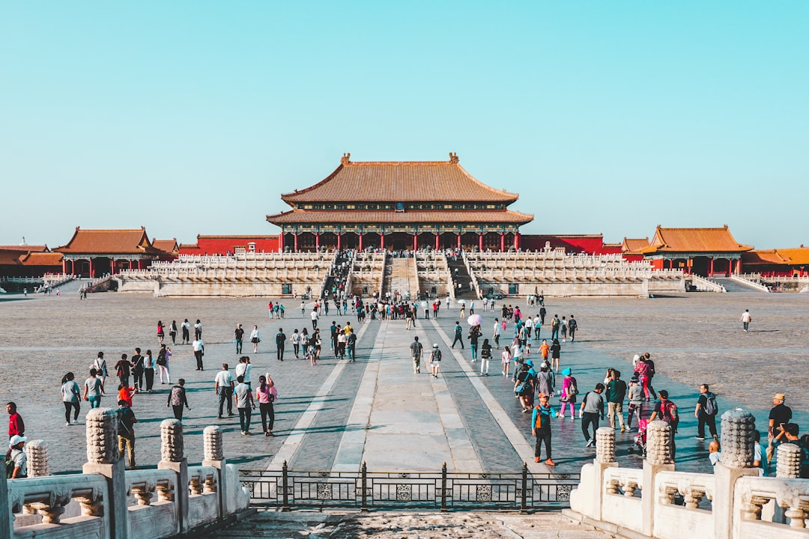

# Beijing, China

Country: China
Region: Asia

Beijing is the political and cultural capital of China, an imperial city of more than 800 years overlaid by a modern megacity of 21 million. The Forbidden City still anchors the axis. The Great Wall begins (and never quite ends) a couple of hours from your hotel.

---

## 🧭 Step 1: Choices

### ✨ Why Visit

Beijing is the scale of Chinese civilisation, made walkable. The Forbidden City is the world's largest preserved imperial palace complex. The Temple of Heaven is one of Asia's masterworks of cosmological architecture. A single day on the Great Wall (Mutianyu or Jinshanling) puts everything else into perspective.

The city is also where modern China is most legibly itself: the hutong alleys (still shrinking) sit blocks from CCTV towers and Zaha Hadid buildings. The food is dazzlingly regional. The pace is high but the imperial calm of the central axis survives.

You come for the Wall, the palaces, the food, and a chance to read several thousand years of continuous political tradition in stone and tile.

### 🌍 Ethical Compass

- **💰 Economy.** Eat at *jiaozi* shops, noodle joints, and Peking-duck specialists outside the hotel zones. Hutong tea houses and small Sichuan and Yunnan restaurants in Dongcheng and Xicheng are excellent. Avoid the worst of Wangfujing snack street (designed for tourists, photographed everywhere).
- **👥 Employment.** Hire a licensed guide for the Great Wall and major palace complexes. Use metered taxis or **DiDi** ride-hail; insist on the meter or app fare. Tipping is not customary in China and can occasionally cause awkwardness.
- **📚 Education.** China has firm rules around political conversation, photography near military and government sites, and what foreigners can post. Read about the limits before assuming a Western default applies. Learn ten Mandarin phrases (*nǐ hǎo*, *xiè xiè*, *duō shǎo qián*, *wǒ bù yào*); your phone's translator will do the rest.
- **🌱 Ecology.** Air quality varies dramatically; check the AQI app daily and plan strenuous outdoor days when air is acceptable. The Wall sections deteriorate when walked off-trail; stay on restored sections (Mutianyu) or properly maintained wild sections (Jiankou only with licensed guides).

---

## 🎒 Step 2: Preparation

### 🔍 Governance Management

- **Visa or transit-visa-free** status varies frequently. Verify your nationality's current rules on the Chinese embassy portal before booking. Transit-visa-free is available for many nationalities for short stays.
- The **Forbidden City** caps daily entries and requires passport-linked online booking on the official Palace Museum portal. Sells out days ahead.
- **Great Wall sections** are managed differently; Mutianyu, Jinshanling, and Badaling are official, ticketed, accessible. Unrestored wild sections may be restricted or unsafe.
- Most Chinese sites and transport require booking with passport; bring your passport everywhere.
- **WeChat Pay or Alipay** linked to a foreign card is now possible and effectively required for everyday spending; set up before arrival.

### 📡 Information Curation

- **China Daily** (official) and **The Beijinger** (English-language expat magazine) for events and current restrictions.
- The **Palace Museum** official site for Forbidden City booking and exhibitions.
- A book on modern China: Peter Hessler's *Country Driving* or *Oracle Bones*; Yu Hua's novels for fiction.
- A licensed local guide (TripAdvisor's certified Beijing guides or a hotel concierge recommendation) for the Wall and the imperial sites.
- **Wikivoyage Beijing** for district orientation.

### 🎯 Inference Interaction

- **You decide on the Great Wall section.** Badaling is closest and most crowded; Mutianyu is balanced and best for most; Jinshanling is for the hike; Jiankou is wild and only with serious guides.
- **You decide your VPN preparation.** Most Western apps and sites are blocked; if you need WhatsApp, Google, Instagram, or Western news, set up a VPN before arrival.
- **You decide your political conversation comfort.** China has clear limits on what foreigners can discuss publicly. Listening is fine; provoking is not.
- **You decide on hutong tours.** Pedicab tours through hutongs are tourist theatre; a walking tour with a Beijing-born guide is meaningful. The choice is yours.
- **You decide on air-quality days.** A bad AQI day is a museum day, not a Great Wall day.

### 🔄 Intelligence Cooperation

Beijing weather and air are highly variable. A spring sandstorm, a summer thunderstorm, a winter inversion can each rewrite a day. Major political events (Party congresses, state visits) can close roads and museums on short notice.

Bring a soft plan. If air quality is poor, the National Museum, the Forbidden City, and the major shopping districts are indoor. If a state visit closes Tiananmen, swap to the 798 art district or the Summer Palace. The city absorbs disruption better than its size suggests.

### 📍 Top 5 Anchor Spots

1. **Forbidden City (Palace Museum).** Passport-linked booking on the official portal. Plan four hours minimum; enter from the south, exit north.
2. **Great Wall at Mutianyu or Jinshanling.** Full day with a licensed guide and a private driver. Best at sunrise or in late afternoon light.
3. **Temple of Heaven and the surrounding park.** Visit early morning to see locals practising taichi and dance; the cosmological architecture is at its best.
4. **798 Art District.** Repurposed Bauhaus factory zone, now China's leading contemporary art quarter. Plan a half day.
5. **Hutongs around Houhai and Nanluoguxiang.** Walking the alleys near the lakes, with stops at courtyard restaurants and small museums.

### 🧰 Practical Essentials

- **Recommended Length.** Four to five days for Beijing. Add at least one full day for the Great Wall and one for the Summer Palace or the Ming Tombs.
- **Transport.** Beijing's metro is enormous, cheap, and easy; signs are bilingual. **DiDi** ride-hail (in English) and metered taxis cover the rest. Bicycle-share works well in central areas. The high-speed rail station network is one of the world's best; get used to it for any further travel.
- **Daily Cost (per person).**
  - **Budget:** roughly CNY 250 to 500 (about USD 35 to 70). Hostel or budget hotel, street food and noodles, metro, two or three major sites.
  - **Mid-range:** roughly CNY 700 to 1,500 (about USD 100 to 210). Three- or four-star hotel, mixed dining including a high-end Peking duck dinner, all major sites, a guided Wall day.
  - **Higher-comfort:** roughly CNY 2,500 and up. Five-star hotel, fine dining at places like TRB Hutong, private guides and drivers, helicopter Wall flights.
- **Booking Notes.**
  - **Visa or transit-visa-free.** Rules change; verify on the Chinese embassy portal for your nationality.
  - **Forbidden City:** capped daily entries, passport-linked booking on the official portal, sells out days ahead.
  - **Great Wall:** book Mutianyu cable car tickets ahead in peak season; the Jinshanling-to-Simatai hike requires fitness and a guide.
  - **Payments:** set up WeChat Pay or Alipay with your foreign card before arrival; cash is increasingly difficult.
  - **VPN:** if you need access to blocked services, set up before arrival; most VPNs cannot be downloaded once you are in China.

---

## ✈️ Step 3: Delivery

### 🤖 AI Prompt

Copy this into your own AI assistant, fill in the brackets, and treat the answer as a researcher's draft, not a final plan.

> Please help me plan an ethical visit to Beijing, China for [NUMBER] days in [MONTH]. I am travelling with [WHO] and my interests are [INTERESTS, e.g. imperial history, the Great Wall, food, contemporary art, hutongs]. My total budget is around [AMOUNT] and my comfort level is [budget / mid-range / higher-comfort].
>
> Please structure your answer in three steps.
>
> **Step 1: Choices.** Help me decide what to prioritise. Recommend the two or three Beijing experiences I should not miss given my interests, and one I should consider skipping (Badaling Wall in midday, the worst of Wangfujing snack street, a pedicab tourist hutong tour). Briefly explain each trade-off.
>
> **Step 2: Preparation.** Cover all four of the following:
> - **Governance Management.** What assumptions should I check before I book? Include current visa or transit-visa-free rules on the Chinese embassy portal, the passport-linked Forbidden City booking, Great Wall section choice and access, WeChat Pay/Alipay set-up with a foreign card, and VPN preparation.
> - **Information Curation.** Suggest at least four different source types: one official Chinese source, one English-language Beijing-based outlet, one author on modern China, and one licensed Beijing-based guide.
> - **Inference Interaction.** List the decisions I personally need to make (Wall section, VPN, political conversation comfort, hutong tour type, air-quality days).
> - **Intelligence Cooperation.** How should I trust my own judgment and local advice over algorithmic defaults when conditions change? Build me a soft plan with at least two alternates for likely disruptions (a bad-AQI day, a sandstorm, a state event closing roads, sold-out Forbidden City slot).
>
> **Step 3: Delivery.** Give me the actual itinerary, day by day, with realistic timings, metro lines, and named neighbourhoods. Include at least one full Great Wall day and one hutong walk with a local-led guide. Mark each business as confidently locally owned, or flag it for me to verify.
>
> Finally, please remind me at the end to verify your suggestions against:
> 1. Official sources: the Palace Museum portal, the Chinese embassy visa page for my nationality, and a reliable AQI app.
> 2. Real people: a local resident, a licensed Beijing guide, or hotel staff who live in Beijing now.
>
> Treat your output as a researcher's draft. I will make the final calls.

---

Part of **Gyro Governance Ethical Travel: AI-Empowered Guides for Human Adventures**.

Explore more destinations, ethical domains, and AI prompts at [travel.gyrogovernance.com](https://travel.gyrogovernance.com/).
