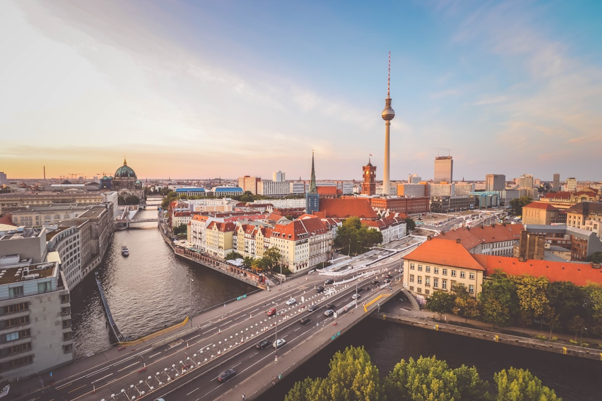

# Berlin, Germany

Country: Germany
Region: Europe

Berlin is the German capital of memory. Reunified for less than a long lifetime, the city wears its twentieth century openly: the Wall traces, the Holocaust memorials, the rebuilt Reichstag, the squat-turned-gallery, the techno club in the power station. It is also a working capital of 3.8 million, with a quietly aggressive housing politics.

---

## 🧭 Step 1: Choices

### ✨ Why Visit

Berlin is more honest about its history than almost any major capital. The Memorial to the Murdered Jews of Europe sits beside the Brandenburg Gate; the Topography of Terror is across the street from the former Luftwaffe ministry; the Stasi headquarters in Lichtenberg is preserved as a working archive.

Beyond the memory, Berlin is one of Europe's great living-art and music cities. Museum Island, the Berghain and Tresor club scenes, the gallery streets of Mitte and Kreuzberg, and a creative economy still partly underwritten by post-reunification cheap rents (rapidly disappearing).

You come for the history, the museums, the nightlife, and a city that does not soften its past.

### 🌍 Ethical Compass

- **💰 Economy.** Eat Turkish, Vietnamese, and German at small shop-front places in Kreuzberg, Neukölln, Wedding, and Friedrichshain. Buy at the Markthalle Neun (Kreuzberg) or weekly *Wochenmärkte* rather than international chains. Stay in licensed hotels and pensions; Berlin restricts short-term rentals to protect residential housing.
- **👥 Employment.** Tip a small amount at sit-down meals (round up or 5 to 10 percent). Use the BVG (public transport) rather than ride-hail where possible; it supports a strong public-sector workforce.
- **📚 Education.** Read about both the Nazi period and the GDR before you visit. Berliners are direct about their history; vague allusions feel dismissive. The Stolpersteine (brass "stumbling stones" set into pavements naming Holocaust victims) are everywhere; learn to read them.
- **🌱 Ecology.** Cycle (Berlin has serious bike infrastructure), walk, or use the BVG. Berlin's lakes (Wannsee, Müggelsee) are real summer relief; reach them by S-Bahn rather than car. Heatwaves are increasingly intense; plan accordingly.

---

## 🎒 Step 2: Preparation

### 🔍 Governance Management

- Berlin restricts **short-term apartment rentals**. Most legal listings require the host to live on premises or hold a specific permit. Verify the listing's licence number; the city has fined many illegal hosts.
- Book major museums (**Pergamon, Neues Museum, Jewish Museum, Topography of Terror**) on their official portals; many have timed entry. The Pergamon is undergoing long renovation; verify current open wings.
- **Reichstag dome visits** require advance registration with passport on the Bundestag's official portal. Free.
- Berghain and the major clubs have strict door policies; no guides, no AI, can predict them. The legend is part of the experience.
- Berlin's **Berliner Testament Card or Welcome Card** offers public transport plus museum discounts; verify on the official BVG and visit-Berlin portals.

### 📡 Information Curation

- **The Local Germany** and **Berliner Morgenpost** (English available) for current Berlin news.
- **visitBerlin** (official tourism site) for current museum openings, festivals, and rules.
- A German author or historian: W.G. Sebald's *On the Natural History of Destruction*, or anything by Joseph Roth on Weimar Berlin.
- A neighbourhood walking host based in Kreuzberg, Neukölln, or Friedrichshain for a non-Mitte perspective.
- **Wikivoyage Berlin** for district orientation; the city is divided into Bezirke that feel like separate small cities.

### 🎯 Inference Interaction

- **You decide where you sleep.** A licensed hotel or pension in any Bezirk is fair. An unlicensed short-term rental is illegal in Berlin and often actively displacing tenants.
- **You decide how you engage history.** A Holocaust memorial deserves quiet attention, not a TikTok. Same for the Stasi prison at Hohenschönhausen.
- **You decide your nightlife approach.** Berghain may say no. If they do, the queue at Tresor or about:blank is real too. Or have a quiet night in Friedrichshain.
- **You decide on Pergamon vs alternatives.** The Pergamon is partly closed for major renovation; verify what is open before booking.
- **You decide on cycling.** Berlin is genuinely good for it; you also need to know the unwritten rules (do not block the cycle lane).

### 🔄 Intelligence Cooperation

Berlin reinvents corners of itself constantly. Galleries become clubs become apartment blocks. Museum wings close for renovation. New memorials open. The wider political weather (national elections, demonstrations) reshapes central streets.

Bring a soft plan. If a demonstration closes Brandenburg Gate (common), the U- and S-Bahn route around it. If a sudden cold snap kills your beer-garden plan, the museums absorb it. If your club door says no, the next one might say yes.

### 📍 Top 5 Anchor Spots

1. **Museum Island and the Pergamon area.** Verify which wings are open before booking; the Neues Museum (Nefertiti's bust) and the Bode are usually accessible.
2. **Memorial to the Murdered Jews of Europe + Topography of Terror.** A morning's quiet walk through twentieth-century atonement at scale.
3. **Reichstag dome.** Free, requires passport-linked booking on the Bundestag portal. Sunset slots are the prize.
4. **East Side Gallery and the Berlin Wall Memorial.** Bernauer Strasse holds the most honest Wall museum; East Side Gallery is the famous painted stretch.
5. **A Kreuzberg or Neukölln evening.** Turkish market on Maybachufer (Tuesday and Friday), dinner at a Kreuzberg neighbourhood place, drinks in Friedrichshain after.

### 🧰 Practical Essentials

- **Recommended Length.** Three to five days for the city. Add a day for Potsdam (Sanssouci) or Sachsenhausen memorial.
- **Transport.** Walk in each Bezirk. The BVG U-Bahn, S-Bahn, tram, and bus network is excellent; contactless and the BVG app sell tickets. Bicycle-share and rentals are widely available. Berlin's two-airport situation is now consolidated at BER, 30 to 45 minutes from the centre.
- **Daily Cost (per person).**
  - **Budget:** roughly €70 to €120. Hostel or pension, döner and bakery meals, BVG, two or three major sites.
  - **Mid-range:** roughly €140 to €230. Three-star hotel, mixed dining, all the major sites, an evening at a brewery or beer garden.
  - **Higher-comfort:** roughly €300 and up. Boutique Mitte hotel, fine dining at places like Tim Raue or Nobelhart und Schmutzig, private guided walks, taxis.
- **Booking Notes.**
  - **Reichstag dome:** book with passport on the Bundestag portal weeks ahead in summer.
  - **Pergamon Museum:** major renovation ongoing; verify what is open on the official Staatliche Museen zu Berlin portal.
  - **Major memorials:** free entry but often timed; book on official portals.
  - **Short-term rentals:** licence required; verify the registration number.
  - **May 1 and major demonstrations** can close central streets; the BVG continues to run but routes change.

---

## ✈️ Step 3: Delivery

### 🤖 AI Prompt

Copy this into your own AI assistant, fill in the brackets, and treat the answer as a researcher's draft, not a final plan.

> Please help me plan an ethical visit to Berlin, Germany for [NUMBER] days in [MONTH]. I am travelling with [WHO] and my interests are [INTERESTS, e.g. twentieth-century history, art, nightlife, food, architecture]. My total budget is around [AMOUNT] and my comfort level is [budget / mid-range / higher-comfort].
>
> Please structure your answer in three steps.
>
> **Step 1: Choices.** Help me decide what to prioritise. Recommend the two or three Berlin experiences I should not miss given my interests, and one I should consider skipping (an unlicensed apartment, a Wall-themed shop souvenir tour, a daytime Berghain queue). Briefly explain each trade-off.
>
> **Step 2: Preparation.** Cover all four of the following:
> - **Governance Management.** What assumptions should I check before I book? Include the Berlin short-term rental licensing regime, the Reichstag dome passport registration, the Pergamon's current open wings, and which memorials require timed entry.
> - **Information Curation.** Suggest at least four different source types: one official German government source, one Berlin-based news outlet, one German author or historian on twentieth-century Berlin, and one neighbourhood-based walking host outside Mitte.
> - **Inference Interaction.** List the decisions I personally need to make (licensed accommodation, how I engage memorials, nightlife approach, cycling commitment, Pergamon alternatives).
> - **Intelligence Cooperation.** How should I trust my own judgment and local advice over algorithmic defaults when conditions change? Build me a soft plan with at least two alternates for likely disruptions (a major demonstration closing central streets, a sudden cold or heat wave, a museum wing closure, a club door turning you away).
>
> **Step 3: Delivery.** Give me the actual itinerary, day by day, with realistic timings, U-Bahn and S-Bahn routes, and named neighbourhoods. Include at least one Bezirk outside Mitte (Kreuzberg, Neukölln, Friedrichshain, or Wedding) and at least one serious memorial visit. Mark each business as confidently locally owned, or flag it for me to verify.
>
> Finally, please remind me at the end to verify your suggestions against:
> 1. Official sources: visitBerlin, the Bundestag's dome portal, the Staatliche Museen zu Berlin portal, and the BVG transport app.
> 2. Real people: a local resident, a licensed Berlin guide, or hotel staff who live in Berlin now.
>
> Treat your output as a researcher's draft. I will make the final calls.

---

Part of **Gyro Governance Ethical Travel: AI-Empowered Guides for Human Adventures**.

Explore more destinations, ethical domains, and AI prompts at [travel.gyrogovernance.com](https://travel.gyrogovernance.com/).
