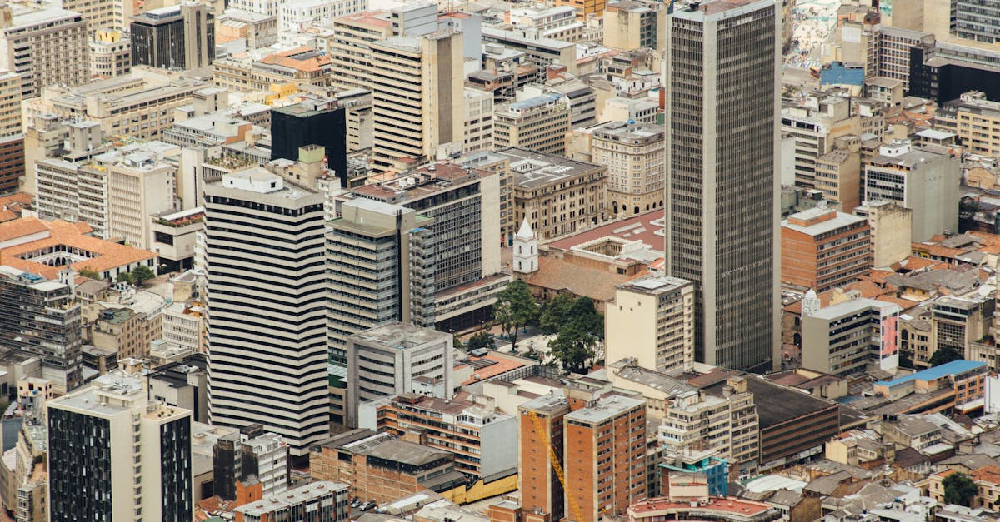

# Bogota, Colombia

Country: Colombia
Region: Americas

Bogota sits at 2,640 metres on a high plateau of the Andes, the political and academic capital of Colombia and the country's largest city. Spanish colonial centre, twentieth-century concrete sprawl, world-class museums, and a serious coffee and cuisine scene wrapped in cool mountain air.

---

## 🧭 Step 1: Choices

### ✨ Why Visit

Bogota is the head of contemporary Colombia. The Museo del Oro holds one of the great pre-Columbian gold collections in the world. La Candelaria, the colonial centre, is a working university quarter painted with street art. Cerro Monserrate, the eastern mountain, frames the city with a basilica and a viewpoint.

The city is also a real conversation about Colombia's transition from decades of conflict to a complicated peace. The Casa de la Memoria and museums of memory document what happened; the cuisine and music scenes show what is being built now.

You come for the museums, the coffee, the altitude views, and a city that rewards curiosity beyond the stereotypes.

### 🌍 Ethical Compass

- **💰 Economy.** Eat at *menú del día* lunches in working-class neighbourhoods (La Macarena, Chapinero, La Candelaria edges). Buy coffee at producer-owned cafés (Café Cultor, Devoción, Amor Perfecto) rather than international chains. Stay in licensed boutique hotels or guesthouses; the city has reasonable rates.
- **👥 Employment.** Hire registered taxis or use Uber, Cabify, or DiDi; the meter is law and most drivers respect it. Tip guides, drivers, and porters; the COP figures are small but meaningful.
- **📚 Education.** Read about the Colombian peace process and the recent history (FARC, paramilitaries, displacement) before you arrive. Visit the Museo Casa de la Memoria for the country's open conversation with its conflict. Learn Spanish basics; English is uneven outside tourist zones.
- **🌱 Ecology.** Air pollution can be serious in valley conditions; check the air-quality app. Bogota's *ciclovía* (Sunday car-free streets) is one of the world's great urban initiatives; cycle it. The páramo ecosystems above the city are fragile; only visit guided.

---

## 🎒 Step 2: Preparation

### 🔍 Governance Management

- Confirm your **visa-on-arrival or visa-exempt** status on the official Colombian Cancillería portal.
- Check current **safety advisories** for specific Bogota neighbourhoods on your home government's portal. Bogota is broadly safe in tourist and middle-class areas but has neighbourhoods that warrant local advice.
- The **Museo del Oro** is operated by the Banco de la República; buy tickets at the door or on the official site, not from resellers.
- **Cerro Monserrate** is reached by funicular or cable car (or a steep walk on weekends only); verify operation on the official Monserrate portal.
- Verify any guided coffee-region or Zipaquirá day-trip operator is registered with the Colombian tourism authority.

### 📡 Information Curation

- **El Tiempo** and **El Espectador** (Colombian dailies, Spanish; partial English coverage) for current news.
- **Bogota Turismo** (the official city site) for events and current advisories.
- A Colombian author: Gabriel García Márquez (always), or Juan Gabriel Vásquez's *The Sound of Things Falling* for modern Bogota.
- A locally led walking tour (Bogotá Bike Tours, Beyond Colombia) that includes Bogotá Graffiti Tour or a Candelaria history walk by residents.
- **Wikivoyage Bogotá** for district orientation.

### 🎯 Inference Interaction

- **You decide on altitude.** Bogota is 2,640 metres; allow an easy first day, drink water, skip alcohol until you adjust.
- **You decide on your neighbourhood base.** La Candelaria is colonial and central but quiet at night; Chapinero and Zona G are restaurant- and café-rich; Usaquén is upmarket and weekend-marketed. Each gives a different city.
- **You decide your evening movement.** Many Bogota neighbourhoods change character at night; locals routinely take a taxi after dark even for short distances. Follow local practice rather than improvising.
- **You decide whether to engage memory.** The Museo Casa de la Memoria and the National Centre for Historical Memory's projects are not light visits; they reward serious attention.
- **You decide on Sunday ciclovía.** Bogota's Sunday morning car-free streets are one of the city's gifts. Rent a bike and join.

### 🔄 Intelligence Cooperation

Bogota weather is famously variable; "four seasons in an afternoon" is barely an exaggeration. Demonstrations occasionally close central streets. The TransMilenio bus network can be jammed in peak hours.

Bring a soft plan. If it pours, the Museo del Oro, the Botero Museum, and the colonial centre's interiors absorb wet hours well. If a protest fills Plaza Bolívar, the Chapinero gallery district is unaffected. If altitude wears you down, take an easy day.

### 📍 Top 5 Anchor Spots

1. **Museo del Oro.** One of the world's great pre-Columbian collections, beautifully designed. Plan two hours.
2. **La Candelaria walking loop.** Plaza Bolívar, the Botero Museum (free, excellent), Casa de Nariño exterior, the side streets of street art.
3. **Cerro Monserrate.** Funicular up, walk down (weekends only and with company). The basilica and city panorama.
4. **Paloquemao Market.** A working wholesale market where most of Bogota's restaurants buy. Best early morning, ideally with a local guide for a tasting tour.
5. **Sunday Ciclovía and Usaquén Sunday Market.** The car-free morning streets, then north to Usaquén for the artisan market and lunch.

### 🧰 Practical Essentials

- **Recommended Length.** Three to four days for the city. Add days for Zipaquirá (Salt Cathedral), Villa de Leyva (colonial weekend), or onward to the coffee region or Cartagena.
- **Transport.** TransMilenio articulated buses and SITP regular buses are the public network; use a TuLlave card. Uber, Cabify, and DiDi are reliable and cheap. Yellow taxis are metered (insist on it). Walk only in well-trafficked daylight zones.
- **Daily Cost (per person).**
  - **Budget:** roughly COP 130,000 to 250,000 (about USD 30 to 60). Hostel or guesthouse, *menú del día* lunches, public transport, free or low-cost museums.
  - **Mid-range:** roughly COP 350,000 to 700,000 (about USD 80 to 170). Three- or four-star hotel, mixed dining, ride-hail, guided museum visits.
  - **Higher-comfort:** roughly COP 1,000,000 and up. Boutique Chapinero or Zona G hotel, fine dining at Leo or Mesa Franca, private guides, day-trips by chartered vehicle.
- **Booking Notes.**
  - **Visa:** verify on the official Colombian Cancillería portal.
  - **Yellow fever** vaccination required for some onward Colombian regions (Amazon, parts of the coast); check current requirements.
  - **Altitude:** Sleep, drink, skip alcohol on day one.
  - **Major museum closures:** most close Mondays; Museo del Oro and Botero closed Tuesdays.
  - **Demonstrations** are common in central Bogota; check news the morning of any Plaza Bolívar visit.

---

## ✈️ Step 3: Delivery

### 🤖 AI Prompt

Copy this into your own AI assistant, fill in the brackets, and treat the answer as a researcher's draft, not a final plan.

> Please help me plan an ethical visit to Bogota, Colombia for [NUMBER] days in [MONTH]. I am travelling with [WHO] and my interests are [INTERESTS, e.g. pre-Columbian art, coffee, food, street art, modern history]. My total budget is around [AMOUNT] and my comfort level is [budget / mid-range / higher-comfort].
>
> Please structure your answer in three steps.
>
> **Step 1: Choices.** Help me decide what to prioritise. Recommend the two or three Bogota experiences I should not miss given my interests, and one I should consider skipping. Briefly explain each trade-off.
>
> **Step 2: Preparation.** Cover all four of the following:
> - **Governance Management.** What assumptions should I check before I book? Include current visa rules on the Colombian Cancillería portal, home-government safety advisories, official ticketing for the Museo del Oro and Monserrate, and registered tour operators for coffee-region or Zipaquirá day trips.
> - **Information Curation.** Suggest at least four different source types: one official Colombian government source, one Colombian newspaper, one Colombian author, and one locally led Bogota walking or bike tour.
> - **Inference Interaction.** List the decisions I personally need to make (altitude pacing, neighbourhood base, evening movement, engagement with memory museums, ciclovía participation).
> - **Intelligence Cooperation.** How should I trust my own judgment and local advice over algorithmic defaults when conditions change? Build me a soft plan with at least two alternates for likely disruptions (heavy rain, a Plaza Bolívar demonstration, an altitude-affected day, a closed museum on Mondays or Tuesdays).
>
> **Step 3: Delivery.** Give me the actual itinerary, day by day, with realistic timings and named neighbourhoods. Include a Sunday ciclovía morning if my dates allow, and at least one menú del día lunch at a working-class restaurant. Mark each business as confidently locally owned, or flag it for me to verify.
>
> Finally, please remind me at the end to verify your suggestions against:
> 1. Official sources: the Colombian Cancillería, Bogota Turismo, the Museo del Oro portal, and my home country's current travel advisory.
> 2. Real people: a local resident, a licensed Bogota guide, or hotel staff who live in Bogota now.
>
> Treat your output as a researcher's draft. I will make the final calls.

---

Part of **Gyro Governance Ethical Travel: AI-Empowered Guides for Human Adventures**.

Explore more destinations, ethical domains, and AI prompts at [travel.gyrogovernance.com](https://travel.gyrogovernance.com/).
