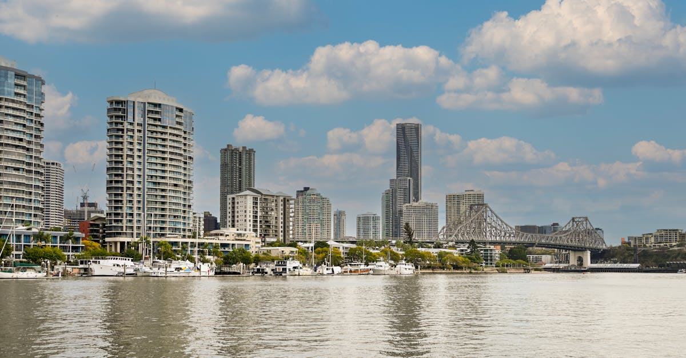

# Brisbane, Australia

Country: Australia
Region: Oceania

Brisbane (*Meanjin* in Yagara language) is Queensland's subtropical capital on a wide brown river that loops through the city six times. Smaller and more humid than Sydney or Melbourne, host of a coming Olympic Games, and a real working gateway to the Great Barrier Reef and the Sunshine and Gold Coasts.

---

## 🧭 Step 1: Choices

### ✨ Why Visit

Brisbane has spent the last twenty years quietly becoming one of Australia's most liveable cities. The Cultural Centre at South Bank holds GOMA (the Gallery of Modern Art), one of the best contemporary collections in the Southern Hemisphere. The river is a transport spine via the CityCat ferries. The food culture has caught up with the rest of the country.

The city is also the gateway to a wider Queensland that includes Aboriginal-led tourism on Stradbroke Island (*Minjerribah*), Moreton Bay's whale and dugong populations, and the southern entry to the Great Barrier Reef. Brisbane is a base, not just a stop.

You come for the subtropical river city, the contemporary art, the food, and as a launchpad to Queensland's coast and islands.

### 🌍 Ethical Compass

- **💰 Economy.** Eat at independent places in Fortitude Valley, West End, New Farm, and Paddington rather than chain mall food courts. Buy at the West End or Powerhouse farmers' markets. Stay in licensed hotels and apartment-hotels; Queensland regulates short-term lets less strictly than NSW or Victoria but the housing pressure is rising.
- **👥 Employment.** Tip is not customary in Australia. Use Translink (the public transport network) where you can; the CityCat ferry is both transport and sightseeing.
- **📚 Education.** This is Yagara, Turrbal, and Jagera country. Visit Aboriginal-led experiences (Minjerribah on Stradbroke Island, or downtown cultural tours run by First Nations operators) before assuming you have seen the Brisbane story. The state has a real conversation about reconciliation; engage it.
- **🌱 Ecology.** Brisbane summers are humid and increasingly hot; plan strenuous outdoor days carefully. Reef-bound trips from Brisbane should choose **High Standard Tourism Operators** certified by Tourism Australia and the Great Barrier Reef Marine Park Authority.

---

## 🎒 Step 2: Preparation

### 🔍 Governance Management

- **ETA or eVisitor visa** is required for most travellers; verify your nationality on the Australian Department of Home Affairs portal.
- **Translink** runs all Brisbane public transport (train, bus, CityCat ferry); contactless payment is accepted on most services.
- **GOMA, QAGOMA, and the Queensland Museum** at South Bank are mostly free; verify special-exhibition pricing on official portals.
- For day trips to **Moreton Island or North Stradbroke**, confirm ferry operators (SeaLink for Stradbroke, MICAT for Moreton) on official sites.
- Any **wildlife encounter** (koala sanctuary, dolphin feeding) should be licensed by Queensland Parks and Wildlife; verify before booking.

### 📡 Information Curation

- **The Brisbane Times** and **ABC Brisbane** for current city news.
- **Visit Brisbane** (the official city tourism site) for events, openings, and seasonal advisories.
- An Aboriginal author with Queensland connection: Melissa Lucashenko's *Too Much Lip* (set in northern NSW but resonant), or anthology *Growing Up Aboriginal in Australia*.
- A First Nations-led Brisbane tour: BlackCard or Yura Tours for in-city; Quandamooka tours on Minjerribah.
- **Wikivoyage Brisbane** for area orientation.

### 🎯 Inference Interaction

- **You decide on the Olympics overlay.** Brisbane is hosting in coming years; construction is already reshaping parts of the city. Your visit can support or bypass the displacement that often comes with mega-events.
- **You decide on Quandamooka and Minjerribah.** A day on North Stradbroke with Quandamooka-led tourism is a different Australia from the riverside CBD; it is also a longer day.
- **You decide on the Reef from Brisbane.** It is a long way to the Great Barrier Reef from Brisbane; the southern reef (off Lady Elliot or Heron Island) is closer than the northern reef. Be honest with yourself about distance.
- **You decide on koala interactions.** Lone Pine Koala Sanctuary allows holding; many ethical voices argue against this. Decide on your principles.
- **You decide your river engagement.** The CityCat (or the free CityHopper inner-city route) is one of the great public-transport experiences. Use it.

### 🔄 Intelligence Cooperation

Brisbane weather is subtropical; thunderstorms arrive fast in summer, the river floods periodically (most recently with serious damage), and humidity drives the rhythm of the day. Major events (festivals, sport, eventually the Olympics) reshape transport at short notice.

Bring a soft plan. If a storm closes the river, the cultural centre at South Bank absorbs a wet afternoon. If a koala sanctuary day feels wrong, the Lone Pine alternative is just to walk D'Aguilar National Park trails. If a CityCat is cancelled, Translink buses cover the same routes.

### 📍 Top 5 Anchor Spots

1. **GOMA and the Queensland Cultural Centre.** Free general admission, one of the great contemporary collections in the Southern Hemisphere. Plan three hours.
2. **CityCat down the river.** Apollo Road to West End, or end-to-end. The cheapest sightseeing in Brisbane.
3. **South Bank Parklands.** The river beach, the rainforest walk, the Wheel of Brisbane, the night markets on weekends.
4. **Mt Coot-tha and the Botanic Gardens.** Twenty minutes from the CBD, panoramic city view, native plant sections worth two hours.
5. **North Stradbroke Island (Minjerribah).** Ferry from Cleveland; Quandamooka-led cultural tourism, point lookout, gorges, and beaches.

### 🧰 Practical Essentials

- **Recommended Length.** Two to three days for the city. Add one to two for Minjerribah or Moreton, more for onward to the Sunshine Coast or Great Barrier Reef.
- **Transport.** Translink CityCat ferries are both transport and the most pleasant way to see the river; pay contactless. CityTrain serves the airport in 20 minutes. Buses cover the rest. The compact CBD is walkable; cycling on the riverside paths is excellent.
- **Daily Cost (per person).**
  - **Budget:** roughly AUD 100 to 170. Hostel, supermarket and food court meals, Translink, mostly free museums.
  - **Mid-range:** roughly AUD 220 to 380. Three-star hotel, mixed dining, all the major sites, a Stradbroke day.
  - **Higher-comfort:** roughly AUD 500 and up. Boutique river hotel, fine dining (the Wickham, Greca), private guided experiences, Lady Elliot Island fly-in if Reef-bound.
- **Booking Notes.**
  - **ETA or eVisitor visa:** verify on the official Department of Home Affairs portal.
  - **Major museums and galleries:** free general admission; book special exhibitions ahead.
  - **Ferry services to islands:** book ahead in summer holidays.
  - **Brisbane Festival (September) and Riverfire (late September)** are extraordinary if your dates align.
  - **Cyclone season** runs November to April; the city itself rarely sees direct hits but rain and humidity peak.

---

## ✈️ Step 3: Delivery

### 🤖 AI Prompt

Copy this into your own AI assistant, fill in the brackets, and treat the answer as a researcher's draft, not a final plan.

> Please help me plan an ethical visit to Brisbane (Meanjin), Australia for [NUMBER] days in [MONTH]. I am travelling with [WHO] and my interests are [INTERESTS, e.g. contemporary art, river life, First Nations culture, food, islands]. My total budget is around [AMOUNT] and my comfort level is [budget / mid-range / higher-comfort].
>
> Please structure your answer in three steps.
>
> **Step 1: Choices.** Help me decide what to prioritise. Recommend the two or three Brisbane experiences I should not miss given my interests, and one I should consider skipping. Briefly explain each trade-off.
>
> **Step 2: Preparation.** Cover all four of the following:
> - **Governance Management.** What assumptions should I check before I book? Include the ETA or eVisitor on the Department of Home Affairs portal, Translink contactless payments, ferry operators to Stradbroke and Moreton, and licensing of any wildlife-encounter operators.
> - **Information Curation.** Suggest at least four different source types: one official Australian or Queensland source, one Brisbane news outlet, one First Nations author or tour operator, and one neighbourhood-based food or walking host.
> - **Inference Interaction.** List the decisions I personally need to make (Olympics-overlay considerations, Quandamooka engagement, Reef-from-Brisbane reality, koala ethics, river engagement).
> - **Intelligence Cooperation.** How should I trust my own judgment and local advice over algorithmic defaults when conditions change? Build me a soft plan with at least two alternates for likely disruptions (summer thunderstorm, cancelled CityCat, ferry weather cancellation, a closed wing at GOMA).
>
> **Step 3: Delivery.** Give me the actual itinerary, day by day, with realistic timings and named places. Include at least one First Nations-led experience and one full CityCat run. Mark each business as confidently locally owned, or flag it for me to verify.
>
> Finally, please remind me at the end to verify your suggestions against:
> 1. Official sources: Visit Brisbane, Translink, the Department of Home Affairs, and Tourism Australia for Reef operators if applicable.
> 2. Real people: a local resident, a First Nations guide, or hotel staff who live in Brisbane now.
>
> Treat your output as a researcher's draft. I will make the final calls.

---

Part of **Gyro Governance Ethical Travel: AI-Empowered Guides for Human Adventures**.

Explore more destinations, ethical domains, and AI prompts at [travel.gyrogovernance.com](https://travel.gyrogovernance.com/).
