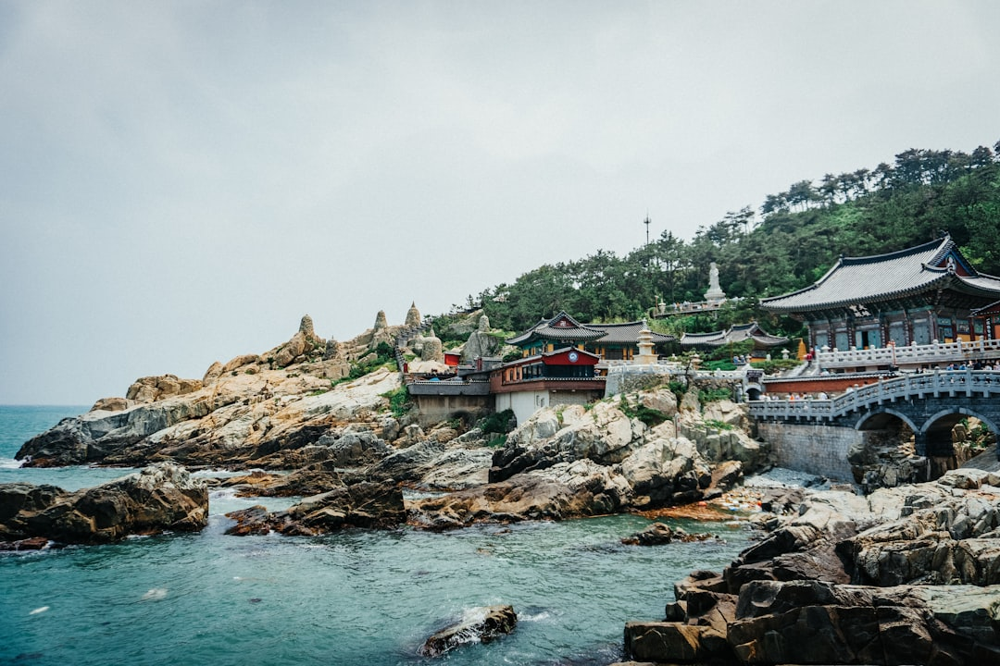

# Busan, South Korea

Country: South Korea
Region: Asia

Busan is South Korea's second city and largest port, a Pacific-facing coastline of beaches, fishing villages, and high-rises wrapped around mountains and a working harbour. The country's seafood capital, the country's film festival capital, and a quietly different rhythm from Seoul.

---

## 🧭 Step 1: Choices

### ✨ Why Visit

Busan is what happens when a Pacific port city industrialises hard and then learns to enjoy itself. Haeundae and Gwangalli beaches are urban beaches that work. Jagalchi Market is the largest seafood market in Korea. Gamcheon Culture Village is a hillside neighbourhood reborn through community-led art.

The city is also a contrast to Seoul. It is hillier, more humid, more laid back; the dialect is recognisable to any Korean within seconds. The Busan International Film Festival draws filmmakers from across Asia each autumn.

You come for the seafood, the beaches, the temples carved into cliffs, and a less photographed Korea than the Seoul Instagram has shown.

### 🌍 Ethical Compass

- **💰 Economy.** Eat at Jagalchi market upstairs (point to your fish, eat it cooked downstairs), and at small *pojangmacha* (tent restaurants) and *banchan*-rich local spots in Seomyeon and Nampo-dong. Avoid the over-touristed Western restaurants along Haeundae's beach front.
- **👥 Employment.** Tipping is not customary in Korea; do not press it. Use the Busan Metro, the public buses, and the **Cashbee** or **T-money** transit cards. KakaoTaxi is the standard ride-hail.
- **📚 Education.** Read about Busan's role in the Korean War (the city was the temporary capital and the perimeter held); the UN Memorial Cemetery is sobering. Learn ten Korean phrases; English is uneven outside the central tourist zones.
- **🌱 Ecology.** Busan beaches have real currents; swim within marked flags. The cliffside temples (Haedong Yonggungsa) are fragile heritage; stay on paths. Korea has tightened waste rules; sort your rubbish where signage requires.

---

## 🎒 Step 2: Preparation

### 🔍 Governance Management

- **K-ETA (Korea Electronic Travel Authorization)** is required for many visa-waiver nationalities; verify your status on the official K-ETA portal before booking flights.
- The **Busan Metro** has four lines; tap a Cashbee or T-money card or use contactless on most lines.
- For the **Busan International Film Festival (BIFF, October)**, book accommodation and screenings months ahead through the official BIFF portal.
- Verify any **Jagalchi Market guided tour** operates with a licensed Busan guide; tasting tours are excellent if properly run.
- **Beach water safety:** verify current beach flags and warnings on the Busan municipal beach portal; jellyfish and currents are seasonal.

### 📡 Information Curation

- **Korea Herald** and **Korea JoongAng Daily** (English-language Korean newspapers) for national and Busan news.
- **Visit Busan** (the official city tourism site) for events, openings, and seasonal advisories.
- A Korean author with Busan or southern roots: Han Kang's *The Vegetarian* or *Human Acts* (set in nearby Gwangju).
- A locally led Gamcheon walking tour, ideally with a guide based in the village.
- **Wikivoyage Busan** for area orientation; the city is spread along the coast and metro lines.

### 🎯 Inference Interaction

- **You decide on your base.** Seomyeon (central, restaurants, nightlife) versus Haeundae (beach, modern) versus Nampo-dong (old town, market) gives wildly different days.
- **You decide on BIFF.** If your dates align, the festival is genuinely worth planning around; book early.
- **You decide on the day-trip ambition.** Gyeongju (the ancient Silla capital) is a possible day from Busan but better as an overnight; verify if your itinerary can absorb it.
- **You decide on Jagalchi etiquette.** Pointing at fish to be cooked upstairs is the system; do not haggle aggressively, and tip the cooking auntie modestly even if not customary.
- **You decide on temple dress and behaviour.** Haedong Yonggungsa is a working Buddhist temple; cover shoulders, lower voices, no flash photography of monks.

### 🔄 Intelligence Cooperation

Busan weather is humid and dramatic; typhoons reach the coast late summer through early autumn. The film festival fills the city in October. National holidays (Chuseok, Lunar New Year) close many businesses for several days.

Bring a soft plan. If a typhoon warning closes beaches, the indoor parts of the city (Centum City's malls, the Museum of Movies, Beomeosa temple under cover) absorb a day well. If Jagalchi is overwhelmed, Choryang Ibagu-gil or the Gukje Market deliver a quieter market experience.

### 📍 Top 5 Anchor Spots

1. **Gamcheon Culture Village.** A community-led art transformation of a hillside refugee-era neighbourhood. Walk down through the colour-coded houses, support the small cafés.
2. **Jagalchi Fish Market and Nampo-dong.** Pick your seafood downstairs, eat it cooked upstairs. Combine with BIFF Square and the surrounding old town.
3. **Haedong Yonggungsa Temple.** A rare seaside Buddhist temple, with the sea crashing against its walls. Best at dawn.
4. **Beomeosa Temple and Mount Geumjeong.** A serious mountain temple complex; walk to the fortress wall if fit, or take the cable car partway.
5. **Gwangalli Beach and the Gwangan Bridge at night.** The bridge lights and a beachside walk are genuinely lovely; the seafood tents (*pojangmacha*) on the back streets are the meal.

### 🧰 Practical Essentials

- **Recommended Length.** Two to four days for the city. Add a day for Gyeongju (overnight better), and the broader southern coast can absorb a week.
- **Transport.** Busan Metro and city buses cover almost everything; Cashbee or T-money cards, contactless on most lines. KakaoTaxi for ride-hail. The KTX high-speed train from Seoul takes about 2 hours 30 minutes. Gimhae International Airport (PUS) is 30 minutes from central Busan on the metro extension or limousine bus.
- **Daily Cost (per person).**
  - **Budget:** roughly KRW 50,000 to 90,000 (about USD 35 to 65). Hostel or motel, market and street meals, metro, free or low-cost beaches and temples.
  - **Mid-range:** roughly KRW 130,000 to 250,000 (about USD 95 to 180). Three- or four-star hotel, mixed dining including a serious raw-seafood meal at Jagalchi, all the major sites.
  - **Higher-comfort:** roughly KRW 400,000 and up. Five-star at Haeundae or Centum City, fine dining, private guided tours, day trips by chartered vehicle.
- **Booking Notes.**
  - **K-ETA:** verify your nationality's current requirement on the official K-ETA portal.
  - **BIFF (October):** book accommodation and screenings months ahead.
  - **Chuseok (autumn) and Seollal (Lunar New Year)** close many small businesses for days; verify in advance.
  - **Typhoon season** runs roughly August to early October; check coastal forecasts.
  - **Beach swimming season** is short (July to early September) but officially flagged; check Visit Busan for current beach conditions.

---

## ✈️ Step 3: Delivery

### 🤖 AI Prompt

Copy this into your own AI assistant, fill in the brackets, and treat the answer as a researcher's draft, not a final plan.

> Please help me plan an ethical visit to Busan, South Korea for [NUMBER] days in [MONTH]. I am travelling with [WHO] and my interests are [INTERESTS, e.g. seafood, beaches, temples, film, Korean War history]. My total budget is around [AMOUNT] and my comfort level is [budget / mid-range / higher-comfort].
>
> Please structure your answer in three steps.
>
> **Step 1: Choices.** Help me decide what to prioritise. Recommend the two or three Busan experiences I should not miss given my interests, and one I should consider skipping (an over-marketed beach club, a tourist-priced seafood spot, a packed day trip that should be an overnight). Briefly explain each trade-off.
>
> **Step 2: Preparation.** Cover all four of the following:
> - **Governance Management.** What assumptions should I check before I book? Include the K-ETA on the official portal, Jagalchi Market etiquette, BIFF dates and ticketing if relevant, temple dress codes, and Busan beach conditions.
> - **Information Curation.** Suggest at least four different source types: one official Korean or Busan source, one English-language Korean newspaper, one Korean author, and one local Gamcheon or Jagalchi-based guide.
> - **Inference Interaction.** List the decisions I personally need to make (neighbourhood base, BIFF or no, day-trip ambition, market etiquette, temple behaviour).
> - **Intelligence Cooperation.** How should I trust my own judgment and local advice over algorithmic defaults when conditions change? Build me a soft plan with at least two alternates for likely disruptions (typhoon warning, beach closure, Chuseok closures, BIFF overcrowding).
>
> **Step 3: Delivery.** Give me the actual itinerary, day by day, with realistic timings, metro lines, and named neighbourhoods. Include at least one Jagalchi seafood meal and one seaside temple visit. Mark each business as confidently locally owned, or flag it for me to verify.
>
> Finally, please remind me at the end to verify your suggestions against:
> 1. Official sources: Visit Busan, the K-ETA portal, BIFF (if applicable), and Busan municipal beach portal.
> 2. Real people: a local resident, a licensed Korean guide, or hotel staff who live in Busan now.
>
> Treat your output as a researcher's draft. I will make the final calls.

---

Part of **Gyro Governance Ethical Travel: AI-Empowered Guides for Human Adventures**.

Explore more destinations, ethical domains, and AI prompts at [travel.gyrogovernance.com](https://travel.gyrogovernance.com/).
