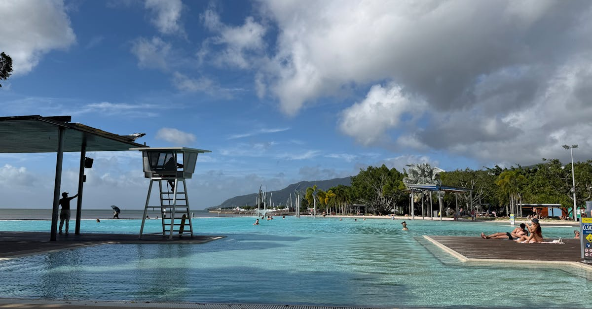

# Cairns, Australia

Country: Australia
Region: Oceania

Cairns is the small tropical city of Far North Queensland that functions as the world's main gateway to the Great Barrier Reef and the Daintree, the oldest continuously surviving rainforest on Earth. A working port, a serious dive industry, and a long Aboriginal and Torres Strait Islander presence.

---

## 🧭 Step 1: Choices

### ✨ Why Visit

Cairns is the only city anywhere that sits between two UNESCO World Heritage sites: the Great Barrier Reef offshore, the Wet Tropics rainforest inland. The Esplanade has a working lagoon (the beach itself is mostly mudflats), the Reef trips run daily, and a 40-minute scenic train or cable car puts you in Kuranda mountain rainforest.

The city is also the natural base for the Daintree and Cape Tribulation, where reef meets rainforest. Visiting reef and rainforest responsibly is the entire point of being in Cairns; there are few other compelling reasons to be in this specific town.

You come here for the Reef, for the rainforest, and for the chance to engage with the Indigenous custodians of both.

### 🌍 Ethical Compass

- **💰 Economy.** Choose **High Standard Tourism Operators** for Reef trips; they meet stricter sustainability and education benchmarks. Stay in licensed Cairns accommodation rather than informal lets; the city has limited housing pressure for residents.
- **👥 Employment.** Hire Indigenous-led tour operators where possible: Mandingalbay Authentic Indigenous Tours, Walkabout Cultural Adventures (Daintree), or Mossman Gorge's Ngadiku Dreamtime Gorge Walk run by Kuku Yalanji guides.
- **📚 Education.** Cairns is on the country of Yidinji, Gimuy Walubara Yidinji, and other traditional owners. Read about the Wet Tropics and Reef's Indigenous management before assuming this is "wilderness". The Reef has lost much coral cover to bleaching; be honest with what you will see.
- **🌱 Ecology.** **Reef-safe sunscreen** (non-oxybenzone) for any in-water activity. Never touch coral. Choose operators who follow the Great Barrier Reef Marine Park Authority's High Standard Tourism criteria. Tipping is not customary; supporting Indigenous-led experiences is.

---

## 🎒 Step 2: Preparation

### 🔍 Governance Management

- **ETA or eVisitor** required for most visa-waiver nationals; verify on the Department of Home Affairs portal.
- Confirm any Reef operator is on the **Great Barrier Reef Marine Park Authority** list of certified operators; verify on the official GBRMPA portal.
- An **Environmental Management Charge** applies to most Reef trips and should be clearly itemised; verify on the GBRMPA portal.
- **Stinger season** runs roughly November to May; outer Reef pontoons supply stinger suits but verify before booking summer in-water activities.
- **Crocodile risk** in Daintree and Cape Tribulation waters is real; do not swim in unmarked rivers or estuaries. Verify current advisories with Queensland Parks and Wildlife.

### 📡 Information Curation

- **Great Barrier Reef Marine Park Authority (GBRMPA)** for current reef conditions, certified operators, and education materials.
- **Cairns Post** and **ABC Far North** for local news, weather, and event listings.
- **Tropical North Queensland Tourism** (official) for accommodation and event information.
- An Indigenous-led Daintree or Mossman Gorge tour with Kuku Yalanji or Yidinji custodians.
- A book on the Reef: J.E.N. Veron's *A Reef in Time*, or recent journalism on the Reef's bleaching crisis.

### 🎯 Inference Interaction

- **You decide on your Reef operator.** A High Standard Tourism Operator costs marginally more and delivers far better education, safety, and conservation outcomes than the cheapest day boat.
- **You decide on sunscreen.** Reef-safe (non-oxybenzone, non-octinoxate) is non-negotiable for anyone going in the water near coral.
- **You decide on inner vs outer Reef.** Outer Reef sites have better-preserved coral; inner sites are closer and cheaper. Read recent operator reports honestly.
- **You decide on Daintree as a day trip vs overnight.** A day trip is 12 hours of bus from Cairns; an overnight in Cape Tribulation lets you actually experience the forest at night.
- **You decide on Indigenous engagement.** A Walkabout or Mandingalbay tour is a different reading of the same landscape; well worth a half day or full day.

### 🔄 Intelligence Cooperation

Tropical North Queensland weather is dramatic. The wet season (November to April) brings monsoonal storms, cyclones, and stinger risk in coastal waters. The dry season (May to October) is the practical visitor window. Reef visibility varies with weather and recent rainfall runoff.

Bring a soft plan. If a Reef trip is cancelled by swell, the rainforest absorbs that day. If the Daintree road is cut by flooding (common in the wet), Cairns and Kuranda still work. If your inner-Reef visibility is bad on the day, that is a real conversation to have with your operator about rebooking.

### 📍 Top 5 Anchor Spots

1. **Outer Great Barrier Reef day trip with a certified High Standard Operator.** Agincourt, Flynn, or Norman reefs are common outer sites; ask which.
2. **Daintree National Park and Cape Tribulation.** Ferry across the Daintree River, drive up to Cape Tribulation; an Indigenous-led walk at Mossman Gorge or Cooper Creek is the right entry point.
3. **Kuranda via Skyrail Rainforest Cableway and the Scenic Railway.** Cableway up over the canopy, train down through gorges. Touristy but genuinely worth it.
4. **Atherton Tablelands day trip.** Crater lakes, waterfalls (Millaa Millaa), and dairy country at altitude; a good break from the coast.
5. **Cairns Esplanade and Lagoon.** Free saltwater swimming pool, evening street-food markets, the city's social spine after dark.

### 🧰 Practical Essentials

- **Recommended Length.** Three to six days. Two days minimum for one Reef trip and one rainforest day; a week if you want serious diving or Cape Trib overnights.
- **Getting There and Around.** Fly to Cairns Airport (CNS) from most Australian and some Asian capitals. In the city, walk or use Cairns buses; outside it, rent a car for Daintree and the Tablelands, or join a guided tour. The Skyrail and Kuranda Scenic Railway are pre-bookable on official sites.
- **Daily Cost (per person).**
  - **Budget:** roughly AUD 120 to 200. Hostel, supermarket and food-market meals, public transport, one Reef trip on a budget operator.
  - **Mid-range:** roughly AUD 280 to 500. Three-star hotel, restaurant dinners, one High Standard Reef trip, one Daintree day, Skyrail.
  - **Higher-comfort:** roughly AUD 700 and up. Five-star Palm Cove or city hotel, fine dining, private guided Reef diving, Cape Trib eco-lodge overnights, helicopter Reef flights.
- **Booking Notes.**
  - **ETA or eVisitor:** verify on the Department of Home Affairs portal.
  - **Reef operators:** verify the High Standard Tourism Operator status on the GBRMPA portal; book days ahead in peak winter season.
  - **Stinger suits** supplied by most outer Reef operators in summer; verify in your booking.
  - **Wet-season closures** can affect Daintree access and Reef days; check forecasts.
  - **Cyclone risk** peaks January to March; build flexibility into bookings.

---

## ✈️ Step 3: Delivery

### 🤖 AI Prompt

Copy this into your own AI assistant, fill in the brackets, and treat the answer as a researcher's draft, not a final plan.

> Please help me plan an ethical visit to Cairns and the Great Barrier Reef, Australia for [NUMBER] days in [MONTH]. I am travelling with [WHO] and my interests are [INTERESTS, e.g. diving, snorkelling, rainforest, Indigenous culture, photography]. My total budget is around [AMOUNT] and my comfort level is [budget / mid-range / higher-comfort].
>
> Please structure your answer in three steps.
>
> **Step 1: Choices.** Help me decide what to prioritise. Recommend the two or three Cairns and Daintree experiences I should not miss given my interests, and one I should consider skipping (the cheapest unverified Reef trip, an inner-Reef-only day in poor visibility, a Daintree day-trip if I could afford an overnight). Briefly explain each trade-off.
>
> **Step 2: Preparation.** Cover all four of the following:
> - **Governance Management.** What assumptions should I check before I book? Include the ETA or eVisitor on the Department of Home Affairs portal, High Standard Tourism Operator certification on GBRMPA, stinger and crocodile advisories, and Environmental Management Charge inclusion.
> - **Information Curation.** Suggest at least four different source types: GBRMPA, Tropical North Queensland Tourism, an Indigenous-led tour operator (Walkabout, Mandingalbay, or Mossman Gorge), and a recent book or article on the Reef's condition.
> - **Inference Interaction.** List the decisions I personally need to make (operator choice, reef-safe sunscreen, inner vs outer Reef, Daintree day vs overnight, Indigenous engagement).
> - **Intelligence Cooperation.** How should I trust my own judgment and local advice over algorithmic defaults when conditions change? Build me a soft plan with at least two alternates for likely disruptions (Reef trip cancelled by swell, Daintree road cut by flood, poor visibility, cyclone warning).
>
> **Step 3: Delivery.** Give me the actual itinerary, day by day, with realistic timings and named operators where I should book. Include at least one High Standard Reef day and one Indigenous-led rainforest experience. Mark each business as confidently locally owned, or flag it for me to verify.
>
> Finally, please remind me at the end to verify your suggestions against:
> 1. Official sources: GBRMPA for Reef operators, Tropical North Queensland Tourism, the Department of Home Affairs, and Queensland Parks and Wildlife for safety advisories.
> 2. Real people: a Cairns dive shop, a Kuku Yalanji or Yidinji guide, or hotel staff who live in Cairns now.
>
> Treat your output as a researcher's draft. I will make the final calls.

---

Part of **Gyro Governance Ethical Travel: AI-Empowered Guides for Humane Adventures**.

Explore more destinations, ethical domains, and AI prompts at [travel.gyrogovernance.com](https://travel.gyrogovernance.com/).
