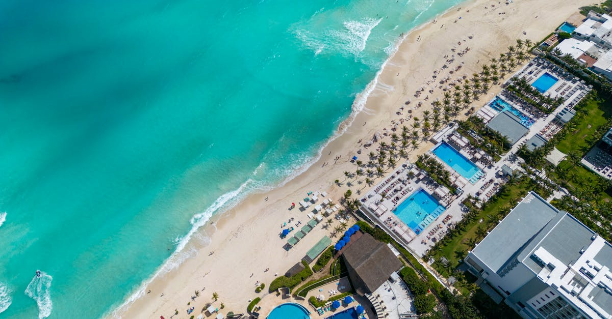

# Cancun, Mexico

Country: Mexico
Region: Americas

Cancun is the planned tourist city on Mexico's Caribbean coast, built in the 1970s as a federal megaproject and now the gateway to the wider Yucatán: Mayan ruins, cenotes, the Mesoamerican Reef, and the colonial cities of Mérida and Valladolid. The Hotel Zone is the postcard; the Yucatán beyond is the trip.

---

## 🧭 Step 1: Choices

### ✨ Why Visit

Cancun is one of the planet's most reliable points of entry to the Maya world and the Caribbean's second-longest reef. Tulum and Chichén Itzá sit within a day's reach; the cenotes (underground freshwater pools sacred to the Maya) are uniquely Yucatán; the Sian Ka'an Biosphere Reserve protects mangroves and coral within a couple of hours.

The city is also a real case study in how mass beach tourism plays out. The Hotel Zone is a 25 km strip of international resorts, and most visitors never leave it. The actual city of Cancun (the *centro*) and the wider Riviera Maya hold a far more interesting trip.

You come for the reef, the Mayan sites, the cenotes, and a chance to make a beach-resort holiday into something more.

### 🌍 Ethical Compass

- **💰 Economy.** Stay outside the Hotel Zone at least once: Playa del Carmen, Tulum town (not beach), Mérida, Valladolid, or Isla Holbox. Eat at *taquerías*, *cocinas económicas*, and Yucatecan family restaurants in Cancun centro and Mayan villages, not just the all-inclusive buffet.
- **👥 Employment.** Hire **INAH-certified guides** at Chichén Itzá, Tulum, and Cobá; the freelance guides outside the gates are often unlicensed. Tip in cash at restaurants (10 to 15 percent), and tip the housekeeping staff at resorts.
- **📚 Education.** This is Maya country. The civilisation is not gone; six million Maya live across Mexico, Guatemala, Belize, and Honduras today. Visit Maya-run cultural experiences rather than the costumed dance shows. Read one popular book on the Maya before assuming you understand the ruins.
- **🌱 Ecology.** **Reef-safe sunscreen** is now legally required at many cenotes and parks; check the label (no oxybenzone, no octinoxate). The cenotes themselves are fragile and sacred; shower before entry, no chemicals, follow the rules. Sargassum seaweed blooms can affect beaches; verify before booking specific resorts.

---

## 🎒 Step 2: Preparation

### 🔍 Governance Management

- Most visitors get an **FMM tourist card** automatically with their flight; verify current rules on the **INM (Instituto Nacional de Migración)** portal.
- A **Quintana Roo state tourist tax (VisiTax)** applies to most international visitors; pay online on the official VisiTax portal before departure to avoid airport queues.
- **Chichén Itzá** has separate state and federal entry fees, plus extra for evening sound-and-light shows; verify on the INAH (Instituto Nacional de Antropología e Historia) portal.
- For **cenote visits**, use entry through the official ejido (community) operators rather than freelancers at the roadside; the Maya communities that own the cenotes deserve the entry fee.
- Confirm any reef trip uses **MARTI**-certified or known sustainable operators; verify on official Mexican tourism portals.

### 📡 Information Curation

- **Mexico News Daily** and **The Yucatan Times** (English-language Mexican outlets) for current events and security advisories.
- **Visit Mexico** and **Quintana Roo state tourism** official portals for current rules.
- A book or documentary on the Maya: Michael D. Coe's *The Maya*, or Carlos Fuentes' essays on Mexican identity.
- A Maya-led tour: U Najil Ek Balam (community-run, near Valladolid), Alltournative (community-tourism focus), or local Mérida operators.
- **Wikivoyage Cancun** and **Wikivoyage Yucatán** for area orientation.

### 🎯 Inference Interaction

- **You decide whether to leave the Hotel Zone.** Staying in an all-inclusive resort and never exiting is a choice; so is taking a day trip to a Maya village or two nights in Mérida.
- **You decide on Chichén Itzá vs Cobá vs Uxmal.** Chichén is the famous one and the most crowded; Cobá lets you actually climb (still, where rules permit); Uxmal is quieter and arguably more interesting.
- **You decide on Tulum.** The ruins are excellent at opening; the beach town has become expensive and overdeveloped, with serious water and waste problems.
- **You decide your sargassum tolerance.** From May to October the seaweed can pile up on east-facing beaches; west-facing (Isla Holbox, Mérida coast) and the cenotes are unaffected.
- **You decide on a Maya-led experience.** A village visit run by Maya hosts is a fundamentally different day from a costumed show at a resort.

### 🔄 Intelligence Cooperation

Yucatán weather is hot year-round. The wet season (May to October) brings afternoon thunderstorms and sargassum on east coasts. Hurricane season peaks August to October. Some Maya sites close earlier than tourists expect.

Bring a soft plan. If your reef day is windy, a cenote day is unaffected. If sargassum closes your beach, Isla Mujeres, Isla Holbox, or a cenote replaces it. If a hurricane warning closes the airport, build flexibility into your dates.

### 📍 Top 5 Anchor Spots

1. **Chichén Itzá at opening with an INAH-certified guide.** Arrive at 8 am to walk El Castillo before the buses. Add Ik Kil cenote for the swim afterwards.
2. **Tulum archaeological site at sunrise (or just at opening).** The Maya city above the Caribbean. Beat the cruise-day crowds.
3. **A cenote day in the Ruta de los Cenotes (Puerto Morelos area) or near Valladolid.** Three or four cenotes in one day, with showers and reef-safe sunscreen.
4. **Mérida overnight.** Two and a half hours west of Cancun, the colonial Yucatán capital with great food, music, and proximity to Uxmal.
5. **Isla Mujeres or Isla Holbox.** Holbox is sargassum-free, car-free, and a different Caribbean. Mujeres is a quick ferry from Cancun for a beach day with better water than the Hotel Zone.

### 🧰 Practical Essentials

- **Recommended Length.** Five to seven days minimum for a Cancun-and-Yucatán trip. Three days in Cancun or Playa, two in Mérida, and one day for ruins is a workable mix.
- **Transport.** **ADO buses** run a comfortable and cheap network across the Yucatán; book on the official ADO site. The new **Tren Maya** connects Cancun, Tulum, Mérida, and other points; verify schedules on the official portal. Rental car is the most flexible for cenote and small-town exploration. In Cancun centro and Mérida, walking and ride-hail work.
- **Daily Cost (per person).**
  - **Budget:** roughly USD 50 to 100. Hostel or small hotel outside the Hotel Zone, taquería and cocina meals, ADO buses, two cenote days.
  - **Mid-range:** roughly USD 150 to 300. Three- or four-star hotel or eco-cabaña, mixed dining, one INAH-certified guided Maya site day, one reef day.
  - **Higher-comfort:** roughly USD 500 and up. Five-star Hotel Zone or boutique Tulum jungle resort, fine dining, private guides, helicopter or charter snorkel days.
- **Booking Notes.**
  - **VisiTax (Quintana Roo state tourist tax):** pay on the official portal before departure.
  - **INAH-certified guides** at Maya sites are licensed and badged; verify at the gate.
  - **Chichén Itzá:** book ahead in peak season and arrive at opening.
  - **Sargassum:** check current beach reports (the University of South Florida sargassum bulletin is freely available).
  - **Hurricane season** runs roughly June to November; consider travel insurance that covers weather cancellations.

---

## ✈️ Step 3: Delivery

### 🤖 AI Prompt

Copy this into your own AI assistant, fill in the brackets, and treat the answer as a researcher's draft, not a final plan.

> Please help me plan an ethical visit to Cancun and the Yucatán, Mexico for [NUMBER] days in [MONTH]. I am travelling with [WHO] and my interests are [INTERESTS, e.g. Maya history, cenotes, reef, food, colonial cities]. My total budget is around [AMOUNT] and my comfort level is [budget / mid-range / higher-comfort].
>
> Please structure your answer in three steps.
>
> **Step 1: Choices.** Help me decide what to prioritise. Recommend the two or three Yucatán experiences I should not miss given my interests, and one I should consider skipping (a Hotel Zone all-inclusive that never leaves the strip, an unlicensed Maya-site guide, a Tulum beach club priced in dollars). Briefly explain each trade-off.
>
> **Step 2: Preparation.** Cover all four of the following:
> - **Governance Management.** What assumptions should I check before I book? Include the FMM tourist card on the INM portal, the VisiTax on the official state portal, INAH-certified guides at Maya sites, community-ejido cenote entry, and sustainable reef operators.
> - **Information Curation.** Suggest at least four different source types: one official Mexican or Quintana Roo source, one English-language Mexican news outlet, one Maya-led tour, and a book or documentary on the Maya.
> - **Inference Interaction.** List the decisions I personally need to make (whether to leave the Hotel Zone, Chichén vs Cobá vs Uxmal, Tulum's trade-offs, sargassum tolerance, reef-safe sunscreen).
> - **Intelligence Cooperation.** How should I trust my own judgment and local advice over algorithmic defaults when conditions change? Build me a soft plan with at least two alternates for likely disruptions (sargassum bloom, rainy-season storm, hurricane warning, sold-out Chichén time slot).
>
> **Step 3: Delivery.** Give me the actual itinerary, day by day, with realistic timings and named places. Include at least one Maya-led experience and at least one night outside the Hotel Zone. Mark each business as confidently locally owned, or flag it for me to verify.
>
> Finally, please remind me at the end to verify your suggestions against:
> 1. Official sources: VisiTax, INAH for Maya sites, the INM for visa rules, and the USF sargassum bulletin if I am visiting east-coast beaches.
> 2. Real people: a local resident, an INAH-certified guide, or hotel staff who live in the Yucatán now.
>
> Treat your output as a researcher's draft. I will make the final calls.

---

Part of **Gyro Governance Ethical Travel: AI-Empowered Guides for Human Adventures**.

Explore more destinations, ethical domains, and AI prompts at [travel.gyrogovernance.com](https://travel.gyrogovernance.com/).
