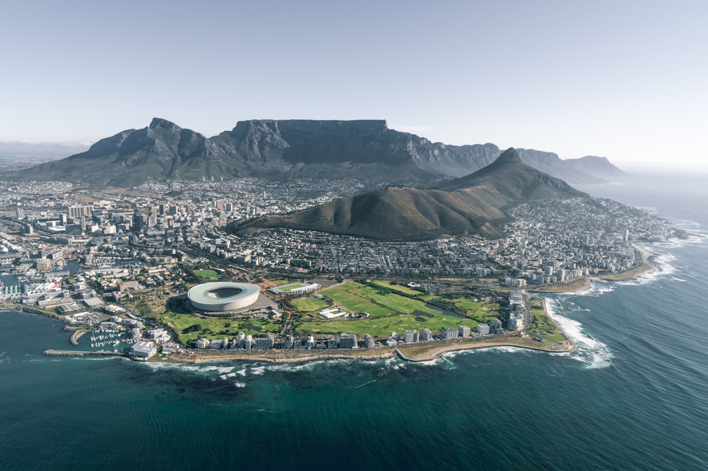

# Cape Town, South Africa

Country: South Africa
Region: Africa

Cape Town (*iKapa* in Xhosa) sits at the south-western tip of Africa, wrapped around Table Mountain and two oceans, with a 350-year history of colonial trade, slavery, segregation, and resistance written into every neighbourhood. It is one of the world's most spectacular cities and one of the most unequal.

---

## 🧭 Step 1: Choices

### ✨ Why Visit

Cape Town is geographically extraordinary. Table Mountain rises 1,000 metres from the city centre; the Atlantic and Indian Ocean currents converge below it; the Cape of Good Hope is an hour's drive south. The Cape Winelands begin 40 minutes east.

The city is also a serious place to understand modern South Africa. Robben Island, the District Six Museum, the Bo-Kaap, and Langa township each hold different parts of the apartheid story and the country's still-incomplete reckoning with it. Visiting Cape Town as if it were only mountains and wine misses the point.

You come for the mountain, the coast, the wines, the African penguin, and the chance to think seriously about a country still building itself in real time.

### 🌍 Ethical Compass

- **💰 Economy.** Eat at township restaurants (Mzansi in Langa, Café Mojo in Mitchells Plain, Marco's African Place in Bo-Kaap) on a guided visit; book locally owned guesthouses outside the wealthy Atlantic Seaboard. Buy from Greenmarket Square and Hout Bay Saturday market makers, not just airport curio shops.
- **👥 Employment.** Tipping is structural: 10 to 15 percent at restaurants, R10 to R30 for car-guards (informal parking attendants), generously for housekeeping. South African hospitality wages remain low.
- **📚 Education.** Read at least one South African author before you arrive: Sindiwe Magona, J.M. Coetzee, Damon Galgut, Antjie Krog. The District Six Museum and Robben Island Museum tell the apartheid story honestly. A locally led township tour with a resident operator (not a drive-through) is the right way to engage township life.
- **🌱 Ecology.** Cape Town has had serious water crises; conserve in any accommodation. The Cape Peninsula is one of the world's six floral kingdoms (*fynbos*); stay on trails. Penguins, baboons, and seals are protected; do not feed, do not approach.

---

## 🎒 Step 2: Preparation

### 🔍 Governance Management

- **Visa requirements** vary widely by nationality; verify on the official Department of Home Affairs portal. Many countries get 90 days visa-free.
- The **Robben Island tour** must be booked through the official Robben Island Museum portal; weather cancels ferries.
- **Table Mountain cable car** is weather-dependent and closes regularly; verify on the official cable car portal before going up.
- The **Cape Peninsula day tour** (Boulders Beach penguins, Cape Point) requires reserve entry fees; verify on the SANParks portal.
- **MyCiTi bus** is the city's reliable public transport; verify routes and current pricing on the official MyCiTi portal.

### 📡 Information Curation

- **Daily Maverick** and **News24** for serious South African journalism in English.
- **Cape Town Tourism** (the official city site) for events, current advisories, and weather warnings.
- A South African author: Sindiwe Magona on Cape Town specifically; J.M. Coetzee for literary depth; Niq Mhlongo for contemporary township perspective.
- A locally led township tour run by resident operators (Coffee Beans Routes, Uthando Tours); avoid bus-window tours.
- **SANParks** for Table Mountain National Park and Cape Point information.

### 🎯 Inference Interaction

- **You decide on safety.** Cape Town has high inequality and real petty and serious crime in some areas. Listen to local advice on walking after dark, neighbourhoods, and parked-car valuables. Most visitors have problem-free trips by following advice.
- **You decide on the township engagement.** A bus-window tour is voyeurism; a resident-led walking visit with conversation, a meal, and time is meaningful.
- **You decide on the cable car vs hike.** Table Mountain has multiple hiking routes (Platteklip Gorge is the direct climb). The cable car is easy but weather-dependent; hiking is committing.
- **You decide on the Winelands.** Stellenbosch, Franschhoek, and Constantia each give different days; consider whether a designated driver, a wine bus, or a hired guide is the safer plan.
- **You decide on Robben Island timing.** Morning ferries are more reliable; afternoons can be cancelled. Book days ahead.

### 🔄 Intelligence Cooperation

Cape Town weather is famously fickle. The "tablecloth" cloud on Table Mountain rolls in within minutes. Summer south-easters (the "Cape Doctor") can shut beaches. Winter storms close the cable car and ferries.

Bring a soft plan. If Table Mountain is closed, Lion's Head, Signal Hill, or the Castle of Good Hope are unaffected. If Robben Island is cancelled, the District Six Museum and Bo-Kaap walking tour absorb the day. If a south-easter ruins Camps Bay, Boulders Beach on the False Bay side is calm.

### 📍 Top 5 Anchor Spots

1. **Table Mountain.** Cable car or Platteklip Gorge hike; sunset is the prize if the wind allows. Always check the cable car's official portal before going.
2. **Robben Island.** Three-hour ferry-and-tour including Mandela's cell with a former political prisoner as guide. Book on the official portal.
3. **District Six Museum and a Bo-Kaap walking tour.** Half a day in the city's apartheid and Cape Malay heritage. The Bo-Kaap Cooking Tour is excellent.
4. **Cape Peninsula day: Boulders Beach penguins, Cape Point, Kirstenbosch.** A full day around the peninsula, ideally with a guide who explains the landscape.
5. **Stellenbosch or Franschhoek Winelands.** Half day or full day; book a wine tour or hire a driver. Spier and Tokara are good starts; Babylonstoren is a destination in itself.

### 🧰 Practical Essentials

- **Recommended Length.** Four to six days for the city and peninsula. Add days for the Winelands, Hermanus whale-watching (June to November), or onward to the Garden Route.
- **Transport.** **MyCiTi bus** covers the city centre, Atlantic Seaboard, and the airport; use a myconnect card or contactless. **Uber and Bolt** are reliable and cheap. Renting a car is the most flexible for the peninsula and Winelands. Avoid walking after dark in central business district or unfamiliar areas.
- **Daily Cost (per person).**
  - **Budget:** roughly ZAR 800 to 1,500 (about USD 45 to 85). Backpacker hostel, supermarket and casual meals, MyCiTi and Uber, Robben Island, Table Mountain hike.
  - **Mid-range:** roughly ZAR 2,500 to 5,000 (about USD 140 to 280). Three- or four-star guesthouse, restaurant dinners, cable car, township tour, peninsula day with driver.
  - **Higher-comfort:** roughly ZAR 8,000 and up. Five-star hotel (Mount Nelson, One&Only), fine dining at La Colombe or The Test Kitchen, private guides, Winelands lunches at Babylonstoren.
- **Booking Notes.**
  - **Visa:** verify on the official Department of Home Affairs portal.
  - **Robben Island:** book on the official museum portal days ahead.
  - **Table Mountain cable car:** check operating status on the morning you go.
  - **Cape Town Cycle Tour (March)** and major sporting events fill the city; book ahead.
  - **Loadshedding** (rolling power cuts) is a real factor; verify with your hotel; most have generators.

---

## ✈️ Step 3: Delivery

### 🤖 AI Prompt

Copy this into your own AI assistant, fill in the brackets, and treat the answer as a researcher's draft, not a final plan.

> Please help me plan an ethical visit to Cape Town, South Africa for [NUMBER] days in [MONTH]. I am travelling with [WHO] and my interests are [INTERESTS, e.g. mountain hiking, apartheid history, wine, marine wildlife, food]. My total budget is around [AMOUNT] and my comfort level is [budget / mid-range / higher-comfort].
>
> Please structure your answer in three steps.
>
> **Step 1: Choices.** Help me decide what to prioritise. Recommend the two or three Cape Town experiences I should not miss given my interests, and one I should consider skipping (a drive-through township "tour", a Camps Bay sunset with a stiff south-easter, a Winelands day without a designated driver). Briefly explain each trade-off.
>
> **Step 2: Preparation.** Cover all four of the following:
> - **Governance Management.** What assumptions should I check before I book? Include the Department of Home Affairs visa portal, Robben Island official booking, Table Mountain cable car operating status, SANParks for the peninsula, and loadshedding status with my accommodation.
> - **Information Curation.** Suggest at least four different source types: one official South African source, one serious South African news outlet, one South African author, and one resident-led township tour operator.
> - **Inference Interaction.** List the decisions I personally need to make (safety practice, township engagement style, cable car vs hike, Winelands transport, Robben Island timing).
> - **Intelligence Cooperation.** How should I trust my own judgment and local advice over algorithmic defaults when conditions change? Build me a soft plan with at least two alternates for likely disruptions (Table Mountain closed, Robben Island cancelled, a strong south-easter wind, a loadshedding scheduled cut).
>
> **Step 3: Delivery.** Give me the actual itinerary, day by day, with realistic timings and named places. Include at least one resident-led township or Bo-Kaap experience, one full peninsula day, and one Winelands afternoon. Mark each business as confidently locally owned, or flag it for me to verify.
>
> Finally, please remind me at the end to verify your suggestions against:
> 1. Official sources: Cape Town Tourism, Robben Island Museum, the Table Mountain cable car portal, SANParks, and the Department of Home Affairs.
> 2. Real people: a local resident, a township-resident guide, or hotel staff who live in Cape Town now.
>
> Treat your output as a researcher's draft. I will make the final calls.

---

Part of **Gyro Governance Ethical Travel: AI-Empowered Guides for Human Adventures**.

Explore more destinations, ethical domains, and AI prompts at [travel.gyrogovernance.com](https://travel.gyrogovernance.com/).
