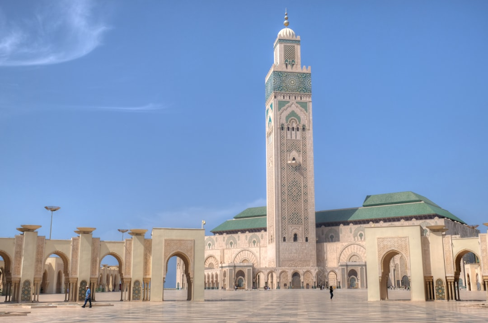

# Casablanca, Morocco

Country: Morocco
Region: Africa

Casablanca (*ad-Dār al-Bayḍāʾ*) is Morocco's largest city and economic capital, a Atlantic-facing port of nearly four million, and the country's most modern face. Less postcard than Marrakech or Fes, more working metropolis, with the immense Hassan II Mosque on the ocean and a quietly excellent Art Deco core.

---

## 🧭 Step 1: Choices

### ✨ Why Visit

Casablanca is the working city Morocco built in the twentieth century. The Hassan II Mosque is one of the largest mosques in the world and the only one in Morocco where non-Muslims can enter (on a guided tour). The Art Deco architecture downtown is some of the best preserved in Africa. The food scene is among the country's most cosmopolitan.

The city is also the access point most international visitors use before heading to Marrakech, Fes, or Chefchaouen. Spending one or two nights here lets you see the modern Morocco those other cities deliberately conceal.

You come for the mosque, the architecture, the seafood on the corniche, and a more honest reading of contemporary Morocco than the imperial cities alone provide.

### 🌍 Ethical Compass

- **💰 Economy.** Eat at seafood restaurants in the Port de Pêche (the fishing port), at family-run *snacks* in Maarif and Habous, and at Moroccan bakeries rather than international chains. Tip 10 percent at sit-down meals.
- **👥 Employment.** Hire licensed guides through your hotel or registered agencies; freelancers approaching you on the street are usually unlicensed. Tip taxi drivers (round up), porters, and hotel staff in small Moroccan dirham notes.
- **📚 Education.** Read about French Protectorate-era Casablanca and the Art Deco building boom; Casablanca was deliberately built to embody French colonial modernism. The film *Casablanca* (1942) was not actually shot here.
- **🌱 Ecology.** Casablanca air pollution is a real issue in still weather; check the air-quality index. Water pressure on Morocco's Atlantic coast is increasing; bathe briefly, refill from sealed bottles, and respect any drought signage.

---

## 🎒 Step 2: Preparation

### 🔍 Governance Management

- Verify your **visa-exempt or visa-required** status on the official Moroccan Ministry of Foreign Affairs portal; most Western nationalities are exempt for short visits.
- **Hassan II Mosque** visits are guided-tour only for non-Muslims; check the official mosque portal for tour times and dress requirements. Tickets are bought at the door.
- **Tramway de Casablanca** is the city's modern public transport spine; verify routes on the official Casa Tram portal.
- Confirm any taxi (the small red *petit taxi* or larger white *grand taxi*) is using the meter (*compteur*).
- For **day trips to Rabat** by train, book on the official ONCF portal; the journey is roughly one hour.

### 📡 Information Curation

- **Morocco World News** and **Hespress English** (English-language Moroccan outlets) for current events.
- The official **Moroccan National Tourist Office (ONMT)** for cultural and event listings.
- A Moroccan author: Tahar Ben Jelloun, Laila Lalami, Abdellah Taïa.
- A licensed Casablanca walking guide for the Art Deco quarter; recommended through your hotel.
- **Wikivoyage Casablanca** for orientation.

### 🎯 Inference Interaction

- **You decide on the mosque visit.** The Hassan II tour is genuinely worth it; dress modestly (shoulders, knees covered; no shoes inside; women can wear or borrow a head covering).
- **You decide on the architecture walk.** Casablanca's Art Deco quarter rewards a slow morning with a guide who can point at façades you would otherwise miss.
- **You decide on the corniche.** Ain Diab (the corniche) has the city's beach and ocean restaurants; it is also commercial and traffic-heavy. Half a day is enough.
- **You decide on dress.** Morocco is broadly tolerant in cities but conservative; shoulders and knees covered avoids the worst street attention.
- **You decide on day-trips.** Rabat (one hour by train) is a calm contrast to Casablanca and an actual capital.

### 🔄 Intelligence Cooperation

Casablanca runs on its own rhythm; lunch around 1 to 3 pm is sacred, dinner after 8 pm. Friday afternoon prayers shape the day. Ramadan reshapes the month. Air-quality and heat days affect outdoor plans.

Bring a soft plan. If a heat wave makes the corniche brutal, the Mahkama du Pacha and Villa des Arts absorb a cool indoor day. If Friday prayer fills central streets, the Habous quarter and the food markets are calmer.

### 📍 Top 5 Anchor Spots

1. **Hassan II Mosque.** Guided tour for non-Muslims; allow ninety minutes. The hammam underneath is also visitable.
2. **Art Deco walking tour of the city centre.** Place Mohammed V, the post office, the Old Medina edges, the Sacré-Coeur Cathedral (now a cultural centre).
3. **Habous Quarter (Quartier des Habous).** The "new medina" built in the 1930s; calmer than the old, with Moroccan bakeries and a famous bookshop.
4. **Corniche (Ain Diab) and the Port de Pêche seafood.** Sunset walk on the corniche, dinner at the fishing port's grilled-seafood restaurants.
5. **Rabat day trip.** One hour by ONCF train; the Kasbah of the Udayas, the Hassan Tower, the Mohammed V Mausoleum, and a far more relaxed city than Casablanca.

### 🧰 Practical Essentials

- **Recommended Length.** One to two days for Casablanca. The city pairs naturally with Rabat (one day) and as an entry to the wider Moroccan circuit (Marrakech, Fes, Chefchaouen).
- **Transport.** The tramway is clean and reliable; petit taxis (red) for short trips with the meter on. **Inter-city ONCF trains** are excellent; book the Al Boraq high-speed train to Tangier on the official portal. Casablanca Mohammed V Airport (CMN) is 30 minutes from the city by direct train.
- **Daily Cost (per person).**
  - **Budget:** roughly MAD 350 to 700 (about USD 35 to 70). Guesthouse, snack and bakery meals, tram, mosque tour.
  - **Mid-range:** roughly MAD 1,000 to 2,200 (about USD 100 to 220). Three- or four-star hotel, mixed dining including a seafood dinner, all the major sites, a guided architecture walk.
  - **Higher-comfort:** roughly MAD 3,500 and up. Four Seasons Anfa Place or Sofitel Tour Blanche, fine dining at Rick's Café (yes, that one) or La Sqala, private guides, day trips by chartered car.
- **Booking Notes.**
  - **Visa:** verify on the Ministry of Foreign Affairs portal.
  - **Hassan II Mosque:** verify current tour times and any holiday closures on the official portal.
  - **Ramadan:** site hours change and most restaurants close during daylight; evenings (iftar) are festive.
  - **Friday prayer (around midday)** closes some businesses and reshapes traffic.
  - **Mawazine Festival (in Rabat, late spring)** is a major regional event if your dates align.

---

## ✈️ Step 3: Delivery

### 🤖 AI Prompt

Copy this into your own AI assistant, fill in the brackets, and treat the answer as a researcher's draft, not a final plan.

> Please help me plan an ethical visit to Casablanca, Morocco for [NUMBER] days in [MONTH]. I am travelling with [WHO] and my interests are [INTERESTS, e.g. Art Deco architecture, the Hassan II Mosque, seafood, contemporary Morocco]. My total budget is around [AMOUNT] and my comfort level is [budget / mid-range / higher-comfort].
>
> Please structure your answer in three steps.
>
> **Step 1: Choices.** Help me decide what to prioritise. Recommend the two or three Casablanca experiences I should not miss given my interests, and one I should consider skipping (a "Casablanca film tour" with little actual relevance, an unlicensed street guide, a Rick's Café visit on a budget that should fund a Rabat day trip). Briefly explain each trade-off.
>
> **Step 2: Preparation.** Cover all four of the following:
> - **Governance Management.** What assumptions should I check before I book? Include the Moroccan visa-exempt status, the Hassan II Mosque tour times and dress code, tramway and petit taxi rules, and ONCF train booking for Rabat or further travel.
> - **Information Curation.** Suggest at least four different source types: one official Moroccan source, one English-language Moroccan news outlet, one Moroccan author, and one licensed Casablanca walking guide.
> - **Inference Interaction.** List the decisions I personally need to make (mosque visit commitment, architecture walk, corniche time allocation, dress code, day-trip choice).
> - **Intelligence Cooperation.** How should I trust my own judgment and local advice over algorithmic defaults when conditions change? Build me a soft plan with at least two alternates for likely disruptions (Friday prayer street closures, Ramadan timing, a heat wave, an air-quality red day).
>
> **Step 3: Delivery.** Give me the actual itinerary, day by day, with realistic timings and named neighbourhoods. Include the Hassan II Mosque tour and at least one architecture walk or Habous quarter visit. Mark each business as confidently locally owned, or flag it for me to verify.
>
> Finally, please remind me at the end to verify your suggestions against:
> 1. Official sources: the Moroccan National Tourist Office, the Hassan II Mosque portal, ONCF for trains, and the Moroccan Ministry of Foreign Affairs for visas.
> 2. Real people: a local resident, a licensed Casablanca guide, or hotel staff who live in Casablanca now.
>
> Treat your output as a researcher's draft. I will make the final calls.

---

Part of **Gyro Governance Ethical Travel: AI-Empowered Guides for Humane Adventures**.

Explore more destinations, ethical domains, and AI prompts at [travel.gyrogovernance.com](https://travel.gyrogovernance.com/).
