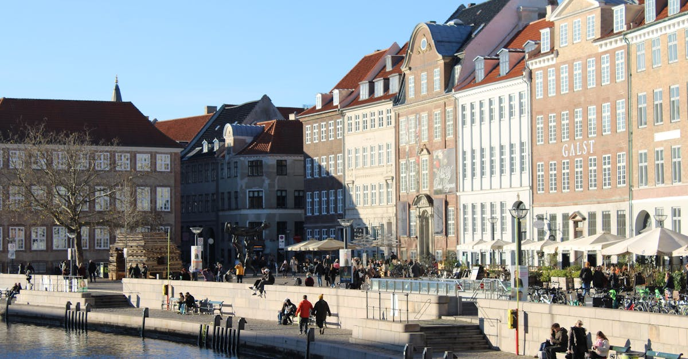

# Copenhagen, Denmark

Country: Denmark
Region: Europe

Copenhagen (*København*) is the Danish capital, a city of around 660,000 built on islands between Sweden and the rest of Denmark. The world's most-cited urban-design model, a working bicycle city, the kitchen of New Nordic cuisine, and a quietly radical climate-adaptation programme.

---

## 🧭 Step 1: Choices

### ✨ Why Visit

Copenhagen has spent thirty years rebuilding itself as the most liveable city in the world by most rankings, and it shows. Cyclists outnumber cars in the central districts. The harbour is clean enough to swim in. The food scene grew Noma and the entire New Nordic movement. The neighbourhoods (Nørrebro, Vesterbro, Christianshavn) each have a distinct rhythm.

The city is also the easiest place in Europe to see what climate-adapted urban design actually looks like. Cycle infrastructure, district heating, public swimming harbour baths, and rewilded park edges are not aspirations here, they are built.

You come for the design, the food, the cycling, and a chance to live in a city that has chosen its residents over its cars.

### 🌍 Ethical Compass

- **💰 Economy.** Eat at the food halls (Torvehallerne, Reffen, Broens Gadekøkken) where small Danish operators sell at fair prices, and at the *smørrebrød* shops Danes actually use. Stay in licensed hotels and pensions; Denmark restricts short-term rentals to protect residential housing.
- **👥 Employment.** Tipping is not expected; service is included by law and Danish wages are properly funded. Rounding up at restaurants or leaving a small tip for outstanding service is appreciated.
- **📚 Education.** Read about Danish social-democratic urban policy and how that produced the city you are visiting. The Designmuseum Denmark, the Danish Architecture Center, and the Workers' Museum each tell pieces of that story.
- **🌱 Ecology.** Cycle. The DOT bike-share or any rental shop sets you up in minutes; the lanes are dedicated and respected. Swim in the harbour at Islands Brygge or Sandkaj. Refuse plastic; tap water is safe and excellent.

---

## 🎒 Step 2: Preparation

### 🔍 Governance Management

- **Schengen** rules apply; verify your nationality's status on the Danish or Schengen portals.
- **Tivoli Gardens** sells timed tickets on the official portal; verify ride access bundles if relevant.
- **Major museums** (Statens Museum for Kunst, the National Museum, the Designmuseum, Louisiana Museum north of the city) sell tickets on official portals.
- **Copenhagen Card** bundles public transport and museum entry; verify whether it suits your specific itinerary on the official Copenhagen Card portal.
- For the **Tivoli Christmas market or Distortion festival**, book accommodation months ahead.

### 📡 Information Curation

- **The Local Denmark** and **Politiken** (Danish, partial English) for current Copenhagen news.
- **VisitCopenhagen** (the official city tourism site) for events, openings, and current rules.
- A Danish author: Tove Ditlevsen's *Copenhagen Trilogy*, or anything by Helle Helle.
- A Copenhagen-resident food or design guide (the Copenhagen Food Tour, A.M. Mansoor's design walks).
- **Wikivoyage Copenhagen** for orientation.

### 🎯 Inference Interaction

- **You decide to cycle.** The city is designed for it. Renting and riding is the right default for most visitors.
- **You decide on Noma.** Noma's reservations are months ahead and priced accordingly. The wider New Nordic scene (Geranium, Alchemist, Sanchez, Hart Bageri) offers more accessible alternatives.
- **You decide on Christiania.** The Freetown is a working community with its own rules; respect the no-photography zones and the residents' boundaries. The cannabis trade context has changed in recent years; verify current rules.
- **You decide on harbour swimming.** The harbour baths are free, safe, and the most Danish thing you can do in summer.
- **You decide on Louisiana.** The Louisiana Museum of Modern Art is 35 minutes by train north; many visitors call it the best art museum in Denmark.

### 🔄 Intelligence Cooperation

Copenhagen weather is variable but rarely extreme. Summer days are long and cool; winter days are short and grey. Major events (Distortion in June, Christmas markets, the Royal Christmas calendar) reshape parts of the city briefly.

Bring a soft plan. If a sudden storm closes outdoor seating, the food halls and museums absorb it. If your Noma booking falls through, a smaller Nordic spot is often better anyway. If you wanted to cycle in winter rain, the Metro and buses also serve.

### 📍 Top 5 Anchor Spots

1. **Cycle a half-day loop through Nørrebro, the Lakes, and Vesterbro.** This is the city. Stop at Assistens Cemetery (Kierkegaard, Hans Christian Andersen, Niels Bohr), Jægersborggade for coffee, Værnedamsvej for shopping.
2. **Tivoli Gardens.** The world's second-oldest amusement park; lovely at dusk, magical in Christmas season.
3. **Christiansborg Palace and the harbour area.** Climb the Christiansborg Tower (free) for a panorama; the Black Diamond library and the Royal Danish Theatre are walking distance.
4. **A New Nordic meal.** Lunch at Selma or Hart Bageri; dinner at one of the dozens of strong restaurants beyond Noma.
5. **Louisiana Museum of Modern Art (Humlebæk).** 35 minutes by train. Allow a full half day; the sculpture garden and Øresund views are essential.

### 🧰 Practical Essentials

- **Recommended Length.** Three to four days for the city. Add a day for Louisiana, Roskilde, or Malmö (Sweden, 35 minutes across the bridge).
- **Transport.** Cycle as the default; bike rentals are everywhere. Metro, S-train, and harbour buses cover the rest; tap a contactless card or use the Rejsekort. Copenhagen Airport (CPH) is 15 minutes from the centre on the M2 metro.
- **Daily Cost (per person).**
  - **Budget:** roughly DKK 600 to 1,000 (about EUR 80 to 130). Hostel, smørrebrød and food-hall meals, public transport, free museums on free days.
  - **Mid-range:** roughly DKK 1,400 to 2,500 (about EUR 190 to 335). Three-star hotel, restaurant dinners, all the major sites, a Louisiana day trip.
  - **Higher-comfort:** roughly DKK 3,500 and up. Boutique design hotel (Ottilia, Sanders), New Nordic dining, private guided architecture or food tours, a charter bike trip.
- **Booking Notes.**
  - **Noma and top New Nordic:** book months ahead.
  - **Tivoli Christmas market (November to early January)** is exceptional; book accommodation early.
  - **Distortion (early June)** is a city-wide street party; the city becomes a different place.
  - **Harbour swimming:** check water-quality flags; closures happen briefly after heavy rain.
  - **Sunday closings:** many small shops are closed Sunday; restaurants and museums remain open.

---

## ✈️ Step 3: Delivery

### 🤖 AI Prompt

Copy this into your own AI assistant, fill in the brackets, and treat the answer as a researcher's draft, not a final plan.

> Please help me plan an ethical visit to Copenhagen, Denmark for [NUMBER] days in [MONTH]. I am travelling with [WHO] and my interests are [INTERESTS, e.g. design, food, cycling, modern art, climate-adapted urbanism]. My total budget is around [AMOUNT] and my comfort level is [budget / mid-range / higher-comfort].
>
> Please structure your answer in three steps.
>
> **Step 1: Choices.** Help me decide what to prioritise. Recommend the two or three Copenhagen experiences I should not miss given my interests, and one I should consider skipping (a tourist canal tour when cycling does the job, an over-priced Strøget meal, a Noma chase that crowds out other Nordic spots). Briefly explain each trade-off.
>
> **Step 2: Preparation.** Cover all four of the following:
> - **Governance Management.** What assumptions should I check before I book? Include Schengen rules, Tivoli and Louisiana ticketing, the Copenhagen Card cost-benefit, and Christiania's current rules.
> - **Information Curation.** Suggest at least four different source types: one official Danish source, one Danish news outlet, one Danish author, and one Copenhagen-resident design or food guide.
> - **Inference Interaction.** List the decisions I personally need to make (whether to cycle, Noma vs the wider Nordic scene, Christiania approach, harbour swimming, Louisiana commitment).
> - **Intelligence Cooperation.** How should I trust my own judgment and local advice over algorithmic defaults when conditions change? Build me a soft plan with at least two alternates for likely disruptions (sudden rain, a harbour-bath closure for water quality, a sold-out restaurant, a winter daylight day).
>
> **Step 3: Delivery.** Give me the actual itinerary, day by day, with realistic timings and named neighbourhoods. Include at least one cycling loop and one harbour-or-Louisiana experience. Mark each business as confidently locally owned, or flag it for me to verify.
>
> Finally, please remind me at the end to verify your suggestions against:
> 1. Official sources: VisitCopenhagen, Tivoli, Louisiana Museum, and the DOT public transport portal.
> 2. Real people: a local resident, a Copenhagen guide, or hotel staff who live in the city now.
>
> Treat your output as a researcher's draft. I will make the final calls.

---

Part of **Gyro Governance Ethical Travel: AI-Empowered Guides for Humane Adventures**.

Explore more destinations, ethical domains, and AI prompts at [travel.gyrogovernance.com](https://travel.gyrogovernance.com/).
