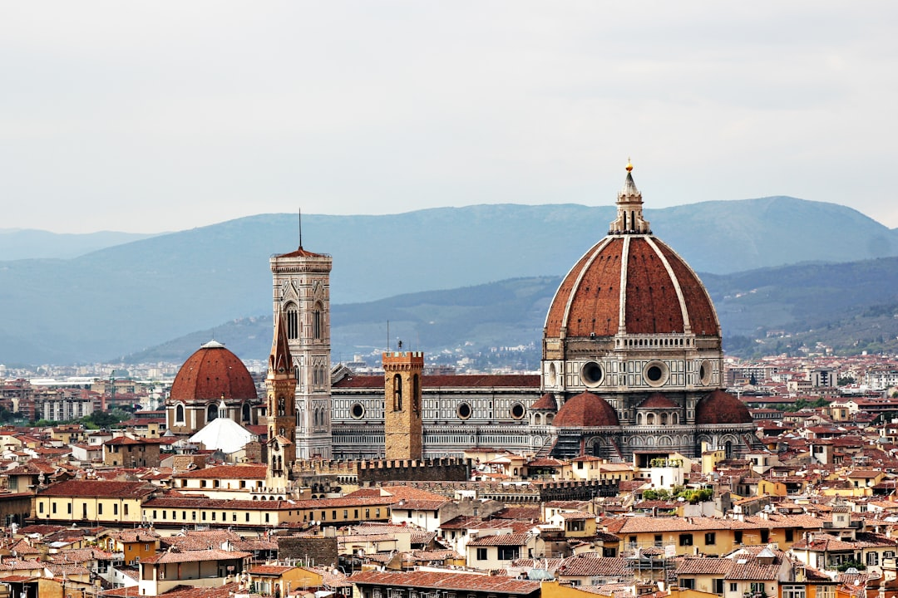

# Florence, Italy

Country: Italy
Region: Europe

Florence (*Firenze*) is the capital of Tuscany and the cradle of the Italian Renaissance, a small UNESCO city of around 380,000 along the Arno river. Birthplace of Michelangelo, Botticelli, Leonardo, and the modern Italian language, with a daily summer pressure of tourism that the historic centre struggles to absorb.

---

## 🧭 Step 1: Choices

### ✨ Why Visit

Florence holds more first-rank Renaissance art per square kilometre than anywhere on Earth. The Uffizi, the Accademia (Michelangelo's *David*), the Bargello, San Marco, and the Brancacci Chapel are all walking distance from each other. The Duomo, Baptistery, and Santa Croce define the western art-history syllabus.

The city is also under immense visitor pressure. Day-trippers from cruise ships (via Livorno) and tour groups from across Europe pour into the same handful of streets. Florentines are gradually being priced out of the historic centre. Visiting carefully is not optional.

You come for the art, the food (Tuscan cooking is one of Italy's most distinctive regional cuisines), the architecture, and a chance to engage with the most studied city in Western art history.

### 🌍 Ethical Compass

- **💰 Economy.** Eat at *trattorie* outside the immediate centre (Oltrarno, Sant'Ambrogio, San Frediano) where Florentines actually eat. Buy at the Mercato Centrale upstairs or the Mercato di Sant'Ambrogio rather than tourist-targeted leather shops on Ponte Vecchio's approach.
- **👥 Employment.** Tip a euro or two at restaurants; *coperto* (cover charge) is not a tip. Hire licensed Italian-state-certified guides for museums (look for the badge); freelancers in front of major sites are usually unlicensed.
- **📚 Education.** Read at least one short book on the Renaissance before you visit; Mary McCarthy's *The Stones of Florence* is the literary classic; Ross King's *Brunelleschi's Dome* covers the cathedral. Visit the Medici tombs at the Cappelle Medicee to see Michelangelo's funerary work in situ.
- **🌱 Ecology.** Walk; the historic centre is small. Use trams to outer areas. Avoid driving in the ZTL (Limited Traffic Zone); fines are automatic and large. Refill from public fountains; tap water is safe and excellent in Tuscany.

---

## 🎒 Step 2: Preparation

### 🔍 Governance Management

- **Schengen** rules apply; verify your nationality on official portals.
- **Uffizi, Accademia, Pitti Palace, and the Duomo complex** require timed tickets on official portals (Uffizi: uffizi.it; Duomo: museumflorence.com or duomo.firenze.it). Reservations are essential, especially summer.
- The **Brancacci Chapel** at Santa Maria del Carmine has limited capacity and requires advance booking; verify on the official portal.
- Florence has a **tourist tax** (*tassa di soggiorno*) collected by accommodation; verify it is itemised on your bill.
- **Day-tripping cruise tourism** is a major part of summer crowds; verify cruise-day schedules at Livorno if you want to be elsewhere on big days.

### 📡 Information Curation

- **La Nazione Firenze** (the city's main daily, Italian) and **The Florentine** (English-language magazine for residents and visitors) for local news.
- The official **Visit Florence** and **Uffizi Galleries** portals for ticketing and events.
- A Florence-set book: E.M. Forster's *A Room with a View*; Magdalen Nabb's Florentine mysteries; Mary McCarthy as above.
- A licensed Italian-state guide for the Uffizi and Duomo (a personal Florentine guide changes the experience completely).
- **Wikivoyage Florence** for orientation.

### 🎯 Inference Interaction

- **You decide on Uffizi timing.** First or last entry slots are by far the calmest; midday in summer is brutal.
- **You decide on the Duomo climb vs Giotto's Campanile.** The Duomo dome (Brunelleschi's) climb is more famous and timed-entry; Giotto's bell tower gives a better view of the dome itself. Pick one.
- **You decide on Oltrarno.** Crossing the Arno to Santo Spirito and San Frediano is a different city; the artisan workshops are real working ateliers.
- **You decide on guides.** A personal Florentine art-historian guide for the Uffizi or the Brancacci changes the experience profoundly.
- **You decide on a Tuscan day-trip.** Siena, San Gimignano, Lucca, or the Chianti hills are all reachable; commit to one and do it properly.

### 🔄 Intelligence Cooperation

Florence is hot in summer and cold-damp in winter. Major Catholic feast days close some sites or shift hours. Cruise-day arrivals double the daily crowd at the Uffizi and Duomo.

Bring a soft plan. If your Uffizi day is sold out, the Bargello, San Marco, or Palazzo Vecchio absorb a Renaissance morning. If a heat wave makes the city brutal, an early Boboli Gardens visit and an air-conditioned museum afternoon work. If a strike closes museums on a Sunday, walk Oltrarno and visit the workshops.

### 📍 Top 5 Anchor Spots

1. **Uffizi Gallery.** Timed entry on the official portal; book the opening slot.
2. **Duomo, Baptistery, and Brunelleschi's dome.** The complex requires a combined ticket; book the dome climb separately and ahead.
3. **Galleria dell'Accademia (Michelangelo's David).** Timed entry; arrive at opening.
4. **Brancacci Chapel and Santa Maria del Carmine (Oltrarno).** Masaccio's frescoes that taught the Renaissance how to paint. Limited capacity; book ahead.
5. **Oltrarno walk: Santo Spirito, the artisan workshops, sunset at Piazzale Michelangelo.** Cross the Arno away from the crowds; finish at the panoramic viewpoint.

### 🧰 Practical Essentials

- **Recommended Length.** Three to four days for the city. Add days for Siena, Pisa, Lucca, or a Chianti day-trip.
- **Transport.** Walk; the historic centre is compact. **ATAF buses and trams** for outer areas; tap a contactless card or buy at *tabacchi*. **Santa Maria Novella station** connects to Rome, Milan, and Venice in under two hours by Frecciarossa or Italo. The airport (FLR) is 15 minutes by tram or shuttle.
- **Daily Cost (per person).**
  - **Budget:** roughly EUR 90 to 150. Hostel, *trattoria* lunches and pizza, public transport, two ticketed sites.
  - **Mid-range:** roughly EUR 180 to 320. Three-star hotel or licensed apartment, restaurant dinners, all the major sites with timed entries, a guided art tour.
  - **Higher-comfort:** roughly EUR 400 and up. Boutique hotel near the Duomo or Oltrarno, fine dining at Enoteca Pinchiorri or Borgo San Jacopo, private Italian-state-licensed art-historian guides, a Chianti day with chartered car.
- **Booking Notes.**
  - **Uffizi, Accademia, Duomo dome, Brancacci:** book ahead on official portals.
  - **Tourist tax** collected by accommodation; verify on your bill.
  - **Summer (June to August)** is hot and crowded; spring and autumn are dramatically better.
  - **Easter and Christmas** see major closures and changes; verify museum hours.
  - **Calcio Storico (late June)** is the historic football tournament; book accommodation months ahead.

---

## ✈️ Step 3: Delivery

### 🤖 AI Prompt

Copy this into your own AI assistant, fill in the brackets, and treat the answer as a researcher's draft, not a final plan.

> Please help me plan an ethical visit to Florence, Italy for [NUMBER] days in [MONTH]. I am travelling with [WHO] and my interests are [INTERESTS, e.g. Renaissance art, architecture, Tuscan food, day trips into the hills]. My total budget is around [AMOUNT] and my comfort level is [budget / mid-range / higher-comfort].
>
> Please structure your answer in three steps.
>
> **Step 1: Choices.** Help me decide what to prioritise. Recommend the two or three Florence experiences I should not miss given my interests, and one I should consider skipping (Ponte Vecchio leather-shop tourist traps, a midday Uffizi in summer, a Pisa half-day that should be a full Lucca day). Briefly explain each trade-off.
>
> **Step 2: Preparation.** Cover all four of the following:
> - **Governance Management.** What assumptions should I check before I book? Include Schengen visa rules, official Uffizi/Accademia/Duomo/Brancacci timed-entry portals, the Florence tourist tax, ZTL driving rules, and cruise-day arrival schedules.
> - **Information Curation.** Suggest at least four different source types: one official Italian or Florence source, one Florence news outlet (Italian or English), one author on Florence and the Renaissance, and one licensed Italian-state art-historian guide.
> - **Inference Interaction.** List the decisions I personally need to make (Uffizi timing, dome climb vs Giotto's tower, Oltrarno time, guide commitment, Tuscan day-trip choice).
> - **Intelligence Cooperation.** How should I trust my own judgment and local advice over algorithmic defaults when conditions change? Build me a soft plan with at least two alternates for likely disruptions (sold-out Uffizi slot, summer heatwave, museum strike, a cruise-day crowd).
>
> **Step 3: Delivery.** Give me the actual itinerary, day by day, with realistic timings and named sites. Include at least one Oltrarno half-day and one sunset at Piazzale Michelangelo. Mark each business as confidently locally owned, or flag it for me to verify.
>
> Finally, please remind me at the end to verify your suggestions against:
> 1. Official sources: Visit Florence, the Uffizi Galleries portal, Duomo Firenze, and Trenitalia or Italo for onward trains.
> 2. Real people: a local resident, a licensed Florentine guide, or hotel staff who live in Florence now.
>
> Treat your output as a researcher's draft. I will make the final calls.

---

Part of **Gyro Governance Ethical Travel: AI-Empowered Guides for Humane Adventures**.

Explore more destinations, ethical domains, and AI prompts at [travel.gyrogovernance.com](https://travel.gyrogovernance.com/).
