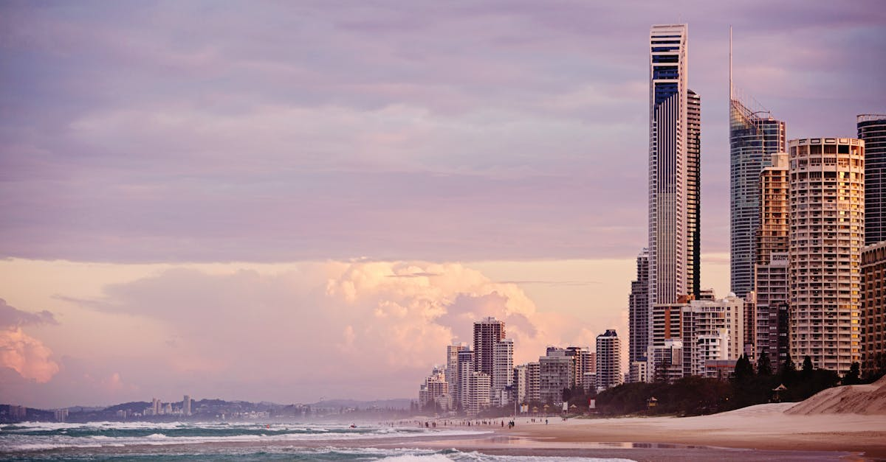

# Gold Coast, Australia

Country: Australia
Region: Oceania

The Gold Coast is a 70-kilometre coastal city in south-east Queensland, famous for surf beaches, theme parks, high-rise apartment towers, and the rainforest of the McPherson Range right behind it. A subtropical climate, a serious surf culture, and a city where you can swim at sunrise and walk through World Heritage rainforest by lunchtime.

---

## 🧭 Step 1: Choices

### ✨ Why Visit

The Gold Coast is Australia's most concentrated holiday city. Surfers Paradise, Burleigh Heads, Coolangatta, and Currumbin give a string of distinct beach towns along one coastline. The hinterland (Lamington and Springbrook National Parks) holds Gondwana-era rainforest, glow worms, and waterfalls within 45 minutes of the beach.

The city is also one of Australia's fastest-growing, with the housing pressure and over-tourism conversations that come with that. The 70 km beach itself is mostly public and well-managed; the rainforest behind is World Heritage-listed Gondwana Rainforest.

You come for the beaches, the surf, the rainforest, the theme parks (if that is your thing), and a base for a wider Queensland trip.

### 🌍 Ethical Compass

- **💰 Economy.** Eat at Burleigh Heads' Coast-of-Currumbin local cafés, Mermaid Beach bistros, and Surfers Paradise side streets rather than the Pacific Fair mall food courts. Stay in the smaller towns (Burleigh, Currumbin, Kirra) for a more local feel than the Surfers high-rises.
- **👥 Employment.** Tipping is not customary in Australia; staff are properly paid. Use Translink for public transport. Surf schools support the local surf community; respect line-up etiquette in the water.
- **📚 Education.** This is the country of the Yugambeh language people and the Bundjalung Nation. The rainforest behind the Gold Coast holds deep Aboriginal significance; engage with Yugambeh-led tours and the Yugambeh Museum at Beenleigh.
- **🌱 Ecology.** **Reef-safe sunscreen** for any in-water activity. Do not feed wildlife (the Currumbin Wildlife Sanctuary lorikeet feeding is a managed exception). Stay on rainforest tracks; the Gondwana Rainforests are World Heritage. Avoid stinger season (November to May) in coastal areas without nets.

---

## 🎒 Step 2: Preparation

### 🔍 Governance Management

- **ETA or eVisitor** required for most visa-waiver nationals; verify on the Department of Home Affairs portal.
- **Translink** runs Gold Coast public transport (G:link tram, buses, train to Brisbane); contactless or go card.
- **National parks** (Lamington, Springbrook, Burleigh Head National Park) are free entry; verify trail status on Queensland Parks and Wildlife.
- **Theme parks** (Movie World, Sea World, Dreamworld, Wet'n'Wild) sell timed tickets on official portals; consider the multi-park passes if doing more than one.
- For **Currumbin Wildlife Sanctuary** and similar, verify their conservation accreditation and any animal-encounter ethics on the official portals.

### 📡 Information Curation

- **Gold Coast Bulletin** and **ABC Gold Coast** for local news.
- **Destination Gold Coast** (official) for events, surf reports, and beach conditions.
- A Bundjalung or Yugambeh perspective: the Yugambeh Museum's resources, or a tour with Jellurgal Aboriginal Cultural Centre at Burleigh Heads.
- A Burleigh Heads-resident food guide or surf school for ground-truth.
- **Wikivoyage Gold Coast** for area orientation.

### 🎯 Inference Interaction

- **You decide your beach town.** Surfers Paradise is high-rise and stag-do central; Burleigh Heads is craft-coffee and family; Coolangatta-Kirra is surf-and-flat; Currumbin is wildlife and beach. Pick deliberately.
- **You decide on theme parks.** Three to four major parks; one is enough for most visitors. Movie World and Dreamworld have had safety reviews in recent years; verify current standards.
- **You decide on the rainforest.** Lamington (O'Reilly's, Binna Burra) is the deeper experience; Springbrook is closer and easier. Both deserve a full day.
- **You decide on a Yugambeh-led experience.** The Jellurgal walk up Burleigh Heads with an Aboriginal guide is a different reading of a place most visitors only sunbake on.
- **You decide on surf school.** Beginners do well at flat Currumbin Alley or Mermaid Beach with a registered school; intermediate-onward at Burleigh or Snapper Rocks.

### 🔄 Intelligence Cooperation

Gold Coast weather is subtropical with serious storms in summer; cyclones occasionally affect the coast. Schoolies Week (mid-November) turns Surfers into a teenage city. Major events (Magic Millions racing, Gold Coast Marathon, surf comps) reshape parts of the city briefly.

Bring a soft plan. If a storm closes the beach, the indoor theme parks and the Museum of Tomorrow at HOTA absorb a wet afternoon. If Surfers feels overwhelming, the G:link tram south to Burleigh in 30 minutes is a different city. If a rainforest walk is closed by recent rain, Currumbin Wildlife or the HOTA arts centre work.

### 📍 Top 5 Anchor Spots

1. **Burleigh Heads National Park headland walk.** Free, 30 minutes, one of the best coastal walks in Queensland. Pair with a Yugambeh-led Jellurgal walk.
2. **Currumbin Wildlife Sanctuary.** Native wildlife (lorikeets, koalas, dingoes) in a working conservation facility. The morning lorikeet feeding is a managed spectacle.
3. **Lamington National Park (O'Reilly's or Binna Burra).** Gondwana-era rainforest, treetop walks, waterfalls. A full day from the coast.
4. **HOTA (Home of the Arts).** The Gold Coast's serious cultural quarter; the gallery is excellent, the rooftop bar has the city's best view.
5. **A surf lesson or sunrise surf at Burleigh, Kirra, or Snapper Rocks.** Australian surf culture done right.

### 🧰 Practical Essentials

- **Recommended Length.** Three to five days. Less if just transit, more if combining beach, theme parks, and rainforest.
- **Transport.** The **G:link tram** runs the spine from Helensvale north to Broadbeach south; buses connect the rest. **Train to Brisbane** in about 70 minutes. Gold Coast Airport (OOL) is at Coolangatta; Brisbane Airport (BNE) is 90 minutes north. Renting a car helps for rainforest day-trips.
- **Daily Cost (per person).**
  - **Budget:** roughly AUD 120 to 200. Backpacker hostel, supermarket and beach-café meals, Translink, free beaches and headland walks.
  - **Mid-range:** roughly AUD 280 to 500. Three-star apartment-hotel, mixed dining, one theme park, one rainforest day with rental car.
  - **Higher-comfort:** roughly AUD 700 and up. Five-star Broadbeach or Burleigh hotel, fine dining at Rick Shores or Restaurant Labart, private guided rainforest tours, helicopter scenic flights.
- **Booking Notes.**
  - **ETA or eVisitor:** verify on the Department of Home Affairs portal.
  - **Theme parks:** book online for discounts; consider multi-park passes.
  - **Schoolies Week (mid- to late November):** Surfers is overwhelmed by teenagers; book elsewhere or skip the area entirely.
  - **Stinger nets** are deployed in summer at Surfers and Broadbeach beaches; verify current beach safety with Surf Life Saving.
  - **Cyclone season** (November to April): less common than further north but possible.

---

## ✈️ Step 3: Delivery

### 🤖 AI Prompt

Copy this into your own AI assistant, fill in the brackets, and treat the answer as a researcher's draft, not a final plan.

> Please help me plan an ethical visit to the Gold Coast, Australia for [NUMBER] days in [MONTH]. I am travelling with [WHO] and my interests are [INTERESTS, e.g. surfing, rainforest, theme parks, Aboriginal culture, food]. My total budget is around [AMOUNT] and my comfort level is [budget / mid-range / higher-comfort].
>
> Please structure your answer in three steps.
>
> **Step 1: Choices.** Help me decide what to prioritise. Recommend the two or three Gold Coast experiences I should not miss given my interests, and one I should consider skipping (a high-rise Surfers Paradise base when Burleigh is steps better, two theme-park days when one is enough, a stinger-season swim without nets). Briefly explain each trade-off.
>
> **Step 2: Preparation.** Cover all four of the following:
> - **Governance Management.** What assumptions should I check before I book? Include the ETA or eVisitor on the Department of Home Affairs portal, Translink go card or contactless, Queensland Parks and Wildlife trail status, official theme-park ticketing, and surf-school registration.
> - **Information Curation.** Suggest at least four different source types: one official Gold Coast source, one local news outlet, one Aboriginal-led cultural source (Yugambeh, Jellurgal), and one Burleigh-based food or surf guide.
> - **Inference Interaction.** List the decisions I personally need to make (beach town choice, theme park ethics, rainforest commitment, Yugambeh engagement, surf school).
> - **Intelligence Cooperation.** How should I trust my own judgment and local advice over algorithmic defaults when conditions change? Build me a soft plan with at least two alternates for likely disruptions (summer storm, beach stinger flag, rainforest track closure, Schoolies Week overlap).
>
> **Step 3: Delivery.** Give me the actual itinerary, day by day, with realistic timings and named places. Include at least one rainforest day and one Yugambeh-led experience if possible. Mark each business as confidently locally owned, or flag it for me to verify.
>
> Finally, please remind me at the end to verify your suggestions against:
> 1. Official sources: Destination Gold Coast, Translink, the Department of Home Affairs, and Queensland Parks and Wildlife.
> 2. Real people: a local resident, a Yugambeh guide, a Burleigh surf instructor, or hotel staff who live in the area now.
>
> Treat your output as a researcher's draft. I will make the final calls.

---

Part of **Gyro Governance Ethical Travel: AI-Empowered Guides for Humane Adventures**.

Explore more destinations, ethical domains, and AI prompts at [travel.gyrogovernance.com](https://travel.gyrogovernance.com/).
