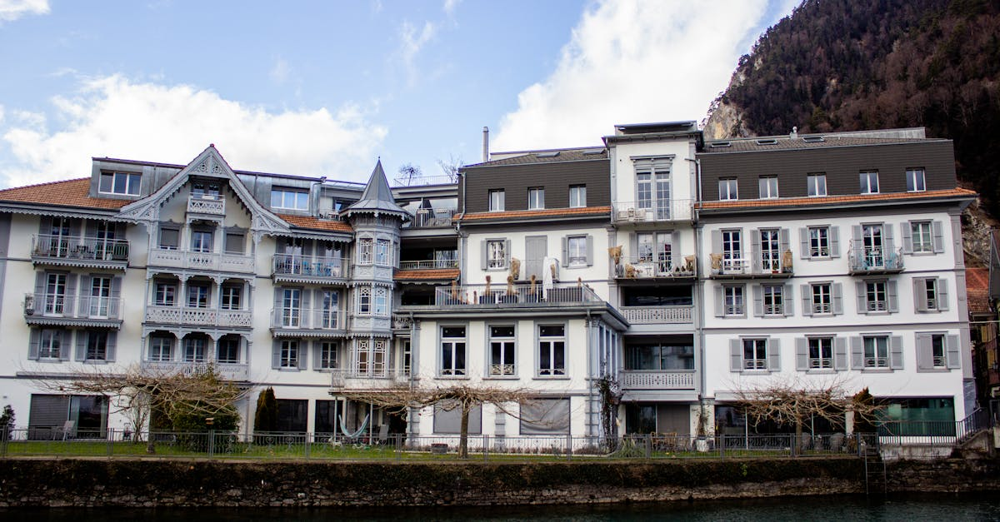

# Interlaken, Switzerland

Country: Switzerland
Region: Europe

Interlaken is a small Swiss town of around 5,500 people in the Bernese Oberland, perfectly placed between Lake Thun and Lake Brienz with the Eiger, Mönch, and Jungfrau alpine massif directly to the south. The gateway to the Jungfrau region's UNESCO Alpine landscapes and one of Europe's best-established mountain adventure bases.

---

## 🧭 Step 1: Choices

### ✨ Why Visit

Interlaken is the practical base for the most photographed corner of the Swiss Alps. Lauterbrunnen valley (the model for Tolkien's Rivendell), Grindelwald, Wengen, Mürren, and the Jungfraujoch (the "Top of Europe", the highest train station in Europe) are all reachable on day trips from town.

The Bernese Oberland is also one of the world's most thoughtfully managed alpine tourism economies. The cogwheel railways, mountain cable cars, and protected high-alpine valleys have a century of careful planning behind them. Visiting respectfully means engaging with that infrastructure rather than trying to bypass it.

You come for the Alps in their textbook form, for serious hiking and skiing, and for a Swiss alpine experience that has been refining itself since the 1880s.

### 🌍 Ethical Compass

- **💰 Economy.** Stay in Interlaken itself (cheaper) and day-trip up, or stay in mountain villages (Wengen, Mürren, Gimmelwald) for the deeper experience. Eat at the Beizli (traditional pubs) and farmers' restaurants in the villages rather than only the resort restaurants. Buy Swiss wines and cheeses at local Coop or Migros and at farm shops.
- **👥 Employment.** Tipping is not customary; service is included. The Swiss mountain workforce (railway staff, guides, hut keepers) is one of the world's most professional. SBB-trained mountain guides and Swiss Mountain Guide Association (SBV) certifications are real and worth their fees.
- **📚 Education.** Read about Swiss alpine history: the climbing history of the Eiger North Face, the development of the Jungfrau railway, the Bernese Oberland's transformation from farming-and-Catholic monastic land to global tourism. The Touristikmuseum in Unterseen has a serious account.
- **🌱 Ecology.** Walk and use the integrated rail-and-cable car network; do not drive in alpine villages where car access is restricted (Wengen and Mürren are car-free). Stay on marked trails; the alpine flora and the cattle herds depend on it. Avoid helicopter sightseeing if you can; it is loud and ecologically costly.

---

## 🎒 Step 2: Preparation

### 🔍 Governance Management

- **Schengen** rules apply; verify your nationality on official Swiss portals.
- The **Swiss Travel Pass** or the **Jungfrau Travel Pass** can be cost-effective for multi-day stays; verify on the official SBB and Jungfrau Railways portals.
- The **Jungfraujoch (Top of Europe)** is reached by cogwheel railway from Kleine Scheidegg; verify timetables and tickets on the official Jungfrau Railways portal. It is expensive; budget accordingly.
- **Lauterbrunnen valley** has introduced visitor management measures in recent years to handle peak crowds; verify any current shuttle or parking rules.
- For **paragliding, canyoning, skydiving, and bungee** operators, verify Swiss certification (SVOLT, SkiInstructorSwiss); Interlaken has accidents from time to time. Choose only certified operators.

### 📡 Information Curation

- **Swissinfo** for English-language Swiss news.
- The official **Interlaken Tourism** and **Jungfrau Region** portals for events, openings, and trail status.
- A Swiss alpine writer: Heinrich Harrer's *The White Spider* on the Eiger; or contemporary mountaineering literature.
- A locally certified Swiss Mountain Guide for any technical experience.
- **Wikivoyage Interlaken** and **Wikivoyage Jungfrau Region** for orientation.

### 🎯 Inference Interaction

- **You decide on the Jungfraujoch.** It is expensive (one of the most expensive train rides in the world per kilometre) and crowded; it is also genuinely once-in-a-lifetime. A clear-weather day is essential.
- **You decide on your base.** Interlaken (town, cheaper, longer commutes to peaks) versus Wengen, Mürren, or Grindelwald (mountain villages, expensive, you wake up to the view).
- **You decide on hiking commitment.** A casual visitor walks valley trails (Lauterbrunnen valley floor, Bachalpsee from First). A serious hiker does ridges (the Eiger Trail, the Männlichen-Kleine Scheidegg, the Schynige Platte panorama).
- **You decide on adventure sports.** Interlaken is one of Europe's largest paragliding and canyoning bases; the safety record is mostly good but not perfect. Choose certified operators.
- **You decide on the cogwheel railways.** They are part of the experience, not a cheat. Use them.

### 🔄 Intelligence Cooperation

Alpine weather is the boss. A clear morning can become snow by afternoon at any time of year. The Jungfraujoch can be in cloud and zero visibility on a sunny valley day; conversely, the valleys can be socked in fog while the peaks are brilliant.

Bring a soft plan. If your Jungfrau day is forecast cloudy, swap with Lauterbrunnen valley walks (which work in light rain) and try again the next day. If a sudden storm grounds paragliding, the indoor swimming pool at the Hotel Beatus or the Trümmelbach waterfalls absorb a wet half-day. Always check weather webcams before committing to a peak day.

### 📍 Top 5 Anchor Spots

1. **Jungfraujoch (Top of Europe).** Cogwheel railway from Kleine Scheidegg; verify clear-weather day. Allow a full day from Interlaken.
2. **Lauterbrunnen valley and Trümmelbach Falls.** The valley floor walk with seventy-two waterfalls cascading down; Staubbach Falls and the Trümmelbach inside the mountain.
3. **First (above Grindelwald) and Bachalpsee hike.** Cable car up, walk to the alpine mirror-lake Bachalpsee in two hours return; cliff-walk attractions at the top for the adventurous.
4. **Schilthorn (above Mürren).** Cable car up; James Bond museum in the revolving restaurant; panoramic view over 200 named peaks.
5. **Schynige Platte panorama.** Vintage cogwheel railway up; one of the great viewpoints over the Jungfrau massif; less crowded than the Jungfraujoch.

### 🧰 Practical Essentials

- **Recommended Length.** Three to five days minimum. A week if you want serious hiking or to combine summer and the Eiger Glacier areas.
- **Getting There and Around.** Direct trains to Interlaken Ost (East) from Zurich, Bern, and most Swiss cities. Inside the Jungfrau region, the **integrated rail-cable car-funicular network** covers everything; the Jungfrau Travel Pass, Swiss Travel Pass, or single tickets. Cars are restricted in many mountain villages.
- **Daily Cost (per person).**
  - **Budget:** roughly CHF 100 to 180. Hostel in Interlaken (Backpacker Villa Sonnenhof, Balmer's), supermarket and bakery meals, valley walking, one mountain day with the cheapest cable car.
  - **Mid-range:** roughly CHF 250 to 450. Three-star hotel in Interlaken or guesthouse in a village, mixed dining, the Jungfraujoch day, one Schilthorn or First day.
  - **Higher-comfort:** roughly CHF 600 and up. Mountain resort (Victoria-Jungfrau Grand Hotel, Belvedere Wengen), fine dining, private mountain guide for a Schynige Platte to First hike, a helicopter day.
- **Booking Notes.**
  - **Schengen:** verify your nationality's status.
  - **Jungfraujoch:** verify weather, book the morning train, check the official portal for any reservation requirements.
  - **Lauterbrunnen valley peak-day rules:** verify any current shuttle or parking measures.
  - **Swiss Travel Pass vs Jungfrau Pass vs individual tickets:** run the numbers for your specific itinerary.
  - **Winter (December to March)** is ski season; summer (June to September) is hiking season; shoulder seasons can be unpredictable.

---

## ✈️ Step 3: Delivery

### 🤖 AI Prompt

Copy this into your own AI assistant, fill in the brackets, and treat the answer as a researcher's draft, not a final plan.

> Please help me plan an ethical visit to Interlaken and the Jungfrau region, Switzerland for [NUMBER] days in [MONTH]. I am travelling with [WHO] and my interests are [INTERESTS, e.g. hiking, alpine photography, skiing, adventure sports, mountaineering]. My total budget is around [AMOUNT] and my comfort level is [budget / mid-range / higher-comfort].
>
> Please structure your answer in three steps.
>
> **Step 1: Choices.** Help me decide what to prioritise. Recommend the two or three Jungfrau-region experiences I should not miss given my interests, and one I should consider skipping (the Jungfraujoch on a cloud-locked day, paragliding with an unverified operator, a helicopter sightseeing flight if alpine quiet matters to me). Briefly explain each trade-off.
>
> **Step 2: Preparation.** Cover all four of the following:
> - **Governance Management.** What assumptions should I check before I book? Include Schengen rules, the Jungfrau Railways and SBB portals, Swiss Travel Pass vs Jungfrau Pass cost-benefit, current Lauterbrunnen valley visitor management, and Swiss Mountain Guide Association certification for technical activities.
> - **Information Curation.** Suggest at least four different source types: Swiss government tourism, Interlaken Tourism, Swissinfo for news, and a Swiss alpine writer or certified Mountain Guide.
> - **Inference Interaction.** List the decisions I personally need to make (Jungfraujoch weather commitment, base location, hiking ambition, adventure-sport operator, cogwheel approach).
> - **Intelligence Cooperation.** How should I trust my own judgment and local advice over algorithmic defaults when conditions change? Build me a soft plan with at least two alternates for likely disruptions (peak cloud-locked, sudden snow, paragliding grounded by wind, a Lauterbrunnen day-overload).
>
> **Step 3: Delivery.** Give me the actual itinerary, day by day, with realistic timings, train and cable-car routes, and named hikes. Include at least one Jungfraujoch day on a clear-weather window and one alternative panoramic day. Mark each operator as confidently certified (SBV, SVOLT), or flag for me to verify.
>
> Finally, please remind me at the end to verify your suggestions against:
> 1. Official sources: Interlaken Tourism, Jungfrau Railways, SBB, MeteoSwiss for weather, and Swiss Mountain Guide Association for certifications.
> 2. Real people: a local mountain guide, a hotel concierge in Interlaken or a mountain village, or a rail station agent.
>
> Treat your output as a researcher's draft. I will make the final calls.

---

Part of **Gyro Governance Ethical Travel: AI-Empowered Guides for Human Adventures**.

Explore more destinations, ethical domains, and AI prompts at [travel.gyrogovernance.com](https://travel.gyrogovernance.com/).
