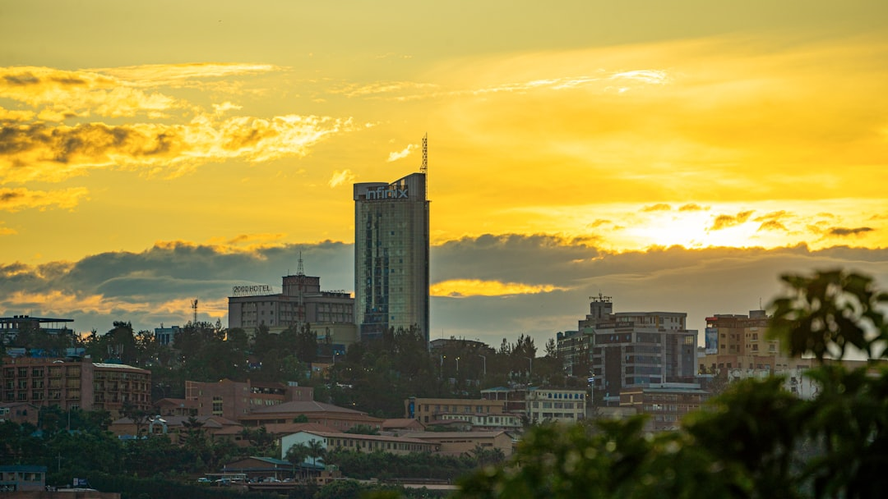

# Kigali, Rwanda

Country: Rwanda
Region: Africa

Kigali is Rwanda's capital, a hill-laced city of around 1.7 million that has become one of Africa's safest and most orderly urban centres in the three decades since the 1994 genocide against the Tutsi. The gateway to mountain-gorilla trekking in Volcanoes National Park and to a national reckoning with one of the twentieth century's worst atrocities.

---

## 🧭 Step 1: Choices

### ✨ Why Visit

Kigali is one of the most thoughtfully managed cities in Africa. Plastic bags are banned. Streets are clean. *Umuganda* (mandatory monthly community work on the last Saturday) keeps the city maintained. The Kigali Genocide Memorial is one of the most powerful purpose-built memorials in the world.

The city is also the practical gateway to Rwanda's premier wildlife experience: mountain-gorilla trekking in Volcanoes National Park (Parc National des Volcans), about two hours by road north of Kigali. The chimpanzees of Nyungwe Forest and the lake-and-mountain landscapes of Lake Kivu are reachable within a multi-day trip.

You come for the gorillas, for the most respectful possible engagement with the genocide history, and for a city that has become a model in many ways for what Africa can build.

### 🌍 Ethical Compass

- **💰 Economy.** Eat at local restaurants (the Hut, Repub Lounge, Heaven, but also smaller *isombe* and *brochettes* spots). Stay in Rwandan-owned hotels and guesthouses (Hôtel des Mille Collines is iconic; smaller boutique options support local owners). The country's "Made in Rwanda" initiative supports local manufacturing; buy local crafts at the Kimironko Market or Caplaki.
- **👥 Employment.** Tip 10 to 15 percent at restaurants; tip gorilla-trekking porters generously (USD 15 to 25 per porter); tip lodge and game-reserve staff at the end of stays. The gorilla-trekking economy directly funds conservation and local communities.
- **📚 Education.** Visit the Kigali Genocide Memorial as one of your first activities; the context shapes everything you see afterwards. Read about the genocide (Philip Gourevitch's *We Wish to Inform You That Tomorrow We Will Be Killed With Our Families*, or Jean Hatzfeld's reporting). Engage carefully; many Rwandans you meet have lived this.
- **🌱 Ecology.** Rwanda's plastic-bag ban is enforced at the border; do not bring any. Mountain-gorilla trekking is permit-controlled to protect the animals; rules (distance, time limits, no flash photography, no plastic) are non-negotiable. Stay on park trails.

---

## 🎒 Step 2: Preparation

### 🔍 Governance Management

- Many visitors are **visa-on-arrival or visa-exempt** for Rwanda; verify on the official Directorate General of Immigration and Emigration portal. The **East Africa Tourist Visa** (Rwanda, Uganda, Kenya combined) is also an option.
- **Mountain-gorilla permits** in Volcanoes National Park are sold by the **Rwanda Development Board (RDB)**; permits are limited (currently around 96 per day across 12 habituated groups) and priced at the upper end. Book months ahead on the official RDB portal.
- **Kigali Genocide Memorial** is free but a small donation is requested and audio guide adds value; verify on the official Aegis Trust portal.
- **Plastic bags** are banned; airport security removes them at entry. Use cloth or paper bags.
- For **Volcanoes National Park transfers**, hire a registered driver or join a registered tour; verify on the RDB portal.

### 📡 Information Curation

- **The New Times** (Rwandan English-language daily, government-aligned) and **The East African** for regional coverage.
- The official **Visit Rwanda** site for events and current rules.
- A Rwandan or Rwanda-focused author: Scholastique Mukasonga; Philip Gourevitch (American journalist); Jean Hatzfeld (French journalist).
- A Kigali-based resident guide (Kigali Cycling Tours, Nyamirambo Women's Center walking tours).
- **Wikivoyage Kigali** and **Wikivoyage Rwanda** for orientation.

### 🎯 Inference Interaction

- **You decide on the gorilla trek.** It is expensive (premium permit pricing), physically demanding (1 to 6 hours of mountain hiking through nettles and mud), and once-in-a-lifetime. Most who go say it changed how they think about animals.
- **You decide on the genocide memorial timing.** A serious half-day; arrive prepared; consider doing it on day one so the rest of your visit has context.
- **You decide on political conversation depth.** Rwanda has firm restrictions on what can be said publicly about politics, ethnicity, and the post-1994 government. Foreigners can have private conversations; do not press locals on sensitive points in public.
- **You decide on Nyungwe and Lake Kivu.** Adding the chimpanzee trekking in Nyungwe Forest and a Lake Kivu beach day is a full week; many gorilla visitors regret not adding them.
- **You decide on motorcycle taxis.** *Moto-taxis* are everywhere, with helmets, and the local way to get around. Use registered ones; insist on the helmet.

### 🔄 Intelligence Cooperation

Rwanda is the "land of a thousand hills"; the elevation moderates the equatorial climate to spring-like year-round. Dry seasons (June to September, December to February) are the best for gorilla trekking. Heavy rains can make trekking strenuous.

Bring a soft plan. If a gorilla trek is rained out heavy, you continue (the gorillas do not stop) but it is harder; bring rain gear. If a transfer day is disrupted, Kigali itself absorbs an extra day well. If political events affect the calendar, the genocide memorial and museums remain open.

### 📍 Top 5 Anchor Spots

1. **Kigali Genocide Memorial.** Free, donation requested. Allow a full half-day. The audio guide is essential.
2. **Volcanoes National Park (Parc National des Volcans).** Mountain-gorilla trekking is the headline; the Dian Fossey Karisoke Research Centre area is also visitable.
3. **Nyamirambo neighbourhood walking tour.** Run by the Nyamirambo Women's Center; an insider walk through one of Kigali's most lively neighbourhoods.
4. **Inema Arts Center.** Contemporary Rwandan art and a working studio space in the Kacyiru area.
5. **Lake Kivu day (Kibuye or Gisenyi).** Three hours west of Kigali; one of Africa's great lake landscapes; can extend to Nyungwe.

### 🧰 Practical Essentials

- **Recommended Length.** Two days for Kigali itself; three more for Volcanoes National Park (gorillas). A full week to add Nyungwe and Lake Kivu.
- **Getting There and Around.** Kigali International Airport (KGL) is 15 minutes from the centre. Within Kigali: registered moto-taxis (with helmet), licensed taxis, or ride-hail apps (Move, YegoMoto). For Volcanoes National Park, hire a registered driver; the road is good.
- **Daily Cost (per person, excluding the gorilla permit).**
  - **Budget:** roughly USD 50 to 100. Guesthouse, local meals, moto-taxis, the Genocide Memorial.
  - **Mid-range:** roughly USD 150 to 300. Three- or four-star hotel (Heaven, Hôtel des Mille Collines), mixed dining, registered driver for Volcanoes transfer.
  - **Higher-comfort:** roughly USD 500 and up. Bisate Lodge or Sabyinyo Silverback Lodge near Volcanoes, fine dining at Heaven, private guides, helicopter transfers.
  - **Gorilla permit:** verify current pricing on the official RDB portal; it is currently the upper bracket of African wildlife permits.
- **Booking Notes.**
  - **Visa:** verify on the Directorate General of Immigration and Emigration portal.
  - **Gorilla permit:** book months ahead through the RDB or a registered tour operator.
  - **No plastic bags:** packed in cloth or paper; airport will confiscate.
  - **Umuganda (last Saturday morning of every month):** city activity is reduced; most businesses close 8 am to 11 am.
  - **Genocide commemoration period (April):** a serious national period; museums and many businesses observe restrictions.

---

## ✈️ Step 3: Delivery

### 🤖 AI Prompt

Copy this into your own AI assistant, fill in the brackets, and treat the answer as a researcher's draft, not a final plan.

> Please help me plan an ethical visit to Kigali and Volcanoes National Park, Rwanda for [NUMBER] days in [MONTH]. I am travelling with [WHO] and my interests are [INTERESTS, e.g. mountain gorillas, genocide-history understanding, food, contemporary Rwandan art, Lake Kivu]. My total budget is around [AMOUNT] and my comfort level is [budget / mid-range / higher-comfort].
>
> Please structure your answer in three steps.
>
> **Step 1: Choices.** Help me decide what to prioritise. Recommend the two or three Rwanda experiences I should not miss given my interests, and one I should consider skipping (an over-packed itinerary that loses a day to transfers, gorilla trekking without enough physical preparation, a memorial visit when I am exhausted). Briefly explain each trade-off.
>
> **Step 2: Preparation.** Cover all four of the following:
> - **Governance Management.** What assumptions should I check before I book? Include the Rwandan visa portal, the RDB official gorilla-permit booking, the East Africa Tourist Visa option, registered driver transfers, the plastic-bag ban, and Umuganda day timing.
> - **Information Curation.** Suggest at least four different source types: one official Rwandan source, one Rwandan or East African news outlet, one author on the genocide and Rwanda, and one Kigali-resident walking or cycling guide.
> - **Inference Interaction.** List the decisions I personally need to make (gorilla trek commitment, Genocide Memorial timing, political conversation depth, Nyungwe and Kivu add-on, moto-taxi use).
> - **Intelligence Cooperation.** How should I trust my own judgment and local advice over algorithmic defaults when conditions change? Build me a soft plan with at least two alternates for likely disruptions (heavy rain on trek day, gorilla group changed, a transfer-road delay, the April commemoration period overlap).
>
> **Step 3: Delivery.** Give me the actual itinerary, day by day, with realistic timings and named places. Include the Genocide Memorial on day one and the gorilla trek on a well-rested day. Mark each operator as confidently registered with the RDB or Rwanda Tourism, or flag for me to verify.
>
> Finally, please remind me at the end to verify your suggestions against:
> 1. Official sources: the Rwanda Development Board for gorilla permits, the Directorate General of Immigration and Emigration for visa, the Aegis Trust for the Kigali Genocide Memorial, and Visit Rwanda.
> 2. Real people: a Rwandan guide, a Kigali resident, or lodge staff in Volcanoes National Park.
>
> Treat your output as a researcher's draft. I will make the final calls.

---

Part of **Gyro Governance Ethical Travel: AI-Empowered Guides for Humane Adventures**.

Explore more destinations, ethical domains, and AI prompts at [travel.gyrogovernance.com](https://travel.gyrogovernance.com/).
