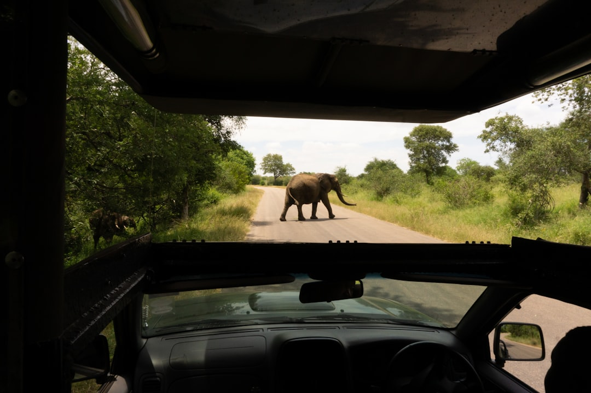

# Kruger National Park, South Africa

Country: South Africa
Region: Africa

Kruger National Park is South Africa's flagship wildlife reserve, a roughly two-million-hectare protected savannah along the Mozambican border. Home to the "Big Five" (lion, leopard, elephant, rhino, buffalo) and one of the most accessible and well-managed big-game reserves in Africa, run by SANParks with private concessions on its edges.

---

## 🧭 Step 1: Choices

### ✨ Why Visit

Kruger is the most accessible self-drive big-game experience on the planet. A rental car and a SANParks campsite or rest-camp puts you alongside lions, elephants, and the rest of the southern African mammal community for the price of a European city break. The private reserves on the western boundary (Sabi Sand, Timbavati, Klaserie) raise the comfort and the per-night cost dramatically and deliver some of Africa's best big-cat sightings.

The park is also a working conservation success story under pressure. Rhino poaching is a real, ongoing crisis. The community partnerships with neighbouring villages are gradually changing how the park's economic benefits are shared.

You come for the wildlife, the African bush at scale, and a chance to engage with one of the world's most studied conservation landscapes.

### 🌍 Ethical Compass

- **💰 Economy.** Choose **SANParks rest-camps** (Lower Sabie, Skukuza, Olifants, Letaba) for the public-good support, or **Kruger-area community-partnered private lodges** (Africa on Foot, Umlani, several Sabi Sand and Timbavati lodges with measurable community benefit). Avoid lodges with no demonstrated community engagement.
- **👥 Employment.** Tip game rangers, trackers, and lodge staff generously (USD 10 to 20 per guide per day, USD 5 to 10 for trackers, plus general staff). Their pay depends on it; their work is genuinely transformative.
- **📚 Education.** Read about southern African conservation history, the contested history of national parks displacing African communities, and the current rhino-poaching crisis. SANParks publishes solid education materials. Indigenous-led tourism around Kruger (e.g., Africa Foundation projects) deserves your attention.
- **🌱 Ecology.** Stay on roads in the self-drive areas. Do not approach wildlife on foot outside guided walks. Reef-safe is not the issue here; the issue is plastic, water, and feed-the-wildlife mistakes. Pack out what you pack in.

---

## 🎒 Step 2: Preparation

### 🔍 Governance Management

- Many visitors are **visa-exempt** for South Africa; verify on the Department of Home Affairs portal.
- **SANParks Kruger** reservations (accommodation and gate entry) are made on the official SANParks portal; rest-camps book months ahead in peak season.
- A daily **conservation fee** applies for international visitors at park gates; SANParks **Wild Card** can save money for longer or multi-park trips.
- **Private reserves** (Sabi Sand, Timbavati, Klaserie) have their own access rules; verify with the specific lodge.
- **Malaria** is endemic in parts of Kruger; verify current prophylaxis advice with a travel-medicine specialist before going.

### 📡 Information Curation

- **SANParks** official site for park rules, road status, and conservation context.
- **Africa Geographic** and **Daily Maverick** environmental coverage for wider context on poaching and conservation.
- A book on African conservation: David Quammen's *Spillover* (not Kruger-specific but ecologically relevant); Don Pinnock's *Last Elephants* for the poaching crisis context.
- An on-the-ground guide with field-guide qualification (FGASA Levels) for any walking safari or technical experience.
- **Wikivoyage Kruger National Park** for self-drive practicalities.

### 🎯 Inference Interaction

- **You decide on self-drive vs lodge.** Self-drive (SANParks rest-camps) gives independence and is far cheaper; you also have to find your own animals, drive on the right (UK-style, left in South Africa actually), and have less expert interpretation. A guided lodge stay has the opposite trade-offs.
- **You decide on the private reserve.** Sabi Sand and Timbavati offer off-road driving, walking safaris, and exceptional big-cat density at high prices; the SANParks side is on-road only and cheaper.
- **You decide on the gate.** Kruger has multiple gates; Phabeni (closest to Hazyview), Numbi (closest to Hazyview), Kruger Gate (Skukuza), Orpen (central), Punda Maria (north), Pafuri (far north). Each accesses different sections of the park.
- **You decide on north vs south.** South Kruger (Skukuza, Lower Sabie, Berg-en-Dal) has higher animal density and is busier; north Kruger (Letaba, Mopani, Pafuri) is quieter and more wilderness-feeling.
- **You decide on community engagement.** Several lodges fund schools, clinics, and conservancies on the park edge; choosing one of these is the most tangible way to make the trip support the place.

### 🔄 Intelligence Cooperation

Bushveld weather is hot summer (October to April, wet, lush, harder to spot wildlife), cool dry winter (May to September, sparse vegetation, easier wildlife viewing, cold mornings). Loadshedding has reached even park camps; most lodges have backup power. Gate hours change seasonally.

Bring a soft plan. If a road is closed by elephant damage or flooding, alternative routes exist (the H4-1 and S30 connect well, for example). If your sighting day is quiet, the next morning is usually different. If a lodge experiences power issues, the food and game drives continue.

### 📍 Top 5 Anchor Spots (Zones and Camps)

1. **South Kruger camps: Skukuza, Lower Sabie, Pretoriuskop, Berg-en-Dal.** The most accessible, highest-density wildlife area; busiest.
2. **Central Kruger camps: Satara, Olifants, Letaba.** Open savannah country, good lion and elephant; the H1-3 road north from Satara is famous.
3. **North Kruger: Mopani, Shingwedzi.** Quiet, wilderness-feeling, fewer animals but more solitude.
4. **Far north Pafuri area.** Remote, baobab country, fly-camp territory, exceptional birding.
5. **Sabi Sand or Timbavati private reserves (western boundary).** Off-road big-cat viewing, walking safaris, premium lodges.

### 🧰 Practical Essentials

- **Recommended Length.** Three to seven days. Three is a minimum for one section; five to seven covers more park; pair with Johannesburg or the Drakensberg or Cape Town as a longer trip.
- **Getting There and Around.** Fly into **Skukuza Airport (SZK)** inside the park, **Kruger Mpumalanga International (MQP)** at Nelspruit (one hour drive to closest gate), or **Hoedspruit (HDS)** for central and northern access. Drive from Johannesburg in five to six hours. Inside SANParks, self-drive in your own rental; inside private reserves, lodge game vehicles only.
- **Daily Cost (per person).**
  - **Budget:** roughly ZAR 1,500 to 3,000 (about USD 85 to 170). SANParks rest-camp accommodation, self-catering, rental car, fuel.
  - **Mid-range:** roughly ZAR 5,000 to 12,000 (about USD 280 to 670). SANParks safari tents or chalets with on-site restaurant, guided game drive add-ons, rental car.
  - **Higher-comfort:** roughly ZAR 15,000 and up (often substantially more in private reserves). Private-reserve all-inclusive lodge (Singita, Londolozi, MalaMala, Lion Sands, Sabi Sabi), expert ranger and tracker, walking safaris.
- **Booking Notes.**
  - **SANParks reservations** open months ahead; peak season (school holidays, June to August dry season) sells out.
  - **Wild Card:** consider for international visitors planning more than four park days in one year.
  - **Malaria:** consult travel-medicine for current prophylaxis advice for South African lowveld.
  - **Gate hours change seasonally;** verify before arrival.
  - **Self-drive:** stay in the vehicle except at marked rest stops and picnic sites.

---

## ✈️ Step 3: Delivery

### 🤖 AI Prompt

Copy this into your own AI assistant, fill in the brackets, and treat the answer as a researcher's draft, not a final plan.

> Please help me plan an ethical visit to Kruger National Park, South Africa for [NUMBER] days in [MONTH]. I am travelling with [WHO] and my interests are [INTERESTS, e.g. self-drive safari, lodge experience, walking safaris, photography, big cats, birds]. My total budget is around [AMOUNT] and my comfort level is [budget / mid-range / higher-comfort].
>
> Please structure your answer in three steps.
>
> **Step 1: Choices.** Help me decide what to prioritise. Recommend the best combination of SANParks self-drive, SANParks guided drives, or a private-reserve lodge given my interests and budget, and one I should consider skipping (a one-night Kruger visit that loses a day to transfers, a lodge without demonstrated community engagement, a self-drive day with no plan). Briefly explain each trade-off.
>
> **Step 2: Preparation.** Cover all four of the following:
> - **Governance Management.** What assumptions should I check before I book? Include the Department of Home Affairs visa portal, SANParks official reservations, the Wild Card cost-benefit, private-reserve lodge access rules, FGASA-qualified guides for any walking safari, and current malaria prophylaxis advice.
> - **Information Curation.** Suggest at least four different source types: SANParks, a serious African conservation journalism source (Africa Geographic, Daily Maverick environmental), a book on African conservation, and an FGASA-qualified guide or lodge with field-guide expertise.
> - **Inference Interaction.** List the decisions I personally need to make (self-drive vs lodge, north vs south Kruger, gate choice, private vs SANParks, community engagement).
> - **Intelligence Cooperation.** How should I trust my own judgment and local advice over algorithmic defaults when conditions change? Build me a soft plan with at least two alternates for likely disruptions (a closed park road, a wet-season day with poor visibility, a sold-out rest-camp, malaria-prophylaxis side effect).
>
> **Step 3: Delivery.** Give me the actual itinerary, day by day, with realistic timings, named gates and camps, and named lodges with community engagement. Include at least one specific game drive route and one rest at a SANParks picnic site. Mark each lodge or operator as confidently community-partnered, or flag for me to verify.
>
> Finally, please remind me at the end to verify your suggestions against:
> 1. Official sources: SANParks, the Department of Home Affairs, and a travel-medicine specialist for malaria.
> 2. Real people: a SANParks ranger, a FGASA-qualified lodge guide, or lodge staff who live in the area now.
>
> Treat your output as a researcher's draft. I will make the final calls.

---

Part of **Gyro Governance Ethical Travel: AI-Empowered Guides for Human Adventures**.

Explore more destinations, ethical domains, and AI prompts at [travel.gyrogovernance.com](https://travel.gyrogovernance.com/).
