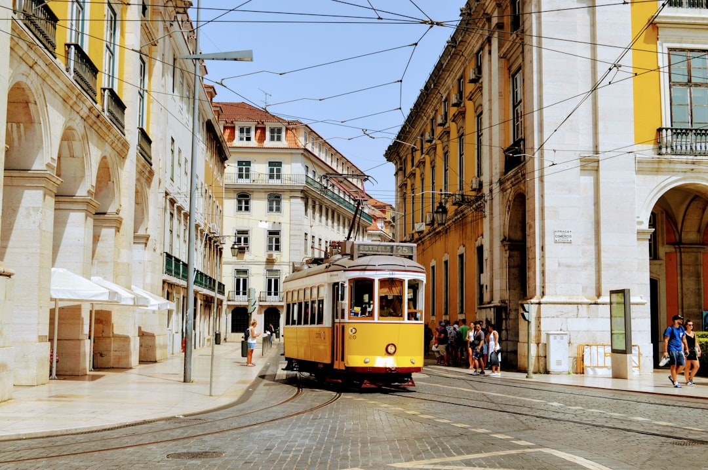

# Lisbon, Portugal

Country: Portugal
Region: Europe

Lisbon (*Lisboa*) is the Portuguese capital, a hill-stacked Atlantic port-city of around 550,000 in the city proper and three million in the wider area. Tiled façades, yellow trams, fado music, and a 350-year-old earthquake-rebuilt grid in the Baixa give the city a melancholic-bright character of its own.

---

## 🧭 Step 1: Choices

### ✨ Why Visit

Lisbon climbed back into the world's "where do I want to live and visit" lists about fifteen years ago and has not left. The Alfama, Baixa, Chiado, Bairro Alto, and Belém each tell a different chapter: medieval Moorish, post-earthquake Pombaline, literary nineteenth-century, bohemian-twentieth, and Age of Discovery. Trams 28 and 12 are still working public transport.

The city is also one of Europe's clearest case studies in fast post-pandemic gentrification. Short-term rentals, golden-visa investment, and digital-nomad inflows have rewritten neighbourhood economics. Visiting respectfully means engaging with that conversation, not pretending it is not happening.

You come for the tiles, the fado, the bacalhau, the Atlantic light, and a city that rewards walking up hills with a different view from each one.

### 🌍 Ethical Compass

- **💰 Economy.** Eat at *tascas* (family taverns) and small *cervejarias* in Alfama, Mouraria, Graça, and Campo de Ourique rather than only Bairro Alto's tourist set. Buy ceramics from small workshops in Anjos or Marvila, not only the airport gift shops.
- **👥 Employment.** Tip a euro or two at restaurants; 5 to 10 percent at sit-down meals. Use Carris trams, metro, and buses rather than Uber for short hops. Fado singers depend on tips at small fado houses; pay generously.
- **📚 Education.** Read Fernando Pessoa (the great Lisbon poet) and José Saramago before you visit. The Museu Nacional do Azulejo explains the tile tradition; the Maritime Museum and the Monument to the Discoveries cover the imperial past, which is contested.
- **🌱 Ecology.** Walk and tram; the hills make cycling specialised. Refill from public fountains; tap water is excellent. Choose shoulder seasons (April to June, September to October) for tile-walking weather without the August crush.

---

## 🎒 Step 2: Preparation

### 🔍 Governance Management

- **Schengen** rules apply; verify on official Portuguese consulate portals.
- **Tram 28** is a working public tram, not a tourist line; expect pickpocket activity in tourist-dense sections. Buy a Viva Viagem or contactless on all public transport.
- **Jerónimos Monastery, Belém Tower, and the Coach Museum** sell timed tickets on official portals; book ahead in peak season.
- **Short-term rental licensing** in Lisbon has tightened in recent years; verify the AL (Alojamento Local) registration number on any listing.
- **Fado houses:** distinguish between tourist fado dinner shows and small Alfama or Mouraria houses where Lisboetas actually go.

### 📡 Information Curation

- **Público** and **The Portugal News** (English) for current news.
- **Visit Lisboa** (the official city tourism site) for events and openings.
- A Portuguese author: Fernando Pessoa's *Book of Disquiet*; José Saramago's *Blindness* or his Lisbon-set novels; António Lobo Antunes.
- A locally led fado-and-Alfama walking tour with a Lisbon resident.
- **Wikivoyage Lisbon** for orientation.

### 🎯 Inference Interaction

- **You decide on your accommodation.** Licensed hotels and AL-registered apartments are fine; unlicensed lets undermine the housing policy and may be cancelled.
- **You decide on tram 28 timing.** Crowded all day in season; early morning or after 10 pm are calmer; consider tram 12 (smaller loop) as an alternative.
- **You decide on Belém.** Half a day minimum: Jerónimos, Belém Tower, Padrão dos Descobrimentos, and pastéis at Pastéis de Belém (the original) or the lighter Manteigaria.
- **You decide on Sintra.** A day-trip works but is very crowded; consider going midweek or in shoulder season. Train from Rossio.
- **You decide on the fado.** A small Alfama or Mouraria fado house with no tourist menu is the real experience; the larger venues are spectacle.

### 🔄 Intelligence Cooperation

Lisbon weather is Mediterranean-Atlantic; summers hot but dry, winters mild but rainy. Trams are crowded year-round in tourist season. Major events (Festas de Lisboa in June, the Lisbon Web Summit in November) reshape the city briefly.

Bring a soft plan. If tram 28 is impassable, walk; the city is small. If a Sintra day is forecast rain, the Lisbon museums and the Time Out Market absorb a wet day. If your fado house is full, the next one over is usually open and often better.

### 📍 Top 5 Anchor Spots

1. **Alfama walking loop.** From the Castelo de São Jorge down through the alleys to the Santa Luzia and Portas do Sol viewpoints and on to the Sé Cathedral. Best early morning or sunset.
2. **Belém half-day.** Jerónimos Monastery, Belém Tower, Padrão dos Descobrimentos, pastéis at Pastéis de Belém or Manteigaria, and the Berardo or MAAT museums.
3. **A fado evening in Alfama or Mouraria.** A small fado house with a fixed-price meal or pay-by-drink format; tip the singers.
4. **Tram 28 (or, alternatively, a walk through Chiado, Baixa, and Bairro Alto).** Off-peak only for the tram; the walk is fine any time.
5. **Sintra day trip.** Pena Palace and the Moorish Castle; book Pena timed entry; train from Rossio. Midweek or shoulder season if possible.

### 🧰 Practical Essentials

- **Recommended Length.** Three to four days for Lisbon. Add a day for Sintra; consider Évora or the Algarve for longer.
- **Transport.** Walk and tram in the centre. The **metro** (four lines) plus buses and trams cover everything; Viva Viagem card or contactless. The **CP commuter rail** to Sintra, Cascais, and Belém. Lisbon Airport (LIS) is 20 minutes from the centre by metro.
- **Daily Cost (per person).**
  - **Budget:** roughly €70 to €120. Hostel, tasca lunches and pastéis, public transport, two ticketed sites.
  - **Mid-range:** roughly €140 to €240. Three-star hotel or AL-registered apartment, restaurant dinners with wine, all major sites, a fado evening.
  - **Higher-comfort:** roughly €320 and up. Boutique Chiado or Príncipe Real hotel, fine dining at Belcanto or Alma, private guides, a Sintra day with chartered car.
- **Booking Notes.**
  - **Schengen:** verify your nationality.
  - **Jerónimos and Belém Tower:** book ahead in peak season.
  - **AL registration:** verify on the listing if booking a short-term rental.
  - **Festas de Santo António (June 12 to 13)** transforms Alfama; book accommodation months ahead.
  - **Sintra Pena Palace:** timed entry, book days ahead in summer.

---

## ✈️ Step 3: Delivery

### 🤖 AI Prompt

Copy this into your own AI assistant, fill in the brackets, and treat the answer as a researcher's draft, not a final plan.

> Please help me plan an ethical visit to Lisbon, Portugal for [NUMBER] days in [MONTH]. I am travelling with [WHO] and my interests are [INTERESTS, e.g. fado, tiles and architecture, food, Age of Discovery history, day trips]. My total budget is around [AMOUNT] and my comfort level is [budget / mid-range / higher-comfort].
>
> Please structure your answer in three steps.
>
> **Step 1: Choices.** Help me decide what to prioritise. Recommend the two or three Lisbon experiences I should not miss given my interests, and one I should consider skipping (a midday tram 28, a tourist fado dinner show, an unlicensed AL apartment). Briefly explain each trade-off.
>
> **Step 2: Preparation.** Cover all four of the following:
> - **Governance Management.** What assumptions should I check before I book? Include Schengen, the AL (Alojamento Local) registration number on any rental, official ticketing for Jerónimos and Belém Tower, fado-house authenticity, and Sintra Pena Palace timed entry.
> - **Information Curation.** Suggest at least four different source types: one official Portuguese source, one Lisbon news outlet (Portuguese or English), one Portuguese author, and one Alfama or Mouraria fado-and-walking guide.
> - **Inference Interaction.** List the decisions I personally need to make (accommodation licensing, tram 28 timing, Belém depth, Sintra commitment, fado venue type).
> - **Intelligence Cooperation.** How should I trust my own judgment and local advice over algorithmic defaults when conditions change? Build me a soft plan with at least two alternates for likely disruptions (a Sintra rain day, sold-out Jerónimos slot, a Festas-de-Santo-António week overlap, a tram closure).
>
> **Step 3: Delivery.** Give me the actual itinerary, day by day, with realistic timings and named neighbourhoods. Include at least one fado evening, one Belém half-day, and one Alfama walking loop. Mark each business as confidently locally owned, or flag it for me to verify.
>
> Finally, please remind me at the end to verify your suggestions against:
> 1. Official sources: Visit Lisboa, the Jerónimos and Belém Tower portals, and the AL registry for short-term rentals.
> 2. Real people: a local resident, a Lisbon-based guide, or hotel staff who live in Lisbon now.
>
> Treat your output as a researcher's draft. I will make the final calls.

---

Part of **Gyro Governance Ethical Travel: AI-Empowered Guides for Human Adventures**.

Explore more destinations, ethical domains, and AI prompts at [travel.gyrogovernance.com](https://travel.gyrogovernance.com/).
