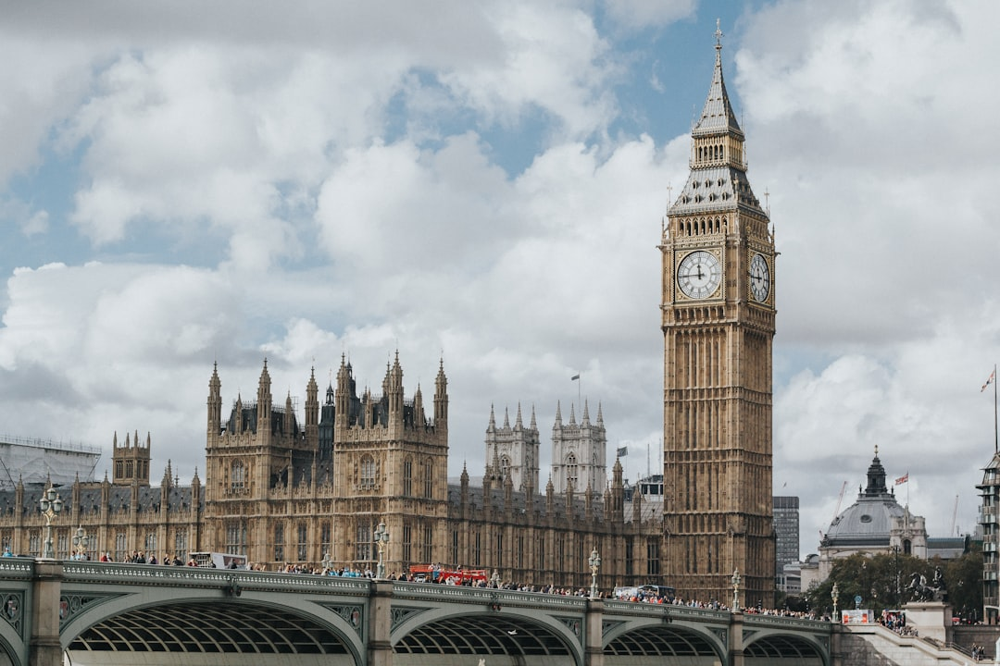

# London, United Kingdom

Country: United Kingdom
Region: Europe

London is the British capital, a Thames-bisected megacity of around nine million, and one of the world's three or four most visited cities. Roman bones, medieval City walls, Tudor palaces, Georgian terraces, Victorian railway architecture, and twenty-first-century glass towers all share the same square miles.

---

## 🧭 Step 1: Choices

### ✨ Why Visit

London concentrates more world-class museums, theatres, and historic spaces in a single city than almost anywhere on Earth, and most of the great museums are free. The British Museum, the National Gallery, Tate Modern, the V&A, the Natural History Museum, and the British Library each justify a half day or full day. The West End is the most active English-language theatre district in the world.

The city is also a working capital with serious housing-affordability and tourism-pressure conversations, and a post-Brexit re-positioning still unfolding. Visiting respectfully means engaging the actual London beyond the Westminster postcard.

You come for the museums, the theatre, the parks, the food (London is one of the world's great food cities now), and a city that takes its history and its complexity seriously.

### 🌍 Ethical Compass

- **💰 Economy.** Eat at neighbourhood places in Brixton, Peckham, Dalston, Hackney, Tooting, Whitechapel, and Soho's side streets, not only Leicester Square chains. Buy at Borough Market or smaller weekly markets (Maltby Street, Broadway Market), not the airport gift shops.
- **👥 Employment.** Tip 12.5 percent at sit-down restaurants (often added as "service" already; check). Tip a pound or two for table service at pubs is uncommon; tipping bar staff at cocktail bars is appreciated.
- **📚 Education.** Read about Empire, slavery, and the contemporary debates around museum collections (the British Museum's Parthenon marbles and Benin bronzes are live conversations). Visit the Museum of London Docklands and the International Slavery Museum exhibits to balance the Empire narratives elsewhere.
- **🌱 Ecology.** Use the Tube, buses, and walking. The Ultra Low Emission Zone (ULEZ) covers most of London; driving is expensive and discouraged. Cycle hire (Santander) works for confident cyclists. Refill water; tap is safe.

---

## 🎒 Step 2: Preparation

### 🔍 Governance Management

- Most visitors need an **ETA (UK Electronic Travel Authorization)** or a visa; verify on the official UK government portal.
- **Tower of London, Westminster Abbey, St Paul's Cathedral, Tower Bridge** sell timed tickets on official portals; book ahead in peak season.
- **British Museum, National Gallery, Tate Modern, V&A, Natural History Museum, Science Museum** are free general admission; special exhibitions are ticketed.
- **Theatre tickets:** book on the venue's official website, the official TKTS booth in Leicester Square (same-day discount), or trusted vendors. Beware resale-only sites.
- **Tube and bus:** tap contactless or Oyster; the daily and weekly cap is automatic.

### 📡 Information Curation

- **The Guardian** and **BBC London** for serious British news.
- **Time Out London** and **Visit London** (official) for events, openings, and current advisories.
- A London author: Charles Dickens (canonical); Zadie Smith (Willesden and beyond); Hanif Kureishi (1980s and 1990s); Bernardine Evaristo.
- A locally led East End, Brixton, or Notting Hill walking tour for a non-Westminster perspective.
- **Wikivoyage London** for transport and district orientation.

### 🎯 Inference Interaction

- **You decide on the museum strategy.** A day per major museum is the right pace; trying to do three in a day burns out everyone involved.
- **You decide on theatre.** A West End musical, a Shakespeare at the Globe, or a National Theatre production are all valid; the Globe is uncovered and seasonal.
- **You decide on royal visits.** Buckingham Palace State Rooms open in summer only (verify); Kensington Palace is year-round; Hampton Court is the Tudor masterpiece outside the centre.
- **You decide your engagement with Empire history.** The British Museum is a serious place to think about provenance; the way you read those galleries is up to you.
- **You decide on Notting Hill Carnival.** August Bank Holiday weekend; one of Europe's largest street festivals; a unique London experience if your dates align.

### 🔄 Intelligence Cooperation

London weather is famously variable. Tube strikes, line closures, and engineering works happen regularly; Network Rail and Transport for London publish updates. Major events (state occasions, marathons, Notting Hill Carnival, big sport) reshape transport on short notice.

Bring a soft plan. If a Tube line is closed, the bus network or walking covers most of central London. If rain shuts down a park-walk plan, the great museums absorb wet days indefinitely. If a theatre show is sold out, TKTS at Leicester Square has same-day options.

### 📍 Top 5 Anchor Spots

1. **British Museum + a long lunch.** Three to four hours; the Rosetta Stone, the Elgin Marbles (think about provenance), the Mesopotamia and Egyptian galleries.
2. **Tate Modern + walk across the Millennium Bridge to St Paul's.** Free general admission; the view from the top floor is one of London's best.
3. **A Royal Parks walk: Hyde Park, Kensington Gardens, St James's, Green Park, Regent's Park.** London is greener than most visitors realise.
4. **A West End theatre evening or Shakespeare at the Globe.** Book on the official portals.
5. **An East End or South London neighbourhood walk: Brick Lane, Spitalfields, Brixton, Peckham.** A different London from the Westminster postcard.

### 🧰 Practical Essentials

- **Recommended Length.** Three to five days for a first visit. A week if you want to add day trips (Oxford, Cambridge, Bath, Stonehenge) or do museums in depth.
- **Transport.** The **Underground (Tube)** plus buses cover almost everything; contactless or Oyster, with automatic daily and weekly caps. The **Elizabeth Line** has dramatically improved east-west and airport links. **National Rail** for day trips. London Heathrow (LHR) connects by Underground Piccadilly Line or Heathrow Express; Gatwick (LGW), Stansted (STN), Luton (LTN), and City (LCY) all have rail or coach options.
- **Daily Cost (per person).**
  - **Budget:** roughly GBP 90 to 150. Hostel, pub-lunch and market meals, public transport, free major museums.
  - **Mid-range:** roughly GBP 200 to 350. Three-star hotel, restaurant dinners, all major museum visits, a theatre show.
  - **Higher-comfort:** roughly GBP 450 and up. Boutique Marylebone or Bloomsbury hotel, fine dining at Sketch, Core, or The Ledbury, premium theatre seats, private guided tours.
- **Booking Notes.**
  - **ETA:** verify your nationality on the UK government portal.
  - **Tower of London and Westminster Abbey:** book ahead.
  - **Wimbledon (late June to early July), Notting Hill Carnival (August Bank Holiday), and major state events** affect the city.
  - **Major exhibitions** at the big museums sell out; book ahead.
  - **National Theatre and Globe:** book official portals.

---

## ✈️ Step 3: Delivery

### 🤖 AI Prompt

Copy this into your own AI assistant, fill in the brackets, and treat the answer as a researcher's draft, not a final plan.

> Please help me plan an ethical visit to London, United Kingdom for [NUMBER] days in [MONTH]. I am travelling with [WHO] and my interests are [INTERESTS, e.g. museums, theatre, food, Empire history, day trips]. My total budget is around [AMOUNT] and my comfort level is [budget / mid-range / higher-comfort].
>
> Please structure your answer in three steps.
>
> **Step 1: Choices.** Help me decide what to prioritise. Recommend the two or three London experiences I should not miss given my interests, and one I should consider skipping (a Leicester Square chain restaurant, a queue-only Tower visit on a peak day, a resale-marked-up theatre ticket). Briefly explain each trade-off.
>
> **Step 2: Preparation.** Cover all four of the following:
> - **Governance Management.** What assumptions should I check before I book? Include the UK ETA, official ticketing for Tower of London/Westminster Abbey/St Paul's, free general admission for major national museums, theatre ticketing through venues or TKTS, and contactless/Oyster for transport.
> - **Information Curation.** Suggest at least four different source types: one official UK source, one British news outlet (Guardian or BBC), one London author, and one neighbourhood-based walking host outside Westminster.
> - **Inference Interaction.** List the decisions I personally need to make (museum pacing, theatre choice, royal-palace selection, Empire-history engagement, neighbourhood exploration).
> - **Intelligence Cooperation.** How should I trust my own judgment and local advice over algorithmic defaults when conditions change? Build me a soft plan with at least two alternates for likely disruptions (a Tube strike, sudden rain, a sold-out show, a state-event street closure).
>
> **Step 3: Delivery.** Give me the actual itinerary, day by day, with realistic timings, Tube lines, and named neighbourhoods. Include at least one major museum, one theatre or live show, and one neighbourhood beyond Westminster (East End, Brixton, Notting Hill, or Hackney). Mark each business as confidently locally owned, or flag for me to verify.
>
> Finally, please remind me at the end to verify your suggestions against:
> 1. Official sources: Visit London, Transport for London, the official museum and venue portals, and the UK government ETA portal.
> 2. Real people: a local resident, a London guide, or hotel staff who live in London now.
>
> Treat your output as a researcher's draft. I will make the final calls.

---

Part of **Gyro Governance Ethical Travel: AI-Empowered Guides for Humane Adventures**.

Explore more destinations, ethical domains, and AI prompts at [travel.gyrogovernance.com](https://travel.gyrogovernance.com/).
