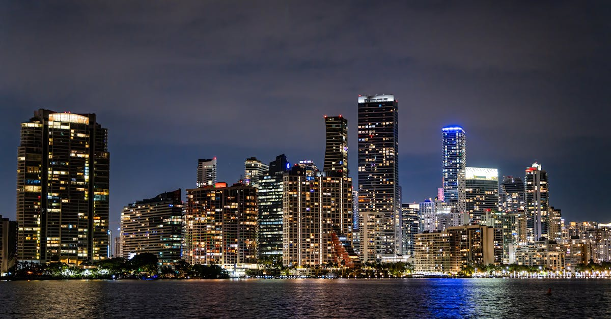

# Miami, United States

Country: United States
Region: Americas

Miami is the largest city in southern Florida, a six-million-person metropolitan area that is the United States' most Latin American city. South Beach Art Deco, Cuban Calle Ocho, Haitian Little Haiti, Caribbean-Atlantic beaches, and the wider Everglades and Florida Keys all within reach.

---

## 🧭 Step 1: Choices

### ✨ Why Visit

Miami is the most Latin city in the US. Spanish is the working language for huge swaths of life. Little Havana's Calle Ocho, Wynwood's mural-covered Arts District, the Design District, and Coral Gables each give a distinct Miami. The Art Deco district of South Beach is one of the world's largest concentrations of 1920s-1940s Art Deco architecture.

The city is also a gateway to the broader South Florida ecosystem: the Everglades, the Florida Keys, Biscayne National Park, and the cruise port for the Caribbean. Many visitors treat Miami as transit; spending three days here proper is the better trip.

You come for the beaches, the food (Cuban, Haitian, Venezuelan, Argentine, Peruvian, Colombian), the architecture, the music, and the gateway to the Everglades.

### 🌍 Ethical Compass

- **💰 Economy.** Eat at Cuban *ventanitas* (windows on Calle Ocho), Haitian restaurants in Little Haiti, Venezuelan arepa places in Doral and Brickell, Argentine parrillas in North Miami Beach. Avoid limiting yourself to Lincoln Road or Ocean Drive tourist set.
- **👥 Employment.** Tip 20 percent at sit-down restaurants; tip housekeeping, valet, ride-share. Service-industry workers in Miami face very high cost of living.
- **📚 Education.** Read about Cuban exile history (José Martí, the Mariel boatlift, the contemporary diaspora) and Haitian Miami. Visit the Bay of Pigs Museum, the Pérez Art Museum Miami (PAMM), and the HistoryMiami Museum.
- **🌱 Ecology.** Miami is at climate-change ground zero: sea-level rise, hurricane intensity, freshwater stress. The Everglades is one of the world's most threatened ecosystems. **Reef-safe sunscreen** for any in-water activity in the Keys. Choose Everglades operators with conservation focus.

---

## 🎒 Step 2: Preparation

### 🔍 Governance Management

- Most international visitors need **ESTA (visa waiver) or a B-2 visa** for the US; verify on the official US State Department portal.
- **Vizcaya Museum and Gardens, the Pérez Art Museum Miami, the Frost Museum of Science** sell tickets on official portals.
- **Everglades National Park** (Shark Valley, Ernest Coe Visitor Center, Royal Palm) entry on Recreation.gov or at the gate.
- For **airboat tours**, choose operators within or adjacent to Everglades National Park with permits; avoid pure tourist airboat operations outside the park.
- **Miami-Dade transit** has Metrorail, Metromover (free, downtown), and Metrobus; tap a contactless card or get an EASY card.

### 📡 Information Curation

- **Miami Herald** and **WLRN** for serious local journalism.
- **Visit Miami** (the official tourism site) for events and openings.
- A Miami author: Edwidge Danticat (Haitian-Miami); Tom Wolfe's *Back to Blood*; Cristina García's *Dreaming in Cuban*.
- A locally led Little Havana, Little Haiti, or Wynwood walking tour with a resident guide.
- **Wikivoyage Miami** for orientation.

### 🎯 Inference Interaction

- **You decide on the neighbourhood.** South Beach is the postcard; Brickell is corporate-glass; Wynwood is murals; Little Havana is Cuban-working; Little Haiti is Haitian-working. Each gives a different Miami.
- **You decide on the beach.** South Beach is the famous one; Mid-Beach (around 35th Street) is quieter; North Beach Boardwalk is local; Key Biscayne is a State Park alternative.
- **You decide on the Everglades trip.** Half-day from Miami works; the airboat at Shark Valley is the family classic; a serious paddle in Flamingo or a guided slough walk is the deeper experience.
- **You decide on the Keys.** Key West is 3.5 hours each way by car; a full day with a 4 am start or an overnight is the only humane way.
- **You decide on your engagement with Cuban exile politics.** Calle Ocho is a working political space, not just a food street; engage respectfully.

### 🔄 Intelligence Cooperation

Miami weather is subtropical; hurricane season runs June through November (peak August-October); afternoon thunderstorms are routine in summer. Major events (Art Basel December, Miami Open March, Ultra Music Festival March) reshape the city and book hotels.

Bring a soft plan. If a hurricane warning approaches, the airport and city plan ahead; have travel insurance. If a thunderstorm closes the beach, the museums and the Wynwood Arts District absorb a wet day. If a music festival fills your dates, accommodation prices triple; book very early.

### 📍 Top 5 Anchor Spots

1. **South Beach Art Deco walking tour.** Miami Design Preservation League runs the official tour; book on their portal.
2. **Wynwood Arts District + Pérez Art Museum.** The Wynwood Walls outdoor murals; the PAMM downtown.
3. **Little Havana on Calle Ocho.** Walk from Domino Park through the ventanitas, El Tucán, Ball & Chain. Best on a Friday evening.
4. **Everglades National Park (Shark Valley or Royal Palm).** Half-day from Miami; airboat or boardwalk loop.
5. **A Miami Beach day at Mid-Beach (35th Street area) or Key Biscayne.** Quieter beach options away from the South Beach scrum.

### 🧰 Practical Essentials

- **Recommended Length.** Three to four days for Miami. Add days for the Keys (overnight better than day-trip) or the Everglades (one full day).
- **Transport.** Walk South Beach and parts of downtown. The **free Metromover** loops downtown. **Metrorail** and **Metrobus** cover the rest but not comprehensively. **Uber and Lyft** are reliable. Renting a car helps for the Everglades and the Keys. Miami International Airport (MIA) is 20 to 40 minutes from South Beach.
- **Daily Cost (per person).**
  - **Budget:** roughly USD 110 to 180. Hostel or budget hotel, ventanita meals, public transport, free beaches.
  - **Mid-range:** roughly USD 240 to 450. Three-star South Beach or Brickell hotel, mixed dining, all major museums, an Everglades day.
  - **Higher-comfort:** roughly USD 600 and up (much more in Art Basel week). Faena, 1 Hotel South Beach, the Ritz, fine dining at Joël Robuchon, Hiyakawa, Boia De, private guided tours, a Keys overnight.
- **Booking Notes.**
  - **ESTA:** apply at least 72 hours before US arrival.
  - **Art Basel (early December):** book hotels months ahead, prices triple.
  - **Hurricane season** (June to November): travel insurance covering weather is wise.
  - **Reef-safe sunscreen** for the Keys.
  - **Public-transport limitations:** plan ride-share or rental car for non-South-Beach areas.

---

## ✈️ Step 3: Delivery

### 🤖 AI Prompt

Copy this into your own AI assistant, fill in the brackets, and treat the answer as a researcher's draft, not a final plan.

> Please help me plan an ethical visit to Miami, United States for [NUMBER] days in [MONTH]. I am travelling with [WHO] and my interests are [INTERESTS, e.g. Art Deco, Latin food and music, beaches, Everglades, contemporary art]. My total budget is around [AMOUNT] and my comfort level is [budget / mid-range / higher-comfort].
>
> Please structure your answer in three steps.
>
> **Step 1: Choices.** Help me decide what to prioritise. Recommend the two or three Miami experiences I should not miss given my interests, and one I should consider skipping (an Ocean Drive tourist restaurant, a Keys day-trip when an overnight is steps better, an airboat operator with no conservation tie). Briefly explain each trade-off.
>
> **Step 2: Preparation.** Cover all four of the following:
> - **Governance Management.** What assumptions should I check before I book? Include the US State Department ESTA, official Vizcaya/PAMM/Frost ticketing, Everglades National Park entry on Recreation.gov, airboat operator permits, and Miami-Dade transit setup.
> - **Information Curation.** Suggest at least four different source types: one official Miami source, one local news outlet (Miami Herald or WLRN), one Miami author, and one Little Havana or Little Haiti walking guide.
> - **Inference Interaction.** List the decisions I personally need to make (neighbourhood base, beach choice, Everglades depth, Keys commitment, Cuban exile engagement).
> - **Intelligence Cooperation.** How should I trust my own judgment and local advice over algorithmic defaults when conditions change? Build me a soft plan with at least two alternates for likely disruptions (hurricane warning, afternoon thunderstorm, Art Basel pricing crunch, an Everglades closure for fire or flood).
>
> **Step 3: Delivery.** Give me the actual itinerary, day by day, with realistic timings and named neighbourhoods. Include at least one Little Havana evening and one Everglades half-day. Mark each business as confidently locally owned, or flag for me to verify.
>
> Finally, please remind me at the end to verify your suggestions against:
> 1. Official sources: Visit Miami, Miami-Dade Transit, Everglades National Park (Recreation.gov), and the US State Department for ESTA.
> 2. Real people: a Miami-based food or neighbourhood guide, a local resident, or hotel staff who live in Miami now.
>
> Treat your output as a researcher's draft. I will make the final calls.

---

Part of **Gyro Governance Ethical Travel: AI-Empowered Guides for Human Adventures**.

Explore more destinations, ethical domains, and AI prompts at [travel.gyrogovernance.com](https://travel.gyrogovernance.com/).
