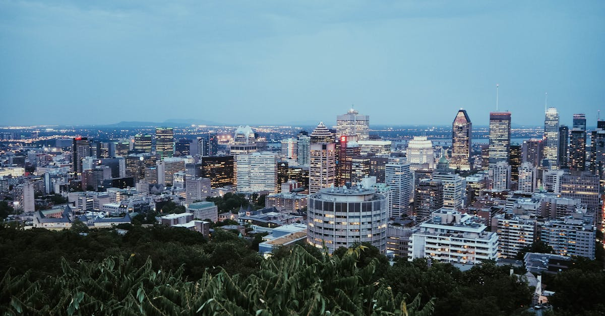

# Montreal, Canada

Country: Canada
Region: Americas

Montreal (*Montréal*) is the largest city in Québec and the second-largest in Canada, an island city at the confluence of the St Lawrence and Ottawa rivers. The largest French-speaking metropolitan area in the Americas, a bilingual cultural capital, and home to a serious food, music, and festival scene through both winter and summer.

---

## 🧭 Step 1: Choices

### ✨ Why Visit

Montreal compresses a French-Canadian capital, a serious museum and music city, and one of North America's most distinctive food cultures into a walkable urban core. Old Montreal (Vieux-Montréal), the Plateau, Mile End, Little Italy, and Chinatown each give a different character. The Mount Royal park (designed by Olmsted, who designed Central Park) anchors the centre.

The city is also the festival capital of Canada. Jazz Festival, Just for Laughs comedy, Osheaga, Igloofest, and dozens of smaller festivals run through the year. Winter is genuinely cold but the city handles it; summer is glorious.

You come for the food (Québécois, Jewish-Montreal deli, French, contemporary), the bilingual culture, the music, and a city that handles its winter with style.

### 🌍 Ethical Compass

- **💰 Economy.** Eat at Plateau and Mile End neighbourhood places (Schwartz's for smoked meat, Wilensky's, St-Viateur and Fairmount for bagels, La Banquise for poutine), Little Italy markets (Jean-Talon Market), and Chinatown rather than only the touristy Old Montreal restaurants.
- **👥 Employment.** Tip 15 to 20 percent at sit-down restaurants; tip bartenders, taxi/Uber drivers, hotel housekeeping. Service-worker wages depend on tips.
- **📚 Education.** Read about Québec's distinct identity, the Quiet Revolution, the language laws (Bill 101), and contemporary Québec politics. The McCord Museum covers Indigenous Québec; Pointe-à-Callière covers the Iroquoian-French foundation of the city.
- **🌱 Ecology.** Walk and use the **STM Metro** (one of the world's most architecturally distinguished). Cycle the BIXI network in summer. The Underground City (RÉSO) keeps you walking in winter. Refill water; Montreal tap is excellent.

---

## 🎒 Step 2: Preparation

### 🔍 Governance Management

- Most visitors need an **eTA (Canadian Electronic Travel Authorization)** if visa-exempt, or a visa otherwise; verify on the official Government of Canada Immigration portal.
- **Major museums** (Musée des Beaux-Arts de Montréal, McCord, Pointe-à-Callière, Biodome) sell tickets on official portals.
- **STM (Metro and bus)** uses **OPUS card** or contactless on metro; verify on the official STM portal.
- **Festival tickets** (Jazz Fest, Osheaga, Just for Laughs) book on official festival portals; some are free street programmes.
- **Hockey tickets** (Montreal Canadiens at the Bell Centre) book on the official Canadiens portal.

### 📡 Information Curation

- **La Presse, Le Devoir** (French) and **Montreal Gazette, CBC Montreal** (English) for current news.
- **Tourisme Montréal** (the official city tourism site) for events and openings.
- A Quebec author: Michel Tremblay (the *Belles-soeurs* and the Plateau); Heather O'Neill (contemporary Montreal); Dany Laferrière (Haitian-Quebec).
- A locally led Plateau or Mile End walking tour or a Jean-Talon Market food tour.
- **Wikivoyage Montreal** for orientation.

### 🎯 Inference Interaction

- **You decide on French.** Most Montrealers are functionally bilingual but a *bonjour* opens doors; the few minutes' effort matters and is appreciated.
- **You decide on a winter visit.** Igloofest, the Festival des Lumières, hockey, and the indoor city are real. Bring serious clothing.
- **You decide on the Plateau vs Mile End balance.** Both are walkable, both have great food; Mile End is hipsterland with serious bagels; the Plateau is the Tremblay-novel postcard.
- **You decide on Old Montreal vs the rest.** Old Montreal is the photogenic colonial core; restaurants there are mostly tourist-oriented; the food scene is in the Plateau, Mile End, and Little Italy.
- **You decide on a hockey game.** Bell Centre, Habs game, real Montreal experience.

### 🔄 Intelligence Cooperation

Montreal weather is dramatic: serious winter (December to March, often below minus 20°C with windchill), beautiful summer (June to September), short shoulder seasons. Major festivals reshape downtown briefly. Construction season (May to October) affects driving (much less metro).

Bring a soft plan. If a winter storm closes things, the RÉSO underground city, the museums, and a long restaurant lunch absorb a cold day. If a festival closes Saint-Catherine Street, the metro routes around it.

### 📍 Top 5 Anchor Spots

1. **Old Montreal walking loop.** Notre-Dame Basilica, Place Jacques-Cartier, the Old Port, the Pointe-à-Callière museum. Best on foot, early morning or evening.
2. **Mount Royal park.** Walk up from Avenue du Parc or take the bus; the lookout (Belvédère Kondiaronk) is the city's classic view.
3. **Plateau Mont-Royal and Mile End food walk.** Schwartz's smoked meat, St-Viateur or Fairmount bagels, Wilensky's, La Banquise poutine.
4. **Jean-Talon Market in Little Italy.** Outdoor market with surrounding cafés; one of the best food markets in North America.
5. **Musée des Beaux-Arts de Montréal.** Free general admission for the permanent collection; ticketed exhibitions.

### 🧰 Practical Essentials

- **Recommended Length.** Three to four days for the city. Add days for Quebec City (three hours by train) or the Eastern Townships.
- **Transport.** Walk in Old Montreal, the Plateau, Mile End, and downtown. **STM Metro** (four colour-coded lines, beautifully designed) and buses; OPUS or contactless. **BIXI bike-share** in summer. Montreal Trudeau Airport (YUL) connects by the 747 Express bus in 30 minutes (24/7) or rideshare.
- **Daily Cost (per person).**
  - **Budget:** roughly CAD 90 to 160. Hostel, smoked-meat and poutine meals, Metro, two free museums.
  - **Mid-range:** roughly CAD 200 to 380. Three-star hotel in the Plateau or downtown, restaurant dinners, all major museums, a hockey game.
  - **Higher-comfort:** roughly CAD 500 and up. Boutique Old Montreal hotel (Hotel Nelligan, Hotel William Gray), fine dining at Joe Beef, Toqué!, or Mon Lapin, private guided food tours, premium hockey seats.
- **Booking Notes.**
  - **eTA:** verify on the official Canadian Immigration portal.
  - **Major festivals** (Jazz Fest late June-July, Osheaga early August, Just for Laughs July): book accommodation months ahead.
  - **Winter clothing:** sub-zero temperatures genuinely require it.
  - **Bagel allegiance** (St-Viateur vs Fairmount) is a real Montreal conversation; try both.
  - **Quebec City day or overnight:** book Via Rail in advance.

---

## ✈️ Step 3: Delivery

### 🤖 AI Prompt

Copy this into your own AI assistant, fill in the brackets, and treat the answer as a researcher's draft, not a final plan.

> Please help me plan an ethical visit to Montreal, Canada for [NUMBER] days in [MONTH]. I am travelling with [WHO] and my interests are [INTERESTS, e.g. food, French-Canadian culture, museums, music festivals, hockey]. My total budget is around [AMOUNT] and my comfort level is [budget / mid-range / higher-comfort].
>
> Please structure your answer in three steps.
>
> **Step 1: Choices.** Help me decide what to prioritise. Recommend the two or three Montreal experiences I should not miss given my interests, and one I should consider skipping (an Old Montreal tourist restaurant when the Plateau is steps better, a winter walk without proper clothing, a sold-out festival show with resale markup). Briefly explain each trade-off.
>
> **Step 2: Preparation.** Cover all four of the following:
> - **Governance Management.** What assumptions should I check before I book? Include the Canadian eTA, official museum portals, STM OPUS or contactless, festival ticketing, and Via Rail to Quebec City.
> - **Information Curation.** Suggest at least four different source types: one official Montreal source, one local news outlet (Gazette or Le Devoir), one Quebec author, and one Plateau or Mile End food guide.
> - **Inference Interaction.** List the decisions I personally need to make (a few French words, winter readiness, Plateau vs Mile End time, Old Montreal vs neighbourhoods, hockey game).
> - **Intelligence Cooperation.** How should I trust my own judgment and local advice over algorithmic defaults when conditions change? Build me a soft plan with at least two alternates for likely disruptions (winter storm, a festival closing streets, a Canadiens game crush at Bell Centre, construction-season detours).
>
> **Step 3: Delivery.** Give me the actual itinerary, day by day, with realistic timings and named neighbourhoods. Include at least one Plateau or Mile End food walk and one Mount Royal climb or descent. Mark each business as confidently locally owned, or flag for me to verify.
>
> Finally, please remind me at the end to verify your suggestions against:
> 1. Official sources: Tourisme Montréal, STM, the Canadian Immigration eTA portal, and Via Rail.
> 2. Real people: a Montreal resident, a local food guide, or hotel staff who live in Montreal now.
>
> Treat your output as a researcher's draft. I will make the final calls.

---

Part of **Gyro Governance Ethical Travel: AI-Empowered Guides for Humane Adventures**.

Explore more destinations, ethical domains, and AI prompts at [travel.gyrogovernance.com](https://travel.gyrogovernance.com/).
