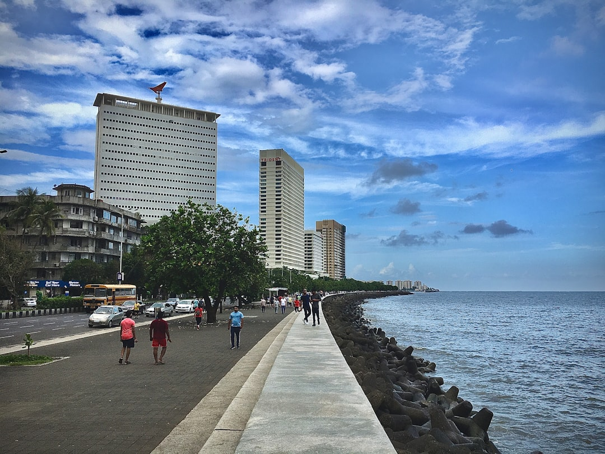

# Mumbai, India

Country: India
Region: Asia

Mumbai (formerly Bombay) is India's financial capital and largest city, a 21-million-person Arabian Sea metropolis on a chain of seven reclaimed islands. Home to Bollywood, the Bombay Stock Exchange, India's most concentrated wealth and its largest slum, and one of the most cinematic cities on Earth.

---

## 🧭 Step 1: Choices

### ✨ Why Visit

Mumbai is the engine of contemporary India. The Victorian-Gothic and Art Deco precinct in South Mumbai is UNESCO-listed; the Gateway of India and the Taj Mahal Palace Hotel are iconic. Bollywood produces more films per year than Hollywood. The food (Maharashtrian, Parsi, Goan, Punjabi, South Indian, Mughlai, and dozens of regional styles in one city) is unmatched in India.

The city is also a working megacity with extreme inequality; Dharavi (Asia's largest informal settlement) and the South Mumbai luxury towers face each other across short distances. Visiting respectfully means engaging both realities.

You come for the food, the Bollywood-and-business energy, the Victorian-Gothic and Art Deco architecture, and a city that does not stop.

### 🌍 Ethical Compass

- **💰 Economy.** Eat at *udipis* (South Indian veg restaurants), *Irani cafés* (Parsi-Iranian heritage cafés like Britannia, Kyani), street vada pav at Anand Stall or Aram Vada Pav, and small Mughlai joints in Bohri Mohalla rather than only five-star restaurants. Buy from the Crawford Market interior or the cooperative crafts shops, not commission-paying tourist shops.
- **👥 Employment.** Hire MoT-registered guides. Use **Uber, Ola, or Rapido** rather than informal taxis. The autorickshaw is suburb-only (not South Mumbai). Tip modestly but consistently.
- **📚 Education.** Read about Mumbai's history (the British Bombay Presidency, the cotton mills, the textile-workers' strike of 1982, the 1992-93 riots, the 2008 Taj attack). Suketu Mehta's *Maximum City* is the foundational text. Visit the Chhatrapati Shivaji Maharaj Vastu Sangrahalaya (Prince of Wales Museum) and the Bhau Daji Lad.
- **🌱 Ecology.** Mumbai air pollution and traffic are real; check AQI; avoid driving yourself. The monsoon (June to September) is dramatic and floods low areas. The mangrove-and-creek ecosystem is fragile; do not feed any wildlife at Sanjay Gandhi National Park.

---

## 🎒 Step 2: Preparation

### 🔍 Governance Management

- Most visitors need an **e-Visa** through the official Indian government e-Visa portal.
- **Major museums** (Prince of Wales Museum, Bhau Daji Lad, the Mani Bhavan Gandhi house) sell tickets at the gate; verify hours.
- **Elephanta Caves** (UNESCO) require a ferry from the Gateway of India; verify on the official portal; closed Mondays.
- **Dharavi tours:** book only through socially responsible operators (Reality Tours and Travel is the gold standard, with proceeds funding local programmes); avoid voyeuristic operators.
- **Mumbai Metro** lines are expanding; verify routes on the official MMRDA portal.

### 📡 Information Curation

- **The Hindu (Mumbai edition)**, **The Indian Express**, **Mid-Day** for serious local journalism.
- The official **Maharashtra Tourism** portal for events and current advisories.
- A Mumbai author: Suketu Mehta's *Maximum City*; Vikram Chandra's *Sacred Games*; Aravind Adiga's *Last Man in Tower* (more about India broadly but Mumbai-resonant).
- A locally led Mumbai walking or food tour (Reality Tours, Mumbai Magic, Khaki Tours).
- **Wikivoyage Mumbai** for orientation.

### 🎯 Inference Interaction

- **You decide on your base.** South Mumbai (Colaba, Fort, Marine Drive) is historic and walkable; Bandra is the new creative-and-Bollywood hub; Lower Parel is corporate.
- **You decide on the Dharavi tour.** A Reality Tours visit is genuinely informative and funds programmes in Dharavi itself; the "slum tour" voyeurism alternative is the opposite.
- **You decide on the Bollywood tour.** Studios occasionally offer tours; serious Bollywood walking tours (Khaki Tours) cover the industry-and-cinema-history landscape better.
- **You decide on the food strategy.** Mumbai is one of the world's great street-food cities; a guided walking food tour is the best half-day investment in the city.
- **You decide your monsoon comfort.** July is peak monsoon; the city floods regularly; this is a different Mumbai.

### 🔄 Intelligence Cooperation

Mumbai weather is monsoonal; June to September brings serious rain and occasional flooding; the rest of the year is dry, with humid winters and very hot pre-monsoon (April-May). Traffic is the constant; allow 2x to 3x the time you would expect.

Bring a soft plan. If monsoon floods cancel a Dharavi tour or Elephanta ferry, the indoor museums and Colaba walking work. If traffic is impossible, the train (locals only with awareness) or walking covers a lot. If a public event closes a major road, alternatives exist.

### 📍 Top 5 Anchor Spots

1. **South Mumbai heritage walking loop.** Gateway of India, the Taj Mahal Palace, Colaba Causeway, the Victorian-Gothic precinct (CSMT station, BMC, High Court), Marine Drive at sunset.
2. **Elephanta Caves (UNESCO).** Ferry from Gateway of India; cave temples carved into the basalt. Half a day; not Mondays.
3. **Dharavi tour with Reality Tours.** Half a day; meaningful, educational, fund-positive.
4. **A street-food walking tour** in Bohri Mohalla, Mohammed Ali Road (Ramadan only for the night food), or a Khau Galli (food lane) in Fort.
5. **An evening Marine Drive walk plus a Chowpatty Beach sunset and bhelpuri.** Free; one of Mumbai's most local rituals.

### 🧰 Practical Essentials

- **Recommended Length.** Three to four days for the city. Add a day for Elephanta and the surrounding Mumbai region.
- **Transport.** Walk in Colaba, Fort, and the Marine Drive area. **Uber, Ola, Rapido** for ride-hail. **Mumbai Local trains** are an experience but extremely crowded; women-only carriages are available. The **Mumbai Metro** is expanding. Chhatrapati Shivaji Maharaj International Airport (BOM) is 30 minutes to 2 hours from central Mumbai depending on traffic.
- **Daily Cost (per person).**
  - **Budget:** roughly INR 1,500 to 3,500 (about USD 18 to 42). Guesthouse or budget Colaba hotel, street food and udipi meals, ride-hail, two ticketed sites.
  - **Mid-range:** roughly INR 6,000 to 14,000 (about USD 70 to 170). Three- or four-star hotel, mixed dining including Bombay Canteen or Trishna, all major sites, a Reality Tours Dharavi tour.
  - **Higher-comfort:** roughly INR 25,000 and up. Taj Mahal Palace, Oberoi, Four Seasons, fine dining at Wasabi by Morimoto or Indigo, private guides, day-trips by chartered car.
- **Booking Notes.**
  - **e-Visa:** apply on the official Indian government portal.
  - **Elephanta:** closed Mondays.
  - **Dharavi tour:** book with Reality Tours and Travel on their official site.
  - **Monsoon (June to September):** flooding is real; consider this for booking.
  - **Major festivals** (Ganesh Chaturthi in August/September is Mumbai's biggest) reshape the city.

---

## ✈️ Step 3: Delivery

### 🤖 AI Prompt

Copy this into your own AI assistant, fill in the brackets, and treat the answer as a researcher's draft, not a final plan.

> Please help me plan an ethical visit to Mumbai, India for [NUMBER] days in [MONTH]. I am travelling with [WHO] and my interests are [INTERESTS, e.g. street food, Victorian-Gothic and Art Deco architecture, Bollywood, contemporary India, Dharavi]. My total budget is around [AMOUNT] and my comfort level is [budget / mid-range / higher-comfort].
>
> Please structure your answer in three steps.
>
> **Step 1: Choices.** Help me decide what to prioritise. Recommend the two or three Mumbai experiences I should not miss given my interests, and one I should consider skipping (a voyeuristic "slum tour", an unlicensed Bollywood promise, the Elephanta ferry on a Monday). Briefly explain each trade-off.
>
> **Step 2: Preparation.** Cover all four of the following:
> - **Governance Management.** What assumptions should I check before I book? Include the Indian e-Visa portal, Reality Tours official booking for Dharavi, Elephanta Monday closure, Mumbai Metro routes on MMRDA, and air-quality forecasts.
> - **Information Curation.** Suggest at least four different source types: one official Indian or Maharashtra source, one Mumbai newspaper, one Mumbai author (especially Suketu Mehta), and one Mumbai-based walking or food guide.
> - **Inference Interaction.** List the decisions I personally need to make (neighbourhood base, Dharavi tour operator, food-tour commitment, monsoon comfort, traffic-time padding).
> - **Intelligence Cooperation.** How should I trust my own judgment and local advice over algorithmic defaults when conditions change? Build me a soft plan with at least two alternates for likely disruptions (monsoon flood, traffic gridlock, a public-event road closure, an air-quality red day).
>
> **Step 3: Delivery.** Give me the actual itinerary, day by day, with realistic timings and named neighbourhoods. Include the heritage walking loop, a Reality Tours Dharavi half-day, and one street-food walking tour. Mark each business as confidently locally owned, or flag for me to verify.
>
> Finally, please remind me at the end to verify your suggestions against:
> 1. Official sources: Maharashtra Tourism, the Indian e-Visa portal, MMRDA for Metro, Reality Tours and Travel, and the Elephanta Caves official portal.
> 2. Real people: a Mumbai-based guide, a local resident, or hotel staff who live in Mumbai now.
>
> Treat your output as a researcher's draft. I will make the final calls.

---

Part of **Gyro Governance Ethical Travel: AI-Empowered Guides for Human Adventures**.

Explore more destinations, ethical domains, and AI prompts at [travel.gyrogovernance.com](https://travel.gyrogovernance.com/).
