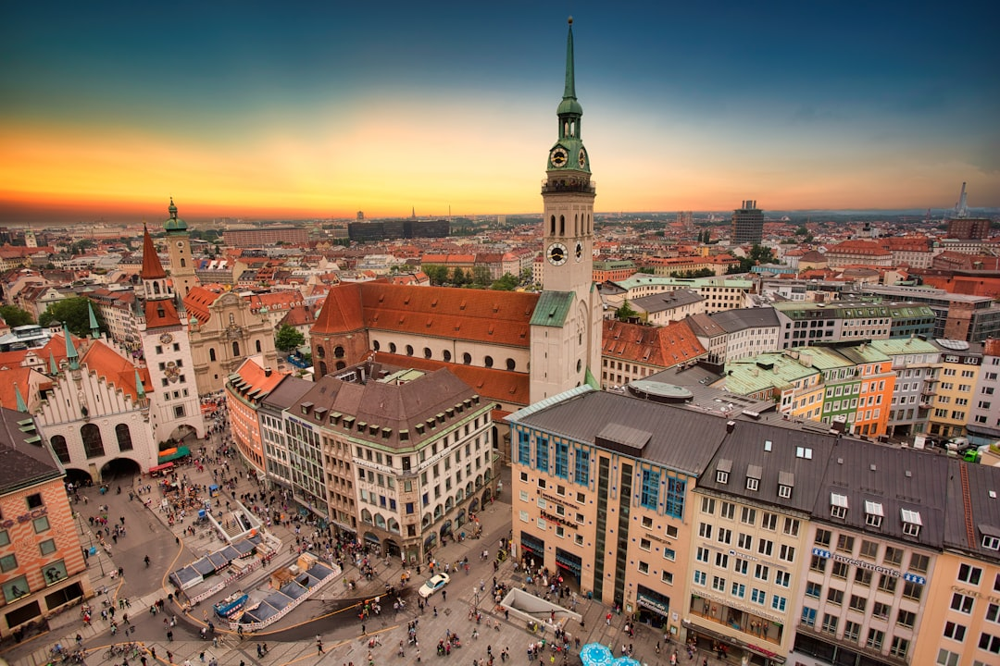

# Munich, Germany

Country: Germany
Region: Europe

Munich (*München*) is the capital of Bavaria, a 1.5 million-person southern German city at the foot of the Alps. Royal Wittelsbach residence, world-class museum centre, beer-garden capital, and home of Oktoberfest (which is a Munich event, not a generic German one).

---

## 🧭 Step 1: Choices

### ✨ Why Visit

Munich is the most Bavarian city in Bavaria. The Marienplatz with its Glockenspiel; the Residenz palace; the Nymphenburg summer palace; the Alte and Neue Pinakothek and the Pinakothek der Moderne (the city's outstanding art museums); the Englischer Garten, larger than Central Park, with a working river-surf wave (Eisbach); and the Hofbräuhaus all anchor the experience.

The city is also the gateway to the Bavarian Alps (Garmisch-Partenkirchen, the Zugspitze), Neuschwanstein Castle, Salzburg, and Dachau Concentration Camp Memorial. A serious Munich trip combines the city itself with at least one day-trip.

You come for the museums, the beer gardens, the Alpine proximity, and a Bavarian culture that is genuine working culture, not folk performance.

### 🌍 Ethical Compass

- **💰 Economy.** Eat at Bavarian *Wirtshäuser* and beer gardens (Augustiner Bräustuben, Wirtshaus in der Au, Andechser am Dom, the Viktualienmarkt central market) rather than the tourist set near Marienplatz. Drink Munich's six brewery beers (Augustiner, Hofbräu, Hacker-Pschorr, Löwenbräu, Paulaner, Spaten) on tap; bottled is not the same.
- **👥 Employment.** Tip 5 to 10 percent at restaurants (round up to a sensible number). The Munich service-industry standard is professional and tip-aware. Use the MVV public transport rather than driving in the centre.
- **📚 Education.** Visit the Dachau Concentration Camp Memorial as a serious morning. The NS-Dokumentationszentrum in the centre covers the Nazi era directly. Munich is where the party was founded; the history is unavoidable and deserves engagement.
- **🌱 Ecology.** Walk and cycle (Munich is a strong cycling city); use trams, the U-Bahn, S-Bahn, and buses. The Englischer Garten is the green spine. Visit shoulder seasons to avoid the Oktoberfest crush.

---

## 🎒 Step 2: Preparation

### 🔍 Governance Management

- **Schengen** rules apply; verify on official portals.
- **Residenz, Nymphenburg, the Pinakothek museums** sell tickets on official Bavarian Palace Department or museum portals.
- **Neuschwanstein Castle** requires advance timed booking on the official Bayerische Schlösserverwaltung portal; sells out days ahead in summer.
- **MVV** (Munich's integrated transport) uses tickets, the MVV app, or contactless (where rolled out); verify on the official MVV portal.
- **Oktoberfest** (late September to first weekend of October) reserves table-and-beer seats at most tents; verify on the official Oktoberfest portal and the individual brewery tent sites.

### 📡 Information Curation

- **The Local Germany** and **Süddeutsche Zeitung** (Munich-based) for current news.
- **München Tourismus** (the official city tourism site) for events and openings.
- A German author with Munich resonance: Thomas Mann (the *Buddenbrooks* setting is north German but he lived in Munich); Bertolt Brecht's early Munich years; contemporary fiction by Wolf Wondratschek.
- A locally led Munich walking tour with a Munich-history specialist (Sandeman's, Radius Tours).
- **Wikivoyage Munich** for orientation.

### 🎯 Inference Interaction

- **You decide on Oktoberfest.** It is one of the world's largest festivals, expensive accommodation-wise, and an actual Bavarian thing. If you come, commit; if you avoid it, choose a different week.
- **You decide on the beer-garden balance.** A beer-garden afternoon (bring your own food allowed in many gardens, buy the beer) is one of Munich's great rituals.
- **You decide on Dachau.** A serious half-day; emotionally heavy; necessary. Free entry; allow proper time.
- **You decide on Neuschwanstein.** Two hours each way by train and bus; book the timed castle entry days ahead; consider whether the Linderhof and Hohenschwangau combination is what you actually want.
- **You decide on the Alps.** Garmisch-Partenkirchen and the Zugspitze cable car are reachable in a day; serious skiing or hiking calls for an overnight.

### 🔄 Intelligence Cooperation

Munich weather is four-season; cold and snowy winter, warm summer, dramatic shoulder seasons. Oktoberfest fills the city. Major football events (Bayern Munich, FC Bayern at the Allianz Arena) reshape transport.

Bring a soft plan. If a rainy Saturday closes outdoor beer gardens, the indoor Augustiner Bräustuben or Hofbräuhaus absorb it. If a Neuschwanstein day is forecast cloud, the Linderhof and Wieskirche alternatives work. If a Bayern match clogs the U-Bahn, plan around it.

### 📍 Top 5 Anchor Spots

1. **Marienplatz + Residenz + Hofbräuhaus walking loop.** A morning in central Munich.
2. **Alte Pinakothek + Neue Pinakothek + Pinakothek der Moderne.** A day or two among the museum cluster in Maxvorstadt.
3. **Dachau Concentration Camp Memorial.** Free, S-Bahn to Dachau station then bus to the memorial. A serious half-day.
4. **Englischer Garten and the Eisbach river-surf wave.** Walk or cycle through; have a beer at the Chinese Tower beer garden; watch the surfers on the Eisbach.
5. **Day trip: Neuschwanstein Castle, or Garmisch-Partenkirchen and the Zugspitze.** Pick one.

### 🧰 Practical Essentials

- **Recommended Length.** Three to four days for the city. Add a day for Neuschwanstein, Dachau, or Salzburg (1.5 hours each way by train).
- **Transport.** Walk the centre and the Englischer Garten. The **MVV U-Bahn, S-Bahn, tram, bus** network is excellent; tickets, app, or contactless where rolled out. Munich Airport (MUC) is 40 minutes by S1 or S8 S-Bahn to the centre.
- **Daily Cost (per person).**
  - **Budget:** roughly €70 to €120. Hostel, bakery and beer-garden meals, MVV, two ticketed sites.
  - **Mid-range:** roughly €150 to €260. Three-star hotel, restaurant dinners with beer, all major museums, a Dachau or Neuschwanstein day.
  - **Higher-comfort:** roughly €320 and up. Bayerischer Hof, Mandarin Oriental, or boutique Schwabing hotel, fine dining at Tantris or EssZimmer (Allianz Arena), private guides, day-trips by chartered car.
- **Booking Notes.**
  - **Schengen:** verify your nationality.
  - **Neuschwanstein:** timed entry, book days ahead.
  - **Oktoberfest (late September to first weekend of October):** book accommodation 6 to 12 months ahead, prices triple, tent reservations needed.
  - **Christmas markets (late November to December):** Marienplatz, Sendlinger Tor, and others.
  - **Bayern Munich match days:** Allianz Arena area is busy; the U6 is full.

---

## ✈️ Step 3: Delivery

### 🤖 AI Prompt

Copy this into your own AI assistant, fill in the brackets, and treat the answer as a researcher's draft, not a final plan.

> Please help me plan an ethical visit to Munich, Germany for [NUMBER] days in [MONTH]. I am travelling with [WHO] and my interests are [INTERESTS, e.g. Bavarian culture, museums, beer gardens, Alpine day trips, twentieth-century history]. My total budget is around [AMOUNT] and my comfort level is [budget / mid-range / higher-comfort].
>
> Please structure your answer in three steps.
>
> **Step 1: Choices.** Help me decide what to prioritise. Recommend the two or three Munich experiences I should not miss given my interests, and one I should consider skipping (a tourist Hofbräuhaus when an Augustiner Bräustuben is steps better, an Oktoberfest week if I had no plan, Neuschwanstein in a fog day). Briefly explain each trade-off.
>
> **Step 2: Preparation.** Cover all four of the following:
> - **Governance Management.** What assumptions should I check before I book? Include Schengen rules, the Bavarian Palace Department for Neuschwanstein, Residenz and Nymphenburg, the Pinakothek portals, MVV transport setup, and Oktoberfest tent reservations.
> - **Information Curation.** Suggest at least four different source types: one official Bavarian source, one Munich news outlet, one German or Munich author, and one Munich-based history walking tour.
> - **Inference Interaction.** List the decisions I personally need to make (Oktoberfest commitment, beer-garden afternoon, Dachau visit timing, Neuschwanstein vs Alps day, museum cluster pace).
> - **Intelligence Cooperation.** How should I trust my own judgment and local advice over algorithmic defaults when conditions change? Build me a soft plan with at least two alternates for likely disruptions (rainy beer-garden day, a Neuschwanstein fog day, a Bayern match closure, a sold-out Tent reservation during Oktoberfest).
>
> **Step 3: Delivery.** Give me the actual itinerary, day by day, with realistic timings and named neighbourhoods. Include at least one beer-garden afternoon and one serious historical visit (Dachau or NS-Dokumentationszentrum). Mark each business as confidently locally owned, or flag for me to verify.
>
> Finally, please remind me at the end to verify your suggestions against:
> 1. Official sources: München Tourismus, the Bayerische Schlösserverwaltung for Neuschwanstein, the Pinakothek and Dachau Memorial portals, and the MVV.
> 2. Real people: a Munich resident, a Munich history guide, or hotel staff who live in Munich now.
>
> Treat your output as a researcher's draft. I will make the final calls.

---

Part of **Gyro Governance Ethical Travel: AI-Empowered Guides for Humane Adventures**.

Explore more destinations, ethical domains, and AI prompts at [travel.gyrogovernance.com](https://travel.gyrogovernance.com/).
