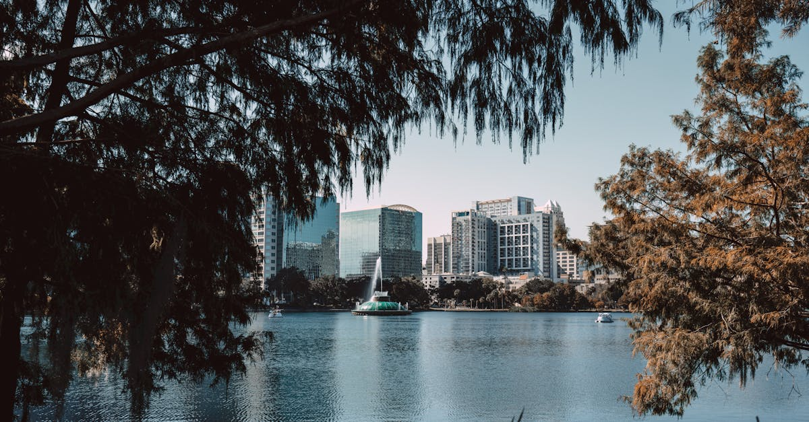

# Orlando, United States

Country: United States
Region: Americas

Orlando is a 2.7-million-person central Florida metropolitan area, home to Walt Disney World, Universal Orlando, SeaWorld, and the densest cluster of major theme parks on Earth. The world's most-visited theme-park destination, with the wider central-Florida natural landscape (springs, swamps, the Kennedy Space Center) within reach.

---

## 🧭 Step 1: Choices

### ✨ Why Visit

Orlando is the global capital of theme parks. Walt Disney World alone is four parks (Magic Kingdom, EPCOT, Hollywood Studios, Animal Kingdom) plus two water parks and a vast resort complex. Universal Orlando is three parks (Universal Studios, Islands of Adventure, Volcano Bay, plus the new Epic Universe). SeaWorld and LEGOLAND round out the cluster.

The destination is also home to one of the largest concentrations of springs in the world, the Kennedy Space Center (45 minutes east), and surprisingly good Vietnamese and Latin American food scenes outside the resort bubble.

You come because the theme parks are the most consistently executed entertainment on the planet, and you stay an extra day to swim in a spring or visit a real working space-launch site.

### 🌍 Ethical Compass

- **💰 Economy.** Eat at the genuine restaurants beyond the parks: Mills 50 (Orlando's Vietnamese district), Park Avenue in Winter Park, the historic Church Street area, downtown's small Latin American spots. Stay at smaller hotels in Winter Park, downtown, or Lake Buena Vista rather than only the most expensive theme-park-adjacent resorts if budget matters.
- **👥 Employment.** Tip 20 percent at sit-down restaurants; tip housekeeping, valet, theme-park sit-down servers. Theme-park hospitality wages are at the low end of US service wages.
- **📚 Education.** Beyond the parks: visit the Kennedy Space Center for actual American space history, the Orlando Museum of Art for visual culture, or learn about central Florida's Seminole and Timucua histories. Read about how Disney's Orlando arrival in the 1970s reshaped the central-Florida economy and ecology.
- **🌱 Ecology.** Choose **springs over crowded beaches** for natural Florida (Wekiwa Springs, Blue Spring, Silver Springs, Rainbow Springs). Reef-safe sunscreen if you swim in the springs (the manatees and clear water depend on it). Do not feed any wildlife.

---

## 🎒 Step 2: Preparation

### 🔍 Governance Management

- Most international visitors need **ESTA (visa waiver) or a B-2 visa** for the US; verify on the official US State Department portal.
- **Walt Disney World** tickets and park reservations book on the official Disney portal; verify current ticket types (date-based, park-hopper, Genie+) and any park-reservation requirement.
- **Universal Orlando** tickets and Express Pass book on the official Universal portal.
- **Kennedy Space Center** tickets book on the official KSC Visitor Complex portal; book ahead for launch days.
- **State park entry** (Wekiwa, Blue Spring) is small fee at the gate; verify on the Florida State Parks portal.

### 📡 Information Curation

- **Orlando Sentinel** for local news.
- **Visit Orlando** (the official tourism site) for events and openings.
- A central Florida book or resource: Carl Hiaasen's Florida novels (set elsewhere but capturing the state); local-business or environmental journalism on the springs.
- A theme-park strategy resource (Touring Plans, Allears.net) for park-specific planning.
- **Wikivoyage Orlando** for non-park orientation.

### 🎯 Inference Interaction

- **You decide on the theme-park strategy.** Disney plus Universal in one trip needs at least four days at the parks. Doing both in two days is exhausting and incomplete. Genie+ at Disney and Express Pass at Universal change the experience but cost.
- **You decide on the on-site vs off-site hotel.** Disney and Universal on-site hotels give early-park access; off-site is cheaper. The trade-off depends on park-day count.
- **You decide on the springs.** A day at a central Florida spring is the antidote to a theme-park week. Wekiwa is closest; Silver Springs has glass-bottom boats; Blue Spring has manatees in winter.
- **You decide on the Kennedy Space Center.** A full day if you have any interest in space; a launch day if your dates align.
- **You decide on the rest of Florida.** Tampa, St Petersburg, the Atlantic beaches, the Everglades, and Miami are all reachable; consider extending.

### 🔄 Intelligence Cooperation

Orlando weather is subtropical with daily afternoon thunderstorms in summer (June to September). Hurricane season runs through November. Major holidays (Christmas/New Year, Easter, Thanksgiving) and school breaks fill the parks to capacity.

Bring a soft plan. If a thunderstorm closes outdoor park rides, the indoor rides and shows continue. If a hurricane warning approaches, the parks close orderly and reschedule. If a sold-out day catches you, the off-park downtown is open.

### 📍 Top 5 Anchor Spots

1. **Magic Kingdom (Disney) at opening.** The flagship Disney park; rope-drop strategy and an evening parade.
2. **Universal's Islands of Adventure (Wizarding World of Harry Potter half) + Universal Studios.** The Universal parks' headline experience.
3. **Kennedy Space Center.** Full day; the Saturn V rocket, the Atlantis shuttle, possibly a launch.
4. **A central Florida spring day** (Wekiwa, Blue Spring, Silver Springs, or Rainbow Springs). A real natural Florida.
5. **A Mills 50 (Orlando's Vietnamese district) dinner or a Winter Park afternoon.** Real local Orlando.

### 🧰 Practical Essentials

- **Recommended Length.** Four to seven days minimum for a meaningful theme-park trip; longer for a more thorough park-and-Florida combination.
- **Transport.** **Renting a car** is the practical default; theme-park transit is comprehensive within Disney and Universal but doesn't connect the city. **Lynx bus and SunRail** are limited. **Uber and Lyft** are reliable. Orlando International Airport (MCO) is 20 minutes to the parks.
- **Daily Cost (per person).**
  - **Budget:** roughly USD 150 to 280 (theme-park tickets alone are USD 130+ per day per person). Off-park budget hotel, off-park meals, single park-day, rental car.
  - **Mid-range:** roughly USD 400 to 700. Three-star theme-park-adjacent or on-site value-tier hotel, mixed dining, multi-day park ticket, rental car.
  - **Higher-comfort:** roughly USD 1,000 and up. Disney Deluxe or Universal premier on-site hotel (with Express Pass), Genie+ or Express Pass, fine dining at park signature restaurants, Lightning Lanes.
- **Booking Notes.**
  - **ESTA:** apply at least 72 hours before US arrival.
  - **Disney and Universal tickets:** book ahead; verify any park-reservation requirement.
  - **Disney Lightning Lane Premier / Genie+ / Lightning Lane Multi Pass** rules have evolved; verify current options on the official portal.
  - **Kennedy Space Center launch days:** book months ahead.
  - **Holidays and school breaks** double crowds; verify your dates.

---

## ✈️ Step 3: Delivery

### 🤖 AI Prompt

Copy this into your own AI assistant, fill in the brackets, and treat the answer as a researcher's draft, not a final plan.

> Please help me plan an ethical visit to Orlando, United States for [NUMBER] days in [MONTH]. I am travelling with [WHO including children's ages if any] and my interests are [INTERESTS, e.g. Disney parks, Universal/Harry Potter, water parks, Kennedy Space Center, Florida springs]. My total budget is around [AMOUNT] and my comfort level is [budget / mid-range / higher-comfort].
>
> Please structure your answer in three steps.
>
> **Step 1: Choices.** Help me decide what to prioritise. Recommend the best mix of Disney parks, Universal parks, springs, and Kennedy Space Center given my interests and time, and one I should consider skipping (an over-packed two-day Disney + Universal attempt, an on-site hotel I do not need, a launch day I cannot reach). Briefly explain each trade-off.
>
> **Step 2: Preparation.** Cover all four of the following:
> - **Governance Management.** What assumptions should I check before I book? Include the US State Department ESTA, official Disney and Universal ticketing and Lightning Lane/Express Pass rules, Kennedy Space Center official tickets, and Florida State Parks for springs.
> - **Information Curation.** Suggest at least four different source types: one official Orlando source, one theme-park planning resource (Touring Plans or Allears), one non-park Orlando food or neighbourhood guide, and one Florida springs or central-Florida environmental source.
> - **Inference Interaction.** List the decisions I personally need to make (park count, on-site vs off-site, springs day, Kennedy Space Center, Mills 50 or Winter Park dinner).
> - **Intelligence Cooperation.** How should I trust my own judgment and local advice over algorithmic defaults when conditions change? Build me a soft plan with at least two alternates for likely disruptions (summer thunderstorm, hurricane warning, a sold-out park-reservation day, a launch scrub).
>
> **Step 3: Delivery.** Give me the actual itinerary, day by day, with realistic timings and named parks/lands. Include at least one non-park day (springs or Kennedy Space Center or downtown Orlando). Mark each business as confidently locally owned where possible, or flag for me to verify.
>
> Finally, please remind me at the end to verify your suggestions against:
> 1. Official sources: Visit Orlando, the Disney and Universal official ticketing portals, Kennedy Space Center Visitor Complex, and Florida State Parks.
> 2. Real people: a recent theme-park visitor, an Orlando food guide outside the parks, or hotel staff.
>
> Treat your output as a researcher's draft. I will make the final calls.

---

Part of **Gyro Governance Ethical Travel: AI-Empowered Guides for Human Adventures**.

Explore more destinations, ethical domains, and AI prompts at [travel.gyrogovernance.com](https://travel.gyrogovernance.com/).
