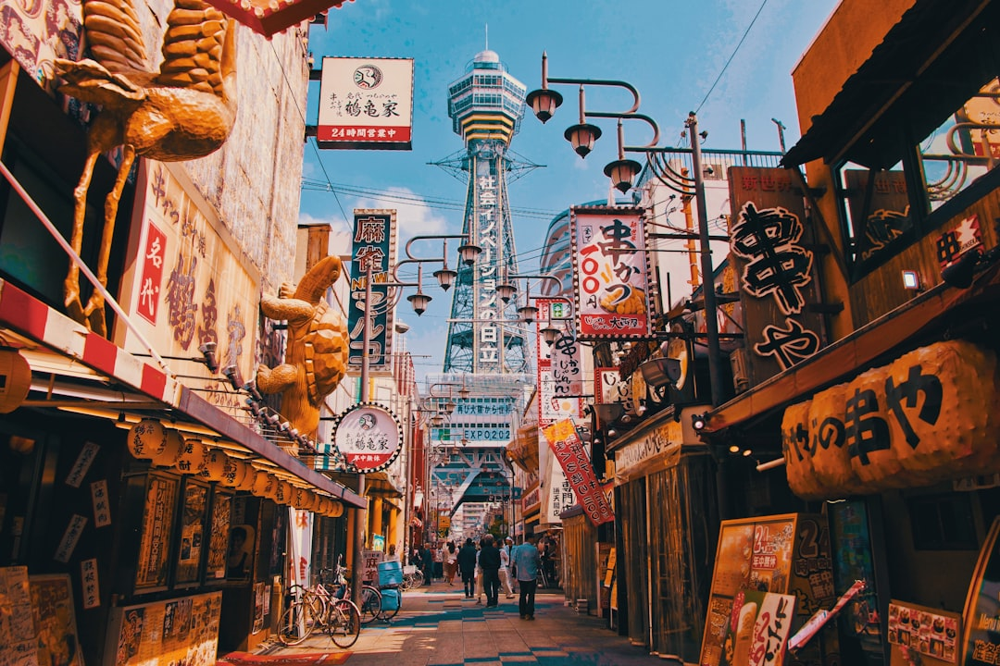

# Osaka, Japan

Country: Japan
Region: Asia

Osaka is Japan's third-largest city, a 2.7-million-person Kansai-region capital that has long been the country's commercial and food heart. Less imperial than Kyoto, less corporate than Tokyo, more direct in its dialect and humour, and one of the world's great street-food cities.

---

## 🧭 Step 1: Choices

### ✨ Why Visit

Osaka is the Japan that talks back. The Osakan dialect is famous for warmth and humour. The food culture is built around *kuidaore* ("eat until you drop"): takoyaki, okonomiyaki, kushikatsu, and a kuidaore reputation that is genuinely lived. The Dotonbori canal with its giant signs is the postcard.

The city is also the gateway to Kansai's deeper attractions: Kyoto (15 minutes by Shinkansen), Nara (45 minutes by JR), Himeji Castle (45 minutes by Shinkansen), and Koyasan (the mountaintop Buddhist temple complex). Many travellers use Osaka as a base for the Kansai region.

You come for the food, the directness of Osakan character, the access to Kansai's deeper culture, and a Japan that is more accessible than its big-city peers.

### 🌍 Ethical Compass

- **💰 Economy.** Eat at standing okonomiyaki and takoyaki counters in Dotonbori and Shinsekai, *teishoku* lunches near Umeda, and the underground food halls of Kuromon Market. Stay in licensed hotels and ryokan; verify any short-term rental's licence.
- **👥 Employment.** Tipping is not customary in Japan. Use IC cards (ICOCA, Suica) on all public transport. Hire Osaka-licensed guides for any deep cultural day.
- **📚 Education.** Read about Osaka's merchant history (it was the trading capital of Edo-era Japan), the firebombing during WWII, and the post-war reconstruction. Osaka Castle has a serious history museum.
- **🌱 Ecology.** Walk and use the metro. Refill water; tap is excellent. Choose shoulder seasons (April to early June, October to early December) for the best weather without major-event crowds.

---

## 🎒 Step 2: Preparation

### 🔍 Governance Management

- Most visitors are **visa-exempt for short stays** in Japan; verify on the official Ministry of Foreign Affairs portal.
- **Osaka Castle** sells tickets at the gate; verify hours on the official portal.
- **Universal Studios Japan** is in Osaka; sells timed tickets on the official portal; book ahead.
- **ICOCA card** (Kansai region) or **Suica** (national) for public transport; tap and ride.
- **Osaka Amazing Pass / Osaka eMetro Pass / Kansai Thru Pass** are multi-day options; verify on the official portals which suits your specific itinerary.

### 📡 Information Curation

- **The Japan Times** and **Mainichi** (English edition) for current news.
- The official **Osaka Convention and Tourism Bureau** site for events and openings.
- A Japanese author with Osaka roots: Mieko Kawakami; Yoko Ogawa; classic works often have Tokyo or Kyoto settings but Osaka has its own contemporary fiction.
- A licensed Osaka food walking tour (Eat Osaka, Magical Trip).
- **Wikivoyage Osaka** for orientation.

### 🎯 Inference Interaction

- **You decide on the food strategy.** A guided street-food walking tour the first night is the best single use of an evening; you learn what to order on your own afterwards.
- **You decide on Osaka vs Kyoto base.** Osaka is cheaper and food-richer; Kyoto is calmer and more culturally weighted. 15 minutes by Shinkansen separates them; you can day-trip either way.
- **You decide on Universal Studios.** A real theme park; book ahead; verify Express Pass and Nintendo World rules.
- **You decide on day-trips.** Nara (deer and Todaiji), Himeji Castle, Koyasan (overnight temple stay) are all from Osaka.
- **You decide on the Hanshin Tigers game.** Real Osakan baseball culture if your dates align.

### 🔄 Intelligence Cooperation

Osaka weather is humid-subtropical; hot summer, cold-damp winter, dramatic shoulder seasons. Major events (cherry blossom, autumn foliage, Tenjin Matsuri in July) fill the city.

Bring a soft plan. If a typhoon disrupts the Shinkansen, Osaka itself absorbs an extra day. If a sold-out Universal day frustrates, Osaka Castle and Shinsekai work as alternatives. The city handles disruption smoothly.

### 📍 Top 5 Anchor Spots

1. **Dotonbori and the Namba district at night.** The Glico Running Man sign, the Kani Doraku crab, the food on every corner. Best after 6 pm.
2. **Osaka Castle.** Stone walls and moat; the reconstructed donjon houses a history museum.
3. **Kuromon Market.** Osaka's "kitchen"; takoyaki, fugu, fresh sushi, fruits. Best at lunch.
4. **Shinsekai and Tsutenkaku Tower.** The retro-Showa neighbourhood; kushikatsu at Daruma; the postwar-rebuild aesthetic.
5. **A day-trip: Nara (deer and Todaiji's Great Buddha), Himeji Castle, or Koyasan.** Pick one.

### 🧰 Practical Essentials

- **Recommended Length.** Two to three days for Osaka; longer if you also use it as a Kansai base.
- **Transport.** Walk in Namba, Umeda, and Shinsekai. **Osaka Metro** (9 lines), **JR loop line**, and private railways cover everywhere; **ICOCA or Suica**. **Shinkansen** to Kyoto (15 minutes), Himeji (45 minutes), Tokyo (2.5 hours). Kansai International Airport (KIX) is 50 minutes from central Osaka by Nankai or JR.
- **Daily Cost (per person).**
  - **Budget:** roughly JPY 7,000 to 14,000 (about USD 45 to 90). Hostel or capsule, street food and convenience-store meals, IC card, two ticketed sites.
  - **Mid-range:** roughly JPY 18,000 to 35,000 (about USD 115 to 230). Three-star hotel, mixed dining including a serious kaiseki or sushi dinner, all major sites, Universal Studios.
  - **Higher-comfort:** roughly JPY 60,000 and up. The St Regis Osaka, Conrad Osaka, or boutique ryokan, fine dining at Hajime or Fujiya 1935, private guides, day-trips by chartered car.
- **Booking Notes.**
  - **Visa-exempt:** verify your nationality.
  - **Universal Studios:** book ahead.
  - **Cherry blossom (late March to early April), autumn foliage (mid-November)** fill the city.
  - **Tenjin Matsuri (late July)** is Osaka's biggest festival; book accommodation months ahead.
  - **JR Pass:** verify whether it suits your overall Japan itinerary.

---

## ✈️ Step 3: Delivery

### 🤖 AI Prompt

Copy this into your own AI assistant, fill in the brackets, and treat the answer as a researcher's draft, not a final plan.

> Please help me plan an ethical visit to Osaka, Japan for [NUMBER] days in [MONTH]. I am travelling with [WHO] and my interests are [INTERESTS, e.g. street food, Edo-era merchant history, Universal Studios, day trips to Kyoto, Nara, or Himeji]. My total budget is around [AMOUNT] and my comfort level is [budget / mid-range / higher-comfort].
>
> Please structure your answer in three steps.
>
> **Step 1: Choices.** Help me decide what to prioritise. Recommend the two or three Osaka experiences I should not miss given my interests, and one I should consider skipping (a tourist-trap Dotonbori restaurant when the next street is better, a day at Universal if I came for culture, an unguided first-night food crawl). Briefly explain each trade-off.
>
> **Step 2: Preparation.** Cover all four of the following:
> - **Governance Management.** What assumptions should I check before I book? Include the Japanese visa-exempt status, Universal Studios official ticketing, ICOCA setup, multi-day pass cost-benefit, and short-term rental licensing.
> - **Information Curation.** Suggest at least four different source types: one official Osaka source, one Japanese English news outlet, one Japanese author, and one Osaka food walking tour.
> - **Inference Interaction.** List the decisions I personally need to make (Osaka vs Kyoto base, Universal commitment, day-trip choice, food-tour first night, Hanshin Tigers game).
> - **Intelligence Cooperation.** How should I trust my own judgment and local advice over algorithmic defaults when conditions change? Build me a soft plan with at least two alternates for likely disruptions (typhoon disruption, a Shinkansen delay, a sold-out Universal day, a major festival overlap).
>
> **Step 3: Delivery.** Give me the actual itinerary, day by day, with realistic timings, metro lines, and named neighbourhoods. Include at least one Dotonbori evening and one day-trip if my schedule allows. Mark each business as confidently locally owned, or flag for me to verify.
>
> Finally, please remind me at the end to verify your suggestions against:
> 1. Official sources: Osaka Convention and Tourism Bureau, Universal Studios Japan, the official transit and IC-card portals, and JR for the Shinkansen.
> 2. Real people: an Osaka resident, a local food guide, or hotel staff who live in Osaka now.
>
> Treat your output as a researcher's draft. I will make the final calls.

---

Part of **Gyro Governance Ethical Travel: AI-Empowered Guides for Human Adventures**.

Explore more destinations, ethical domains, and AI prompts at [travel.gyrogovernance.com](https://travel.gyrogovernance.com/).
