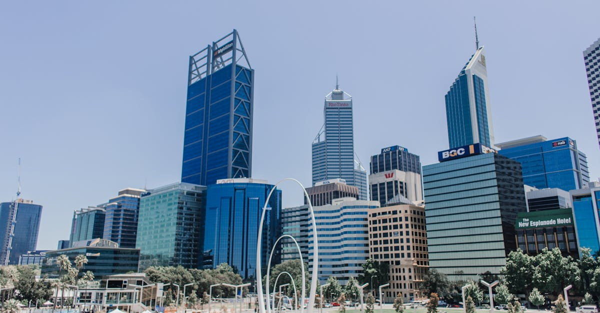

# Perth, Australia

Country: Australia
Region: Oceania

Perth (*Boorloo* in Whadjuk Noongar) is the capital of Western Australia, a 2.3 million-person city on the Indian Ocean coast, isolated by 2,000 kilometres of desert from the next major city. The most remote major city in the world, with a Mediterranean climate, world-class beaches, and a serious wildflower and dolphin and wine season.

---

## 🧭 Step 1: Choices

### ✨ Why Visit

Perth and Western Australia get less attention than the east coast and reward visitors precisely for that. Kings Park is one of the world's largest urban parks (larger than Central Park). Cottesloe and Scarborough beaches face the Indian Ocean. Rottnest Island (with the famous quokkas) is 30 minutes by ferry. The Margaret River wine region is three hours south.

The city is also the gateway to some of Australia's most distinctive landscapes: the Pinnacles, the Coral Coast (Ningaloo Reef in the far north), the wildflower country in spring (August to October), the Karri forests of the south-west, and the Kimberley.

You come for the beaches, the Indian Ocean sunsets, Rottnest Island, the wine region, and as the only major Australian city on the Indian Ocean coast.

### 🌍 Ethical Compass

- **💰 Economy.** Eat at small restaurants in Fremantle, Northbridge, Mount Lawley, Subiaco, and Leederville rather than the city's high-end hotel restaurants only. The Margaret River wine region has small cellar doors that benefit from direct visits.
- **👥 Employment.** Tipping is not customary in Australia. Use Transperth (the public transport network).
- **📚 Education.** This is the country of the Whadjuk Noongar people, part of the wider Noongar Nation that covers south-west Western Australia. Visit the Western Australian Museum Boola Bardip in Perth and engage with Noongar-led cultural experiences. Read about the Stolen Generations and the West Australian colonial history.
- **🌱 Ecology.** **Reef-safe sunscreen** for any reef snorkelling (Ningaloo specifically, but also Rottnest Island). Do not approach quokkas; let them approach you (no food, no touching). Stay on marked trails in Kings Park and the south-west forests.

---

## 🎒 Step 2: Preparation

### 🔍 Governance Management

- **ETA or eVisitor** required for most visa-waiver nationals; verify on the Department of Home Affairs portal.
- **Transperth** runs Perth public transport (Transperth Trains, buses, ferries); contactless or SmartRider card.
- **Rottnest Island** ferries (Rottnest Express, SeaLink Rottnest Island) and the island day-fee book on official portals.
- **Margaret River wineries** mostly accept walk-ins for cellar-door tastings but premium experiences book ahead.
- **Western Australian National Parks** (Pinnacles, Karijini, Cape Le Grand) require a park pass at the gate or annual pass.

### 📡 Information Curation

- **The West Australian** and **ABC Perth** for current local news.
- **Tourism Western Australia** and **Destination Perth** (official) for events and openings.
- A Western Australian author: Tim Winton (canonical, *Cloudstreet* is Perth-set); Kim Scott (Noongar fiction, *Benang*).
- A Noongar-led cultural tour (Wula Gura Nyinda Eco Cultural Adventures, Walyalup Wadjemup tours).
- **Wikivoyage Perth** for orientation.

### 🎯 Inference Interaction

- **You decide on Fremantle.** "Freo" is a 30-minute Transperth train south of Perth; the prison (UNESCO), the markets, the cappuccino strip, the harbour are all distinct from Perth proper.
- **You decide on Rottnest commitment.** A full day on Rottnest; bicycle is the way to get around the car-free island; respect the quokkas.
- **You decide on the wine region.** Three hours each way from Perth makes Margaret River a 12-hour day or (better) an overnight.
- **You decide on the wildflower season.** August to October the south-west has one of the world's most spectacular wildflower displays.
- **You decide on Noongar engagement.** A Noongar-led walk in Kings Park or at Fremantle (Walyalup) is a different reading of the same landscape.

### 🔄 Intelligence Cooperation

Perth weather is Mediterranean; long hot dry summer (December to March, often 35°C+), mild rainy winter (June to August). The Fremantle Doctor (afternoon sea-breeze) cools coastal summer afternoons. Bushfire risk in summer in the surrounding bush.

Bring a soft plan. If a heatwave closes outdoor plans, the Western Australian Museum and the Perth Cultural Centre absorb it. If a Margaret River winery day is rained out, Fremantle and the city work as alternatives. If a Rottnest ferry is weather-cancelled, the closer Cottesloe and Scarborough beaches work.

### 📍 Top 5 Anchor Spots

1. **Kings Park and Botanic Garden.** Free; world-class urban park; war memorial; Boab tree; panorama over the Swan River and city.
2. **Fremantle ("Freo") half-day or full day.** Fremantle Prison (UNESCO), Fremantle Markets, the cappuccino strip on South Terrace, the harbour and the WA Maritime Museum.
3. **Rottnest Island (Wadjemup).** Bike the car-free island; meet the quokkas; swim at the Basin or Salmon Bay.
4. **Cottesloe Beach at sunset.** Free; Indian Ocean sunset; the indie Norfolk Hotel afterwards.
5. **Margaret River day or overnight.** Wineries (Vasse Felix, Voyager, Cape Mentelle), caves, beaches.

### 🧰 Practical Essentials

- **Recommended Length.** Three to five days for Perth and Fremantle and Rottnest. Add a day or two for Margaret River.
- **Transport.** Walk in Perth's compact CBD and in Fremantle. **Transperth Trains, buses, and ferries**; SmartRider or contactless. **Rottnest Express or SeaLink** for Rottnest. **Renting a car** for Margaret River, the Pinnacles, and the south-west. Perth Airport (PER) is 25 minutes from the CBD by Airport Link train.
- **Daily Cost (per person).**
  - **Budget:** roughly AUD 110 to 200. Hostel, food-market and casual meals, Transperth, Rottnest day-trip, free beaches.
  - **Mid-range:** roughly AUD 260 to 480. Three-star hotel in Perth or Fremantle, restaurant dinners, Rottnest day, a Margaret River day with hire car.
  - **Higher-comfort:** roughly AUD 700 and up. COMO The Treasury, the Ritz-Carlton Perth, fine dining at Wildflower or Long Chim, private guided Margaret River wine days, helicopter Pinnacles flights.
- **Booking Notes.**
  - **ETA or eVisitor:** verify on the Department of Home Affairs portal.
  - **Rottnest:** book ferry ahead in peak summer.
  - **Margaret River wineries:** small cellar doors can be walk-in; premium experiences book ahead.
  - **Wildflower season (August to October):** book accommodation for popular wildflower towns months ahead.
  - **Perth Festival (February):** the city's main cultural event.

---

## ✈️ Step 3: Delivery

### 🤖 AI Prompt

Copy this into your own AI assistant, fill in the brackets, and treat the answer as a researcher's draft, not a final plan.

> Please help me plan an ethical visit to Perth and Western Australia for [NUMBER] days in [MONTH]. I am travelling with [WHO] and my interests are [INTERESTS, e.g. beaches, Rottnest quokkas, wine, Noongar culture, wildflowers]. My total budget is around [AMOUNT] and my comfort level is [budget / mid-range / higher-comfort].
>
> Please structure your answer in three steps.
>
> **Step 1: Choices.** Help me decide what to prioritise. Recommend the two or three Perth experiences I should not miss given my interests, and one I should consider skipping (a one-day Margaret River when an overnight is steps better, a quokka selfie that approaches the animal, a Perth-only itinerary that misses Fremantle and Rottnest). Briefly explain each trade-off.
>
> **Step 2: Preparation.** Cover all four of the following:
> - **Governance Management.** What assumptions should I check before I book? Include the ETA or eVisitor, Transperth SmartRider or contactless, Rottnest ferry operators and island day-fee, Margaret River cellar-door bookings, and Western Australian National Parks passes.
> - **Information Curation.** Suggest at least four different source types: one official WA source, one local news outlet, one WA author (Tim Winton or Kim Scott), and one Noongar-led cultural tour.
> - **Inference Interaction.** List the decisions I personally need to make (Fremantle time, Rottnest day commitment, wine-region depth, wildflower season, Noongar engagement).
> - **Intelligence Cooperation.** How should I trust my own judgment and local advice over algorithmic defaults when conditions change? Build me a soft plan with at least two alternates for likely disruptions (summer heat, Rottnest ferry weather cancellation, a bushfire affecting Margaret River, a heatwave grounding outdoor plans).
>
> **Step 3: Delivery.** Give me the actual itinerary, day by day, with realistic timings and named places. Include at least one Fremantle day, one Rottnest day, and one Noongar-led experience if available. Mark each business as confidently locally owned, or flag for me to verify.
>
> Finally, please remind me at the end to verify your suggestions against:
> 1. Official sources: Destination Perth, Tourism Western Australia, Transperth, the Department of Home Affairs, and the official Rottnest ferry operators.
> 2. Real people: a Perth resident, a Noongar guide, or hotel staff who live in Perth now.
>
> Treat your output as a researcher's draft. I will make the final calls.

---

Part of **Gyro Governance Ethical Travel: AI-Empowered Guides for Humane Adventures**.

Explore more destinations, ethical domains, and AI prompts at [travel.gyrogovernance.com](https://travel.gyrogovernance.com/).
