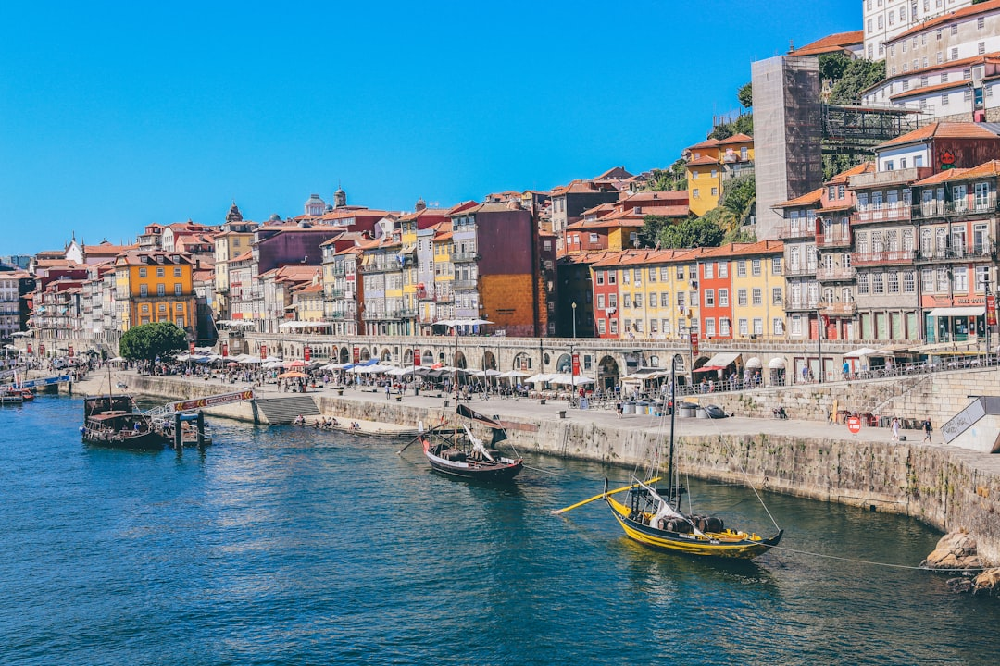

# Porto, Portugal

Country: Portugal
Region: Europe

Porto (*Oporto*) is Portugal's second city, a 240,000-person hill-stacked port-town on the Douro River where the river meets the Atlantic. UNESCO-listed historic centre, the home of port wine (made up-river, aged in Vila Nova de Gaia across the river), and one of Europe's most photogenic working cities.

---

## 🧭 Step 1: Choices

### ✨ Why Visit

Porto is the working Portuguese city that holds together. The Ribeira riverfront, the Dom Luís I bridge (designed by a student of Eiffel), the São Bento railway station's blue-tiled hall, the Livraria Lello bookshop, the port-wine lodges of Vila Nova de Gaia, and the Douro river-cruise are the headlines.

The city has also become one of Europe's most-recommended weekend destinations and is feeling the tourism pressure. Visiting respectfully means engaging the working neighbourhoods and the wider Douro Valley, not just the Ribeira postcard.

You come for the port wine, the food (tripe, francesinha, bacalhau, seafood), the Douro Valley wine region up-river, and a small city that punches well above its size.

### 🌍 Ethical Compass

- **💰 Economy.** Eat at *tascas* (family taverns) in Cedofeita, Bonfim, and Bolhão (the central market neighbourhood) rather than only the Ribeira tourist set. The Mercado do Bolhão has been restored; buy from working stallholders.
- **👥 Employment.** Tip a euro or two at sit-down meals. Use STCP buses, the Porto Metro, and the funicular rather than only Uber.
- **📚 Education.** Read about port wine's English heritage (the lodges of Sandeman, Taylor's, Graham's, Croft were British-founded); the Douro Valley's UNESCO terraced vineyards; and the Age of Discovery's Porto launching point.
- **🌱 Ecology.** Walk; central Porto is small and the hills are part of the experience. Use the Metro for hops. The Douro river-cruises are at scale; choose smaller operators that limit passenger load.

---

## 🎒 Step 2: Preparation

### 🔍 Governance Management

- **Schengen** rules apply; verify on official portals.
- **Port wine lodges** (Sandeman, Taylor's, Graham's, Croft, Cálem) sell timed tour-and-tasting tickets on official portals; the upper-tier tours book ahead.
- **Livraria Lello** (the famous bookshop) requires a paid timed entry that is credited towards a book purchase; verify on the official Lello portal.
- **Douro Valley day trips** (by train from São Bento to Pinhão, or by bus/car/boat tour) verify operator on official Visit Porto or TripAdvisor.
- **Short-term rental** in Porto is regulated; verify the AL (Alojamento Local) registration on any listing.

### 📡 Information Curation

- **Público** and **The Portugal News** (English) for current news.
- **Visit Porto** (the official city tourism site) for events and openings.
- A Portuguese author: Eça de Queirós (canonical, Porto-set in places); José Saramago for broader Portugal.
- A locally led Porto walking tour or a Douro Valley wine tour with a wine-specialist guide.
- **Wikivoyage Porto** for orientation.

### 🎯 Inference Interaction

- **You decide on the lodge tour.** A single lodge tour is enough for most visitors; the upper-tier port-wine experiences with vintage tastings cost more and reward serious enthusiasts.
- **You decide on the Douro Valley.** A day-trip works (train to Pinhão is the classic) but an overnight in the valley (Quinta da Pacheca, Six Senses Douro Valley) is the deeper experience.
- **You decide on the river cruise.** Six-bridges short cruises run from Ribeira; longer Douro cruises go upriver.
- **You decide on Livraria Lello.** Worth it for the architecture but the paid-timed-entry model makes it touristy; arrive at opening or accept the queue.
- **You decide on Gaia vs Porto base.** Vila Nova de Gaia (across the river, the south bank) has the lodges and a panoramic view of Porto; Porto proper has the medieval centre and more food.

### 🔄 Intelligence Cooperation

Porto weather is Atlantic; mild year-round but wet (December to March is the rainiest); summer (June to September) is dry and warm.

Bring a soft plan. If a rainy day kills the river-cruise plan, the lodges, the museums (Serralves contemporary art and the Casa da Música), and a long Ribeira lunch absorb a wet afternoon. If a Douro day is forecast cloud, an extra Porto day works.

### 📍 Top 5 Anchor Spots

1. **Ribeira waterfront and Dom Luís I bridge sunset.** Walk the Ribeira; cross the upper deck of Dom Luís I to Vila Nova de Gaia; ride the funicular down for an evening drink.
2. **A port wine lodge tour in Gaia.** Sandeman, Taylor's, Graham's, or Cálem. Combine with the cable car or the funicular.
3. **São Bento railway station + Livraria Lello + Clérigos Tower.** A morning of central Porto's signature architecture.
4. **Mercado do Bolhão + a Cedofeita lunch.** The newly restored central market with surrounding tascas.
5. **A Douro Valley day-trip or overnight.** Train to Pinhão for the classic experience; a Quinta visit for a vineyard meal.

### 🧰 Practical Essentials

- **Recommended Length.** Two to three days for Porto. Add one to two for the Douro Valley.
- **Transport.** Walk the centre. **Porto Metro** (6 lines), **STCP buses**, the **funicular** and the **historic trams**; an Andante card or contactless. **CP train** to the Douro Valley from São Bento. Porto Airport (OPO) is 30 minutes from the centre by Metro Line E.
- **Daily Cost (per person).**
  - **Budget:** roughly €70 to €120. Hostel, tasca lunches, Metro, one port lodge tour.
  - **Mid-range:** roughly €140 to €240. Three-star hotel or licensed apartment, restaurant dinners with wine, two lodge tours, a Douro train day.
  - **Higher-comfort:** roughly €320 and up. Boutique Ribeira or Bonfim hotel (the Yeatman, Vintage House Hotel, Pousada do Porto), fine dining at The Yeatman, Antiqvvm, or Pedro Lemos, private guides, a Six Senses Douro Valley overnight.
- **Booking Notes.**
  - **Schengen:** verify your nationality.
  - **Port wine lodges:** book ahead in peak season.
  - **Livraria Lello:** verify current entry rules on the official portal.
  - **São João Festival (June 23-24)** is Porto's biggest festival; book accommodation months ahead.
  - **Douro Valley harvest (September-October)** is the most photogenic but busiest time.

---

## ✈️ Step 3: Delivery

### 🤖 AI Prompt

Copy this into your own AI assistant, fill in the brackets, and treat the answer as a researcher's draft, not a final plan.

> Please help me plan an ethical visit to Porto, Portugal for [NUMBER] days in [MONTH]. I am travelling with [WHO] and my interests are [INTERESTS, e.g. port wine, Douro Valley, food, architecture, river]. My total budget is around [AMOUNT] and my comfort level is [budget / mid-range / higher-comfort].
>
> Please structure your answer in three steps.
>
> **Step 1: Choices.** Help me decide what to prioritise. Recommend the two or three Porto experiences I should not miss given my interests, and one I should consider skipping (a Ribeira tourist menu when Bolhão is steps better, a one-day Douro when an overnight is steps better, a Lello queue at midday). Briefly explain each trade-off.
>
> **Step 2: Preparation.** Cover all four of the following:
> - **Governance Management.** What assumptions should I check before I book? Include Schengen, official lodge ticketing for the tours, Livraria Lello entry rules, AL registration for any rental, and Douro train booking on CP.
> - **Information Curation.** Suggest at least four different source types: one official Portuguese source, one Portuguese news outlet, one Portuguese author, and one Porto-based wine or food guide.
> - **Inference Interaction.** List the decisions I personally need to make (which lodge or lodges, Douro day vs overnight, river-cruise length, Livraria Lello commitment, Gaia vs Porto base).
> - **Intelligence Cooperation.** How should I trust my own judgment and local advice over algorithmic defaults when conditions change? Build me a soft plan with at least two alternates for likely disruptions (rainy day, a sold-out lodge slot, a Douro train cancellation, a São João week overlap).
>
> **Step 3: Delivery.** Give me the actual itinerary, day by day, with realistic timings and named neighbourhoods. Include at least one lodge tour and one Cedofeita or Bonfim meal. Mark each business as confidently locally owned, or flag for me to verify.
>
> Finally, please remind me at the end to verify your suggestions against:
> 1. Official sources: Visit Porto, the port-lodge portals, Livraria Lello, and CP for trains.
> 2. Real people: a Porto resident, a port-wine specialist guide, or hotel staff who live in Porto now.
>
> Treat your output as a researcher's draft. I will make the final calls.

---

Part of **Gyro Governance Ethical Travel: AI-Empowered Guides for Human Adventures**.

Explore more destinations, ethical domains, and AI prompts at [travel.gyrogovernance.com](https://travel.gyrogovernance.com/).
