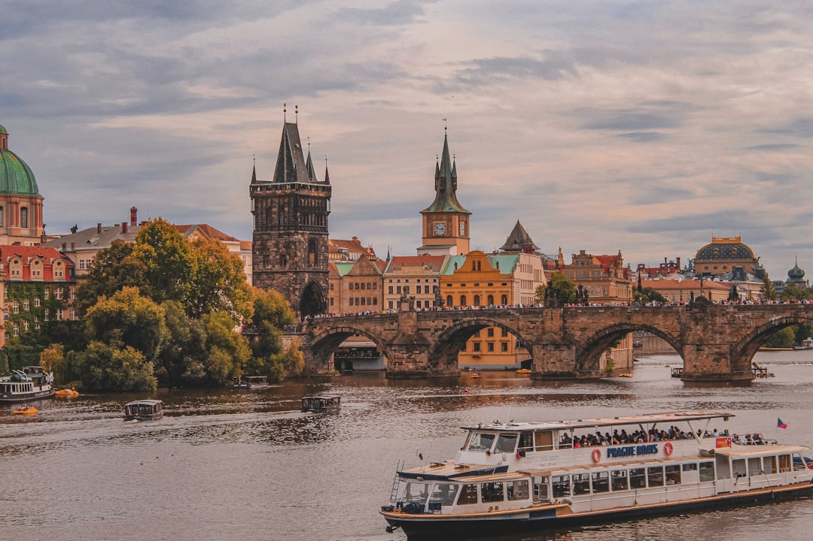

# Prague, Czech Republic

Country: Czech Republic
Region: Europe

Prague (*Praha*) is the Czech capital, a 1.3-million-person Bohemian city on the Vltava River that emerged from WWII largely undamaged. UNESCO-listed centre, Gothic-Baroque-Art-Nouveau density, the largest castle complex in the world by area (Prague Castle), and one of the most-visited cities in Central Europe.

---

## 🧭 Step 1: Choices

### ✨ Why Visit

Prague is the textbook of Central European urban beauty. The Old Town Square with the Astronomical Clock, the Charles Bridge, the Castle district (Hradčany), the Jewish Quarter (Josefov), and Vinohrady's tree-lined Art Nouveau streets are walking-distance from each other. Beer is at coffee-shop prices and is among the world's best.

The city is also one of the most pressure-tested by tourism in Central Europe; Old Town Square in peak hours is a tour-group crush. Visiting respectfully means engaging the residential neighbourhoods and visiting major sites at opening or in the evening.

You come for the architecture, the beer halls, the Charles Bridge at dawn, the Jewish history, and a city that has been the centre of Czech political and cultural life for a thousand years.

### 🌍 Ethical Compass

- **💰 Economy.** Eat at *hospodas* (Czech beer pubs serving food) in Vinohrady, Žižkov, and Letná rather than only the Old Town tourist set. Buy beer at supermarkets (Pilsner Urquell, Budvar, Staropramen) for cheap or at small craft breweries (Pivovar U Fleků, U Medvídků); avoid the inflated Old Town brewpubs.
- **👥 Employment.** Tip 10 percent at restaurants or round up. Use the integrated Prague public transport (DPP); buy a 24-hour or 72-hour pass.
- **📚 Education.** Read about the Czech twentieth century: the First Republic, the Nazi occupation, the Holocaust (Terezín), the Communist period, the 1968 Prague Spring, the 1989 Velvet Revolution. Visit the Pinkas Synagogue (with the names of 80,000 Bohemian and Moravian Holocaust victims) and the Museum of Communism.
- **🌱 Ecology.** Walk; Prague's centre is dense and walkable. Use the Metro, trams, and buses. Refill water; Prague tap is excellent.

---

## 🎒 Step 2: Preparation

### 🔍 Governance Management

- **Schengen** rules apply; verify on official portals.
- **Prague Castle complex** (St Vitus Cathedral, Old Royal Palace, St George's Basilica, Golden Lane) requires a combined ticket; verify on the official Prague Castle portal.
- **Old Jewish Quarter (Josefov)** synagogue cluster (Old-New Synagogue, Pinkas, Spanish, Klausen) uses a combined Jewish Museum ticket; verify on the official Jewish Museum in Prague portal.
- **National Museum, Mucha Museum, Lobkowicz Palace** sell tickets on official portals.
- **Public transport (DPP)** uses paper tickets (90-minute or day passes) or contactless on most lines; verify on the official DPP portal.

### 📡 Information Curation

- **Radio Prague International** and **Expats.cz** for English-language Czech news.
- **Prague.eu** (the official city tourism site) for events and openings.
- A Czech author: Milan Kundera; Bohumil Hrabal; Franz Kafka (writing in German but Prague-rooted); Václav Havel (essays and plays).
- A locally led Jewish Quarter or Velvet Revolution walking tour with a Prague resident.
- **Wikivoyage Prague** for orientation.

### 🎯 Inference Interaction

- **You decide on Castle timing.** Sunrise at the Castle (arrive by 8 am before opening; the courtyards are free; St Vitus opens at 9) gives an empty experience; midday is a tour-bus crush.
- **You decide on Charles Bridge timing.** Sunrise or after 10 pm are the only humane times; the rest of the day is photo-stick collisions.
- **You decide on Jewish Quarter depth.** A serious half-day with the combined Jewish Museum ticket, slowly, is the right pace; rushing diminishes it.
- **You decide on beer commitment.** Czech beer culture is real working culture; an evening at a *hospoda* with locals is the city's best free experience.
- **You decide on Terezín.** A serious day-trip; the former Theresienstadt concentration-and-transit camp; emotionally heavy but important.

### 🔄 Intelligence Cooperation

Prague weather is continental; cold and grey winter (December to February, occasional snow), warm summer (June to August, can be hot), beautiful shoulder seasons. Major events (Easter markets, Christmas markets, Prague Spring Music Festival in May, the Prague Marathon) reshape the city briefly.

Bring a soft plan. If rain ruins outdoor plans, the National Gallery, the Jewish Museum cluster, and the Mucha Museum absorb a wet day. If Christmas markets fill the Old Town Square, the Wenceslas Square and Náměstí Míru markets are quieter alternatives.

### 📍 Top 5 Anchor Spots

1. **Prague Castle complex at opening.** St Vitus Cathedral, Old Royal Palace, St George's Basilica, Golden Lane. Arrive at 9 am.
2. **Charles Bridge at sunrise.** Free, magical, empty before 7 am.
3. **Old Jewish Quarter (Josefov).** Combined Jewish Museum ticket; Old-New Synagogue, Pinkas, Spanish, Klausen, Old Jewish Cemetery.
4. **Vinohrady or Letná evening.** Walk Riegrovy Sady or Letná Park, eat at a Vinohrady *hospoda*, drink Pilsner Urquell on tap.
5. **A Terezín day-trip OR a Czech beer-and-pub crawl in Žižkov.** Pick one.

### 🧰 Practical Essentials

- **Recommended Length.** Three to four days for Prague. Add a day for Terezín, Český Krumlov (three hours south, UNESCO-listed), or Kutná Hora (one hour by train, Sedlec Ossuary).
- **Transport.** Walk in the centre. **Prague Metro (3 lines), trams, and buses** under DPP; 24-hour or 72-hour pass or contactless on most lines. Václav Havel Airport (PRG) is 35 minutes from the centre by bus + Metro or Airport Express bus.
- **Daily Cost (per person).**
  - **Budget:** roughly CZK 1,500 to 3,000 (about EUR 60 to 120). Hostel, *hospoda* meals and Czech beer, transport pass, two ticketed sites.
  - **Mid-range:** roughly CZK 4,000 to 8,000 (about EUR 160 to 320). Three-star hotel, restaurant dinners, all major sites, a Terezín day.
  - **Higher-comfort:** roughly CZK 12,000 and up. Boutique hotel (Augustine, Four Seasons Prague, Mandarin Oriental), fine dining at Field, La Degustation, or Eska, private guides, a classical concert at the Rudolfinum or National Theatre.
- **Booking Notes.**
  - **Schengen:** verify your nationality.
  - **Prague Castle:** ticket categories vary; verify on the official portal.
  - **Jewish Museum combined ticket:** the only way to see all the synagogues.
  - **Prague Spring Music Festival (May)** fills the city; book accommodation months ahead.
  - **Christmas markets (late November to early January)** are a peak season with very crowded centre.

---

## ✈️ Step 3: Delivery

### 🤖 AI Prompt

Copy this into your own AI assistant, fill in the brackets, and treat the answer as a researcher's draft, not a final plan.

> Please help me plan an ethical visit to Prague, Czech Republic for [NUMBER] days in [MONTH]. I am travelling with [WHO] and my interests are [INTERESTS, e.g. Bohemian architecture, Jewish history, Czech beer culture, classical music, Velvet Revolution]. My total budget is around [AMOUNT] and my comfort level is [budget / mid-range / higher-comfort].
>
> Please structure your answer in three steps.
>
> **Step 1: Choices.** Help me decide what to prioritise. Recommend the two or three Prague experiences I should not miss given my interests, and one I should consider skipping (a midday Charles Bridge, an Old Town Square tourist restaurant, a Castle visit at peak hour). Briefly explain each trade-off.
>
> **Step 2: Preparation.** Cover all four of the following:
> - **Governance Management.** What assumptions should I check before I book? Include Schengen, the Prague Castle combined ticket categories, the Jewish Museum combined ticket, DPP transport setup, and Terezín booking.
> - **Information Curation.** Suggest at least four different source types: one official Czech source, one English-language Czech news outlet (Radio Prague International or Expats.cz), one Czech author, and one Prague-based history or pub-crawl guide.
> - **Inference Interaction.** List the decisions I personally need to make (Castle timing, Charles Bridge timing, Jewish Quarter pace, beer commitment, Terezín visit).
> - **Intelligence Cooperation.** How should I trust my own judgment and local advice over algorithmic defaults when conditions change? Build me a soft plan with at least two alternates for likely disruptions (rain on a Castle day, a closed wing, a Christmas-market crowd, a sold-out concert).
>
> **Step 3: Delivery.** Give me the actual itinerary, day by day, with realistic timings and named districts. Include at least one Vinohrady or Žižkov evening and one early-morning Castle or Charles Bridge. Mark each business as confidently locally owned, or flag for me to verify.
>
> Finally, please remind me at the end to verify your suggestions against:
> 1. Official sources: Prague.eu, the Prague Castle and Jewish Museum portals, and DPP for transport.
> 2. Real people: a Prague resident, a Czech-history guide, or hotel staff who live in Prague now.
>
> Treat your output as a researcher's draft. I will make the final calls.

---

Part of **Gyro Governance Ethical Travel: AI-Empowered Guides for Humane Adventures**.

Explore more destinations, ethical domains, and AI prompts at [travel.gyrogovernance.com](https://travel.gyrogovernance.com/).
