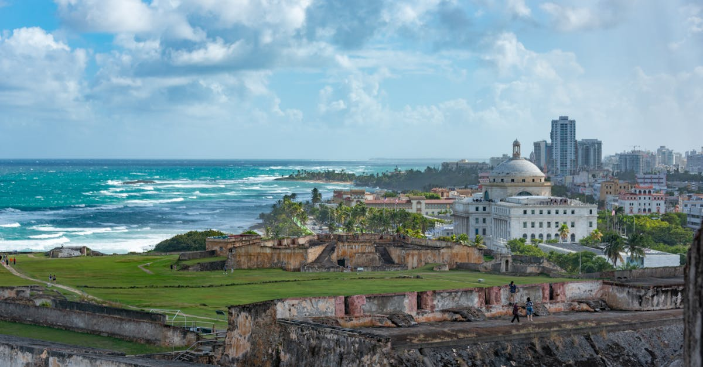

# San Juan, Puerto Rico

Country: United States (Puerto Rico)
Region: Americas

San Juan is the capital of Puerto Rico, a Caribbean island that is a US commonwealth. A 350,000-person port city with a UNESCO-listed Spanish colonial centre (Old San Juan), warm Atlantic and Caribbean beaches, the El Yunque rainforest within reach, and a culture that is genuinely its own: Puerto Rican, Spanish-speaking, Caribbean, and connected to the US mainland.

---

## 🧭 Step 1: Choices

### ✨ Why Visit

San Juan offers UNESCO-listed colonial architecture, beautiful beaches (Condado, Isla Verde, and the further-out Luquillo), and serious Puerto Rican cuisine (mofongo, lechón, alcapurrias). El Morro and San Cristóbal forts, the cobblestone streets of Old San Juan, the contemporary art at MAPR, and the salsa nights of Santurce all anchor a varied stay.

The island is also a real conversation about US-Puerto Rican relations, Hurricane Maria's lasting impact, and the lechón road of Guavate. Visiting respectfully means engaging Puerto Rico on its own terms, not as a generic Caribbean stop.

You come for Old San Juan, the food, the beaches, El Yunque rainforest, and as a base for the wider island.

### 🌍 Ethical Compass

- **💰 Economy.** Eat at Puerto Rican family restaurants (Cocina Abuela Inés, El Jibarito, La Casita Blanca, La Bombonera) and lechón roadsides at Guavate rather than only resort restaurants. Stay in locally owned boutique hotels in Old San Juan, Condado, or Ocean Park rather than only large international resorts.
- **👥 Employment.** Tip 18 to 20 percent at restaurants (US norms apply). The post-Maria and post-pandemic tourism economy depends on visitors who spend locally.
- **📚 Education.** Read about Puerto Rican history (Taíno, Spanish colonial, the 1898 US annexation, the Jones Act, the statehood debate, Hurricane Maria 2017 and its aftermath, the contemporary diaspora). Visit the Museo de Arte de Puerto Rico (MAPR) and El Morro.
- **🌱 Ecology.** **Reef-safe sunscreen** is encouraged across the Caribbean. El Yunque is the only US tropical rainforest in the National Forest system; stay on trails. The bioluminescent bays (Mosquito Bay in Vieques is the most famous) are fragile; use only certified operators.

---

## 🎒 Step 2: Preparation

### 🔍 Governance Management

- US citizens and US permanent residents need no passport for Puerto Rico (it is a US commonwealth). International visitors enter as if entering the US: **ESTA or B-2 visa** depending on nationality; verify on the official US State Department portal.
- **El Morro and San Cristóbal forts** (San Juan National Historic Site) are managed by the US National Park Service; entry fee small; verify on the NPS portal.
- **El Yunque National Forest** entry fee at the gate or pre-paid on Recreation.gov; some trails require reservations.
- For **bioluminescent bay tours** in Vieques (Mosquito Bay), Fajardo (Laguna Grande), or La Parguera, choose operators using non-motorised kayaks; verify on Discover Puerto Rico.
- The new **Tren Urbano** Metro serves only one route (San Juan to Bayamón); rental car, Uber, or taxi for everything else.

### 📡 Information Curation

- **El Nuevo Día** (Spanish) and **The San Juan Daily Star** (English) for current Puerto Rican news.
- **Discover Puerto Rico** (the official tourism site) for events and openings.
- A Puerto Rican author: Esmeralda Santiago; Rosario Ferré; Eduardo Lalo (*Simone*).
- A locally led Old San Juan walking tour or food tour with a Puerto Rican guide.
- **Wikivoyage Puerto Rico** for orientation.

### 🎯 Inference Interaction

- **You decide on the El Yunque day.** A serious 4 to 6 hour visit; the La Mina Falls trail is the classic; verify trail status on Recreation.gov.
- **You decide on the lechón road.** Guavate (the *Ruta del Lechón*) is one of the world's great roadside-food experiences; 45 minutes by car; Saturday/Sunday afternoon is the local time.
- **You decide on the bio-bay.** Vieques' Mosquito Bay is the world's brightest; the ferry to Vieques takes time and is unreliable. Fajardo's Laguna Grande is reachable from San Juan.
- **You decide on the beach.** Condado is the postcard urban beach; Ocean Park is calmer; Luquillo (45 minutes east) is dramatically better and palm-lined.
- **You decide on day trips.** Vieques, Culebra, Ponce (south coast colonial city), and Rincón (west coast surf) are all reachable.

### 🔄 Intelligence Cooperation

San Juan weather is tropical and warm year-round; hurricane season runs June to November (peak August-October). Afternoon thunderstorms in summer are routine.

Bring a soft plan. If a hurricane warning approaches, plans must shift; have travel insurance. If a sudden rain shuts the beach, Old San Juan's forts, museums, and a leisurely Puerto Rican lunch absorb a wet afternoon. If the Vieques ferry is cancelled (common), Fajardo's bio-bay works.

### 📍 Top 5 Anchor Spots

1. **Old San Juan walking loop.** El Morro, San Cristóbal, La Fortaleza, Plaza de Armas, Calle del Cristo, Calle San Sebastián.
2. **El Yunque National Forest.** The only US tropical rainforest; La Mina Falls trail; the lookout tower at Yokahú.
3. **Guavate / Ruta del Lechón.** Saturday-Sunday roadside lechón; 45 minutes by car from San Juan.
4. **A bioluminescent bay tour** (Mosquito Bay in Vieques if you can stay overnight, or Laguna Grande in Fajardo as a day-trip).
5. **A Santurce evening: La Placita de Santurce.** Real Puerto Rican salsa and food after dark.

### 🧰 Practical Essentials

- **Recommended Length.** Three to five days for San Juan and surroundings. Add days for Vieques, Culebra, or the west coast.
- **Transport.** Walk in Old San Juan and Condado. **Tren Urbano** Metro is limited; **Uber and rideshare** for most trips. **Renting a car** for El Yunque, Guavate, and beach exploration. SJU airport is 20 minutes from Old San Juan.
- **Daily Cost (per person).**
  - **Budget:** roughly USD 90 to 160. Guesthouse or hostel in Old San Juan or Ocean Park, local restaurant meals, walking and Uber, El Morro and El Yunque.
  - **Mid-range:** roughly USD 220 to 400. Three-star boutique hotel, mixed dining, rental car, El Yunque day, a bioluminescent bay tour.
  - **Higher-comfort:** roughly USD 550 and up. La Concha, El Convento, Condado Vanderbilt, fine dining at Marmalade or 1919, private guides, day-trips by chartered car.
- **Booking Notes.**
  - **ESTA / B-2:** verify for international visitors.
  - **Hurricane season** (June to November): travel insurance covering weather is wise.
  - **Vieques ferry:** unreliable; consider flying (Vieques Air Link) or skipping for Fajardo bio-bay.
  - **El Yunque:** some trails require timed reservation on Recreation.gov.
  - **Major events** (San Sebastián Festival mid-January) book the city.

---

## ✈️ Step 3: Delivery

### 🤖 AI Prompt

Copy this into your own AI assistant, fill in the brackets, and treat the answer as a researcher's draft, not a final plan.

> Please help me plan an ethical visit to San Juan and Puerto Rico for [NUMBER] days in [MONTH]. I am travelling with [WHO] and my interests are [INTERESTS, e.g. Old San Juan history, food, El Yunque rainforest, bioluminescent bay, beaches]. My total budget is around [AMOUNT] and my comfort level is [budget / mid-range / higher-comfort].
>
> Please structure your answer in three steps.
>
> **Step 1: Choices.** Help me decide what to prioritise. Recommend the two or three Puerto Rico experiences I should not miss given my interests, and one I should consider skipping (a one-day Vieques attempt with unreliable ferry, a resort that doesn't leave Condado, a midday El Yunque without trail booking). Briefly explain each trade-off.
>
> **Step 2: Preparation.** Cover all four of the following:
> - **Governance Management.** What assumptions should I check before I book? Include US entry rules for international visitors (ESTA), the National Park Service for forts and El Yunque, Recreation.gov for trail reservations, bioluminescent bay operator certification, and Vieques ferry reliability.
> - **Information Curation.** Suggest at least four different source types: Discover Puerto Rico, a Puerto Rican news outlet (El Nuevo Día or The San Juan Daily Star), a Puerto Rican author (Santiago, Lalo, or Ferré), and a Puerto Rican walking or food guide.
> - **Inference Interaction.** List the decisions I personally need to make (El Yunque depth, Guavate visit, bio-bay choice, beach selection, day-trip islands).
> - **Intelligence Cooperation.** How should I trust my own judgment and local advice over algorithmic defaults when conditions change? Build me a soft plan with at least two alternates for likely disruptions (hurricane warning, Vieques ferry cancellation, rain on El Yunque day, sargassum on a chosen beach).
>
> **Step 3: Delivery.** Give me the actual itinerary, day by day, with realistic timings and named neighbourhoods. Include Old San Juan, one El Yunque half-day, and one local-food experience (Santurce or Guavate). Mark each business as confidently locally owned, or flag for me to verify.
>
> Finally, please remind me at the end to verify your suggestions against:
> 1. Official sources: Discover Puerto Rico, the National Park Service, Recreation.gov, and the US State Department for international entry.
> 2. Real people: a Puerto Rican guide, a local resident, or hotel staff who live in San Juan now.
>
> Treat your output as a researcher's draft. I will make the final calls.

---

Part of **Gyro Governance Ethical Travel: AI-Empowered Guides for Humane Adventures**.

Explore more destinations, ethical domains, and AI prompts at [travel.gyrogovernance.com](https://travel.gyrogovernance.com/).
