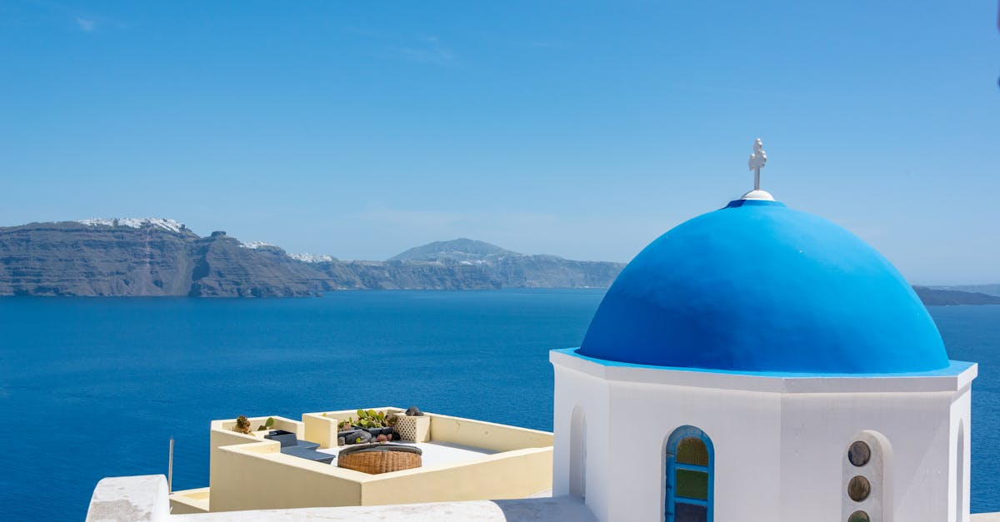

# Santorini, Greece

Country: Greece
Region: Europe

Santorini (*Thira*) is a Cycladic island in the southern Aegean, the remnant of one of history's largest volcanic eruptions (the Minoan eruption around 1600 BCE). The island's caldera, the cliff-top villages of Oia and Fira, the black-and-red volcanic beaches, and the prehistoric site of Akrotiri define one of the most-photographed places on Earth.

---

## 🧭 Step 1: Choices

### ✨ Why Visit

Santorini is the photographable Greek island. The caldera view from Oia or Fira at sunset is one of the planet's iconic urban-natural images. The volcanic geology is unique: the entire island is the rim of a flooded caldera. The Bronze Age site at Akrotiri is a Pompeii-like preservation of pre-eruption Minoan life. The local wines (Assyrtiko, Vinsanto) are world-class.

The island is also one of Europe's most pressure-tested destinations, with around two million visitors per year for fewer than 16,000 residents. Cruise ships flood Fira on peak days; Oia sunset is a crush. Visiting respectfully means choosing your timing very deliberately.

You come for the caldera, the Bronze Age, the wine, the geology, and you accept the trade-off of going to the most-photographed Greek island.

### 🌍 Ethical Compass

- **💰 Economy.** Eat at small tavernas in Megalochori, Pyrgos, Emporio, Mesaria, and Karterados rather than only the caldera-rim restaurants of Oia and Fira. Buy wine at small estate tastings (Domaine Sigalas, Argyros, Gavalas, Hatzidakis) rather than only the airport gift shops.
- **👥 Employment.** Tip 10 percent at restaurants. Use the **KTEL bus** network where you can; rental ATVs and cars are common but accidents are frequent.
- **📚 Education.** Read about the Minoan eruption and its possible role in the Bronze Age collapse and the Atlantis myth. The Museum of Prehistoric Thera in Fira and the Akrotiri excavation site are essential.
- **🌱 Ecology.** Santorini has severe water stress; brief showers, refill bottles. The Oia sunset crush has real ecological and human-comfort cost; consider Fira's *Skaros Rock* hike or other viewpoints. Choose donkey-free options at Fira's port (the working donkeys carrying tourists up the steps have animal-welfare concerns; the cable car is the alternative).

---

## 🎒 Step 2: Preparation

### 🔍 Governance Management

- **Schengen** rules apply; verify on official portals.
- **Akrotiri Archaeological Site** sells tickets at the gate; verify hours.
- **Wine tours** at estates require booking on official estate portals.
- **Ferries** from Athens (Piraeus, Rafina) take 5 to 8 hours by conventional or 4 to 5 hours by high-speed; verify on Aegean Ferries or Hellenic Seaways.
- **Cruise schedules:** verify the Santorini cruise-day schedule (specific days have dramatically more crowds in Fira).

### 📡 Information Curation

- **Kathimerini English edition** for Greek news.
- The official **Greek Tourism Organization** site for ferry status and events.
- A book on Santorini's archaeology: Christos Doumas' work on Akrotiri; or popular accounts of the Minoan eruption.
- A Santorini resident-led walking tour or wine guide.
- **Wikivoyage Santorini** for orientation.

### 🎯 Inference Interaction

- **You decide on the sunset.** Oia is the postcard; it is also a crush. Sunset from Imerovigli (the "Skaros Rock" walk) or from Pyrgos (the highest village) is calmer.
- **You decide on the donkey.** Walking up from Fira old port is steep but achievable; the cable car is the recommended alternative; the donkey rides involve animal-welfare concerns.
- **You decide on Akrotiri.** A serious 90-minute visit; one of the great archaeological sites of the eastern Mediterranean.
- **You decide on the wine experience.** Three to four wineries in a half-day with a driver is the right depth; one each at noon and after-sunset works if you walk.
- **You decide on caldera-edge vs inland.** Caldera-edge hotels are the postcard view at premium prices; inland villages are dramatically cheaper and offer a different stay.

### 🔄 Intelligence Cooperation

Santorini summers are hot and dry; the meltemi wind shapes the season; cruise-ship days double the daytime crowds. The island largely closes outside the May to October window.

Bring a soft plan. If meltemi wind cancels a sunset cruise, the sunset still happens from land. If Fira is mobbed on a cruise day, Megalochori, Pyrgos, and inland are calm. If a heat day fries the midday, sleep through it like locals do.

### 📍 Top 5 Anchor Spots

1. **Oia sunset** (with caveats about crowds) or **Imerovigli "Skaros Rock" sunset** (calmer alternative).
2. **Akrotiri Archaeological Site.** Bronze Age Pompeii; one of the great archaeological sites.
3. **Museum of Prehistoric Thera** in Fira. Pairs perfectly with Akrotiri; finest Bronze Age frescoes.
4. **A wine half-day** (Domaine Sigalas, Argyros, Hatzidakis are the references) with a designated driver.
5. **Pyrgos village.** The highest village; calm; sunset panorama from Kasteli; classic kafenia.

### 🧰 Practical Essentials

- **Recommended Length.** Two to three days for Santorini. Pair with Mykonos, Naxos, or Crete for a fuller Cycladic trip.
- **Getting There and Around.** Fly into **Santorini Thira Airport (JTR)** seasonally from many European cities, or fly to Athens and ferry from Piraeus or Rafina. On the island: **KTEL buses** (cheap but limited), **rental cars** (book in advance), **rental ATVs and scooters** (caution: accidents are common), **licensed taxis** (very limited supply).
- **Daily Cost (per person).**
  - **Budget:** roughly €100 to €180. Inland guesthouse in Karterados or Mesaria, taverna meals, KTEL bus, Akrotiri site.
  - **Mid-range:** roughly €220 to €450. Three-star hotel inland or modest caldera view, mixed dining including a wine half-day, all major sites.
  - **Higher-comfort:** roughly €700 and up (vastly more for caldera-edge cave suites). Mystique, Canaves Oia, Vedema, fine dining at Selene, private guided wine days, charter boats.
- **Booking Notes.**
  - **Schengen:** verify your nationality.
  - **High season (mid-June to early September):** book 6 to 12 months ahead.
  - **Cruise-day schedules:** check before peak Fira plans.
  - **Donkey alternative:** use the cable car or walk.
  - **Short-term rental registration:** verify the property number.

---

## ✈️ Step 3: Delivery

### 🤖 AI Prompt

Copy this into your own AI assistant, fill in the brackets, and treat the answer as a researcher's draft, not a final plan.

> Please help me plan an ethical visit to Santorini, Greece for [NUMBER] days in [MONTH]. I am travelling with [WHO] and my interests are [INTERESTS, e.g. Bronze Age archaeology, wine, sunsets, hiking, beaches]. My total budget is around [AMOUNT] and my comfort level is [budget / mid-range / higher-comfort].
>
> Please structure your answer in three steps.
>
> **Step 1: Choices.** Help me decide what to prioritise. Recommend the two or three Santorini experiences I should not miss given my interests, and one I should consider skipping (the worst of the Oia sunset crush, a donkey ride at Fira port, a caldera-edge restaurant at peak hour). Briefly explain each trade-off.
>
> **Step 2: Preparation.** Cover all four of the following:
> - **Governance Management.** What assumptions should I check before I book? Include Schengen, Akrotiri hours, wine-estate booking portals, ferry operators, and cruise-ship schedules for the daytime crowd.
> - **Information Curation.** Suggest at least four different source types: one official Greek source, one Kathimerini-level news outlet, one Santorini archaeology book, and one Santorini resident-led guide.
> - **Inference Interaction.** List the decisions I personally need to make (sunset spot, donkey ethics, caldera-edge vs inland, wine depth, ATV vs car safety).
> - **Intelligence Cooperation.** How should I trust my own judgment and local advice over algorithmic defaults when conditions change? Build me a soft plan with at least two alternates for likely disruptions (meltemi wind cancelling boats, a cruise-day Fira flood, heatwave, sold-out high-season ferry).
>
> **Step 3: Delivery.** Give me the actual itinerary, day by day, with realistic timings and named villages and sites. Include Akrotiri and a wine half-day. Mark each business as confidently locally owned, or flag for me to verify.
>
> Finally, please remind me at the end to verify your suggestions against:
> 1. Official sources: the Greek Tourism Organization, ferry operators (Aegean Ferries, Hellenic Seaways), and the official wine-estate portals.
> 2. Real people: a Santorini resident host, a wine guide, or hotel staff who live on the island now.
>
> Treat your output as a researcher's draft. I will make the final calls.

---

Part of **Gyro Governance Ethical Travel: AI-Empowered Guides for Humane Adventures**.

Explore more destinations, ethical domains, and AI prompts at [travel.gyrogovernance.com](https://travel.gyrogovernance.com/).
