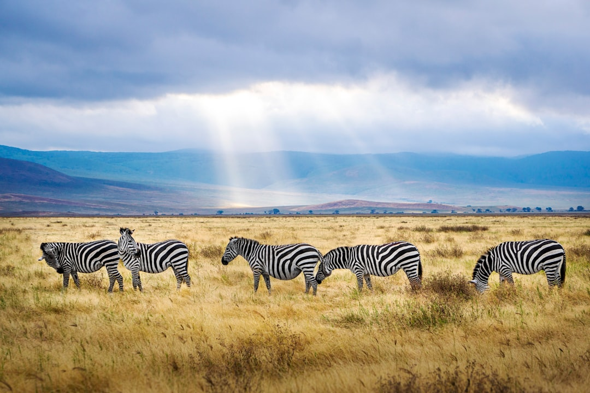

# Serengeti National Park, Tanzania

Country: Tanzania
Region: Africa

The Serengeti is Tanzania's flagship national park, a 15,000-square-kilometre savannah in the north of the country, continuous with Kenya's Maasai Mara. UNESCO World Heritage-listed, home to the largest annual mammal migration on Earth (around 1.5 million wildebeest, 250,000 zebra, and the predators that follow them), and one of the planet's most studied ecosystems.

---

## 🧭 Step 1: Choices

### ✨ Why Visit

The Serengeti is the headline event of African wildlife tourism. The **Great Migration** moves through the park year-round on a roughly predictable circuit, with the calving season (January-February in the southern Serengeti's short-grass plains) and the river crossings (July-October on the Mara River in the northern Serengeti) as the dramatic peaks. The Serengeti has the largest population of lions in Africa.

The park is also adjacent to two other world-class wildlife destinations: **Ngorongoro Crater** (a vast caldera with extraordinary wildlife density) and **Tarangire National Park** (elephant central in dry season). Together the "northern circuit" of Tanzania is the single richest concentrated wildlife trip on the planet.

You come for the migration, the predators, the savannah, the Maasai culture at the park's edges, and one of Earth's most complete remaining megafauna ecosystems.

### 🌍 Ethical Compass

- **💰 Economy.** Choose camps and lodges with **community-benefit links** (Asilia Africa, Nomad Tanzania, Wayo Africa, Singita's community programmes) over operators with no demonstrated benefit. Stay in tented camps inside or adjacent to the park rather than only outside-park lodges that require long daily drives.
- **👥 Employment.** Tip your guide, tracker, camp staff, and pilot generously. Standard guidance: USD 15-25 per day per guide; USD 5-10 per day for general staff (often pooled). Tanzanian wages are stretched.
- **📚 Education.** Read about Maasai pastoralist culture (the Serengeti's edges are Maasai land) and the contemporary land-rights debates around national-park boundaries. Read about the Great Migration biology (Anthony Sinclair's *Serengeti Story* is the academic reference). The Olduvai Gorge (now Oldupai) "cradle of humankind" sits between the Serengeti and Ngorongoro.
- **🌱 Ecology.** Stay in the vehicle on game drives (the park has strict rules). Do not crowd a sighting; let other vehicles in. Do not feed wildlife. The plastic-bag ban in Tanzania is enforced; do not bring any. Choose operators with proper waste-management protocols.

---

## 🎒 Step 2: Preparation

### 🔍 Governance Management

- Most travellers need a **visa** for Tanzania (on arrival or e-visa); verify on the official Tanzania Immigration portal. **Yellow fever** required if arriving from countries with risk.
- **Park entry and concession fees** for the Serengeti, Ngorongoro, and other parks are substantial and paid through your operator; verify current pricing on TANAPA (Tanzania National Parks) portal.
- **Migration timing** cannot be guaranteed; verify recent reports with your operator before committing to specific dates.
- **Fly-in vs drive-in:** small bush flights connect Arusha to Serengeti airstrips (Seronera, Kogatende, Kusini); driving is rough and long.
- For **hot-air balloon safari**, verify operator certification.

### 📡 Information Curation

- **Tanzania National Parks (TANAPA)** for park information.
- **Daily News** (Tanzanian English) and **The Citizen** for current news.
- A book on the Serengeti: Anthony Sinclair's *Serengeti Story*; the Grzimek family's classic *Serengeti Shall Not Die*; Maria Nilsson's photography.
- A Tanzanian-owned or accredited safari operator (Maramboi, Asilia, Nomad, Roho ya Selous, Wayo Africa).
- **Wikivoyage Serengeti** for cross-park logistics.

### 🎯 Inference Interaction

- **You decide on the safari style.** Tented camp (basic but real) versus luxury lodge (comfort but more removed) versus mobile camp (follows the migration). Each is a different trip.
- **You decide on migration timing.** Calving (January-February) in the south; river crossings (July-October) in the north. The "wrong" months still have spectacular resident wildlife.
- **You decide on the northern-circuit pace.** Serengeti + Ngorongoro + Tarangire in 7 to 10 days is the classic structure; doing all in 4 to 5 days is rushed.
- **You decide on the Olduvai Gorge add-on.** A short visit to the museum and excavation site between Ngorongoro and Serengeti gives the deep-time context.
- **You decide on Maasai engagement.** A registered Maasai village visit (not a roadside performance) is meaningful; insist on the proper introduction.

### 🔄 Intelligence Cooperation

Serengeti weather has two rainy seasons: the long rains (March-May, the park is greenest, fewer tourists, but tracks may be boggy) and short rains (October-December). Dry seasons (June-October, January-February) are easier visiting. Migration river crossings cannot be predicted on a daily basis.

Bring a soft plan. If a river-crossing day produces no crossing, other days deliver elsewhere. If long-rains tracks are boggy, your driver knows alternatives. If your fly-in is weather-cancelled, build a buffer day.

### 📍 Top 5 Anchor Spots (Zones and Sectors)

1. **Seronera (central Serengeti).** The heart of resident wildlife; year-round excellent.
2. **Southern short-grass plains (Ndutu area).** December to March; calving season; predator action.
3. **Western Corridor (Grumeti area).** Migration crossing the Grumeti River (May-June); excellent year-round.
4. **Northern Serengeti (Kogatende, Mara River area).** Migration river crossings July to October.
5. **Ngorongoro Crater.** Day visit from Serengeti or as a separate stop; vast caldera with extraordinary wildlife density.

### 🧰 Practical Essentials

- **Recommended Length.** **Five to ten days** in the northern circuit minimum. **Three to four days in the Serengeti specifically**; pair with Ngorongoro and Tarangire for the full picture.
- **Getting There and Around.** Fly into **Kilimanjaro International Airport (JRO)** or **Mount Kilimanjaro to Arusha (ARK)**, transfer to **Arusha**, then fly into Serengeti airstrips (45-minute bush flights) or drive (6 to 10 hours). Within the parks: 4x4 game drives.
- **Daily Cost (per person, fully inclusive).**
  - **Budget:** roughly USD 250 to 500. Public-camp accommodation, group safari, drive-in.
  - **Mid-range:** roughly USD 600 to 1,200. Tented camp inside the park, full board, two game drives per day, fly-in option.
  - **Higher-comfort:** roughly USD 1,800 and up (often substantially more). Singita, Sayari, Roho ya Selous, Asilia premium camps, full board, expert guides, walking safari and balloon options.
- **Booking Notes.**
  - **Visa:** verify on the Tanzania Immigration portal.
  - **Yellow fever:** verify whether required from your origin.
  - **Migration timing:** book 6 to 12 months ahead for the peak windows.
  - **Park fees:** substantial and paid through your operator.
  - **Plastic-bag ban:** strictly enforced.

---

## ✈️ Step 3: Delivery

### 🤖 AI Prompt

Copy this into your own AI assistant, fill in the brackets, and treat the answer as a researcher's draft, not a final plan.

> Please help me plan an ethical Tanzania northern-circuit safari (Serengeti, Ngorongoro, and possibly Tarangire) for [NUMBER] days in [MONTH]. I am travelling with [WHO] and my interests are [INTERESTS, e.g. Great Migration, big cats, balloon safari, Maasai culture, Olduvai Gorge, photography]. My total budget is around [AMOUNT] and my comfort level is [budget / mid-range / higher-comfort].
>
> Please structure your answer in three steps.
>
> **Step 1: Choices.** Help me decide what to prioritise. Recommend the best combination of Serengeti zones (Seronera, Ndutu, western corridor, northern Serengeti), Ngorongoro, and Tarangire given my dates and migration position. Identify one I should consider skipping (a too-rushed 4-day northern circuit, an unaccredited budget operator, a balloon if my budget is tight). Briefly explain each trade-off.
>
> **Step 2: Preparation.** Cover all four of the following:
> - **Governance Management.** What assumptions should I check before I book? Include Tanzania Immigration visa, yellow-fever, TANAPA park fees, current migration position (operator-verified), and Tanzanian-accredited safari operators.
> - **Information Curation.** Suggest at least four different source types: TANAPA, Tanzanian news, an Anthony Sinclair or Grzimek book, and a Tanzanian or community-benefit-aligned safari operator.
> - **Inference Interaction.** List the decisions I personally need to make (safari style, migration position, northern-circuit pace, Olduvai add-on, Maasai engagement).
> - **Intelligence Cooperation.** How should I trust my own judgment and local advice over algorithmic defaults when conditions change? Build me a soft plan with at least two alternates for likely disruptions (no river crossings on my dates, boggy tracks in rains, a fly-in weather cancellation, a sighting jam).
>
> **Step 3: Delivery.** Give me the actual itinerary, day by day, with realistic timings, named camps or lodges, and named game zones. Include the right migration zone for my dates and at least one community-benefit-aligned camp. Mark each as confidently certified, or flag for me to verify.
>
> Finally, please remind me at the end to verify your suggestions against:
> 1. Official sources: TANAPA, the Tanzania Immigration portal, the specific camp's official portal.
> 2. Real people: a Tanzanian guide, a camp manager, or a recent Serengeti visitor.
>
> Treat your output as a researcher's draft. I will make the final calls.

---

Part of **Gyro Governance Ethical Travel: AI-Empowered Guides for Human Adventures**.

Explore more destinations, ethical domains, and AI prompts at [travel.gyrogovernance.com](https://travel.gyrogovernance.com/).
