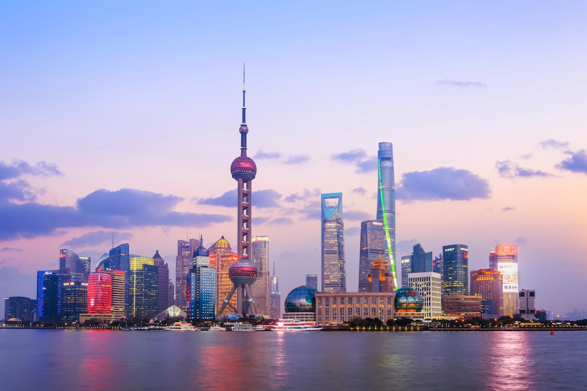

# Shanghai, China

Country: China
Region: Asia

Shanghai is China's largest city, a 25-million-person Yangtze-delta megacity that is the country's commercial and financial capital. The Bund's colonial waterfront, Pudong's twenty-first-century skyline across the Huangpu River, the French Concession's tree-lined streets, and one of the world's most ambitious working cities.

---

## 🧭 Step 1: Choices

### ✨ Why Visit

Shanghai is the working future of urban China. The Bund (Waitan) faces Pudong's Shanghai Tower, Jin Mao, and Shanghai World Financial Center; cross by ferry, Metro, or the underground sightseeing tunnel and see them up close. The French Concession holds the most pleasant inner-city walking. The Yu Garden and Old Town give a glimpse of pre-modern Shanghai.

The city is also where modern China is most legibly itself in commercial form. The food (Shanghainese cuisine, Hu cuisine; xiaolongbao soup dumplings invented here), the contemporary art (M50, West Bund Art Center), the design, and the night life (Found 158, Sinan Mansions) are at the forefront of contemporary Chinese culture.

You come for the skyline, the food, the French Concession walks, the modern art, and a city that is the most visible face of contemporary urban China.

### 🌍 Ethical Compass

- **💰 Economy.** Eat at small Shanghainese restaurants in the French Concession, Tianzifang's back streets, Xintiandi periphery, and Jing'an side streets rather than the most touristy hotel restaurants. Buy at Yuyuan Bazaar with awareness of haggle prices.
- **👥 Employment.** Tipping is not customary in China. Use the **Shanghai Metro** (one of the world's largest and best); tap **WeChat Pay or Alipay** linked to a foreign card. Use **DiDi** ride-hail.
- **📚 Education.** Read about Shanghai's twentieth century: the Treaty Port era, the Republican period, the Japanese occupation, the Cultural Revolution, the post-Deng reopening (Pudong was farmland in 1990). The Shanghai History Museum and the Shanghai Museum are essential.
- **🌱 Ecology.** Air quality varies; check the daily AQI. Walk and use Metro. The Huangpu River parks (Lujiazui, the West Bund) are real green relief.

---

## 🎒 Step 2: Preparation

### 🔍 Governance Management

- **Visa or transit-visa-free** status varies frequently; verify your nationality's current rules on the Chinese embassy portal before booking. Transit-visa-free is available for many nationalities for short Shanghai stays.
- **WeChat Pay or Alipay** linked to a foreign card is now possible and effectively required for everyday spending; set up before arrival.
- **Shanghai Metro** (20+ lines) uses single tickets, transport cards, or QR codes via Metro Daduhui app; verify on the official Shanghai Metro portal.
- **Major museums and observation decks** (Shanghai Museum, Shanghai Tower, World Financial Center, Jin Mao) sell tickets on official portals.
- **VPN:** most Western apps and sites are blocked; set up before arrival.

### 📡 Information Curation

- **Shanghai Daily** (English Chinese paper) and **SHINE** for current news; **South China Morning Post** for outside-China perspective.
- The official **Meet Shanghai** site for events.
- A Shanghai-set book: Wang Anyi's *Song of Everlasting Sorrow*; Eileen Chang's stories; Mian Mian for contemporary.
- A licensed Shanghai walking guide for the French Concession or Old Town.
- **Wikivoyage Shanghai** for orientation.

### 🎯 Inference Interaction

- **You decide on the skyline view.** Shanghai Tower's observation deck is the tallest in the world; Jin Mao is the second; the rooftop bars across Lujiazui give the framed view of Tower itself.
- **You decide on the French Concession depth.** Walking Anfu Lu, Wukang Lu, Yongkang Lu, and Donghu Lu is the most pleasant urban walking in China.
- **You decide on day-trips.** Suzhou (30 minutes by high-speed rail) for the gardens; Hangzhou (1 hour) for West Lake; Zhujiajiao for a water-town day.
- **You decide on the VPN.** If you need WhatsApp, Google, Instagram, or Western news, set up a VPN before arrival.
- **You decide your political conversation register.** China has clear limits on what foreigners can discuss publicly. Listen first.

### 🔄 Intelligence Cooperation

Shanghai weather is humid-subtropical; hot summer, cold-damp winter, beautiful spring and autumn. Typhoons occasionally affect the city late summer. Air quality varies.

Bring a soft plan. If a typhoon disrupts outdoor plans, the Shanghai Museum, the Power Station of Art, and the Yu Garden's covered sections absorb a wet day. If air quality is red, indoor plans. If a state visit closes Lujiazui or the Bund, the French Concession is unaffected.

### 📍 Top 5 Anchor Spots

1. **The Bund + a Huangpu River ferry crossing to Pudong + Shanghai Tower observation deck.** Sunrise or sunset both work.
2. **French Concession walking afternoon.** Wukang Mansion, Anfu Lu, Tianzifang, and Xintiandi.
3. **Shanghai Museum (People's Square).** The Chinese antiquities collection is one of the world's best. Free entry; verify hours.
4. **Yu Garden + Old Town.** Half-day walk through the surviving traditional Chinese garden and surrounding old streets.
5. **M50 contemporary art district or the West Bund museum cluster.** Pick one for a contemporary-art half-day.

### 🧰 Practical Essentials

- **Recommended Length.** Three to four days for Shanghai. Add a day for Suzhou, Hangzhou, or Zhujiajiao.
- **Transport.** Walk in the French Concession and Old Town. **Shanghai Metro** is enormous and excellent; tap a card or use the Metro Daduhui app. **DiDi** for ride-hail. **Shanghai Maglev** from Pudong Airport (PVG) to Longyang Road; **Hongqiao Airport (SHA)** is connected by Metro. **CRH high-speed rail** to Suzhou, Hangzhou, Beijing.
- **Daily Cost (per person).**
  - **Budget:** roughly CNY 300 to 600 (about USD 40 to 85). Hostel or budget hotel, street food and noodles, Metro, two ticketed sites.
  - **Mid-range:** roughly CNY 800 to 1,800 (about USD 110 to 250). Three- or four-star hotel, mixed dining including xiaolongbao at Din Tai Fung or Jia Jia Tang Bao, all major sites, observation deck.
  - **Higher-comfort:** roughly CNY 3,000 and up. Fairmont Peace Hotel, Capella Shanghai, Aman Yangun on Bund, fine dining at Ultraviolet, Fu He Hui, or Mr & Mrs Bund, private guides, helicopter flights.
- **Booking Notes.**
  - **Visa or transit-visa-free:** verify on the Chinese embassy portal.
  - **Payments:** set up WeChat Pay or Alipay with foreign card before arrival.
  - **VPN:** set up before arrival.
  - **Major holidays** (Chinese New Year, National Day Golden Week) reshape the city.
  - **Air quality:** verify daily, especially in winter.

---

## ✈️ Step 3: Delivery

### 🤖 AI Prompt

Copy this into your own AI assistant, fill in the brackets, and treat the answer as a researcher's draft, not a final plan.

> Please help me plan an ethical visit to Shanghai, China for [NUMBER] days in [MONTH]. I am travelling with [WHO] and my interests are [INTERESTS, e.g. the skyline, French Concession, modern art, food, day trips to Suzhou or Hangzhou]. My total budget is around [AMOUNT] and my comfort level is [budget / mid-range / higher-comfort].
>
> Please structure your answer in three steps.
>
> **Step 1: Choices.** Help me decide what to prioritise. Recommend the two or three Shanghai experiences I should not miss given my interests, and one I should consider skipping (a Yuyuan Bazaar overpaid souvenir, a tourist-river-cruise when the Metro and ferry do it better, midday observation deck). Briefly explain each trade-off.
>
> **Step 2: Preparation.** Cover all four of the following:
> - **Governance Management.** What assumptions should I check before I book? Include current visa or transit-visa-free rules, WeChat Pay/Alipay foreign-card setup, VPN preparation, Shanghai Museum hours, and air-quality forecasts.
> - **Information Curation.** Suggest at least four different source types: one official Chinese source, one Shanghai-based English news outlet, one Shanghai author, and one Shanghai-based walking or food guide.
> - **Inference Interaction.** List the decisions I personally need to make (skyline view spot, French Concession depth, day-trip choice, VPN, political conversation comfort).
> - **Intelligence Cooperation.** How should I trust my own judgment and local advice over algorithmic defaults when conditions change? Build me a soft plan with at least two alternates for likely disruptions (a typhoon, air-quality red day, a state event closure, sold-out top restaurant).
>
> **Step 3: Delivery.** Give me the actual itinerary, day by day, with realistic timings, Metro lines, and named neighbourhoods. Include the Bund-and-Pudong crossing and one French Concession afternoon. Mark each business as confidently locally owned, or flag for me to verify.
>
> Finally, please remind me at the end to verify your suggestions against:
> 1. Official sources: Meet Shanghai, the Shanghai Museum portal, the Chinese embassy visa page, and CRH for trains.
> 2. Real people: a Shanghai resident, a licensed Shanghai guide, or hotel staff who live in Shanghai now.
>
> Treat your output as a researcher's draft. I will make the final calls.

---

Part of **Gyro Governance Ethical Travel: AI-Empowered Guides for Humane Adventures**.

Explore more destinations, ethical domains, and AI prompts at [travel.gyrogovernance.com](https://travel.gyrogovernance.com/).
