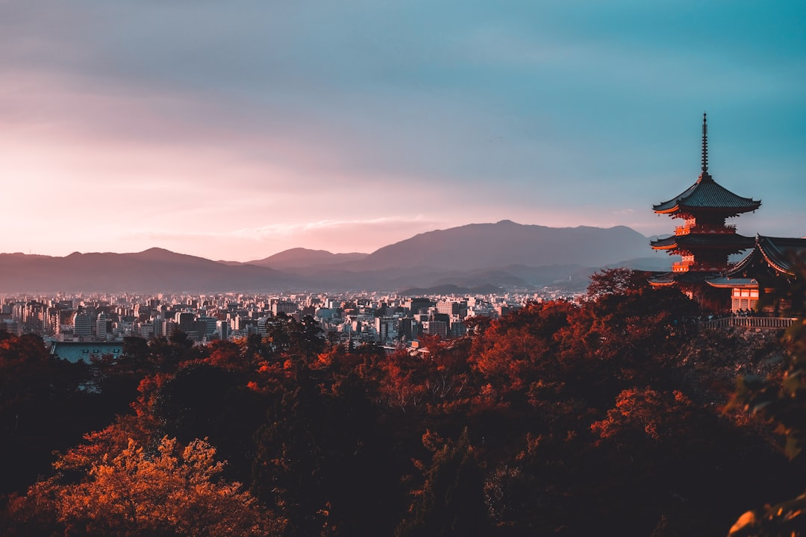

# Tokyo, Japan

Country: Japan
Region: Asia

Tokyo is the Japanese capital, a 14-million-person city centre with 37 million in the wider metropolitan area, the largest urban agglomeration in the world. Edo-era shogunate seat, imperial capital, twenty-first-century neon city, and one of the most rewarding cities on Earth to walk slowly through, neighbourhood by neighbourhood.

---

## 🧭 Step 1: Choices

### ✨ Why Visit

Tokyo concentrates more first-class neighbourhood-distinct urban experiences into one city than almost anywhere. Shibuya's scramble crossing; Shinjuku's nightlife; Asakusa's Senso-ji and old-Tokyo atmosphere; Ueno's museums; Akihabara's electronics; Harajuku's youth fashion; Roppongi's contemporary art; Yanaka's preserved low-town; Tsukiji's outer market. Each is a separate small city worth a half day.

The city is also the food capital of the world by most measures (more Michelin-starred restaurants than anywhere else), the safest large city on Earth, and the most efficient public-transport system ever built.

You come for the food, the neighbourhoods, the design, the contemporary art, the quirks (from cat cafés to Studio Ghibli to Tokyo DisneySea), and a city that rewards slow walking endlessly.

### 🌍 Ethical Compass

- **💰 Economy.** Eat at small restaurants (*izakaya*, *kissaten* cafés, ramen counters, sushi by the piece) in residential neighbourhoods (Shimokitazawa, Yanaka, Koenji, Kichijoji) rather than only the most touristy spots. Hawker culture is at lunch food halls and *yokocho* (alleys); the working ones are excellent.
- **👥 Employment.** Tipping is not customary in Japan. Tap a Suica or Pasmo IC card on all transport.
- **📚 Education.** Read about Edo-era Japan, the Meiji Restoration, WWII (the Tokyo firebombing destroyed half the city in 1945), and the contemporary Japan. The Edo-Tokyo Museum (currently under reconstruction; verify), the Tokyo National Museum in Ueno, and the Sumida Hokusai Museum cover different layers.
- **🌱 Ecology.** Walk and use Metro. Refill water; tap is excellent. Avoid driving in central Tokyo; parking is punitive. Choose shoulder seasons (March-April for cherry blossom, October-November for autumn foliage; both are crowded; April-early May or November are the gentlest if you can avoid blossom and foliage peak).

---

## 🎒 Step 2: Preparation

### 🔍 Governance Management

- Most visitors are **visa-exempt for short stays**; verify on the official Ministry of Foreign Affairs portal.
- **Tokyo Metro and Toei Subway** plus JR Yamanote Line cover everywhere; **Suica or Pasmo** IC card for tap; rechargeable at any station; contactless on most major lines.
- **Studio Ghibli Museum, teamLab Planets and Borderless** sell timed tickets months ahead on official portals.
- **Tsukiji Outer Market** is open daily; the inner market has moved to Toyosu (sushi auctions and breakfast restaurants).
- **JR Pass** has been substantially restructured; verify whether it still suits your overall Japan itinerary at current pricing.

### 📡 Information Curation

- **The Japan Times** and **Time Out Tokyo** for current Tokyo news and openings.
- **Go Tokyo** (the official city tourism site) for events.
- A Japanese author: Haruki Murakami (Tokyo-based novels); Banana Yoshimoto; Mieko Kawakami; Junichiro Tanizaki for older classics.
- A locally led Tokyo food walking tour (Tokyo Food Tour, Arigato Travel) or a neighbourhood walk in Yanaka or Shimokitazawa.
- **Wikivoyage Tokyo** for ward orientation.

### 🎯 Inference Interaction

- **You decide on the neighbourhood depth.** A trip that only sees Shibuya, Shinjuku, and Asakusa misses 80 percent of Tokyo. Add Yanaka, Shimokitazawa, Koenji, Kichijoji, or Daikanyama.
- **You decide on Studio Ghibli.** Tickets sell out a month in advance and can only be bought in specific windows; verify on the official portal.
- **You decide on the day trips.** Kamakura (1 hour), Nikko (2 hours), Hakone (1.5 hours), Mount Fuji area, Tokyo DisneySea each give a different day.
- **You decide on the etiquette commitment.** Learning a few Japanese phrases, removing shoes when expected, being quiet on trains, and keeping things tidy is the default.
- **You decide on a sushi commitment.** Real sushi-bar experience at Sushi Yoshitake or similar (book months ahead) is a different planet from chain sushi.

### 🔄 Intelligence Cooperation

Tokyo weather is four-season; humid hot summer, cool wet autumn (typhoons in September), cold dry winter, warm spring. Major events (cherry blossom, Golden Week early May, Obon in August, Christmas illumination, New Year shrine visits) reshape parts of the city.

Bring a soft plan. If a typhoon shuts trains briefly, the city handles it; museums and food halls absorb a wet day. If a cherry blossom morning is rained out, the petals are still spectacular and the next day clears.

### 📍 Top 5 Anchor Spots

1. **A neighbourhood walking day: Yanaka + Nezu + Ueno.** Old-Tokyo low-town atmosphere, the Tokyo National Museum, sushi or yakitori dinner.
2. **Shibuya + Shinjuku evening.** The scramble crossing; the Shinjuku ward's golden-gai alleys and Robot Restaurant context.
3. **Asakusa: Senso-ji at sunrise + Tsukiji Outer Market for breakfast.** Free and uncrowded if before 7 am.
4. **Tokyo National Museum + Ueno Park.** Major Japanese antiquities collection plus the park.
5. **A day-trip: Kamakura or Hakone.** Pick one.

### 🧰 Practical Essentials

- **Recommended Length.** Four to seven days for Tokyo. Add days for Kyoto-Osaka via Shinkansen, or Hakone or Nikko as day-trips.
- **Transport.** Walk in each neighbourhood. **Tokyo Metro + Toei Subway + JR Yamanote Line + private railways** cover everywhere; **Suica or Pasmo** card. **Shinkansen** to Kyoto (2 hours 15 minutes). Narita (NRT) and Haneda (HND) airports; Haneda is closer.
- **Daily Cost (per person).**
  - **Budget:** roughly JPY 7,000 to 14,000 (about USD 45 to 90). Hostel or capsule, ramen and conbini meals, IC card, two ticketed sites.
  - **Mid-range:** roughly JPY 18,000 to 35,000 (about USD 115 to 230). Three-star hotel, mixed dining including a serious sushi or kaiseki dinner, all major sites, a day-trip.
  - **Higher-comfort:** roughly JPY 70,000 and up. Aman Tokyo, Mandarin Oriental, Park Hyatt, fine dining at Narisawa, Sushi Saito, Den, Florilège, private guides.
- **Booking Notes.**
  - **Visa-exempt:** verify your nationality.
  - **Studio Ghibli Museum:** advance tickets months ahead.
  - **Cherry blossom and autumn foliage:** book accommodation 6-12 months ahead.
  - **Golden Week (late April to early May):** the city is busy; many small businesses closed.
  - **JR Pass:** verify whether the current pricing makes sense for your itinerary.

---

## ✈️ Step 3: Delivery

### 🤖 AI Prompt

Copy this into your own AI assistant, fill in the brackets, and treat the answer as a researcher's draft, not a final plan.

> Please help me plan an ethical visit to Tokyo, Japan for [NUMBER] days in [MONTH]. I am travelling with [WHO] and my interests are [INTERESTS, e.g. food, neighbourhoods, contemporary art, anime/Ghibli, day-trips, traditional culture]. My total budget is around [AMOUNT] and my comfort level is [budget / mid-range / higher-comfort].
>
> Please structure your answer in three steps.
>
> **Step 1: Choices.** Help me decide what to prioritise. Recommend the two or three Tokyo experiences I should not miss given my interests, and one I should consider skipping (a Shibuya-only itinerary, a chain sushi when a real sushi-bar is steps better, an over-marketed tourist attraction). Briefly explain each trade-off.
>
> **Step 2: Preparation.** Cover all four of the following:
> - **Governance Management.** What assumptions should I check before I book? Include the Japanese visa-exempt status, Suica or Pasmo IC card, Studio Ghibli and teamLab advance tickets, JR Pass cost-benefit, and Golden Week / cherry blossom dates.
> - **Information Curation.** Suggest at least four different source types: one official Tokyo source, one Tokyo English news outlet (Japan Times or Time Out), one Japanese author, and one Tokyo-based food or neighbourhood guide.
> - **Inference Interaction.** List the decisions I personally need to make (neighbourhood depth, Studio Ghibli commitment, day-trip choice, etiquette, sushi-bar investment).
> - **Intelligence Cooperation.** How should I trust my own judgment and local advice over algorithmic defaults when conditions change? Build me a soft plan with at least two alternates for likely disruptions (typhoon, sold-out Studio Ghibli, cherry blossom rain, Golden Week closures).
>
> **Step 3: Delivery.** Give me the actual itinerary, day by day, with realistic timings, Metro lines, and named neighbourhoods. Include at least one neighbourhood beyond Shibuya/Shinjuku/Asakusa (Yanaka, Shimokitazawa, Koenji, Kichijoji, or Daikanyama). Mark each business as confidently locally owned, or flag for me to verify.
>
> Finally, please remind me at the end to verify your suggestions against:
> 1. Official sources: Go Tokyo, the Studio Ghibli portal, the Ministry of Foreign Affairs, and JR for the Shinkansen.
> 2. Real people: a Tokyo resident, a Tokyo guide, or hotel staff who live in Tokyo now.
>
> Treat your output as a researcher's draft. I will make the final calls.

---

Part of **Gyro Governance Ethical Travel: AI-Empowered Guides for Humane Adventures**.

Explore more destinations, ethical domains, and AI prompts at [travel.gyrogovernance.com](https://travel.gyrogovernance.com/).
