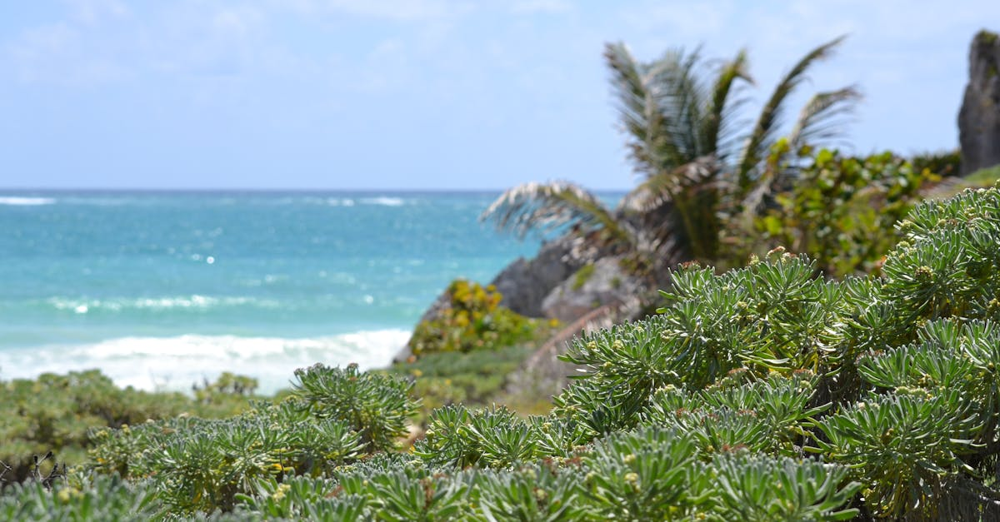

# Tulum, Mexico

Country: Mexico
Region: Americas

Tulum is a Caribbean coastal town and archaeological site on Mexico's Yucatán Peninsula. The Maya walled city of Tulum, built on a cliff above the Caribbean, is one of the most photographed archaeological sites in the world. The beach town has transformed in two decades from a quiet backpacker enclave into one of Mexico's most expensive (and most contested) beach destinations.

---

## 🧭 Step 1: Choices

### ✨ Why Visit

Tulum offers the Maya walled-city archaeological site at sunrise, the Sian Ka'an Biosphere Reserve to the south, some of the world's most accessible cenote diving and snorkelling, and beaches that justify the photography. Yoga retreats, eco-lodges, and a serious if expensive food and design scene have grown around the original town.

The town is also one of the clearest case studies in fast over-development. Hotel-zone construction has outpaced infrastructure; freshwater and waste are real problems; some establishments operate without proper permits and on questionable land tenure. Visiting respectfully requires more attention than most beach destinations.

You come for the Maya ruins, the cenotes, Sian Ka'an, and the beach, with eyes open to the contested rapid change.

### 🌍 Ethical Compass

- **💰 Economy.** Stay in town (Tulum Pueblo) rather than only the most expensive beach-road hotels if budget matters; the beach road has serious infrastructure and ethical questions about land tenure. Eat at small Mexican restaurants in town (Antojitos La Chiapaneca, Burrito Amor, Loncheria Don Pinto) rather than only the international design-restaurant beach scene.
- **👥 Employment.** Tip 10 to 15 percent at restaurants in cash; tip housekeeping, beach attendants, taxi drivers. The Mexican workforce in Tulum often commutes from elsewhere and depends on tipping.
- **📚 Education.** Read about the Maya, the Caste War of Yucatán, and the recent contested development of the Tulum coast. The Maya are not gone; six million Maya live in the region. Visit Tulum and Cobá archaeological sites with INAH-certified guides.
- **🌱 Ecology.** **Reef-safe sunscreen** is legally required at cenotes and parks; verify the label (no oxybenzone, no octinoxate). The Mesoamerican Reef offshore is fragile. Cenotes are sacred to the Maya; respect the rules. Sargassum on east-facing beaches (mostly April-August) varies by year.

---

## 🎒 Step 2: Preparation

### 🔍 Governance Management

- Most visitors get an **FMM tourist card** automatically with their flight or on arrival; verify on the INM portal.
- **VisiTax (Quintana Roo state tourist tax)** required for most international visitors; pay on the official VisiTax portal before departure.
- **Tulum archaeological site** entry at the gate; verify hours on the INAH portal; **Cobá** (45 minutes inland) is the other major nearby Maya site.
- **Sian Ka'an Biosphere Reserve** tours through licensed Community Tours Sian Ka'an or Ecocolors; verify on official tour portals.
- For **cenote visits**, use entry through the official ejido (community) operators rather than freelancers; the Maya communities that own the cenotes deserve the entry fee.

### 📡 Information Curation

- **Mexico News Daily** and **The Yucatan Times** for current local rules.
- **Visit Mexico** and **Quintana Roo state tourism** official portals.
- A book or documentary on the Maya: Michael D. Coe's *The Maya*; recent journalism on Tulum's contested development.
- A locally led Tulum or Cobá tour with an INAH-certified Maya guide or a Community Tours Sian Ka'an guide.
- **Wikivoyage Tulum** for orientation.

### 🎯 Inference Interaction

- **You decide on town vs beach road.** Town (Tulum Pueblo) is cheaper, more local, more rooted; beach road is luxurious but controversial. Both are valid; choose deliberately.
- **You decide on Tulum vs Cobá.** Tulum ruins are smaller, on a cliff, and crowded at midday; Cobá is larger, inland, with a pyramid you used to be able to climb (restrictions vary).
- **You decide on Sian Ka'an.** A full day with Community Tours Sian Ka'an or similar; mangroves, dolphins, ancient Maya canals; one of the best Mexican-coast experiences.
- **You decide on the cenote.** A guided ejido cenote visit pays the Maya community; a solo cenote stop at a roadside pay-as-you-enter is also fine if the ejido runs it.
- **You decide on whether to engage the contested development conversation.** Tulum's coast is under real pressure; reading recent journalism before booking is wise.

### 🔄 Intelligence Cooperation

Tulum weather is tropical; hurricane season June-November; dry season December-April is the peak tourist window. Sargassum on east-facing beaches mostly April-August; verify before booking specific dates.

Bring a soft plan. If sargassum closes the beach, Sian Ka'an's western side, cenotes, and Cobá are unaffected. If a hurricane warning approaches, build flexibility. If a midday Tulum-ruins visit is too hot, sunrise is the alternative.

### 📍 Top 5 Anchor Spots

1. **Tulum archaeological site at sunrise (or at opening).** Arrive at 8 am to walk the walled city before the day-trip buses.
2. **Cobá archaeological site.** 45 minutes inland; larger, less crowded; verify whether the Nohoch Mul pyramid is climbable.
3. **A cenote day at Gran Cenote, Cenote Dos Ojos, or Cenote Calavera.** Reef-safe sunscreen; ejido entry.
4. **Sian Ka'an Biosphere Reserve full-day tour** with Community Tours Sian Ka'an or similar.
5. **A Tulum Pueblo evening meal.** Antojitos La Chiapaneca; small Mexican places in town.

### 🧰 Practical Essentials

- **Recommended Length.** Three to five days for Tulum. Pair with Cancún and Playa del Carmen for a longer Riviera Maya trip.
- **Getting There and Around.** Fly into **Cancún International Airport (CUN)** and transfer 2 hours south by **ADO bus** or shuttle. The new **Tulum airport (TQO)** has opened with limited service; verify. **Renting a car** gives flexibility for cenotes and Cobá. In town and the beach road: bicycle or taxi.
- **Daily Cost (per person).**
  - **Budget:** roughly USD 60 to 130. Town guesthouse or hostel, local restaurants, bicycle or bus, Tulum ruins and one cenote.
  - **Mid-range:** roughly USD 180 to 380. Three- or four-star eco-cabana, mixed dining, all major sites, Sian Ka'an day, INAH-certified guide.
  - **Higher-comfort:** roughly USD 500 and up. Azulik, Be Tulum, Habitas Tulum, fine dining at Hartwood, Arca, or Kitchen Table, private guides, charter snorkel days.
- **Booking Notes.**
  - **FMM card:** automatic on most flights.
  - **VisiTax:** pay on the official portal before departure.
  - **Sargassum:** verify recent reports before booking specific east-coast dates.
  - **Hurricane season** (June-November): travel insurance covering weather is wise.
  - **Tulum airport (TQO):** verify current flights versus driving from Cancún.

---

## ✈️ Step 3: Delivery

### 🤖 AI Prompt

Copy this into your own AI assistant, fill in the brackets, and treat the answer as a researcher's draft, not a final plan.

> Please help me plan an ethical visit to Tulum, Mexico for [NUMBER] days in [MONTH]. I am travelling with [WHO] and my interests are [INTERESTS, e.g. Maya ruins, cenotes, Sian Ka'an wildlife, beach, food]. My total budget is around [AMOUNT] and my comfort level is [budget / mid-range / higher-comfort].
>
> Please structure your answer in three steps.
>
> **Step 1: Choices.** Help me decide what to prioritise. Recommend the two or three Tulum experiences I should not miss given my interests, and one I should consider skipping (a beach-road luxury hotel with infrastructure questions, a midday Tulum-ruins visit, a Cobá day without proper hydration). Briefly explain each trade-off.
>
> **Step 2: Preparation.** Cover all four of the following:
> - **Governance Management.** What assumptions should I check before I book? Include the FMM card and VisiTax, INAH-certified guides for Maya sites, Community Tours Sian Ka'an or similar for the biosphere reserve, ejido cenote entry, and the current status of the Tulum airport.
> - **Information Curation.** Suggest at least four different source types: one official Mexican source, one English-language Mexican news outlet, one Maya-focused book, and one Community Tours Sian Ka'an or INAH-certified guide.
> - **Inference Interaction.** List the decisions I personally need to make (town vs beach road, Tulum vs Cobá vs both, Sian Ka'an commitment, cenote ethics, contested-development engagement).
> - **Intelligence Cooperation.** How should I trust my own judgment and local advice over algorithmic defaults when conditions change? Build me a soft plan with at least two alternates for likely disruptions (sargassum bloom, rainy-season storm, hurricane warning, a midday heat day).
>
> **Step 3: Delivery.** Give me the actual itinerary, day by day, with realistic timings and named sites and operators. Include the Tulum ruins at sunrise, one cenote day, and one Sian Ka'an day. Mark each business as confidently locally owned and ethically run, or flag for me to verify.
>
> Finally, please remind me at the end to verify your suggestions against:
> 1. Official sources: VisiTax, INAH for Maya sites, the Sian Ka'an reserve official portal, and a recent sargassum bulletin.
> 2. Real people: a local resident, an INAH-certified Maya guide, or hotel staff who live in Tulum now.
>
> Treat your output as a researcher's draft. I will make the final calls.

---

Part of **Gyro Governance Ethical Travel: AI-Empowered Guides for Humane Adventures**.

Explore more destinations, ethical domains, and AI prompts at [travel.gyrogovernance.com](https://travel.gyrogovernance.com/).
