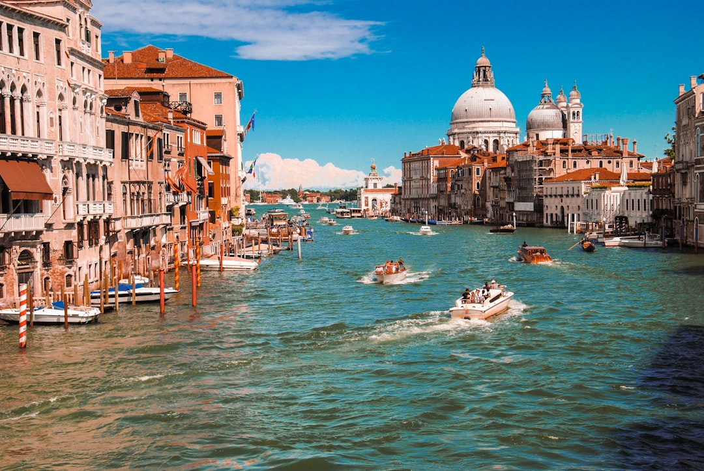

# Venice, Italy

Country: Italy
Region: Europe

Venice (*Venezia*) is the historic centre of the Republic of Venice, a city of around 50,000 residents built across 118 islands in a Venetian Lagoon at the head of the Adriatic Sea. UNESCO World Heritage-listed in its entirety, currently visited by around 20 million people per year, and the most-cited example of overtourism on the planet.

---

## 🧭 Step 1: Choices

### ✨ Why Visit

Venice is the city most globally photographed for the right reasons: a thousand years of working maritime-republic architecture, the Doge's Palace, St Mark's Basilica with its Byzantine mosaics, the Grand Canal as the world's most beautiful main street, Tintoretto and Veronese in the *scuole* and churches, and the wider Lagoon (Murano, Burano, Torcello, the cemetery island of San Michele).

The city is also a serious working case study in overtourism. Day-tripper crowds, cruise-ship arrivals, short-term-rental displacement of Venetian residents, and rising sea levels are all converging. A new **Venice Access Fee** has been introduced for day-tripper visitors on peak days. Visiting respectfully means staying overnight, going beyond St Mark's Square, and engaging the realities the postcard hides.

You come for the city itself, the art, the Lagoon, and as a serious engagement with what tourism does to a place.

### 🌍 Ethical Compass

- **💰 Economy.** Eat at *bacari* (small Venetian wine bars with *cicchetti* small plates) in Cannaregio, San Polo, and Castello rather than restaurants on the Piazza San Marco. **Staying overnight** rather than day-tripping is the single most impactful ethical choice; it puts money in Venetian hotels and restaurants and reduces the day-tripper pressure.
- **👥 Employment.** Tip a euro or two at restaurants. Use the **vaporetto** (water bus) for transport; the gondola is a tourist experience, the *traghetto* (gondola ferry across the Canal) is the local-priced cousin.
- **📚 Education.** Read about the Republic of Venice (the maritime republic, the Doge system, the trade with the Levant, the decline), modern Venetian politics (the *moto ondoso* wash damage, the cruise-ship ban from St Mark's, the MOSE flood-barrier system, the Venice Access Fee). Visit the Doge's Palace, the Accademia, and the Punta della Dogana.
- **🌱 Ecology.** Walk; Venice has no cars by design. Use vaporetti, not water taxis. Refill water from public fountains (*nasoni*); the water is excellent. **Acqua alta** (high water) days are real; check forecasts.

---

## 🎒 Step 2: Preparation

### 🔍 Governance Management

- **Schengen** rules apply; verify on official portals.
- **Venice Access Fee** for day-trippers applies on peak days; verify current rules and exemptions (overnight guests are exempt) on the official Venice city portal.
- **St Mark's Basilica + Doge's Palace + Accademia + Peggy Guggenheim** sell timed tickets on official portals; book ahead in any season.
- **Vaporetto** (ACTV) sells single tickets, daily passes, or multi-day passes; verify on the official ACTV portal.
- **Short-term rentals** in Venice are regulated; verify the CIR registration on any listing.

### 📡 Information Curation

- **La Nuova Venezia** and **Corriere del Veneto** (Italian) for local Venice news.
- **The Local Italy** for English.
- **Visit Venezia** (the official city tourism site) for events and current rules.
- A book on Venice: John Berendt's *The City of Falling Angels*; Donna Leon's Commissario Brunetti detective series (set in Venice); Tiziano Scarpa's *Venice Is a Fish*.
- A locally led Venice walking tour with a Venetian guide.
- **Wikivoyage Venice** for *sestiere* (district) orientation.

### 🎯 Inference Interaction

- **You decide to stay overnight.** Overnight visitors do not pay the Access Fee, support overnight businesses, and experience the city after the day-trippers leave. Day-tripping is the largest single contribution to Venice's problems.
- **You decide on St Mark's pace.** First-slot timed tickets at the Basilica are dramatically calmer than midday; book ahead.
- **You decide on the Lagoon.** A day on Burano (colourful), Murano (glass), and Torcello (the original Lagoon settlement) by vaporetto is the right rhythm.
- **You decide on a gondola.** A gondola is expensive theatre; the traghetto crossing of the Grand Canal is the same boat at a fraction of the cost.
- **You decide on the contemporary art.** The Biennale (alternating years) is one of the world's most important contemporary-art events; if your dates align, book early.

### 🔄 Intelligence Cooperation

Venice weather is variable; the *bora* and *scirocco* winds can affect acqua alta and lagoon swell. Major events (Carnevale February, Biennale, Regata Storica September) reshape the city briefly.

Bring a soft plan. If acqua alta floods St Mark's Square (now substantially mitigated by MOSE), waterproof boots are sold everywhere; the city continues. If a cruise day fills the eastern Lagoon, the Cannaregio walk is unaffected. If the Biennale fills accommodation, book months ahead or visit in alternate years.

### 📍 Top 5 Anchor Spots

1. **St Mark's Basilica + Doge's Palace + Campanile.** Book first-morning slot on the official portal.
2. **A Cannaregio or Castello walking afternoon.** Cannaregio's Jewish Ghetto (the world's first); Castello's calm side away from the crowds.
3. **A vaporetto day around the Lagoon: Murano, Burano, Torcello.** Half-day or full day; the working glass island, the colourful houses, and the original Lagoon settlement.
4. **Accademia or Peggy Guggenheim Collection.** Accademia for Venetian masters (Veronese, Tintoretto); Peggy Guggenheim for twentieth-century modern.
5. **A bacari cicchetti crawl in Cannaregio or San Polo.** Real Venetian food; multiple stops; tip the bartender.

### 🧰 Practical Essentials

- **Recommended Length.** Two to four days for Venice. Add a day for Padua or Verona (1 hour by train) or a full Lagoon island day.
- **Transport.** **Walk and vaporetto**. ACTV vaporetto passes (24, 48, 72-hour) for visitors. **Water taxis** are expensive; the vaporetto suffices. The **People Mover** connects Piazzale Roma to Tronchetto for parking. Marco Polo Airport (VCE) is connected by ACTV Alilaguna boat or bus to Piazzale Roma.
- **Daily Cost (per person).**
  - **Budget:** roughly €100 to €170. Hostel or small pension, *cicchetti* and pizza meals, vaporetto pass, two ticketed sites.
  - **Mid-range:** roughly €200 to €380. Three-star hotel or licensed apartment, restaurant dinners, all major sites, a Lagoon day.
  - **Higher-comfort:** roughly €500 and up. Boutique Venetian palazzo hotel (Gritti Palace, Cipriani, Aman Venice), fine dining at Quadri, Wisteria, or Antiche Carampane, private licensed guides, gondola.
- **Booking Notes.**
  - **Schengen:** verify your nationality.
  - **Venice Access Fee:** verify current rules and overnight exemption.
  - **St Mark's, Doge's Palace, Accademia, Peggy Guggenheim:** book ahead.
  - **Carnevale (February):** book accommodation 6 to 12 months ahead.
  - **Biennale (April to November in odd years for Art; alternating-year structure):** verify dates.

---

## ✈️ Step 3: Delivery

### 🤖 AI Prompt

Copy this into your own AI assistant, fill in the brackets, and treat the answer as a researcher's draft, not a final plan.

> Please help me plan an ethical visit to Venice, Italy for [NUMBER] days in [MONTH]. I am travelling with [WHO] and my interests are [INTERESTS, e.g. Venetian art, the Lagoon, Carnevale, Biennale contemporary art, food]. My total budget is around [AMOUNT] and my comfort level is [budget / mid-range / higher-comfort].
>
> Please structure your answer in three steps.
>
> **Step 1: Choices.** Help me decide what to prioritise. Recommend the two or three Venice experiences I should not miss given my interests, and one I should consider skipping (a day-trip-only visit, a gondola when the traghetto does the same crossing, an unlicensed apartment with no CIR). Briefly explain each trade-off.
>
> **Step 2: Preparation.** Cover all four of the following:
> - **Governance Management.** What assumptions should I check before I book? Include Schengen, the Venice Access Fee and overnight exemption, official ticketing for St Mark's, Doge's Palace, Accademia, Peggy Guggenheim, vaporetto passes, and CIR rental registration.
> - **Information Curation.** Suggest at least four different source types: one official Venice source, one local Venice news outlet, one Venice-set book, and one Venetian walking guide.
> - **Inference Interaction.** List the decisions I personally need to make (staying overnight vs day-tripping, St Mark's timing, Lagoon island day, gondola vs traghetto, Biennale commitment).
> - **Intelligence Cooperation.** How should I trust my own judgment and local advice over algorithmic defaults when conditions change? Build me a soft plan with at least two alternates for likely disruptions (acqua alta, cruise-day crowds, a sold-out Basilica slot, a Carnevale or Biennale overlap).
>
> **Step 3: Delivery.** Give me the actual itinerary, day by day, with realistic timings and named sestieri. Include at least one Cannaregio or Castello afternoon and one Lagoon island day. Mark each business as confidently locally owned, or flag for me to verify.
>
> Finally, please remind me at the end to verify your suggestions against:
> 1. Official sources: Visit Venezia, the Venice Access Fee portal, ACTV vaporetto, and the official Basilica/Doge's/Accademia portals.
> 2. Real people: a Venetian resident, a licensed Venice guide, or hotel staff who live in Venice now.
>
> Treat your output as a researcher's draft. I will make the final calls.

---

Part of **Gyro Governance Ethical Travel: AI-Empowered Guides for Humane Adventures**.

Explore more destinations, ethical domains, and AI prompts at [travel.gyrogovernance.com](https://travel.gyrogovernance.com/).
