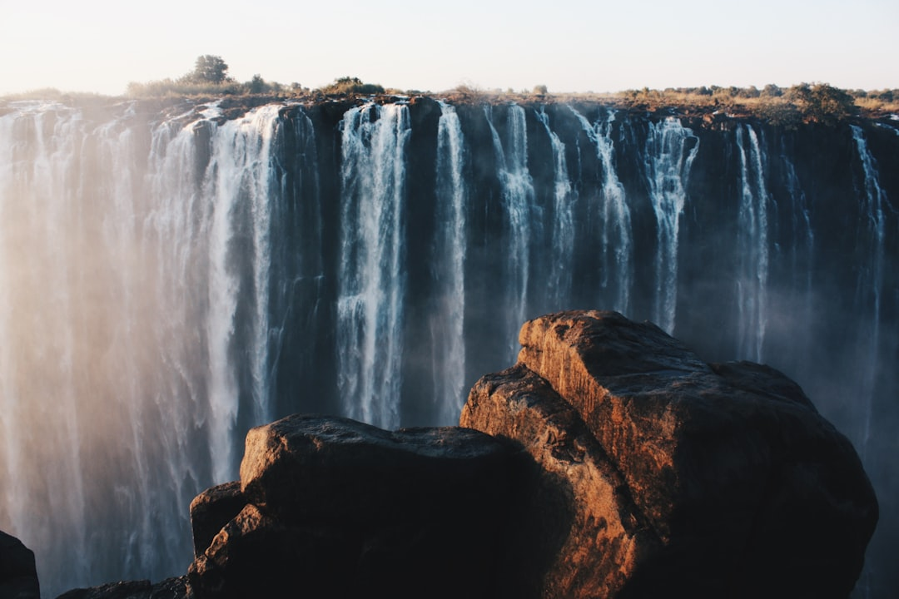

# Victoria Falls, Zambia and Zimbabwe

Country: Zambia and Zimbabwe
Region: Africa

Victoria Falls (*Mosi-oa-Tunya*, "the smoke that thunders" in local Lozi) is the world's largest waterfall by combined width and height, on the Zambezi River between Zambia and Zimbabwe. UNESCO World Heritage-listed on both sides, twice the height of Niagara and one-and-a-half times wider, and the centre of one of southern Africa's premier nature-tourism circuits.

---

## 🧭 Step 1: Choices

### ✨ Why Visit

Victoria Falls is one of the planet's most physically powerful natural spectacles. In peak flow (February-April) the spray rises hundreds of metres and is visible from kilometres away. The two-country geography is the point: **Zimbabwe's side** offers the broader panoramic views (more of the falls visible from the rim path); **Zambia's side** offers more intimate close-ups including the *Devil's Pool* (in dry season only).

The area is also the launching point for **Chobe National Park** (Botswana, an hour away), the **Lower Zambezi** white-water rafting, helicopter "flight of angels" tours, sunset Zambezi cruises, and gateway to the wider southern African circuit.

You come for the Falls, the surrounding adrenaline and wildlife activities, and as a centre for the broader Botswana-Zimbabwe-Zambia trip.

### 🌍 Ethical Compass

- **💰 Economy.** Stay in **Livingstone (Zambia)** or **Victoria Falls town (Zimbabwe)** at locally owned guesthouses or smaller boutique lodges rather than only the largest international resort lodges. Eat at local restaurants in Livingstone; the Royal Livingstone and Victoria Falls Hotel are historic but expensive.
- **👥 Employment.** Tip guides, drivers, hotel and lodge staff generously. Zambian and Zimbabwean wages are extremely stretched. Cash USD tips are usually preferred and most useful.
- **📚 Education.** Read about Cecil Rhodes and the colonial history; the Falls were "discovered" by David Livingstone in 1855 but had been known to local Lozi people for centuries. Learn the Lozi name *Mosi-oa-Tunya*. The Livingstone Museum gives the broader Zambian context.
- **🌱 Ecology.** Stay on the marked rim paths. Do not feed any wildlife (vervet monkeys and baboons are aggressive food-seekers). Reef-safe sunscreen is not the issue here, but plastic and water-bottle waste are. Choose operators with proper waste management.

---

## 🎒 Step 2: Preparation

### 🔍 Governance Management

- The **KAZA UniVisa** (Zambia + Zimbabwe + day trips to Botswana) is available to many nationalities; verify on the official Zambia or Zimbabwe immigration portals. Separate visas are also possible.
- **National park entry fees** for both sides; verify current prices at the gate or on the official Zambia Tourism Agency and Zimbabwe Parks portals.
- **Yellow fever** vaccination is required from countries with risk; verify.
- **Devil's Pool** access (Zambia side, from Livingstone Island) is dry-season only (typically September-November); book ahead through Tongabezi or Royal Livingstone.
- For **white-water rafting, bungee, helicopter flight**, choose certified operators (Wild Horizons, Shockwave, Safari Par Excellence); verify safety credentials.

### 📡 Information Curation

- **Lusaka Times** (Zambia) and **The Herald** (Zimbabwe) for current local news.
- **Zambia Tourism Agency** and **Zimbabwe Tourism Authority** official portals.
- A book on the region: David Livingstone's own journals; modern African travel writing on the region.
- A locally owned Livingstone or Victoria Falls town operator (Bushtracks, Wild Horizons, Tongabezi Lodge programmes).
- **Wikivoyage Victoria Falls** for cross-border logistics.

### 🎯 Inference Interaction

- **You decide on which side, or both.** Both sides have permanent borders and are easy to cross with the KAZA UniVisa. A two-side visit is the ideal; if forced to choose, Zimbabwe's broader panoramic views are usually the recommendation.
- **You decide on the season.** February-April peak flow gives maximum spray but obscures some views; September-November lower flow allows Devil's Pool and clearer photos but less drama; dry season has fewer activities cancelled by weather.
- **You decide on activities.** Helicopter "flight of angels" gives the bird's-eye view; rafting in low water is one of the world's best; bungee from the bridge is iconic; sunset Zambezi cruise is the relaxed option.
- **You decide on Chobe.** A day-trip to Chobe National Park (Botswana) gives serious elephant viewing in addition to the Falls.
- **You decide on the visit time.** Sunrise on the Zimbabwe side is calm; midday with spray rainbows is the photographer's choice.

### 🔄 Intelligence Cooperation

Weather varies dramatically by season. Peak flow (February-May) the spray is intense and visibility may be limited; low flow (September-December) the river thins to streams in places. Dry season has cool mornings and warm days; rainy season is hot and humid.

Bring a soft plan. If a helicopter is cancelled by weather, the rim walks are unaffected. If the Devil's Pool is closed (out of season or by flow), other Zambia-side activities work. If a border-crossing day runs long, both sides have plenty to do solo.

### 📍 Top 5 Anchor Spots (Zones and Sectors)

1. **Zimbabwe-side rim walk and the Victoria Falls Bridge view.** The 16 viewpoints along the rim path; the bridge between the two countries.
2. **Zambia-side rim walk and the Knife Edge Bridge.** Closer to the Falls; in peak flow, get soaked.
3. **Devil's Pool (Zambia, dry season only).** Swim to the edge of the Falls from Livingstone Island; book ahead.
4. **Helicopter "flight of angels".** 15-minute or longer flights over the Falls; both sides have operators.
5. **Chobe National Park (Botswana) day-trip.** Boat safari and game drive; elephant central; combines well with Vic Falls.

### 🧰 Practical Essentials

- **Recommended Length.** **Two to four days** at the Falls. Add days for Chobe, the Lower Zambezi, Hwange National Park, or extension into the wider southern Africa circuit.
- **Getting There and Around.** Fly into **Livingstone Airport (LVI), Zambia** or **Victoria Falls Airport (VFA), Zimbabwe**. Both towns are 20 minutes from the Falls themselves. Cross the border by taxi at the **Victoria Falls Bridge** (passport stamps both ways; the KAZA UniVisa or separate visas).
- **Daily Cost (per person).**
  - **Budget:** roughly USD 100 to 200. Backpacker lodge in Livingstone or Vic Falls town, local restaurant meals, both Falls sides, one activity.
  - **Mid-range:** roughly USD 300 to 600. Three- or four-star lodge near the Falls, mixed dining, both sides, helicopter and Zambezi cruise.
  - **Higher-comfort:** roughly USD 1,200 and up. Royal Livingstone, Victoria Falls Hotel, Tongabezi, Matetsi, fine dining, private guides, Devil's Pool, Chobe day-trip.
- **Booking Notes.**
  - **KAZA UniVisa:** verify your nationality on the official portals.
  - **Yellow fever:** verify required.
  - **Devil's Pool:** dry season only; book ahead through Tongabezi or Royal Livingstone.
  - **Helicopter and rafting:** verify operator safety certification.
  - **Peak flow season (February-May)** sees most spray; this is dramatic but obscures some photographic views.

---

## ✈️ Step 3: Delivery

### 🤖 AI Prompt

Copy this into your own AI assistant, fill in the brackets, and treat the answer as a researcher's draft, not a final plan.

> Please help me plan an ethical visit to Victoria Falls (Zambia and Zimbabwe sides) for [NUMBER] days in [MONTH]. I am travelling with [WHO] and my interests are [INTERESTS, e.g. waterfalls, adrenaline activities, Devil's Pool, Chobe wildlife, photography]. My total budget is around [AMOUNT] and my comfort level is [budget / mid-range / higher-comfort].
>
> Please structure your answer in three steps.
>
> **Step 1: Choices.** Help me decide what to prioritise. Recommend the best combination of Zambian and Zimbabwean sides, helicopter, Devil's Pool, rafting, and Chobe given my season and time. Identify one I should consider skipping (Devil's Pool in peak flow season, one-side-only if I have time for both, an uncertified rafting operator). Briefly explain each trade-off.
>
> **Step 2: Preparation.** Cover all four of the following:
> - **Governance Management.** What assumptions should I check before I book? Include the KAZA UniVisa, yellow-fever, park-entry fees on both sides, Devil's Pool season, and certified activity operators.
> - **Information Curation.** Suggest at least four different source types: Zambia Tourism Agency, Zimbabwe Tourism Authority, an honest travel book or recent journalism on the Falls and surrounding region, and a Livingstone- or Vic Falls-town-based locally owned operator.
> - **Inference Interaction.** List the decisions I personally need to make (which side or both, season trade-off, activities, Chobe add-on, helicopter ethics).
> - **Intelligence Cooperation.** How should I trust my own judgment and local advice over algorithmic defaults when conditions change? Build me a soft plan with at least two alternates for likely disruptions (a helicopter weather cancellation, a peak-flow obscured view, a Devil's Pool closure for season or safety, a border-crossing delay).
>
> **Step 3: Delivery.** Give me the actual itinerary, day by day, with realistic timings and named activities. Include both sides and at least one major activity. Mark each operator as confidently certified, or flag for me to verify.
>
> Finally, please remind me at the end to verify your suggestions against:
> 1. Official sources: Zambia and Zimbabwe Tourism, immigration portals, the official Wild Horizons or operator portals.
> 2. Real people: a Livingstone or Vic Falls town lodge host, a certified guide, or a recent visitor.
>
> Treat your output as a researcher's draft. I will make the final calls.

---

Part of **Gyro Governance Ethical Travel: AI-Empowered Guides for Human Adventures**.

Explore more destinations, ethical domains, and AI prompts at [travel.gyrogovernance.com](https://travel.gyrogovernance.com/).
