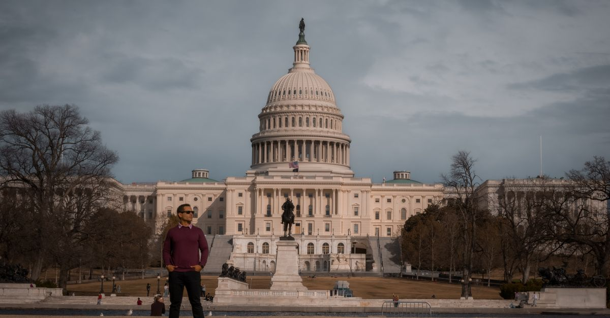

# Washington, DC, United States

Country: United States
Region: Americas

Washington, DC is the capital of the United States, a 700,000-person federal district between Maryland and Virginia. The home of Congress, the White House, the Supreme Court, the Smithsonian museum complex, and the most concentrated set of free world-class museums anywhere on Earth. A working political capital with serious neighbourhood food and culture.

---

## 🧭 Step 1: Choices

### ✨ Why Visit

Washington has the world's largest concentration of free major museums. The Smithsonian Institution operates 17 museums (most on the National Mall), all free; the National Gallery of Art, also on the Mall, also free. The US Capitol, the White House, the Supreme Court, and the Library of Congress give a working tour of American democracy. The Lincoln, Vietnam, World War II, MLK, and Korean War Memorials anchor the Mall.

The city is also more than the Mall. U Street's African-American history; Adams Morgan and Mount Pleasant's Latin and Ethiopian food; Georgetown's eighteenth-century streets; H Street; Anacostia's Black-DC depth; Eastern Market on weekends. A Mall-only itinerary misses contemporary DC.

You come for the museums, the memorials, the architecture of American government, the food, and the contemporary capital city beyond the postcards.

### 🌍 Ethical Compass

- **💰 Economy.** Eat in actual neighbourhoods: Adams Morgan (Latin, Ethiopian), 14th Street (eclectic), H Street (corridor), Eastern Market (DC institutions), Brookland (university), Petworth (Caribbean), Shaw, Mount Pleasant. Avoid limiting yourself to Capitol Hill tourist restaurants.
- **👥 Employment.** Tip 20 percent at sit-down restaurants; tip Uber/Lyft drivers; tip hotel housekeeping. DC service-industry wages are stretched by very high housing costs.
- **📚 Education.** Read about the African-American history of DC (Frederick Douglass, U Street as "Black Broadway", the 1968 riots, contemporary gentrification). Visit the **National Museum of African American History and Culture** (timed free tickets, book ahead) and the Anacostia Community Museum. The Holocaust Memorial Museum is also free and serious.
- **🌱 Ecology.** Walk and use the **Metro** (Washington Metro is one of America's most usable). Avoid driving in central DC. The National Mall is a 3-km walk; cycle the Capital Bikeshare for longer distances.

---

## 🎒 Step 2: Preparation

### 🔍 Governance Management

- Most international visitors need **ESTA (visa waiver) or a B-2 visa** for the US; verify on the official US State Department portal.
- **Smithsonian museums** are all free; **National Museum of African American History and Culture** requires timed free tickets booked on its official portal; sells out weeks ahead.
- **National Gallery of Art** is free; no timed ticket required.
- **US Capitol** tours are free but book ahead through your home Congressperson (US citizens) or the Capitol Visitor Center (international visitors).
- **White House** tours are very limited and require advance request through your home Congress or embassy.
- **Washington Metro** uses SmarTrip card or contactless on most lines.

### 📡 Information Curation

- **The Washington Post** and **DCist** for serious local journalism.
- **Destination DC** (the official tourism site) for events and openings.
- A DC author: Edward P. Jones (*The Known World*, Pulitzer); George Pelecanos for DC crime fiction; Frederick Douglass' autobiography.
- A locally led U Street, Anacostia, or African-American DC walking tour.
- **Wikivoyage Washington DC** for orientation.

### 🎯 Inference Interaction

- **You decide on the Smithsonian strategy.** A trip can't see all 17; pick 3 or 4 carefully: Air and Space (the original on the Mall), Natural History, American History, African American History and Culture, the Hirshhorn (modern), the Freer/Sackler (Asian art).
- **You decide on the African American History and Culture commitment.** Book timed free tickets weeks ahead; it is one of the most powerful museums in America.
- **You decide on the memorial walk.** The Lincoln to Capitol walk (3 km) with the WWII, Vietnam, MLK, Korean, and Washington Monument memorials is best at sunrise or after sunset.
- **You decide on the Capitol vs White House tour.** The Capitol tour is easier to book; the White House tour is very limited.
- **You decide on neighbourhood depth.** A Mall-only DC misses the most interesting contemporary city.

### 🔄 Intelligence Cooperation

DC weather is four-season; hot humid summer, cold winter (occasional snow), beautiful but brief spring (cherry blossom in late March or early April) and autumn. Major events (Cherry Blossom Festival, inauguration in January every four years, major protests) reshape parts of the city.

Bring a soft plan. If a heat wave makes the Mall brutal, the free indoor museums absorb a hot afternoon. If a protest closes the Mall, the museums and the neighbourhoods continue. If a snow day surprises, the Metro runs but slowly.

### 📍 Top 5 Anchor Spots

1. **National Museum of African American History and Culture.** Book timed free tickets weeks ahead. A serious half-day; arrive prepared.
2. **The National Mall memorial walk at sunset.** Lincoln Memorial, Reflecting Pool, WWII, Washington Monument, Capitol view.
3. **Smithsonian Air and Space + Natural History + American History.** Pick two or three; all free; allow half a day each.
4. **U Street historic walk + Adams Morgan / Mount Pleasant evening dinner.** Real DC; African-American history; Ethiopian food.
5. **A Capitol Hill tour + Library of Congress.** Free; book Capitol ahead; the Library of Congress's main reading room is genuinely awesome.

### 🧰 Practical Essentials

- **Recommended Length.** Three to five days for DC. Add a day for Mount Vernon, Annapolis, or Civil War battlefields.
- **Transport.** **Walk the Mall** (3 km end to end). **Washington Metro** (6 lines, colour-coded); SmarTrip or contactless. **Capital Bikeshare** for longer distances. Three airports: **Reagan (DCA)** is closest by Metro; **Dulles (IAD)** is further out (connected by the new Silver Line Metro); **Baltimore (BWI)** is a longer transfer.
- **Daily Cost (per person).**
  - **Budget:** roughly USD 100 to 170. Hostel or budget hotel, neighbourhood food meals, Metro, free Smithsonian and memorials.
  - **Mid-range:** roughly USD 230 to 400. Three-star hotel, restaurant dinners, all major museums, neighbourhood evenings.
  - **Higher-comfort:** roughly USD 550 and up. Hay-Adams, Four Seasons Georgetown, the Jefferson, fine dining at Komi, Rose's Luxury, Pineapple and Pearls, private guides.
- **Booking Notes.**
  - **ESTA:** apply at least 72 hours before US arrival.
  - **National Museum of African American History and Culture:** timed free tickets book weeks ahead.
  - **Cherry Blossom Festival (late March to early April):** the city is at peak; book accommodation months ahead.
  - **Major political events (inauguration, State of the Union, big protests):** the city may have street closures.
  - **Government shutdowns** occasionally close federal museums; verify before going.

---

## ✈️ Step 3: Delivery

### 🤖 AI Prompt

Copy this into your own AI assistant, fill in the brackets, and treat the answer as a researcher's draft, not a final plan.

> Please help me plan an ethical visit to Washington, DC for [NUMBER] days in [MONTH]. I am travelling with [WHO] and my interests are [INTERESTS, e.g. American history, African-American history, art, the political institutions, food]. My total budget is around [AMOUNT] and my comfort level is [budget / mid-range / higher-comfort].
>
> Please structure your answer in three steps.
>
> **Step 1: Choices.** Help me decide what to prioritise. Recommend the two or three DC experiences I should not miss given my interests, and one I should consider skipping (a Mall-only itinerary, a Capitol Hill tourist restaurant, an attempt at all 17 Smithsonians). Briefly explain each trade-off.
>
> **Step 2: Preparation.** Cover all four of the following:
> - **Governance Management.** What assumptions should I check before I book? Include the US State Department ESTA, free timed tickets for the National Museum of African American History and Culture, Capitol tour booking, Metro SmarTrip or contactless, and government-shutdown status.
> - **Information Curation.** Suggest at least four different source types: one official DC source, one Washington Post or DCist news outlet, one DC author, and one neighbourhood-led tour (U Street, Anacostia, or Latin DC).
> - **Inference Interaction.** List the decisions I personally need to make (Smithsonian selection, NMAAHC commitment, memorial walk timing, Capitol or White House priority, neighbourhood depth).
> - **Intelligence Cooperation.** How should I trust my own judgment and local advice over algorithmic defaults when conditions change? Build me a soft plan with at least two alternates for likely disruptions (summer heat-wave on Mall, a major protest closing roads, snow on the Mall, a government shutdown).
>
> **Step 3: Delivery.** Give me the actual itinerary, day by day, with realistic timings and named neighbourhoods. Include at least one neighbourhood beyond the Mall (U Street, Adams Morgan, H Street, or Anacostia). Mark each business as confidently locally owned, or flag for me to verify.
>
> Finally, please remind me at the end to verify your suggestions against:
> 1. Official sources: Destination DC, the Smithsonian, the NMAAHC, the Metro, and the US State Department for ESTA.
> 2. Real people: a DC resident, a DC tour guide, or hotel staff who live in DC now.
>
> Treat your output as a researcher's draft. I will make the final calls.

---

Part of **Gyro Governance Ethical Travel: AI-Empowered Guides for Humane Adventures**.

Explore more destinations, ethical domains, and AI prompts at [travel.gyrogovernance.com](https://travel.gyrogovernance.com/).
