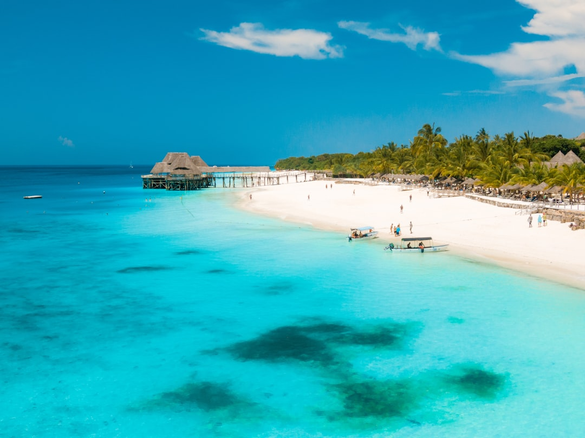

# Zanzibar, Tanzania

Country: Tanzania
Region: Africa

Zanzibar is a Tanzanian archipelago in the Indian Ocean off the East African coast, consisting of the main island of Unguja, smaller Pemba, and several islets. Stone Town (UNESCO World Heritage) is the historic urban centre, a Swahili-Arab-Indian-Portuguese fusion city; the beaches of the north and east coasts are some of the most beautiful in East Africa.

---

## 🧭 Step 1: Choices

### ✨ Why Visit

Zanzibar is the East African Swahili coast at its most concentrated. **Stone Town** is a UNESCO-listed labyrinth of carved wooden doors, Arab houses, Indian shopfronts, and a brutal slave-trade history (the Old Slave Market site is essential). The **north coast** (Nungwi, Kendwa) has the deepest beaches and party scene; the **east coast** (Paje, Jambiani, Matemwe) has dramatic tidal beaches and kitesurfing.

The island is also a working Tanzanian destination, predominantly Muslim (around 99 percent), with a real local culture beyond the beach resorts. Visiting respectfully means engaging Swahili culture, dressing modestly outside the beach zones, and choosing accommodation that benefits Zanzibaris.

You come for Stone Town, the beaches, the spice tours (Zanzibar was the world's main clove producer), the diving (Mnemba Atoll), and a real slice of the Swahili Indian Ocean.

### 🌍 Ethical Compass

- **💰 Economy.** Stay at Zanzibari-owned guesthouses in Stone Town (Emerson Spice, Park Hyatt, smaller Swahili House) and beach guesthouses owned by locals rather than only the largest international resort lodges. Eat at **Forodhani Gardens** night market in Stone Town for street food; at small Swahili restaurants throughout.
- **👥 Employment.** Tip 10 to 15 percent at restaurants in cash. Tip dhow captains, dive guides, drivers, lodge staff generously. Local wages are stretched.
- **📚 Education.** Read about the East African slave trade (Zanzibar was the main slave market until 1873 under British pressure); the Omani Arab sultanate; the 1964 Zanzibar Revolution; the contemporary semi-autonomous relationship with mainland Tanzania. The Anglican Cathedral built on the slave-market site is essential.
- **🌱 Ecology.** **Reef-safe sunscreen** is essential; Mnemba Atoll and the surrounding reefs are coral. The plastic-bag ban applies in Tanzania including Zanzibar. Dress modestly outside beach resorts (shoulders and knees covered) in respect of the Muslim majority culture. Choose dolphin-encounter operators following welfare guidelines.

---

## 🎒 Step 2: Preparation

### 🔍 Governance Management

- Most travellers need a **visa** for Tanzania (on arrival or e-visa); verify on the official Tanzania Immigration portal. **Yellow fever** required from countries with risk.
- Zanzibar charges its own **arrival tax** in addition to the Tanzania visa.
- **Stone Town tours** with licensed Zanzibari guides; the Stone Town Cultural Centre or your hotel can arrange.
- For **dolphin tours** (Kizimkazi area), choose operators using boat-distance and no-touching rules; many do not.
- **Dhow cruises** to Bawe, Changuu (Prison Island), and Chumbe are common; verify operator legitimacy.

### 📡 Information Curation

- **Daily News** (Tanzania) for current events.
- The official **Zanzibar Commission for Tourism** for events.
- A book on Zanzibar: Abdulrazak Gurnah's novels (Nobel laureate, Zanzibari-born; *Paradise* and *Afterlives* are essential); historical accounts of the slave trade.
- A Zanzibari-led Stone Town walking tour or a spice farm tour with a local guide.
- **Wikivoyage Zanzibar** for orientation.

### 🎯 Inference Interaction

- **You decide on Stone Town vs beaches.** Most visitors do both: 2 to 3 nights in Stone Town for culture and 3 to 5 nights at a beach. The split is important.
- **You decide on the coast.** North (Nungwi, Kendwa) is party, deeper water, less tidal; east (Paje, Jambiani, Matemwe) is dramatic tides, kitesurfing, calmer atmosphere.
- **You decide on the dress code.** In Stone Town and villages: modest dress is expected (shoulders, knees covered); at beach resorts: regular swimwear is fine within resort grounds.
- **You decide on the Old Slave Market.** A serious visit; the underground holding chambers; the Anglican Cathedral built on the site.
- **You decide on a dhow trip.** A sunset dhow is one of the world's great cheap experiences; verify the boat is safe.

### 🔄 Intelligence Cooperation

Zanzibar weather is tropical; long rains (March-May), short rains (November), dry seasons in between are the main visitor windows. Ramadan reshapes Stone Town daytime eating.

Bring a soft plan. If long rains close beach plans, Stone Town's indoor experiences (museums, cooking class, market) absorb a wet afternoon. If Ramadan affects restaurant timing, plan around iftar. If a boat trip is sea-cancelled, the Stone Town walk or a spice farm work.

### 📍 Top 5 Anchor Spots

1. **Stone Town walking morning.** The labyrinth of streets; the Old Slave Market and Anglican Cathedral; the Forodhani Gardens evening night-market.
2. **A north or east coast beach stay.** Three to five nights; choose Nungwi/Kendwa or Paje/Matemwe.
3. **Spice tour.** Half-day; Zanzibar was the world's clove capital; the historical context is the point as much as the spices.
4. **Mnemba Atoll snorkel or dive day.** Off the north-east coast; choose certified operators with reef-protection focus.
5. **A sunset dhow from Stone Town.** Cheap, beautiful, classic.

### 🧰 Practical Essentials

- **Recommended Length.** Five to seven days for Zanzibar. Add days for Pemba (the smaller, less developed sister island) or as the beach finale to a mainland Tanzania safari.
- **Getting There and Around.** Fly into **Abeid Amani Karume International Airport (ZNZ)** via Dar es Salaam or direct from some European and Gulf cities. Within the island: **local *daladala* minibuses** (cheap, slow), **taxis**, or pre-arranged transfers. From Dar es Salaam: ferry (2 hours) or short flight.
- **Daily Cost (per person).**
  - **Budget:** roughly USD 50 to 110. Stone Town guesthouse, simple beach guesthouse, local restaurant meals, *daladala* and shared transfers, Stone Town walk + spice tour.
  - **Mid-range:** roughly USD 180 to 400. Mid-range Stone Town hotel and beach lodge, mixed dining, transfers, snorkel day.
  - **Higher-comfort:** roughly USD 700 and up. Park Hyatt Stone Town, Mnemba Island Lodge, Zuri Zanzibar, fine dining, private guides, dive trips.
- **Booking Notes.**
  - **Visa:** verify on Tanzania Immigration portal.
  - **Zanzibar arrival tax:** small but mandatory.
  - **Yellow fever:** verify required.
  - **Plastic-bag ban:** strictly enforced.
  - **Ramadan:** plan around the daytime fast in Stone Town.

---

## ✈️ Step 3: Delivery

### 🤖 AI Prompt

Copy this into your own AI assistant, fill in the brackets, and treat the answer as a researcher's draft, not a final plan.

> Please help me plan an ethical visit to Zanzibar, Tanzania for [NUMBER] days in [MONTH]. I am travelling with [WHO] and my interests are [INTERESTS, e.g. Stone Town history, beaches, diving, dhow sailing, Swahili culture]. My total budget is around [AMOUNT] and my comfort level is [budget / mid-range / higher-comfort].
>
> Please structure your answer in three steps.
>
> **Step 1: Choices.** Help me decide what to prioritise. Recommend the best combination of Stone Town and beach days, and one I should consider skipping (a beach-only resort week with no Stone Town, a dolphin-touch operator, a Stone Town visit in only swimwear). Briefly explain each trade-off.
>
> **Step 2: Preparation.** Cover all four of the following:
> - **Governance Management.** What assumptions should I check before I book? Include Tanzania Immigration visa, Zanzibar arrival tax, yellow-fever, plastic-bag ban, modest dress code in Stone Town, and Mnemba Atoll operator standards.
> - **Information Curation.** Suggest at least four different source types: Zanzibar Commission for Tourism, Tanzanian news, Abdulrazak Gurnah's fiction (Nobel laureate Zanzibari), and a Zanzibari-led Stone Town guide.
> - **Inference Interaction.** List the decisions I personally need to make (Stone Town vs beach days, north vs east coast, dress code commitment, Old Slave Market visit, Ramadan timing).
> - **Intelligence Cooperation.** How should I trust my own judgment and local advice over algorithmic defaults when conditions change? Build me a soft plan with at least two alternates for likely disruptions (long-rains afternoon downpour, Ramadan timing, a Mnemba sea-cancellation, a flight delay from mainland).
>
> **Step 3: Delivery.** Give me the actual itinerary, day by day, with realistic timings and named neighbourhoods and beaches. Include Stone Town, a spice tour, a beach stay, and one snorkel or dhow day. Mark each business as confidently locally owned, or flag for me to verify.
>
> Finally, please remind me at the end to verify your suggestions against:
> 1. Official sources: Zanzibar Commission for Tourism, Tanzania Immigration, and the official UNESCO Stone Town site.
> 2. Real people: a Zanzibari guide, a Stone Town hotel host, or a recent visitor.
>
> Treat your output as a researcher's draft. I will make the final calls.

---

Part of **Gyro Governance Ethical Travel: AI-Empowered Guides for Humane Adventures**.

Explore more destinations, ethical domains, and AI prompts at [travel.gyrogovernance.com](https://travel.gyrogovernance.com/).
